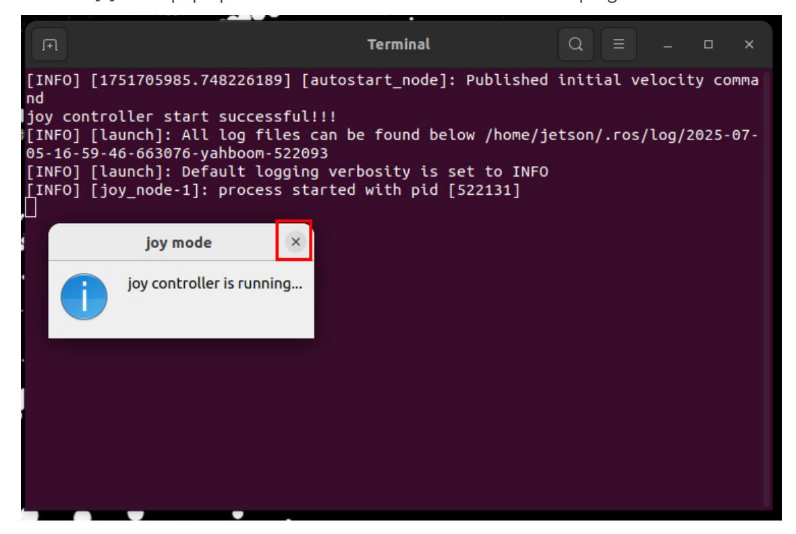

## **Quick start handle to control the car**

Plug the controller receiver into the mainboard or HUB expansion board. After the robot is powered on, the system will automatically connect to the proxy and start the controller control program. Press the [START] button on the controller to activate the controller, then press R2 to unlock the buttons. You can then use the remote control to control the robot according to the table below.

| Buttons                   | Functions                                                          |
|---------------------------|--------------------------------------------------------------------|
| Left joystick up/down     | Car moves forward/backward                                         |
| Left joystick left/right  | Car moves straight left/right                                      |
| Right joystick left/right | Car rotates left/right                                             |
| START button              | End sleep                                                          |
| Left joystick pressed     | Adjust linear velocity of X/Y axis                                 |
| Right joystick pressed    | Adjust angular velocity                                            |
| Button up                 | Robotic arm No.4 servo up                                          |
| Button down               | Robotic arm No.4 servo down                                        |
| Button left               | Robotic arm No.3 servo down                                        |
| Button right              | Robotic arm No.3 servo up                                          |
| Button X                  | Robotic arm No.1 servo left                                        |
| Button B                  | Robotic arm No.1 servo right                                       |
| Button Y                  | Robotic arm No.2 servo up                                          |
| Button A                  | Robotic arm No.2 servo down                                        |
| Left "1" button           | Robotic arm No.6 servo<br>gripper(Tight)/No. 5 servo turn<br>right |
| Left "2" button           | Robotic arm No.6 servo<br>gripper(Loose)/No. 5 servo turn left     |
| SELECT button             | Switch control robotic arm<br>No.6/No. 5 servo                     |
| Right "1" button          | Switch light effect                                                |
| Right "2" button          | Unlock button                                                      |

## **1. Turn off controller control**

Raspberry Pi and Jetson-nano motherboard

Close the window running the handle control program, as shown in the figure below, and press ctrl c to close the terminal.


Orin Motherboard

Click the [x] in the pop-up window below to close the handle control program.



## **2. Temporarily start the handle control**

If we shut down the handle control node that was started at startup, and want to restart the handle control program without shutting down and restarting, the method is as follows:

Raspberry Pi and Jetson-nano motherboard Terminal input,

```
sh Docker_M3Pro.sh
```

Orin Motherboard

Terminal input,

```
sh ~/joy_control/joy.sh
```

## **3. Permanently turn off the handle to control the startup**

If you want to permanently turn off the handle control self-start function, the method is as follows:

Raspberry Pi and Jetson-nano motherboard Terminal input,

```
mv ~/.config/autostart/uros.desktop ~
```

Cut uros.desktop to the ~ directory. It is recommended to save this file. Next time you want to restore handle control at startup, just copy it to the ~/.config/autostart directory.

Orin Motherboard

Terminal input,

```
mv ~/.config/autostart/joy_control.desktop ~
```

Cut joy\_control.desktop to the ~ directory. It is recommended to save this file. Next time you want to restore handle control at startup, just copy it to the ~/.config/autostart directory.