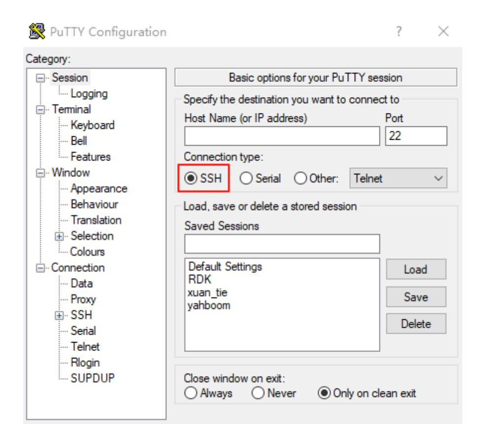
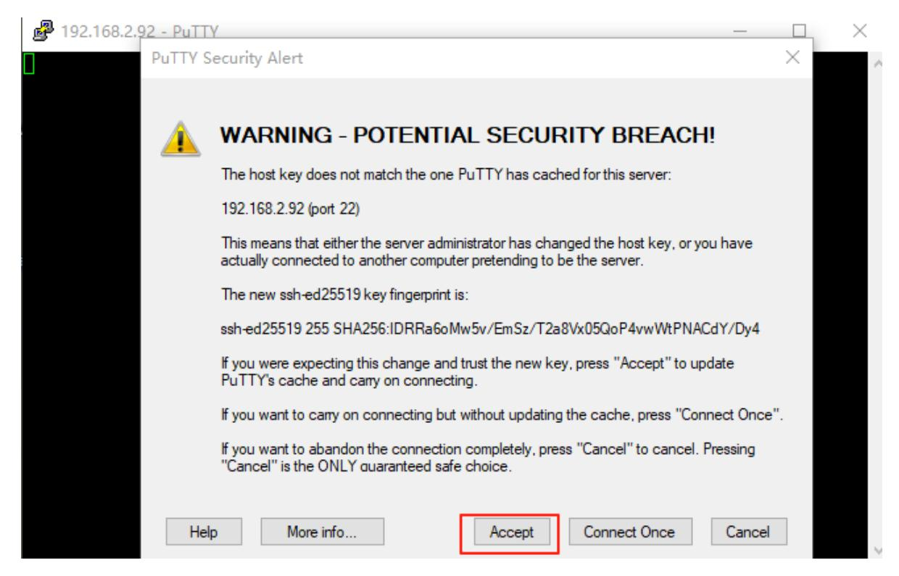
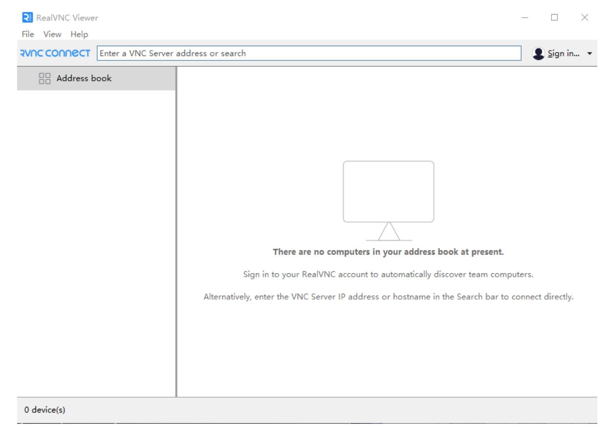
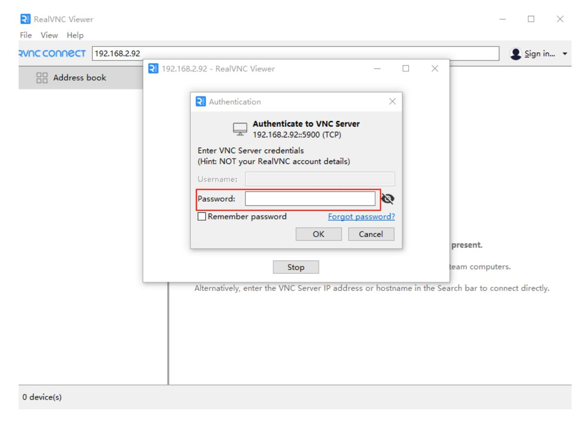
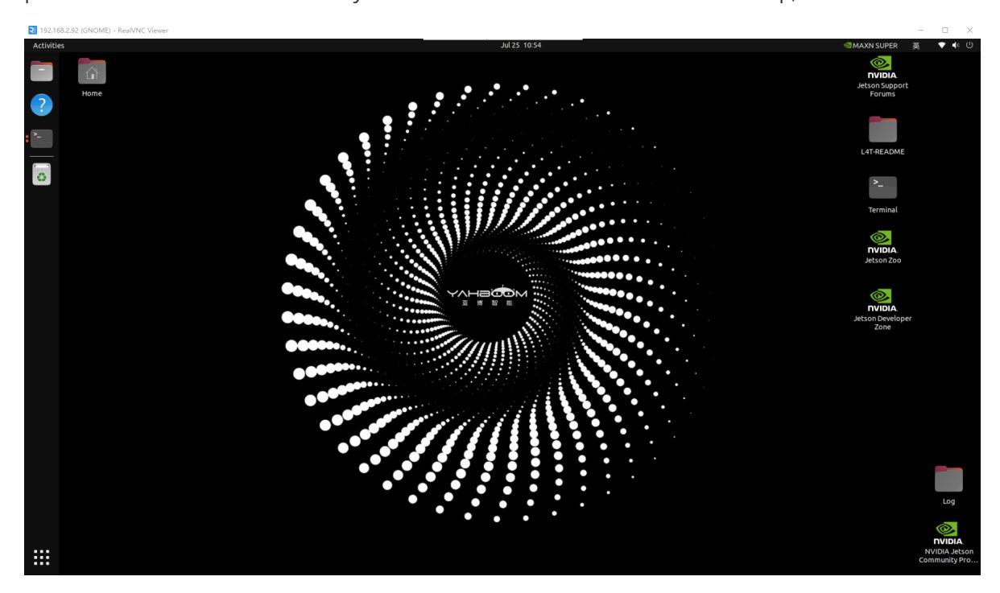
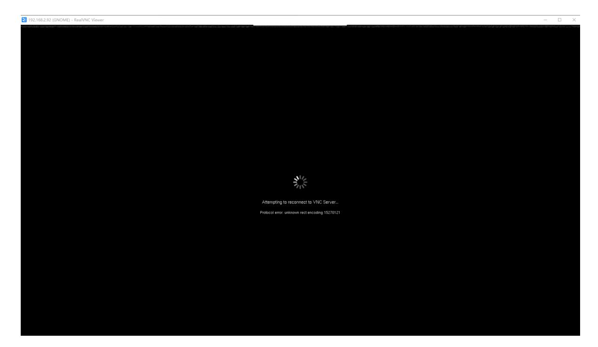
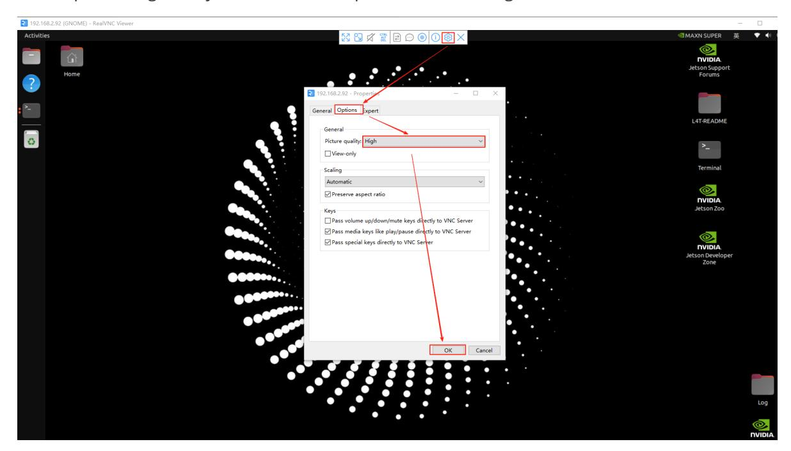
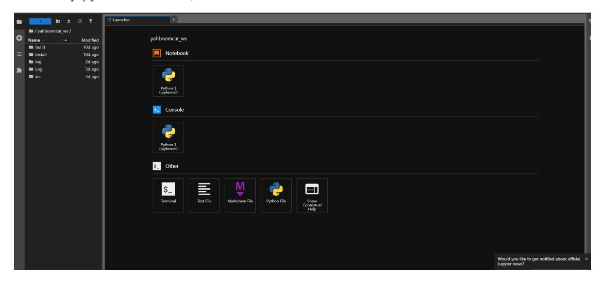

# **Connect the car and view the code**

This section introduces several ways to connect the car to your computer and how to view the code.

The recommended operation process in this section is: connect to the car's hotspot/insert the network cable to obtain the IP → check the OLED screen's IP → log in via VNC → turn off the selfheating point and connect to your own wifi (to facilitate the subsequent operation of large model functions) → check the updated IP of the OLED → reconnect to VNC → view the source code.

**The default hotspot name of the factory image is: ROSMASTER, the password is: 12345678, and the default IP is: 192.168.8.88** .

# **1. Connect the car**

Regardless of the method used to connect to the car, the computer and the car need to be in the same local area network. The simplest condition to meet the same LAN is to connect to the same WiFi or hotspot. First, connect to the car's default hotspot ROSMASTER, the WiFi password is 12345678. After the connection is successful, you can use the following method to log in.

You can also directly connect the motherboard to the network cable. After connecting the network cable, the OLED screen will automatically update the IP address. The following text will demonstrate various operations using the IP address after connecting the network cable.

### **1.1、SSH connection (optional, only for customers who need to use it)**

We can use putty or MobaXterm or other SSH login tools to connect to the car. Here we take putty as an example. The download address of putty is as follows: [Download PuTTY: latest release \(0.83\)](https://www.chiark.greenend.org.uk/~sgtatham/putty/latest.html)

Select the installation according to your computer version. After successful installation, doubleclick to open. The putty interface is as shown below.



Select **SSH** here , then enter the IP address displayed by OLED in the Host Name (or IP address) column. My IP address here is 192.168.2.92, so enter the IP address as shown in the figure below.


Then click Open, you will enter a terminal interface and a pop-up window, we click Accept to select receive, as shown below,



Then the terminal will display **login as** , here enter the user name of the car motherboard, and then press Enter, then it will prompt you to enter the password, then we enter the password, the user name and password of each motherboard are as follows:

| motherboard    | username | password |
|----------------|----------|----------|
| Raspberry Pi 5 | pi       | yahboom  |
| Jetson-Nano    | Jetson   | yahboom  |
| Orin-Nano      | Jetson   | yahboom  |
| Orin-NX        | Jetson   | yahboom  |

Assuming that my motherboard here is Orin-Nano, then enter jetson, then press Enter, and then enter the password. **Nothing is displayed when entering the password** . Enter yahboom and press Enter.

The interface of successfully connecting to the car is as follows:

Only one terminal will be opened here, and the graphical interface cannot be displayed. Therefore, ssh is suitable for logging in without starting the graphical program.

## **1.2 VNC login**

**1.2.1 Orin motherboard without screen (Users of Orin motherboard without screen need to configure this section for visualization. Other users do not need to configure this section and can directly proceed to 1.2.2)**

Since the Orin motherboard system is Ubuntu 22.04, this system needs to be connected to a monitor to enter visualization. Users who have not purchased a monitor package may not be able to open visualization. Here is a method to display visualization on a virtual desktop. It is only for users who have not connected a monitor to the Orin motherboard. Orin motherboard users who

have purchased a monitor and Jetson Nano and Raspberry Pi users can skip this step.

Open Document 19. Attachment - Virtual Desktop Files and copy xorg.conf.backup\_dp and xorg.conf.backup\_vnc to the /etc/X11 directory.

Install the virtual desktop environment xserver-xorg-video-dummy:

```
sudo apt-get install xserver-xorg-video-dummy
```

Open the terminal and enter the following command to open the virtual desktop and switch to VNC mode.

```
sudo cp /etc/X11/xorg.conf.backup_vnc /etc/X11/xorg.conf
```

Restart the system and you can enter the desktop without a screen (continue with tutorial 1.2.2 to connect to VNC).

```
sudo reboot
```

Note: After switching to VNC mode, the DP connection cable will become invalid (even if the monitor is connected to the motherboard, no display will be displayed). You need to modify the configuration back before you can use the DP interface to connect to the display normally.

To shut down a virtual desktop:

If you need to connect a DP display, open the terminal and enter the following command to switch to the DP interface connection display mode.

```
sudo cp /etc/X11/xorg.conf.backup_dp /etc/X11/xorg.conf
```

Restart the system and you can use the DP cable to connect the display.

```
sudo reboot
```

#### **1.2.2**

VNC allows users to remotely access and control the desktop environment of another computer through the network. So when we need to access the desktop environment of the car, for example, when we want to start the image display, we can use VNC to connect and log in to the car. The download address of VNC is as follows: [Download VNC Viewer by RealVNC®](https://www.realvnc.com/en/connect/download/viewer/?lai_vid=0XwM1MAv5h60&lai_sr=5-9&lai_sl=l)

Download and install according to your computer version. After successful installation, doubleclick to open it. The displayed screen is as follows:



Enter the IP address of the car. Here my IP address is 192.168.2.92, as shown below.


Then press Enter,



Enter the user name in Username and the password in Password. Refer to the table in 1.1. The password for all motherboards is yahboom. Then click OK to enter the desktop, as shown below.



If an abnormal screen is displayed, such as the following situation,



If it keeps flashing back, you need to set it up as shown in the figure below.



Then reconnect. The Orin motherboard can only connect to one remote desktop at a time. If the connection fails, you need to check whether the remote desktop is already connected.

After connecting, since the AI large model needs to be used online, the hotspot is only the local area network and has no actual data, so you need to switch the network to facilitate the use of the AI large model function later.

## **2. View the code**

The code for the Orin motherboard is in the /home/jetson directory, so as long as we can connect to the car, we can see the code; the code for the Raspberry Pi 5 and jetson-nano motherboard is in the started Docker container, so we need to enter the container first to see the code.

The following introduces several ways to view the code, which will facilitate our subsequent editing and modification of the code.

#### **2.1、jupyter-lab**

2.1.1: Orin motherboard (it is not recommended to use jupyter-lab to view and modify code)

Jupyter-lab will be started directly after booting up, so you only need to enter ip+:8888 in the browser to use jupyter to view the code. My ip address here is 192.168.2.92, so I enter the following content in the browser,


Then press Enter to display the password. Enter yahboom in the same way, and then you can enter the jupyter-lab interface, as shown below.



Select the contents of the folder on the left to view the code.

2.1.2 Raspberry Pi 5 and Jetson-Nano motherboard:

You need to enter the docker container and enter the command jupyter-lab --allow-root, then enter the car ip+:8888 in the browser to start jupyter-lab to view the car code. As shown in the figure below, I enter the car container and cd to the /root directory, and then enter jupyter-lab - allow-root in the terminal.

Then enter the car's ip+:8888 in the browser. The ip of my Raspberry Pi motherboard is 192.168.2.22, so enter 192.168.2.22:8888, as shown below.


Press Enter. If you need to enter a password, enter yahboom to enter jupyter-lab to view the code.