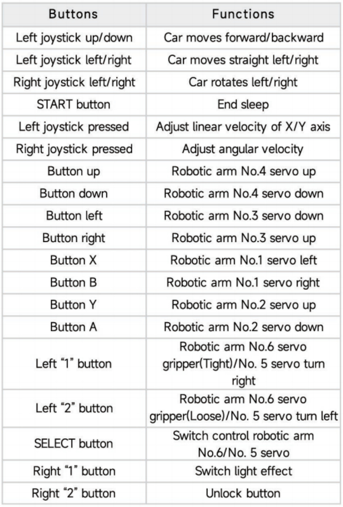
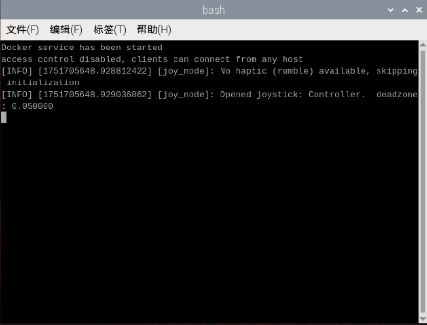
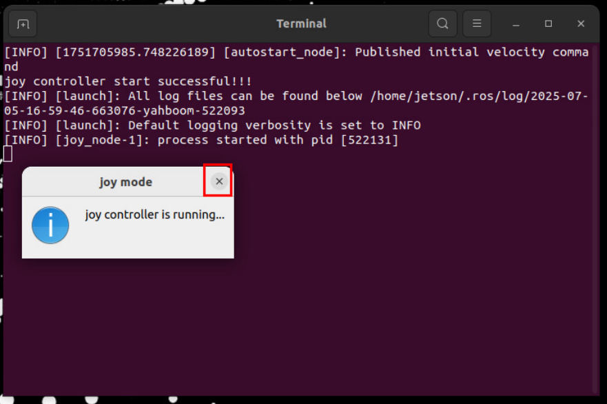

# Quick start handle to control the car

Plug the controller receiver into the mainboard or HUB expansion board. After the robot is

powered on, the system will automatically connect to the proxy and start the controller control

program. Press the [START] button on the controller to activate the controller, then press R2 to

unlock the buttons. You can then use the remote control to control the robot according to the

table below.

## 1. Turn off controller control

Raspberry Pi and Jetson-nano motherboard

Close the window running the handle control program, as shown in the figure below, and

press ctrl c to close the terminal.

Orin Motherboard

Click the [x] in the pop-up window below to close the handle control program.

## 2. Temporarily start the handle control

If we shut down the handle control node that was started at startup, and want to restart the

handle control program without shutting down and restarting, the method is as follows:

Raspberry Pi and Jetson-nano motherboard

Terminal input,

Orin Motherboard

Terminal input,

## 3. Permanently turn off the handle to control the startup

If you want to permanently turn off the handle control self-start function, the method is as

follows:

Raspberry Pi and Jetson-nano motherboard

Terminal input,

Cut uros.desktop to the ~ directory. It is recommended to save this file. Next time you want

to restore handle control at startup, just copy it to the ~/.config/autostart directory.

Orin Motherboard

Terminal input,

Cut joy_control.desktop to the ~ directory. It is recommended to save this file. Next time you

want to restore handle control at startup, just copy it to the ~/.config/autostart directory.
