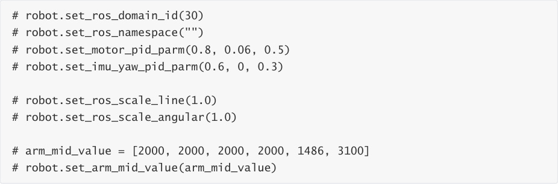
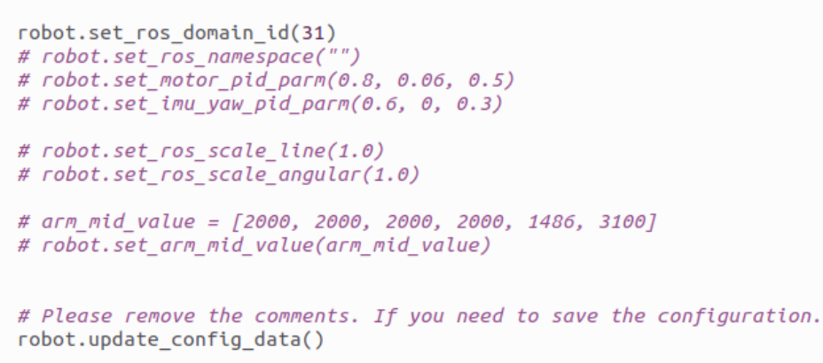
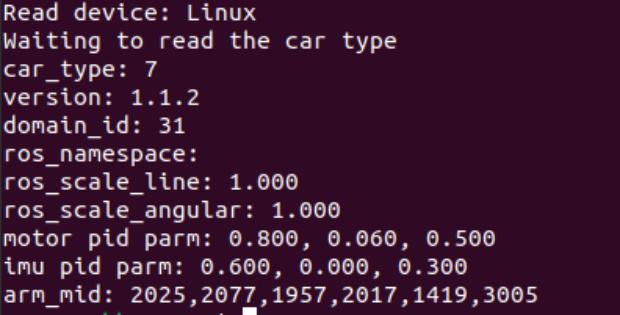

# Modify the firmware parameters of the car control board

Modify the firmware parameters of the car control board

1. Hardware Connection

2. Modify parameters

3. Write configuration

This course requires that the car have already been pre-burned with the factory firmware to

configure the firmware parameters. The purpose of modifying the control board firmware

parameters is to make the car function more in line with personal needs. The factory firmware

comes with default parameters and can be left unchanged unless necessary.

The car control board has been pre-burned with factory firmware. If other firmware has been pre
burned, please follow the course [12. Control Board Course\1. Setting up the Control Board

Development Environment\4. Burning STM32 Firmware via Serial Port] to re-burn the factory

firmware. The factory firmware is stored in the document [Appendix\Control Board Factory

Firmware].

This course takes the Jetson Orin series motherboard as an example, and the operations for other

motherboards are the same.

Note: Before running the configuration modification script, you need to shut down the microros

agent first.

## 1. Hardware Connection

Make sure the Type-C USB Connect port on the control board is connected to the USB port on the

mainboard.

## 2. Modify parameters

Open the system terminal, find and open the [config_robot.py] file in the user directory.

Scroll to the bottom of the file, and you will find the configuration parameters mainly including

set_ros_domain_id, set_ros_namespace, set_motor_pid_parm, set_imu_yaw_pid_parm,

set_ros_scale_line, set_ros_scale_angular, and set_arm_mid_value.

If you need to modify a parameter, please remove the comment symbol before the

corresponding function.

Among them, set_ros_domain_id means setting the car's ROS DOMAIN ID, which ranges from 0 to

100. If there are multiple devices in the LAN, each one should set a different ROS DOMAIN ID to

avoid mutual interference. Note that the ROS_DOMAIN_ID value must be consistent with the

system terminal .bashrc file to ensure communication.

set_ros_namespace means setting the namespace of the car ROS, which is mainly used for the

LAN multi-car control function.

set_motor_pid_parm means setting the PID parameters of the car motor speed.

set_imu_yaw_pid_parm means setting the PID parameters of the car using the IMU to calibrate

the direction.

set_ros_scale_line means setting the car's ROS linear speed scaling ratio.

set_ros_scale_angular means setting the car's ROS angular velocity scaling ratio.

primarily used to quickly restore the robotic arm calibration value and generally does not require

modification. Note: Modifying this value will affect the calibration value of the robotic arm. If you

need to calibrate the robotic arm, please refer to the tutorial for calibrating the robotic arm.

Here we take changing the domain ID to 31 as an example:

## 3. Write configuration

Note: Before running the configuration modification script, you need to shut down the microros

agent first.

Open the system terminal and run the following command to start writing the configuration

You can see all the parameter values finally read out.
