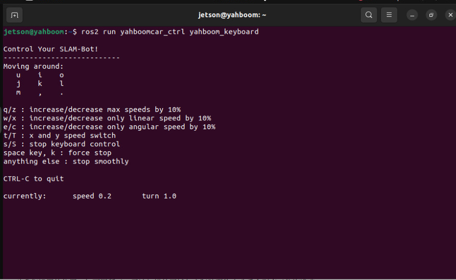
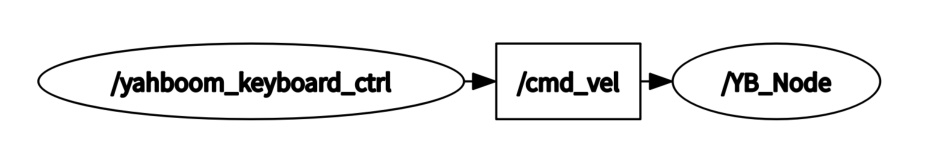
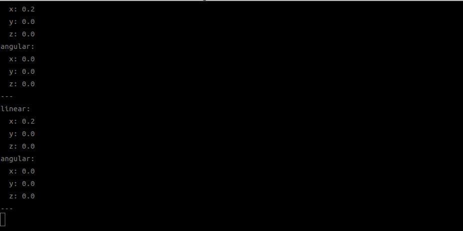
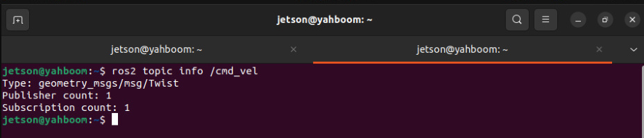
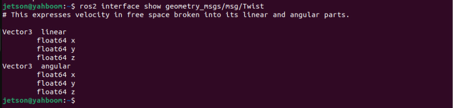
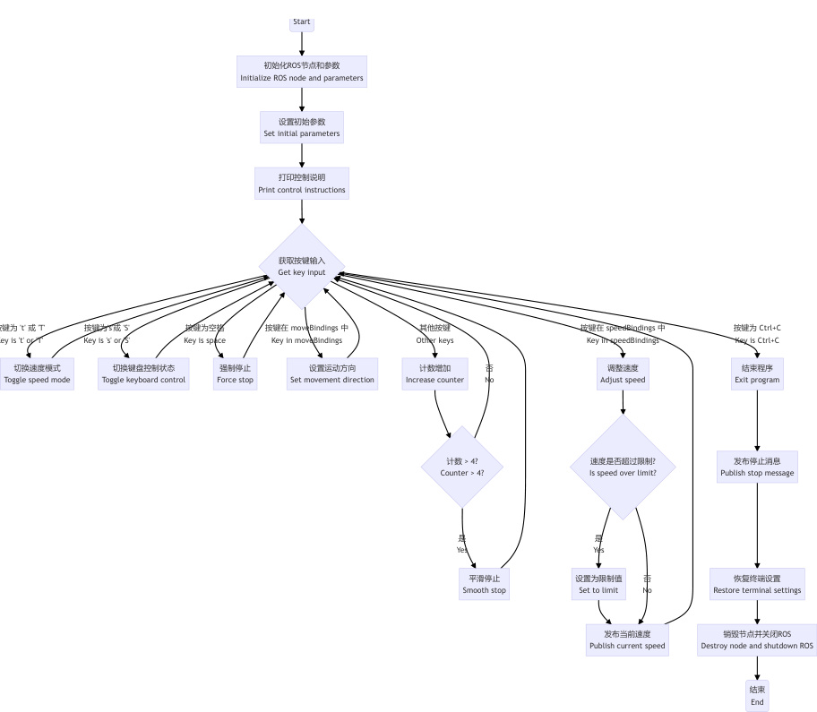
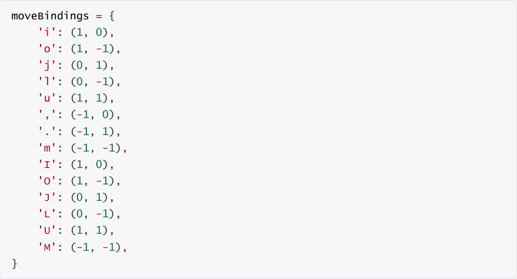
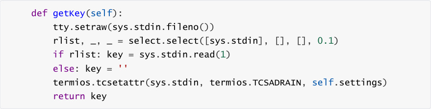
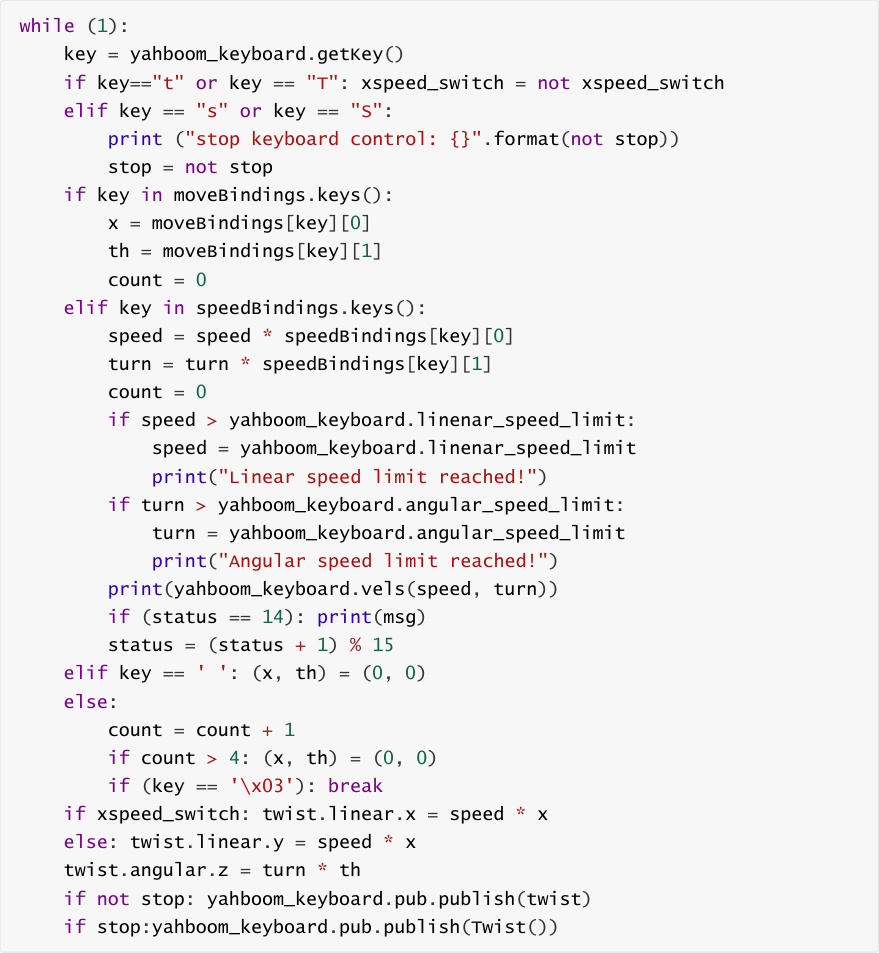

# Keyboard Control

**Keyboard Control**

1. Course Content

2. Preparation

### 2.1 Content Description

### 2.2 Starting the Agent

3. Running the Example

### 3.1 Starting Keyboard Control

### 3.2 Key Control Instructions

#### 3.2.1 Direction Control

#### 3.2.2 Speed Control

4. Source Code Analysis

### 4.1 View the Node Relationship Graph

### 4.2 Viewing Topic Messages and Message Types

### 4.3 Program Flowchart

### 4.4 Source Code Analysis

### 4.41 Published Topic: cmd_vel

### 4.42 Movement Dictionary and Speed Dictionary

## 1. Course Content


Learn how to control robot movement using the keyboard and its principles.


After running the program, use keyboard keys to publish speed topics to control the robot

chassis' movement.
## 2. Preparation
### 2.1 Content Description


This course uses the Jetson Orin NX as an example. For Raspberry Pi and Jetson Nano boards, you

need to open a terminal and enter the command to enter the Docker container. Once inside the

Docker container, enter the commands mentioned in this course in the terminal. For instructions

on entering the Docker container, refer to the product tutorial **[Configuration and Operation**

**Guide] - [Entering the Docker (Jetson Nano and Raspberry Pi 5 users see here)]** . For Orin and

NX boards, simply open a terminal and enter the commands mentioned in this course.

### 2.2 Starting the Agent


**Note: The Docker agent must be started before testing all examples. If it's already started,**

**you don't need to restart it.**


Enter the command in the vehicle terminal:


The terminal prints the following message, indicating a successful connection.


## 3. Running the Example
### 3.1 Starting Keyboard Control

**Note:**


The Jetson Nano and Raspberry Pi series controllers must first enter the Docker container

(for steps, see the [Docker Course Section - Entering the Robot's Docker Container]).


Run the keyboard control node on the vehicle terminal or in the virtual machine:



### 3.2 Key Control Instructions


#### 3.2.1 Direction Control

|[i] or [I]|[linear, 0]|[u] or [U]|[linear, angular]|
|---|---|---|---|
|[,]|[-linear, 0]|[o] or [O]|[linear, -angular]|
|[j] or [J]|[0, angular]|[m] or [M]|[-linear, -angular]|
|[l] or [L]|[0, -angular]|[.]|[-linear, angular]|


#### 3.2.2 Speed Control


|Key|Speed Change|Key|Speed Change|
|---|---|---|---|
|【q】|Increase both linear and angular<br>velocities by 10%|【z】|Decrease both linear and<br>angular velocities by 10%|
|【w】|Increase only linear velocity by<br>10%|【x】|Decrease only linear velocity by<br>10%|
|【e】|Increase only angular velocity by<br>10%|【c】|Decrease only angular velocity<br>by 10%|
|【t】|Switch linear velocity between X-<br>axis and Y-axis|【s】|Stop keyboard control|


## 4. Source Code Analysis

Source code path:


jetson orin nano, jetson orin NX:


Jetson Orin Nano, Raspberry Pi:


You need to enter Docker first.


### 4.1 View the Node Relationship Graph

Open a terminal and enter the command:




From the node relationship diagram, we can see:


**yahboom_keyboard_ctrl** : Controls the robot chassis by publishing the **/cmd_vel** topic


**/YB_Node** : The robot chassis node subscribes to the **/cmd_vel** topic and uses the inverse

kinematic solution to calculate the speed of each wheel, thereby controlling the robot's

movement.

### 4.2 Viewing Topic Messages and Message Types


Open a terminal and enter the command:


When controlling the robot chassis' movements using the keyboard, data is published to the

**/cmd_vel** topic by printing messages.


Enter the following command to view the message type of the **/cmd_vel** topic:







The Type column indicates that the message type of the **/cmd_vel** topic is

**geometry_msgs/msg/Twist** . Enter the following command to view the composition of the

**geometry_msgs/msg/Twist** message type:




From the composition of the above message types, we can see that the robot chassis movement

is controlled by two vector groups: linear (linear velocity) and angular (angular velocity). Each data

element is a float64 floating-point number. The following explains the meaning of each data

element.


linear

float64 x: x-axis velocity

float64 y: y-axis velocity

float64 z: z-axis velocity

angular

float64 x: x-axis angular velocity

float64 y: y-axis angular velocity

float64 z: z-axis velocity : z-axis angular velocity


Because the robot chassis can only move within a two-dimensional plane, only linear-x (x-axis

velocity), linear-y (y-axis velocity), and angular-z (z-axis angular velocity) are published when

controlling the robot via the keyboard.

### 4.3 Program Flowchart


开始

S





### 4.4 Source Code Analysis

Source Code Path:


Jetson Orin Nano, Jetson Orin NX:


Jetson Orin Nano, Raspberry Pi:


You need to first enter Docker.


### 4.41 Published Topic: cmd_vel


Just package the speed and publish it via pub.publish(twist). The chassis' speed subscriber will

receive the speed data and then drive the car.

### 4.42 Movement Dictionary and Speed Dictionary


The movement dictionary mainly stores characters related to direction control





The speed dictionary mainly stores the characters related to speed control

```
 speedBindings = {

    'Q': (1.1, 1.1),

    'Z': (.9, .9),

    'W': (1.1, 1),

    'X': (.9, 1),

    'E': (1, 1.1),

    'C': (1, .9),

    'q': (1.1, 1.1),

    'z': (.9, .9),

    'w': (1.1, 1),

```

```
    'x': (.9, 1),

    'e': (1, 1.1),

    'c': (1, .9),

 }

### 4.43 Get the current key information

```





### 4.44 Determine the key value and publish the /cmd_vel speed topic



