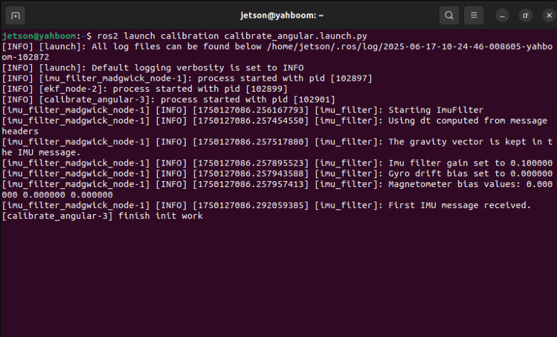
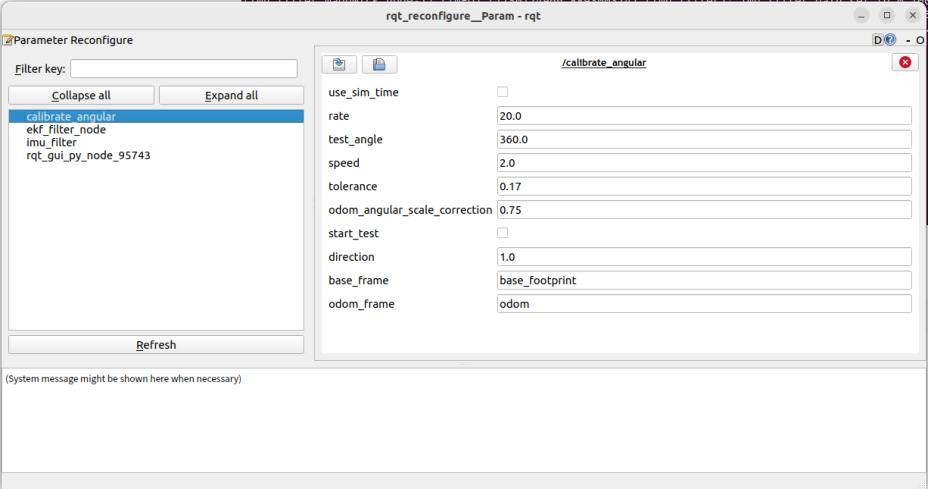
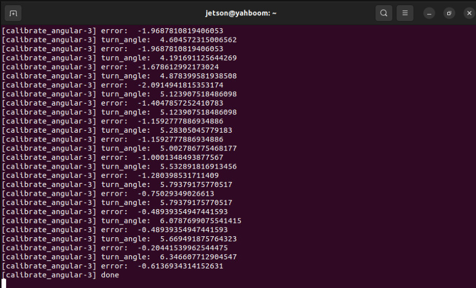
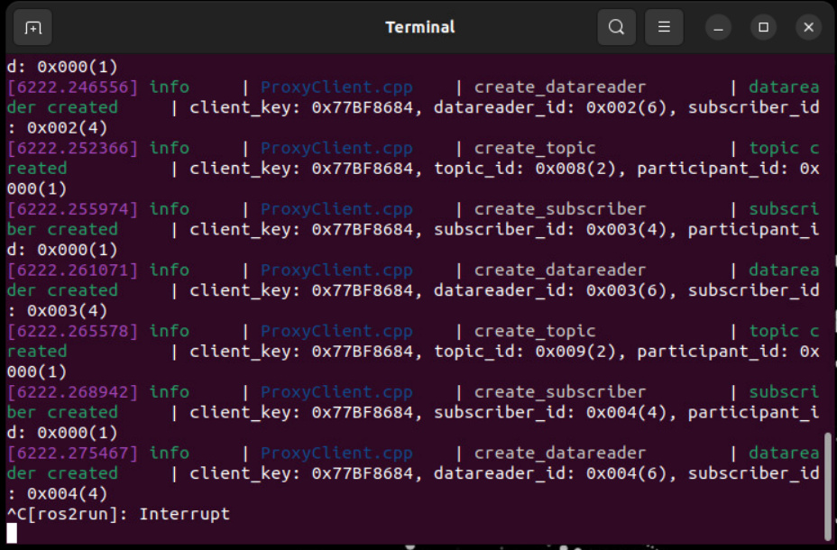
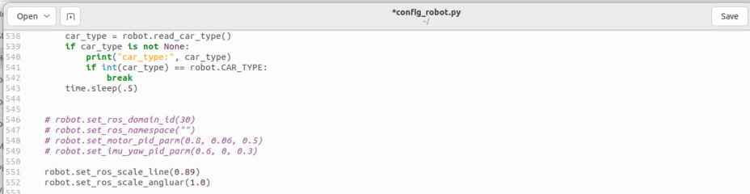
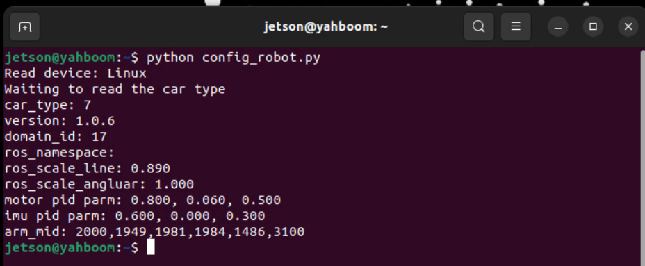
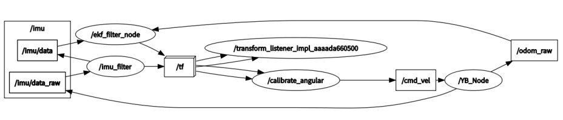
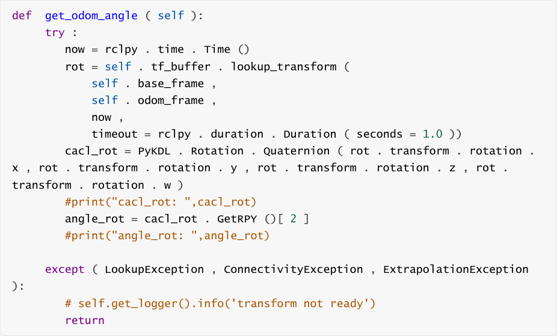

# Angular velocity calibration

**Angular velocity calibration**

1. Course Content

2. Preparation

### 2.1 Content Description

### 2.2 Start the Agent

3. Run the case

### 3.1 Startup Program

### 3.2 Start calibration

### 3.3 Writing calibration parameters to the chassis

4. Source code analysis

### 4.1 View the node relationship diagram

### 4.2 Source code analysis

## 1. Course Content


Learn the function of robot angular velocity calibration


Run the angular velocity calibration program. After clicking Start on the visual interface, the robot

chassis will begin to rotate and will stop when the error is less than the tolerance value.
## 2. Preparation
### 2.1 Content Description


This course uses the Jetson Orin NX as an example. For Raspberry Pi and Jetson Nano boards, you

need to open a terminal and enter the command to enter the Docker container. Once inside the

Docker container, enter the commands mentioned in this course in the terminal. For instructions

on entering the Docker container, refer to the product tutorial **[Configuration and Operation**

**Guide] - [Entering the Docker (Jetson Nano and Raspberry Pi 5 users see here)]** . For Orin and

NX boards, simply open a terminal and enter the commands mentioned in this course.

### 2.2 Start the Agent


**calibrate_angular Note: All test cases must start the docker agent first. If it has already**

**been started, there is no need to start it again**


Enter the command in the vehicle terminal:


The terminal prints the following information, indicating that the connection is successful


## 3. Run the case

**Notice:**


**Jetson Nano and Raspberry Pi** series controllers need to enter the Docker container first

(please refer to the [Docker course chapter - Entering the robot's Docker container] for

steps).

### 3.1 Startup Program


The vehicle computer opens the terminal and runs the angular velocity calibration node:




Open the dynamic parameter adjuster in the virtual machine terminal and run:


**Click the calibrate_angular** node in the node options on the left :


**Note:** The above nodes may not be present when you first open the application. Click Refresh to

see all nodes. The **calibrate_angular** node displayed is the node for calibrating angular velocity.


Other parameters of the rqt interface are described as follows:


test_angle: calibration test angle, here the test rotates 360 degrees;

speed: angular velocity;

Tolerance: the tolerance allowed for error;

odom_angular_scale_correction: Linear velocity proportional coefficient. If the test result is

not ideal, modify this value.

start_test: test switch;

base_frame: the name of the base coordinate system;

odom_frame: The name of the odometry coordinate frame.

### 3.2 Start calibration


In the rqt_reconfigure interface, select the calibrate_angular node. There is a **start_test** node

below . Click the box to the right of it to start calibration.


Click start_test to start calibration. The car will monitor the TF transformation of base_footprint

and odom, calculate the theoretical rotation angle of the car, and issue a stop command when the

error is less than tolerance.





If the actual rotation angle of the car is not 360 degrees, then modify the

odom_angular_scale_correction parameter in rqt. After modification, click a blank space, click

start_test again, reset start_test, and then click start_test again to calibrate. Modifying other

parameters is the same. You need to click a blank space to write the modified parameters. Record

the last calibrated **odom_angular_scale_correction** parameter

### 3.3 Writing calibration parameters to the chassis


To write parameters to the chassis, you need to disconnect the chassis agent first. Press **ctrl+c** or

directly close the chassis connection agent terminal.


**Open the config_robot.py** file in the home directory of the vehicle





Uncomment line 552, enter the previous calibration coefficients in the brackets of

**robot.set_ros_scale_angluar(xx), and click** **Save** .


Open a terminal on the car and enter the command:







Wait for the parameter writing to be completed. The ros_scale_angluar:1.000 printed in the

terminal information is the written parameter, and the chassis angular velocity calibration is

completed.
## 4. Source code analysis


Source code path:


jetson orin nano, jetson orin NX host:


Jetson Orin Nano, Raspberry Pi host:


You need to enter docker first


### 4.1 View the node relationship diagram

Open a terminal on the virtual machine and enter the command:




In the above node relationship diagram:


**The imu_filter node is responsible for filtering the original IMU data** **/imu/data** of the

chassis and publishing the filtered data **/imu/data**

**The /ekf_filter_node** node subscribes to the chassis raw odometer **/odom_raw** and filtered

IMU data **/imu/data**, performs data fusion and publishes to the **/odom** topic

**The calibrate_angular** node monitors the TF transformation of odom->base_footprint and

publishes the /cmd_vel topic to control the movement of the robot chassis.

### 4.2 Source code analysis


Among them, the implementation of monitoring tf coordinate transformation is the

get_odom_angle method in the Calibrateangular class:




The on_timer (timer callback function) method in the Calibrateangular class is used to determine

the rotation angle of the robot chassis and control the chassis movement:

```
 def on_timer ( self ):

```

```
  self . start_test = self . get_parameter ( 'start_test' ).

get_parameter_value (). bool_value

  self . odom_angular_scale_correction = self . get_parameter (

'odom_angular_scale_correction' ) . get_parameter_value () . double_value

  self . test_angle = self . get_parameter ( 'test_angle' ) .

get_parameter_value () . double_value

  self . test_angle = radians ( self . test_angle ) # Convert angle to radians

  self . speed = self . get_parameter ( 'speed' ). get_parameter_value ().

double_value

  move_cmd = Twist ()

  self . test_angle *= self . reverse

  #self.test_angle *= self.reverse

  #self.error = self.test_angle - self.turn_angle

  if self . start_test :

     self . error = self . turn_angle - self . test_angle

     if abs ( self . error ) > self . tolerance  :

       #move_cmd.linear.x = 0.2

       move_cmd . angular . z = copysign ( self . speed, self . error )

       #print("angular: ",move_cmd.angular.z)

       self . cmd_vel . publish ( move_cmd )

       self . odom_angle = self . get_odom_angle ()

       self . delta_angle = self . odom_angular_scale_correction * self .

normalize_angle ( self . odom_angle - self . first_angle )

       #print("delta_angle: ",self.delta_angle)

       self . turn_angle += self . delta_angle

       print ( "turn_angle: ", self . turn_angle, flush = True )

       #self.error = self.test_angle - self.turn_angle

       print ( "error: ", self . error, flush = True )

       self . first_angle = self . odom_angle

       #print("first_angle: ",self.first_angle)

     else :

       self . error = 0.0

       self . turn_angle = 0.0

       print ( "done", flush = True )

       self . first_angle = 0

       self . reverse = - self . reverse

       self . start_test  = rclpy . parameter . Parameter ( 'start_test',

rclpy . Parameter . Type . BOOL, False )

       all_new_parameters = [ self . start_test ]

       self . set_parameters ( all_new_parameters )

  else :

     self . error = 0.0

     self . cmd_vel . publish ( Twist ())

     self . turn_angle = 0.0

     self . start_test  = rclpy . parameter . Parameter ( 'start_test',

rclpy . Parameter . Type . BOOL, False )

     all_new_parameters = [ self . start_test ]

     self . set_parameters ( all_new_parameters )

```
