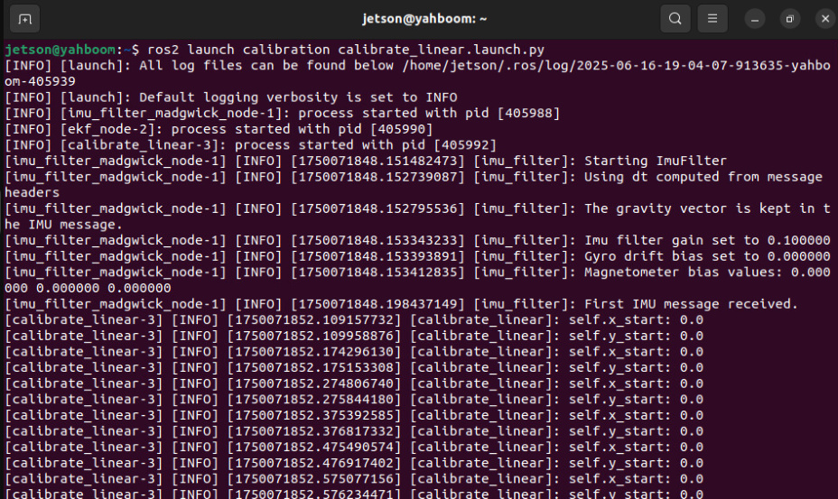
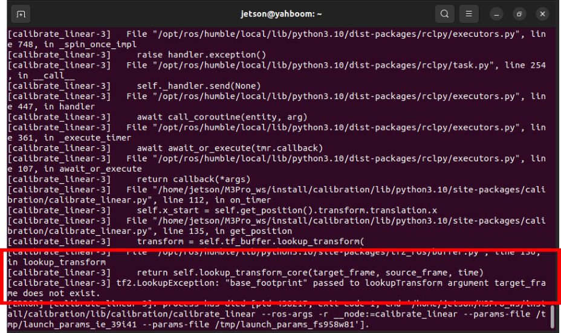
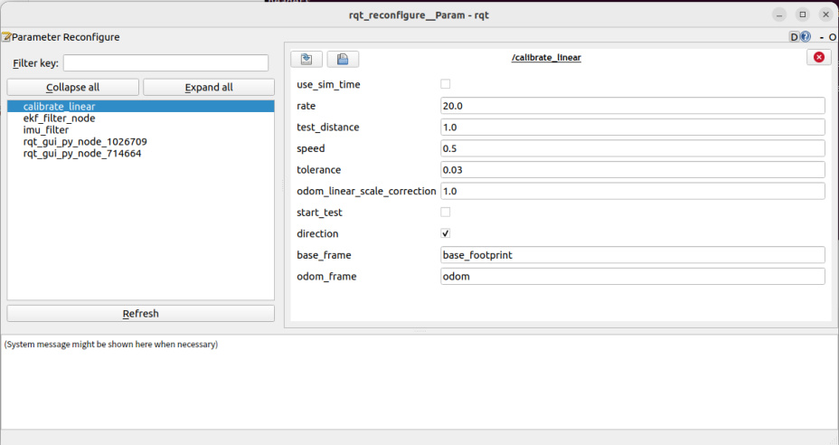
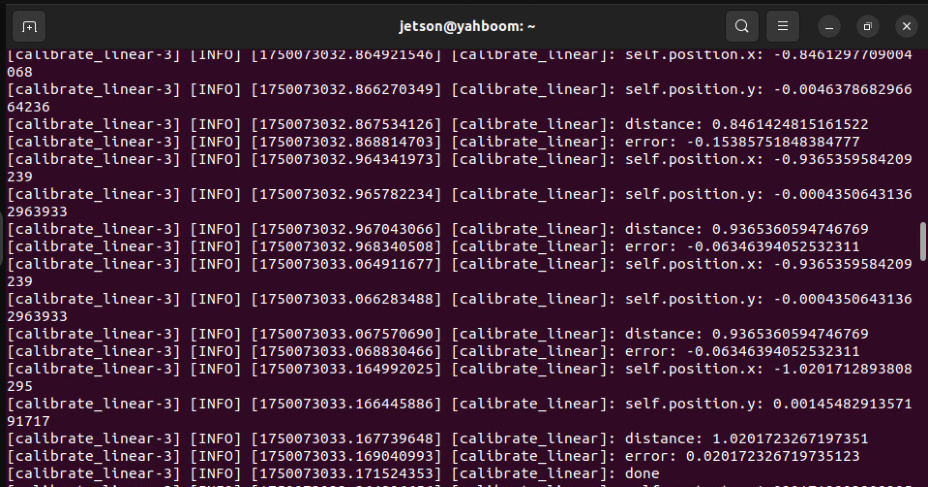
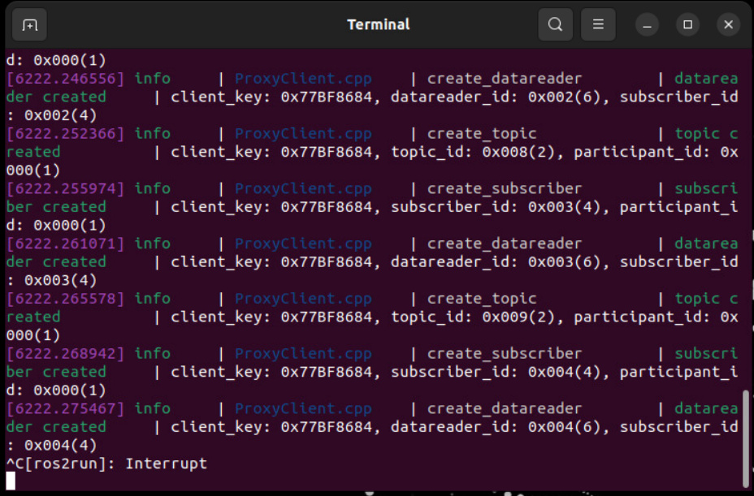
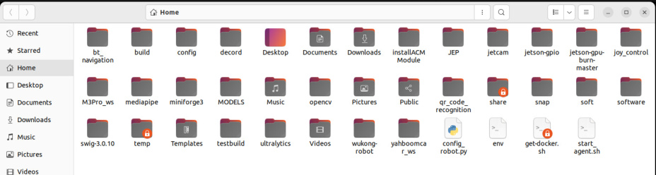
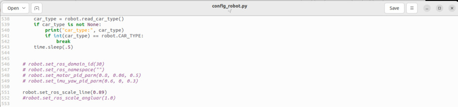
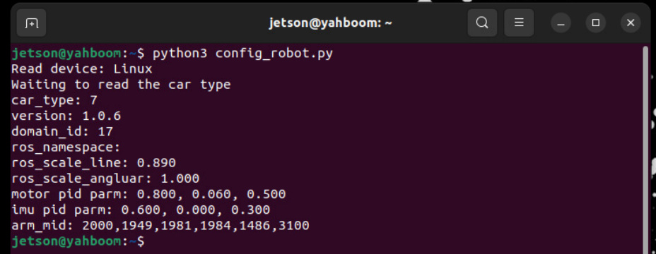
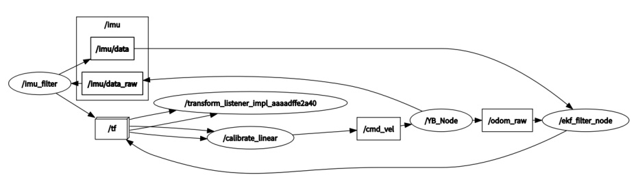
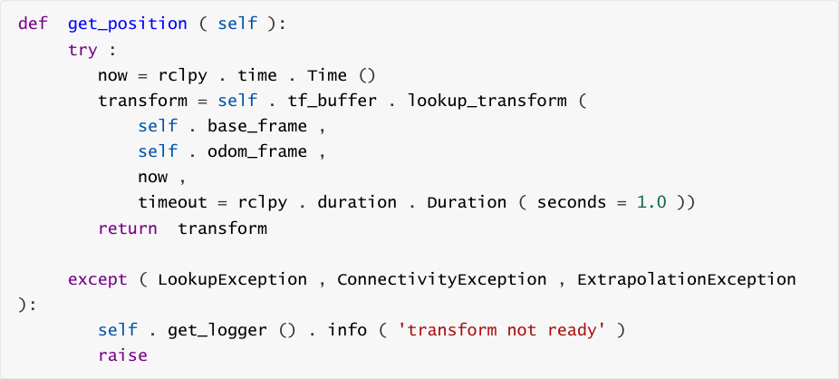

# Linear speed calibration

**Linear speed calibration**

1. Course Content

2. Preparation

### 2.1 Content Description

### 2.2 Start the Agent

3. Run the case

### 3.1 Startup Program

### 3.2 Start calibration

### 3.3 Writing calibration parameters to the chassis

4. Code explanation

### 4.1 View the node relationship diagram

### 4.2 Source code analysis

## 1. Course Content


Learn the function of robot linear speed calibration. After running the program, click Start on the

visual interface. The robot chassis will start to move forward and stop when the error is less than

the tolerance value.
## 2. Preparation
### 2.1 Content Description


This course uses the Jetson Orin NX as an example. For Raspberry Pi and Jetson Nano boards, you

need to open a terminal and enter the command to enter the Docker container. Once inside the

Docker container, enter the commands mentioned in this course in the terminal. For instructions

on entering the Docker container, refer to the product tutorial **[Configuration and Operation**

**Guide] - [Entering the Docker (Jetson Nano and Raspberry Pi 5 users see here)]** . For Orin and

NX boards, simply open a terminal and enter the commands mentioned in this course.

### 2.2 Start the Agent


**Note: To test all cases, you must start the docker agent first. If it has already been started,**

**you do not need to start it again.**


Enter the command in the vehicle terminal:


The terminal prints the following information, indicating that the connection is successful


## 3. Run the case

**Notice:**


**Jetson Nano and Raspberry Pi** series controllers need to enter the Docker container first

(please refer to the [Docker course chapter - Entering the robot's Docker container] for

steps).

### 3.1 Startup Program


Run the Linear Speed Calibration node:




If the error message is displayed as follows when running for the first time, indicating that there is

no tf transformation, press **ctrl+c** to exit the program and run it again.




Open the dynamic parameter adjuster and run in the terminal:


**Click the calibrate_linear** node in the node options on the left :


**Note:** The above nodes may not be present when you first open the application. Click Refresh to

see all nodes. The **calibrate_linear** node shown is the node for calibrating linear velocity.


The rqt interface parameters are described as follows:


test_distance: calibration test distance, here the test is to walk forward 1 meter;

speed: linear speed;

Tolerance: the tolerance allowed for error;

odom_linear_scale_correction: linear velocity proportional coefficient. If the test result is not

ideal, modify this value.

start_test: test switch;

Direction: can be ignored. This value is used for the McWheel structure trolley. After

modification, the linear speed of left and right movement can be calibrated.



base_frame: the name of the base coordinate system;

odom_frame: The name of the odometry coordinate frame.

### 3.2 Start calibration


In the rqt_reconfigure interface, select the calibrate_linear node (if it is not displayed, click

**Refresh** ).


Select a reference of known length on the ground (tape measure, tile, etc.): Change **test_distance**

to the actual test distance. Here we take a 1 meter test distance as an example. Click the

**start_test** box to start calibration.


Click start_test to start calibration. The car will monitor the TF transformation of base_footprint

and odom, calculate the theoretical distance the car has traveled, and wait until the error is less

than tolerance. The terminal will print done after issuing the stop command. If the actual distance

the car has traveled is less than 1m, increase the **odom_linear_scale_correction** parameter

appropriately. After modification, click a blank space, click start_test again, reset start_test, and

then click start_test again to calibrate. Modifying other parameters is the same. You need to click

a blank space to write the modified parameters. Record the last calibrated

**odom_linear_scale_correction** parameter

### 3.3 Writing calibration parameters to the chassis


To write parameters to the chassis, you need to disconnect the chassis agent first. Press **ctrl+c** or

directly close the chassis connection agent terminal.





**Open the config_robot.py** file in the home directory of the vehicle .


Uncomment line 551, enter the previous calibration coefficients in the brackets of

**robot.set_ros_scale_line(xx), and click** **Save** .


Open a terminal on the car and enter the command:









Wait for the parameter writing to be completed. The ros_scale_line:0.890 in the terminal print

information is the written parameter, and the chassis linear speed calibration is completed.

## 4. Code explanation


Source code path:


jetson orin nano, jetson orin NX host:


Jetson Orin Nano, Raspberry Pi host:


You need to enter docker first


### 4.1 View the node relationship diagram

Open a terminal and enter the command:




In the above node relationship diagram:


**The imu_filter node is responsible for filtering the original IMU data** **/imu/data** of the

chassis and publishing the filtered data **/imu/data**

**The /ekf_filter_node** node subscribes to the chassis raw odometer **/odom_raw** and filtered

IMU data **/imu/data**, performs data fusion and publishes to the **/odom** topic


**The calibrate_linear** node monitors the TF transformation of odom->base_footprint and

publishes the /cmd_vel topic to control the movement of the robot chassis.

### 4.2 Source code analysis


Among them, the implementation of monitoring tf coordinate transformation is the get_position

method in the CalibrateLinear class:





The on_timer method (timer callback function) in the CalibrateLinear class is used to determine

the displacement of the robot chassis and control its movement:

```
 def on_timer ( self ):

    move_cmd = Twist ()

    #self.get_param()

    self . start_test = self . get_parameter ( 'start_test' ).

 get_parameter_value (). bool_value

    self . odom_linear_scale_correction = self . get_parameter (

 'odom_linear_scale_correction' ) . get_parameter_value () . double_value

    self . direction = self . get_parameter ( 'direction' ). get_parameter_value

 (). bool_value

    self . test_distance = self . get_parameter ( 'test_distance' ) .

 get_parameter_value () . double_value

    self . tolerance = self . get_parameter ( 'tolerance' ). get_parameter_value

 (). double_value

    self . speed = self . get_parameter ( 'speed' ). get_parameter_value ().

 double_value

    if self . start_test :

      '''trans = self.tf_buffer.lookup_transform(

 self.odom_frame,

 self.base_frame,

 now,

 )'''

      self . position . x = self . get_position () . transform . translation .

 x

      self . position . y = self . get_position () . transform . translation .

 y

      self . get_logger () . info ( f"self.position.x: {self.position.x}" )

      self . get_logger () . info ( f"self.position.y: {self.position.y}" )

```

```
     distance = sqrt ( pow (( self . position . x - self . x_start ), 2 ) +

                 pow (( self . position . y - self . y_start ), 2

))

     distance *= self . odom_linear_scale_correction

     # print("distance: ",distance)

     self . get_logger () . info ( f"distance: {distance}" )

     error = distance - self . test_distance

     # print("error: ",error)

     self . get_logger () . info ( f"error: {error}" )

     #start = time()

     if abs ( error ) < self . tolerance :

       self . start_test  = rclpy . parameter . Parameter ( 'start_test',

rclpy . Parameter . Type . BOOL, False )

       all_new_parameters = [ self . start_test ]

       self . set_parameters ( all_new_parameters )

       self . get_logger () . info ( "done" )

     else :

       if self . direction :

          print ( "x" )

          move_cmd . linear . x = copysign ( self . speed, - 1 * error

)

       else :

          move_cmd . linear . y = copysign ( self . speed, - 1 * error

)

          print ( "y" )

     self . cmd_vel . publish ( move_cmd )

     #end = time()

  else :

     self . x_start = self . get_position () . transform . translation . x

     self . y_start = self . get_position () . transform . translation . y

     self . get_logger () . info ( f"self.x_start: {self.x_start}" )

     self . get_logger () . info ( f"self.y_start: {self.y_start}" )

     self . cmd_vel . publish ( Twist ())

```
