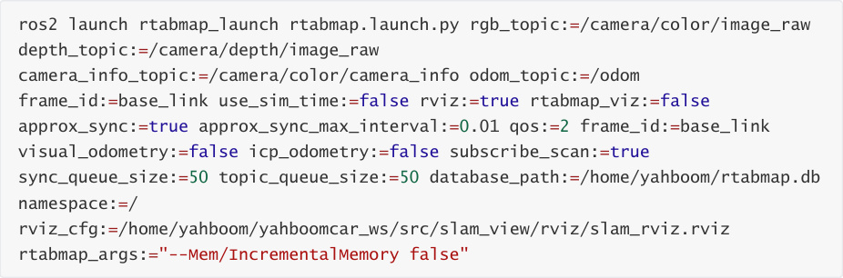
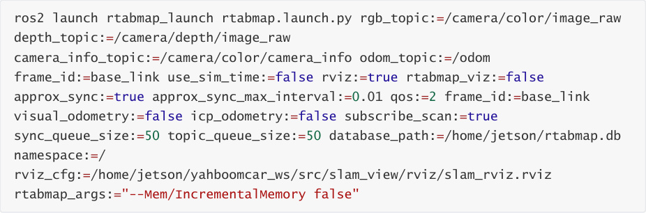
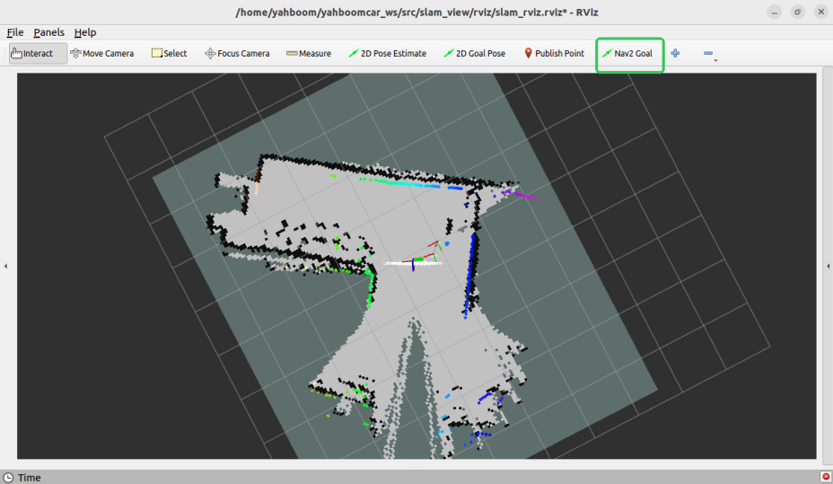
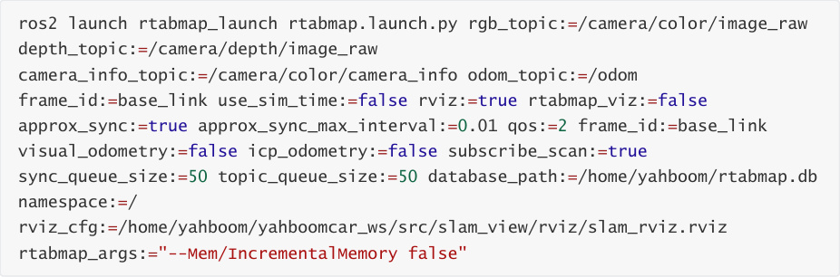

# RTAB-Map Navigation

RTAB-Map Navigation

1. Content Description

2. Preparation

3. Command Analysis

## 1. Content Description

This section explains how to implement RTAB-Map navigation by combining the car chassis,

LiDAR, depth camera, and Navigation2.

This section requires entering commands in the terminal. The terminal you open depends on

your motherboard type. This lesson uses the Raspberry Pi 5 as an example. For Raspberry Pi and

Jetson-Nano boards, you need to open a terminal on the host computer and enter the command

to enter the Docker container. Once inside the Docker container, enter the commands mentioned

in this section in the terminal. For instructions on entering the Docker container from the host

computer, refer to this product tutorial **[Configuration and Operation Guide]--[Entering the**

**Docker (Jetson Nano and Raspberry Pi 5 users, see here)]** .

For Orin boards, simply open the terminal and enter the commands mentioned in this section.

## 2. Preparation

Due to performance limitations, the Raspberry Pi 5 and Jetson Nano cannot smoothly run the

RTAB-Map algorithm in Docker on the motherboard. Therefore, a virtual machine is required to

facilitate this. To enable distributed communication between the car and the virtual machine, two

steps are required:

Both systems must be on the same local area network. This is most easily achieved by

connecting to the same Wi-Fi network.

Both systems must have the same ROS_DOMAIN_ID. The default ROS_DOMAIN_ID for the car

is 30, and the default ROS_DOMAIN_ID for the virtual machine is also 30. If they are different,

you need to modify the virtual machine's ROS_DOMAIN_ID. To do this, modify the ~/.bashrc

file and change the ROS_DOMAIN_ID value to match the car's. Save and exit the file, then

enter the command source ~/.bashrc to refresh the environment variables.

To verify distributed communication between the two systems, enter ros2 node list on the

virtual machine. If you see **/YB_Node**, communication is established.

The Orin motherboard can be run directly on the motherboard.

Also, you need to copy the map created using RTAB-Map to the terminal directory. In the virtual

machine/Orin mainboard terminal, enter the following command to copy it:

Then, open a terminal on the robot and enter the following command to start the chassis, radar,

and camera.

Then, open a terminal in the virtual machine and enter the following command to control the

robot arm to move to the navigation posture.

Open a terminal in the virtual machine and enter the following command to start RTAB-Map.

***** If booting from an Orin motherboard, enter this command in the motherboard terminal:

Then run the following command in the VM/Orin motherboard terminal to start Navigation 2.

After everything has successfully launched, it should look like the image below.

Then, using the [Nav2 Goal] tool in rivz, you can assign a target point to the car, and it will

navigate to it.

## 3. Command Analysis

The RTAB-Map navigation commands are as follows. RTAB-Map here only performs positioning.

rgb_topic: Color image topic

depth_topic: Depth image topic

camera_info_topic: Color camera internal reference topic

odom_topic: Odometry topic

frame_id: Robot base coordinate system name

use_sim_time: Whether to use simulation time

rviz: Whether to enable rviz display

rtabmap_viz: Whether to enable rtabmap plugin display

approx_sync: Whether to enable approximate time synchronization

approx_sync_max_interval: Maximum allowed synchronization time difference

visual_odometry: Whether to enable visual odometry

icp_odometry: Whether to enable ICP point cloud matching odometry

subscribe_scan: Whether to subscribe to lidar data

sync_queue_size: Time synchronization queue size

topic_queue_size: Single-topic subscription queue size

database_path: Map database path

namespace: Namespace

rviz_cfg: Rviz file path

rtabmap_args: Parameters passed directly to the RTAB-MAP core. Optional parameters

include:

positioning)

qos: Quality of Service (QoS policy). Optional parameters include:

0: SYSTEM_DEFAULT

1: RELIABLE (guaranteed delivery)

2: BEST_EFFORT (possible loss)
