# App Mapping and Navigation

App Mapping and Navigation

1. Content Description

### 1.1. Preparation

2. Mapping with the app

### 2.1. Program Startup

### 2.2. Launch Command Parsing

3. App Navigation

### 3.1. Program Startup

### 3.2. Instruction Analysis

## 1. Content Description

This course explains how to use the [ROS Robot] app to control the robot for mapping and

navigation.

This section requires entering commands in the terminal. The terminal you choose depends on

your motherboard type. This section uses the Raspberry Pi 5 as an example. For Raspberry Pi and

Jetson-Nano motherboards, you'll need to open a terminal on the host computer and enter the

command to enter the Docker container. Once inside the Docker container, enter the commands

mentioned in this section in the terminal. For instructions on entering the Docker container from

the host computer, refer to the product tutorial **[Configuration and Operation Guide] -**

**[Entering the Docker (Jetson-Nano and Raspberry Pi 5 users, see here)** .

For Orin boards, simply open the terminal and enter the commands mentioned in this section.

### 1.1. Preparation

You must first download the [ROS Rotbot] app on your phone. Android/iOS phone users, please

scan the QR code to download the remote control software. iOS users can also search and

download the ROSRobot mapping and navigation app from the App Store.

The robot and phone must be on the same local area network. This can be achieved by

connecting to the same Wi-Fi network.

## 2. Mapping with the app

### 2.1. Program Startup

Enter the following command on the robot terminal to launch the robot app mapping.

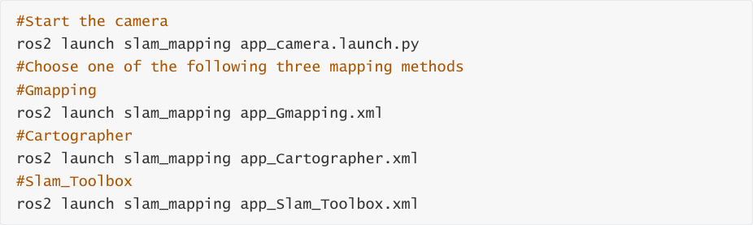

The mobile app will display the following image. Enter the car's IP address, using [zh] for Chinese

and [en] for English. Select ROS2. In the Video Target area below, select

/camera/rgb/image_raw/compressed. Finally, click [Connect].

Connected successfully. After connecting, the following display appears:

Use the wheel to slowly move the cart through the area you want to map. Then click Save Map,

enter a map name, and click Submit to save the map.

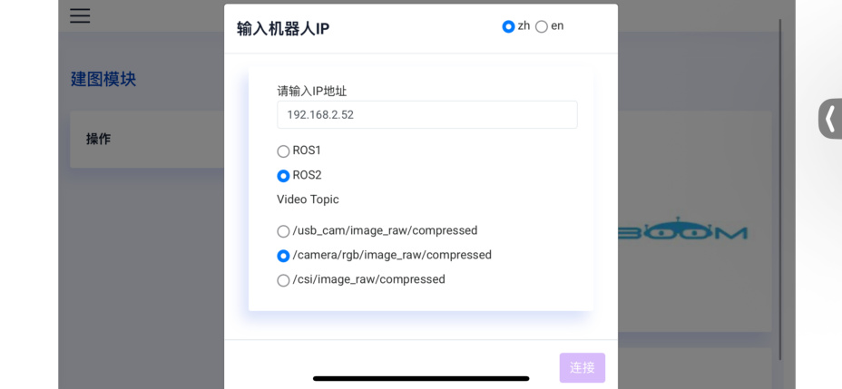

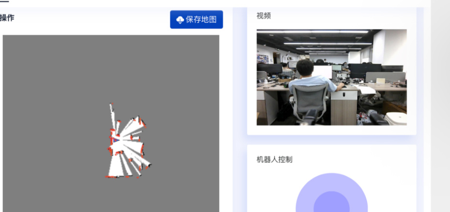
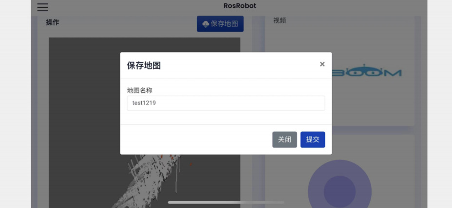

The map is saved to:

Raspberry Pi 5 and Jetson Nano boards:

In a running Docker container, /root/M3Pro_ws/src/M3Pro_navigation/map

Orin board:

/home/jetson/M3Pro_ws/src/M3Pro_navigation/map

### 2.2. Launch Command Parsing

Code Path:

Raspberry Pi 5 and Jetson Nano boards

The program code is in a running Docker container. The path in Docker is

/root/M3Pro_ws/src/slam_mapping/launch/app_Gmapping.xml.

Orin motherboard

The program code path is /home/jetson/M3Pro_ws/src/slam_mapping/launch/app_Gmapping.xml

Using the app_Gmapping.xml file as an example, we will explain which launch files are launched.

The app_Gmapping.xml file is as follows:

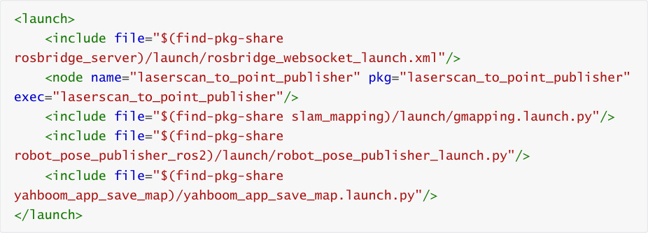

rosbridge_websocket_launch.xml: Used to launch the rosbridge WebSocket server for ROS (Robot

Operating System)

laserscan_to_point_publisher: Node for publishing radar point cloud data to the app

gmapping.launch.py: Node for Gmapping mapping

robot_pose_publisher_launch.py: Node for publishing vehicle position information

yahboom_app_save_map.launch.py: Node for saving maps

## 3. App Navigation

### 3.1. Program Startup

Enter the following command on the car terminal to start the car chassis and radar.

Enter the following command on the car terminal to start the camera.

Enter the following command on the car terminal to start the navigation app.

Change `map:=/root/M3Pro_ws/src/M3Pro_navigation/map/tea.yaml` to the path where you

save your map.

The mobile app displays the following image. Enter the car's IP address, using [zh] for Chinese and

[en] for English. Select ROS2, select /camera/rgb/image_raw/compressed in the Video Target area,

and click [Connect].

After successfully connecting, the following display appears:

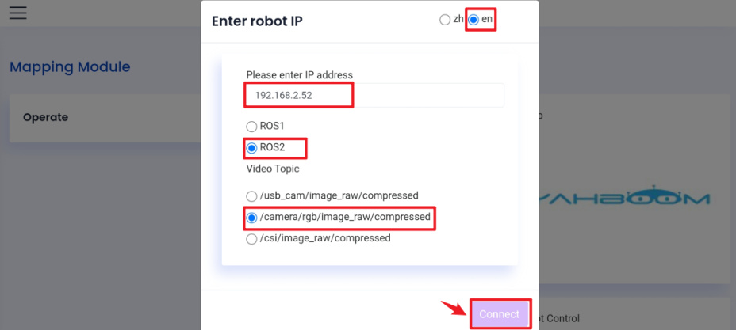
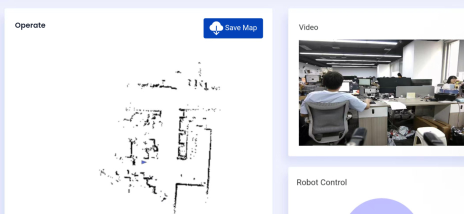

As shown below, select the navigation interface.

Then, based on the actual position of the car, click [Set Initialization Point] to set an initial target

point for the car. If the radar scanning area roughly overlaps with the actual obstacle, the position

is accurate. As shown below,

Then, click [Set Navigation Point] to set a destination for the car. The car will then plan a path and

move along it to the destination. As shown in the image below,

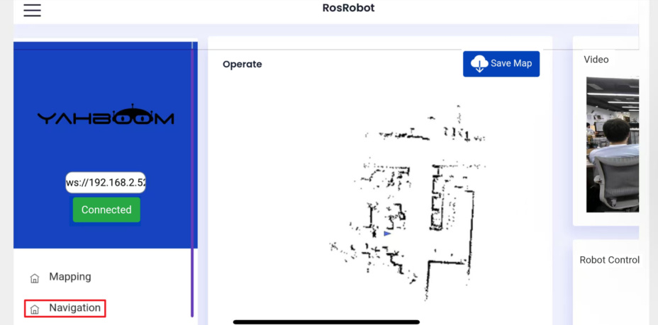

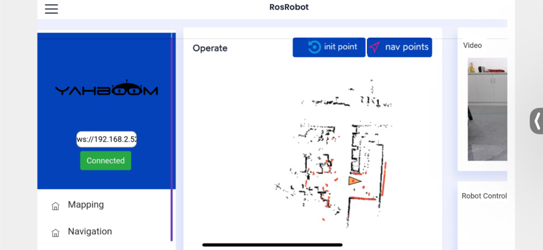
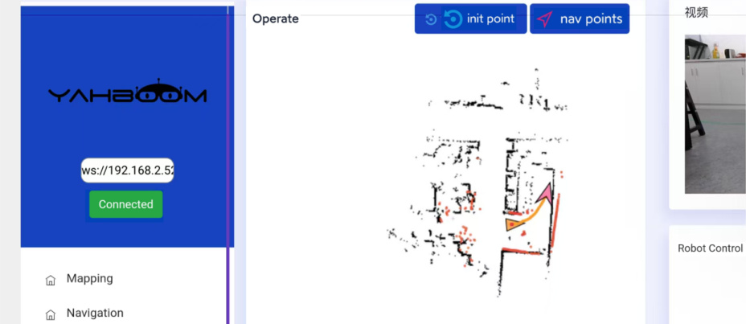
### 3.2. Instruction Analysis

Code Path:

Raspberry Pi and Jetson-Nano Board

The program code is in the running Docker container. The path in Docker is

/root/M3Pro_ws/src/M3Pro_navigation/launch/app_Navigation2.xml.

Orin Board

The program code path is

/home/jetson/M3Pro_ws/src/M3Pro_navigation/launch/app_Navigation2.xml.

app_Navigation2.xml file,

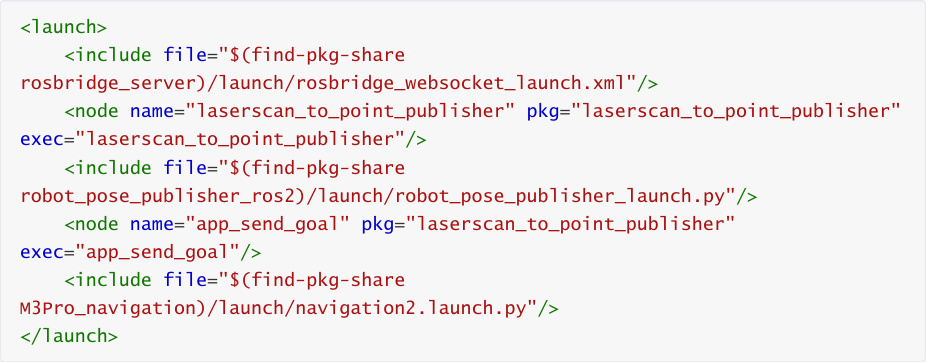

rosbridge_websocket_launch.xml: Used to launch the rosbridge WebSocket server for ROS (Robot

Operating System)

laserscan_to_point_publisher: Node for publishing radar point cloud data to the app

robot_pose_publisher_launch.py: Node for publishing vehicle position information

app_send_goal: Node for the app to publish navigation target point topics

navigation2.launch.py: Navi2 navigation-related programs
