# Pose Constrained Visual Relocalization Navigation

**Pose Constrained Visual Relocalization Navigation**

1. Course Content

Learning Objectives

2. Prerequisites

3. Building Grid Map and Pose Map

4. Recording ArUco Tag Map Coordinates

### 4.1 Preparing ArUco Tags

### 4.2 Deploying ArUco Tags

### 4.3 Starting the Tag Recording Node

5. Starting Visual Relocalization Navigation Mode

### 5.1 Verifying Relocalization Function

### 5.2 Service Control for Tag Detection

6. Source Code Analysis

### 6.1 Tag Recording Node Launch File

### 6.2 Relocalization Mode Navigation Launch File

### 6.3 aritag_relocation.yaml File Structure

### 6.4 Visual Relocalization Working Principle

### 6.5 Tag Configuration Parameters

### 6.6 Inter-node Communication Diagram

## 1. Course Content


Implement visual relocalization navigation using ArUco tags combined with pose constraints.


By deploying ArUco tags as spatial anchors, when robot localization is lost or cumulative error becomes

too large, visual detection automatically triggers relocalization to correct the robot's global pose in the

map, improving the robustness and reliability of the navigation system.


**Learning Objectives**


Master the preparation, deployment, and position recording methods for ArUco tags


Understand the working principles and applicable scenarios of visual relocalization


Learn to use navigation mode with pose constraints combined with visual relocalization
## 2. Prerequisites


Use the following command to start the microROS agent and connect to the chassis

```
 sh start_agent.sh

```


Start basic nodes such as camera, robotic arm assistance, LiDAR fusion, etc.


## 3. Building Grid Map and Pose Map

Start the SLAM mapping node


Control the vehicle to move using keyboard or gamepad to complete map building


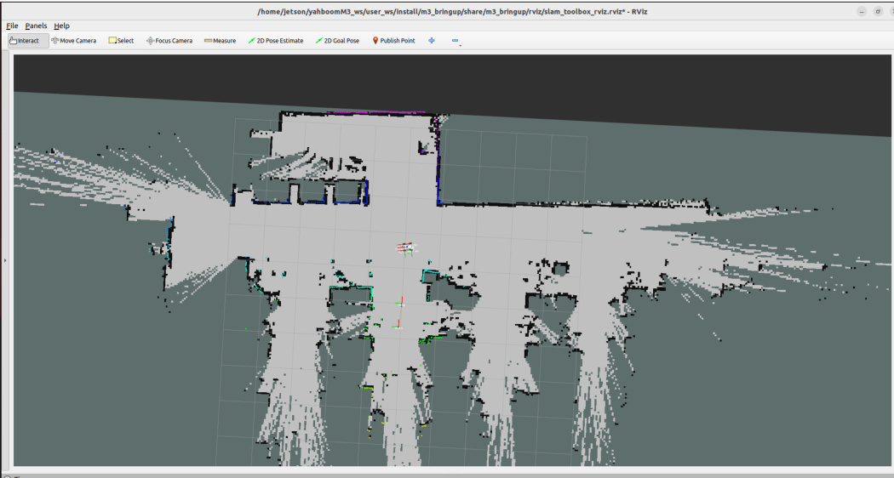

Save the grid map


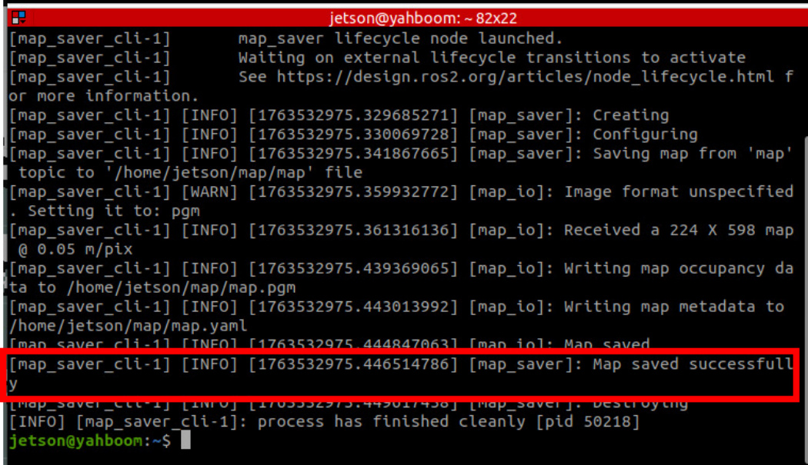

**Note**


**Check Pose Points**


Click the MarkerArray option in the Display panel of Rviz to view the pose points of the pose map.

Ensure there are sufficient pose points evenly distributed in the map area for positioning during

subsequent navigation.


Save the pose map


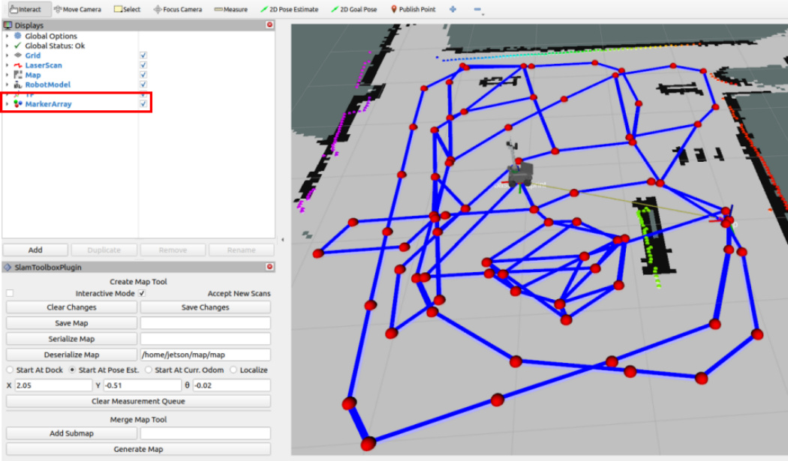


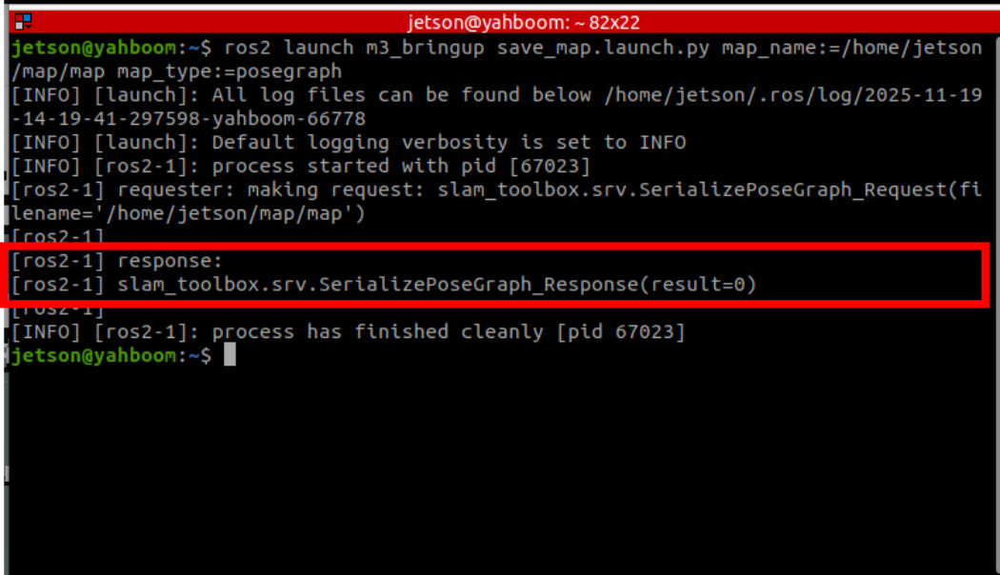
After saving both the grid map and pose map, press **Ctrl+C** in the mapping node terminal to stop

mapping

## 4. Recording ArUco Tag Map Coordinates

### 4.1 Preparing ArUco Tags


You can obtain them through the following methods:


Tags from the sand table map package


Download and print tags from the attachment materials


Determine the tag size


Measure the actual edge length of the tag using measuring tools. The edge length of tags from

the sand table map package is 0.048m


Modify the ArUco detection configuration file


Modify the size to the actual measurement. If you are using tags from the sand table map package, the

factory default size is 0.048 and no modification is needed


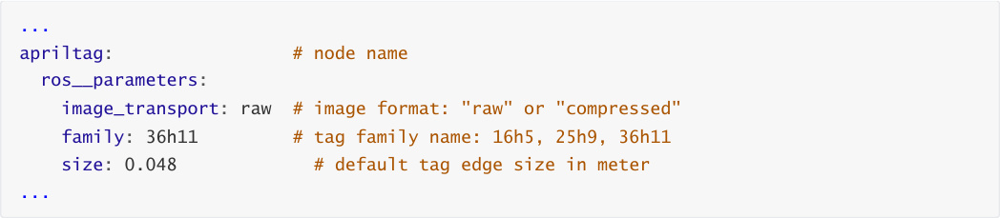


### 4.2 Deploying ArUco Tags

Place ArUco tags at desired locations on the map. They can be placed at any position visible to the

camera, such as the floor, wall, or any other location.


**Important**


**Placement Tips**


It is recommended to place them near the starting or ending points of frequent navigation routes

to trigger relocalization before the vehicle departs or after it reaches the target


It is not recommended to place them during movement because when the vehicle is moving, the

robotic arm may cause mechanical vibration, leading to frequent camera frame shaking and

inaccurate vehicle position calculation

### 4.3 Starting the Tag Recording Node


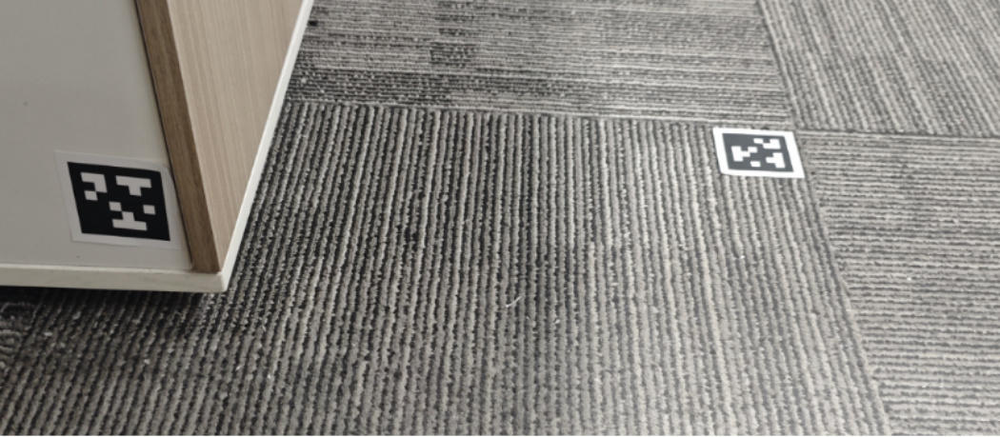


Use the keyboard or gamepad to control the vehicle to move near the tag that needs to be recorded, so

that the tag appears in the camera's field of view


In the **ArUco ID** field of the **aritag_recorder_panel** panel, enter the tag ID that needs to be recorded,

then click **Save** (ensure the vehicle positioning is accurate before recording)


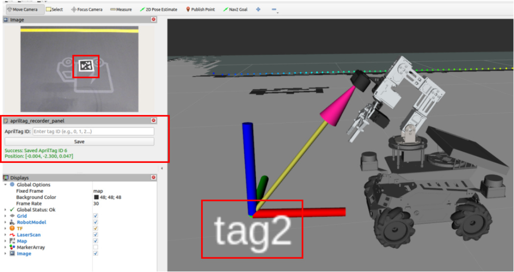

Before recording the tag position, if you find that the laser contour deviates significantly from the

environmental edge features, as shown in the figure below, it indicates a positioning error. At this point,
## you need to first use the 2D Estimate tool for manual relocalization before recording the position


The figure below shows accurate positioning with high matching between the laser contour and

environmental edge features


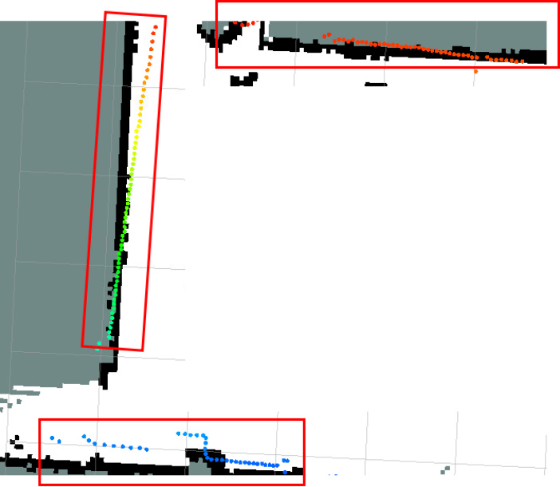
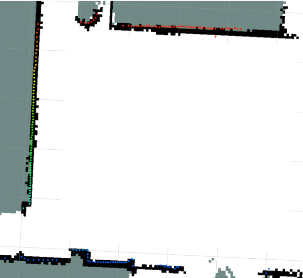

Repeat the above steps to complete recording all tag positions. The recording file path is:


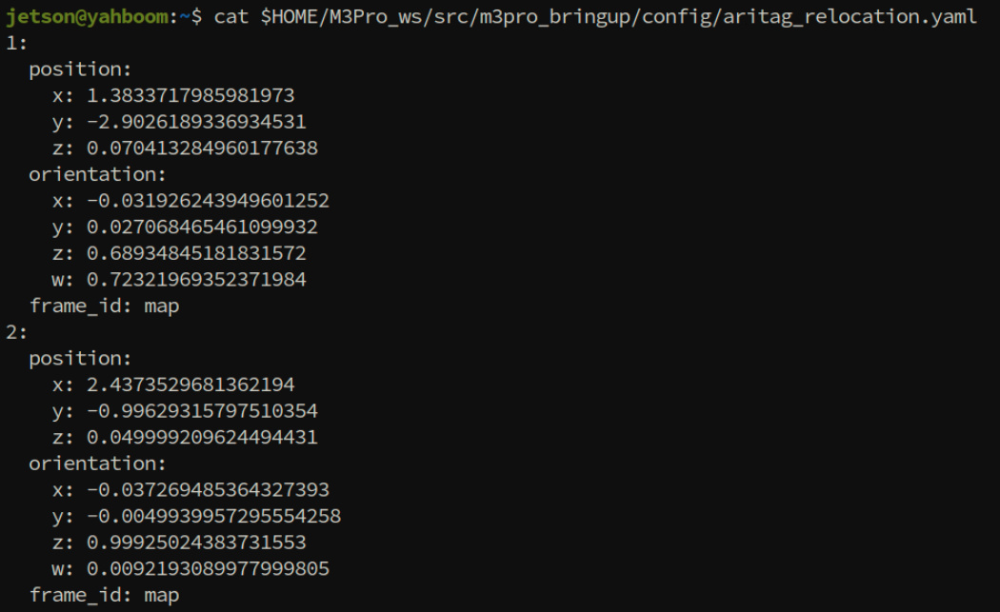

After recording tag positions, press **Ctrl+C** to close the recording node


## 5. Starting Visual Relocalization Navigation Mode


After starting, the interface is the same as regular navigation


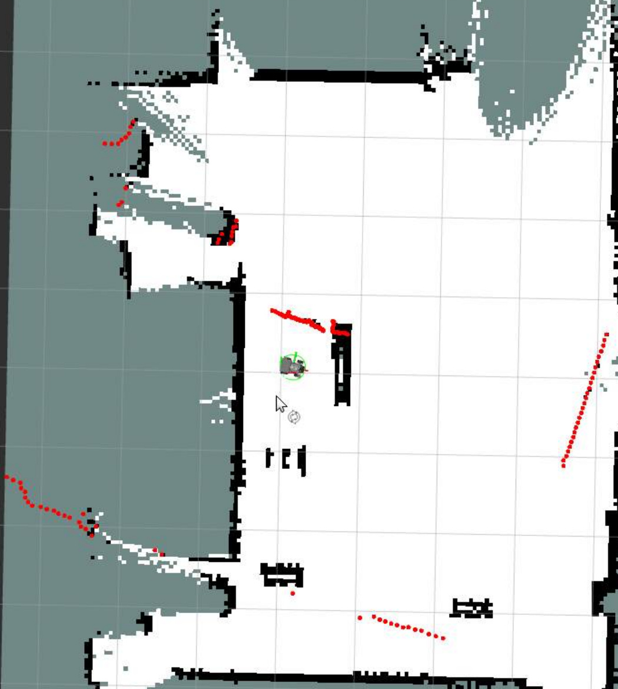
### 5.1 Verifying Relocalization Function

You can manually move the robot's position (simulating severe odometer error or positioning confusion,

as shown in the figure above)


When a tag from the map appears in the camera's field of view, relocalization will be automatically

triggered to correct the robot's global positioning in the map

### 5.2 Service Control for Tag Detection


Since the aritag detection node occupies CPU at high frequency, you can disable the detection state

when detection is not needed. The node provides the control_detection service to control whether tag

detection is performed


Query status


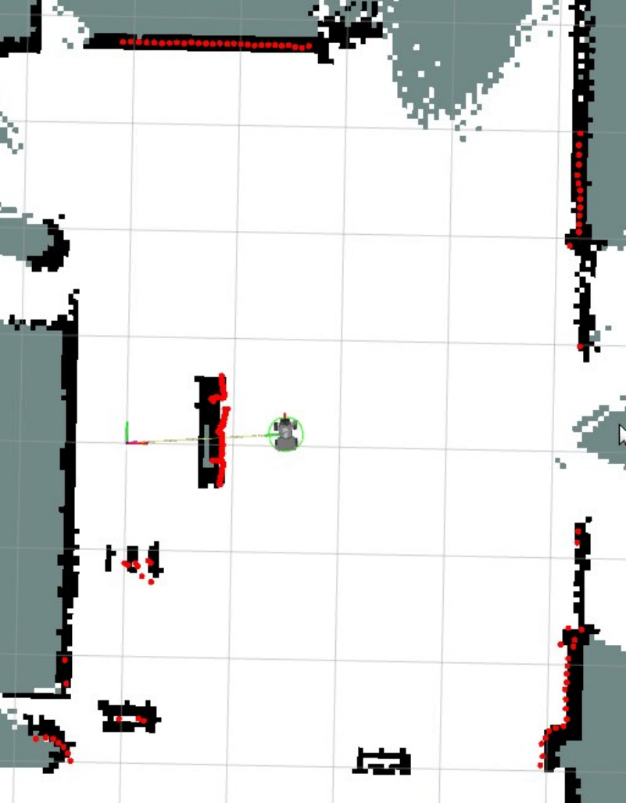
Enable detection


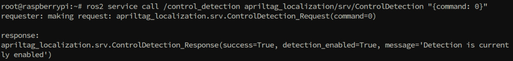


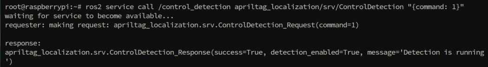

Disable detection (reduce CPU usage)


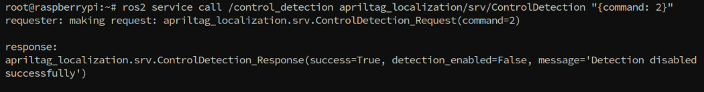
## 6. Source Code Analysis

### 6.1 Tag Recording Node Launch File


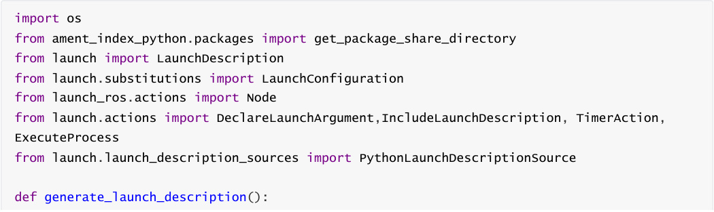


```
  # Step 1: Declare output file path parameter

  output_file_path_arg = DeclareLaunchArgument(

     'output_file_path',

 default_value=os.path.join(get_package_share_directory("m3pro_bringup"),"config","aritag_re

location.yaml"),

     description='Path to the output YAML file for saving AprilTag poses'

)

  # Step 2: Declare target coordinate frame parameter

  target_frame_arg = DeclareLaunchArgument(

     'target_frame',

     default_value='map',

     description='Target coordinate frame for recording AprilTag poses'

)

  # Step 3: Create ArUco recorder node

  apriltag_recorder_node = Node(

     package='apriltag_localization',

     executable='apriltag_recorder',

     name='apriltag_recorder',

     output='screen',

     parameters=[{

       'output_file_path': LaunchConfiguration('output_file_path'),

       'target_frame': LaunchConfiguration('target_frame'),

}]

)

  # Step 4: Start navigation and SLAM toolbox

  navigation_launch = IncludeLaunchDescription(

     PythonLaunchDescriptionSource([os.path.join(

       get_package_share_directory('M3Pro_navigation'),

       'launch',

       'toolbox_location_nav.launch.py'

)]),

     launch_arguments={

       "rviz_config": os.path.join(

          get_package_share_directory('m3pro_bringup'),

          'rviz',

          'aritag_record.rviz'

),

       "log_level": "info",

}.items()

)

  # Step 5: Enable ArUco detection service after 8 seconds delay

  call_detection_service = TimerAction(

     period=8.0,

     actions=[

       ExecuteProcess(

          cmd=['ros2', 'service', 'call', '/control_detection',

             'apriltag_localization/srv/ControlDetection',

             '{command: 1}'],

```

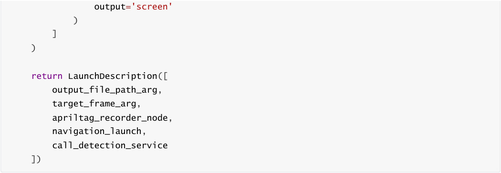


**Code Explanation** :


1. **Parameter Declaration** :


`output_file_path` : Specifies the YAML file path for saving ArUco tag positions, default is


2. **apriltag_recorder Node** :


Function: Listens for ArUco tags in the camera's field of view and saves their poses in the map

coordinate system to a YAML file


Input: Camera image topic, tf coordinate transformation


3. **navigation_launch** :


Starts the SLAM toolbox navigation system to provide accurate robot poses


aritag_recorder_panel


4. **call_detection_service** :


Enables ArUco detection (command: 1 means enable)


The delay is to wait for the system to fully start before enabling detection, avoiding resource

conflicts

### 6.2 Relocalization Mode Navigation Launch File


This launch file is the core entry point for visual relocalization navigation, coordinating the startup of chassis,

localization, navigation and other modules. Below is a detailed explanation:


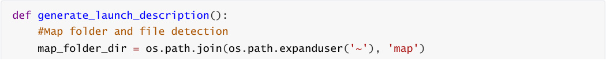


```
  # Declare arguments

  declared_arguments = []

  m3pronav_dir=os.path.join(get_package_share_directory('M3Pro_navigation'))

  #Map file

  declared_arguments.append(

     DeclareLaunchArgument(

       "map",

       default_value="map.yaml",

       description="map name",

)

)

  declared_arguments.append(

     DeclareLaunchArgument(

       "gui",

       default_value='True',

       description="if rviz is used, set to True. If False, rviz will not be

launched.",

)

)

  #slam_toolbox pose map file

  declared_arguments.append(

     DeclareLaunchArgument(

       "pose_map",

       default_value="map",

       description="",

)

)

  declared_arguments.append(

     DeclareLaunchArgument(

       'relocation',

       default_value='false'

)

)

  declared_arguments.append(

     DeclareLaunchArgument(

       'detection_enabled',

       default_value='false'

)

)

  #Navigation parameter file

  declared_arguments.append(

     DeclareLaunchArgument(

     "params_file",

     default_value= os.path.join(get_package_share_directory("M3Pro_navigation"),

"param", "yahboom_M3Pro.yaml"),

       description="Full path to param file to load",

)

)

```

```
  declared_arguments.append(

     DeclareLaunchArgument(

       "use_sim_time",

       default_value="False",

       description="Use simulation (Gazebo) clock if true",

)

)

  declared_arguments.append(

     DeclareLaunchArgument(

       "rviz_config",

       default_value=os.path.join(m3pronav_dir,'rviz','nav2.rviz')

)

)

  declared_arguments.append(

     DeclareLaunchArgument(

       "log_level",

       default_value="info",

       description="log level"

)

)

  # Initialize Arguments

  map = LaunchConfiguration("map")

  map_dir=PathJoinSubstitution([map_folder_dir, map])

  pose_map=PathJoinSubstitution([map_folder_dir, LaunchConfiguration("pose_map")])

  params_file=LaunchConfiguration("params_file")

  use_sim_time=LaunchConfiguration("use_sim_time",default="false")

  rviz_config=LaunchConfiguration("rviz_config")

  log_level=LaunchConfiguration("log_level")

  carbase_launch=IncludeLaunchDescription(

 PythonLaunchDescriptionSource(os.path.join(get_package_share_directory('m3pro_bringup'),'la

unch','car_base.launch.py')),

          launch_arguments={'log_level': log_level,

                    'relocation': LaunchConfiguration('relocation'),

                    'detection_enabled':

LaunchConfiguration('detection_enabled'),

}.items())

  #navigation2 modified launch file, blocking AMCL positioning function

  nav2_launch_mod = os.path.join(m3pronav_dir,

                      'launch',

                      'bringup_mod.launch.py'

)

  # slamtoolbox positioning algorithm startup file

 slamtoolbox_localization_launch_file=os.path.join(get_package_share_directory('slam_mapping

'),'launch','localization_launch.py')

```

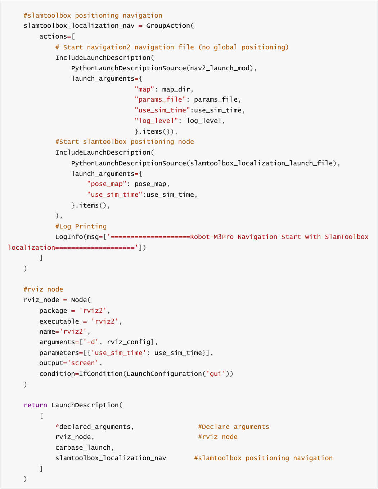


**Code Explanation** :


1. **carbase_launch** :


Starts chassis basic nodes, including camera, robotic arm assistance, LiDAR fusion, etc.


is enabled

2. **nav2_launch_mod** :


This version blocks the AMCL positioning function because the system uses SlamToolbox for

positioning


3. **slamtoolbox_localization_nav** :


This is a GroupAction containing multiple cooperating components:


Starts the modified Nav2 navigation stack (path planning, costmap, controller, etc.)


Starts the SlamToolbox positioning node and loads the pose map to achieve constrained

positioning


Prints startup log information


4. **rviz_node** :


Starts RViz2 visualization tool


Loads the specified RViz configuration file containing navigation-related display panels

### 6.3 aritag_relocation.yaml File Structure


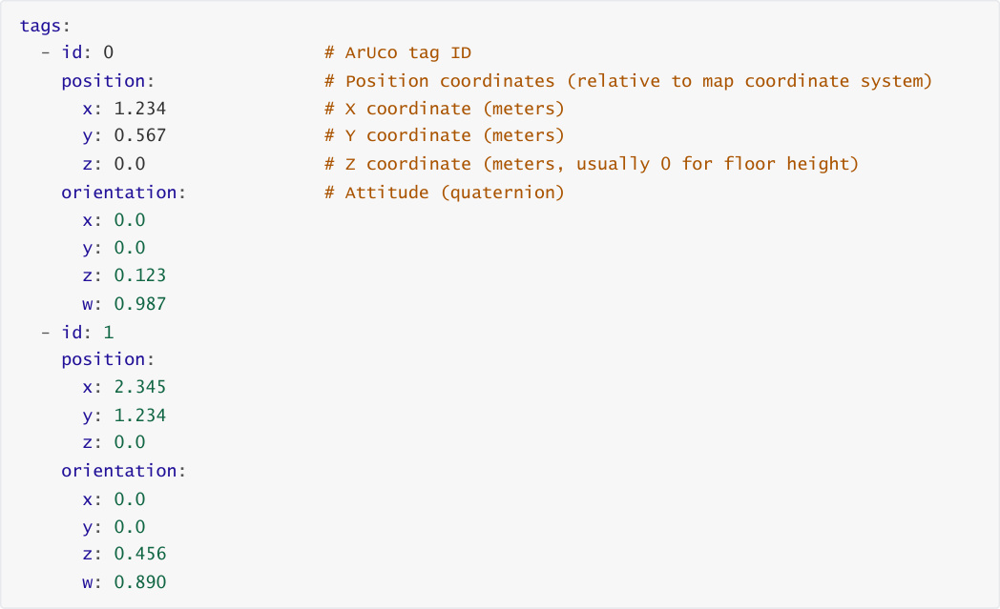


**Field Description** :


|Field|Type|Description|
|---|---|---|
|`id`|int|Unique identifier ID of the ArUco tag|
|`position.x`|float|X coordinate of the tag in map coordinates (meters)|
|`position.y`|float|Y coordinate of the tag in map coordinates (meters)|
|`position.z`|float|Z coordinate of the tag in map coordinates (meters)|
|`orientation.x/y/z/w`|float|Attitude quaternion of the tag, representing the tag's orientation|

### 6.4 Visual Relocalization Working Principle

1. **Detect ArUco Tags** : Camera continuously detects ArUco tags within its field of view


2. **Match Global Coordinates** : If a tag is detected, read its global coordinates from


3. **Calculate Deviation** : Compare the current odometer estimated position with the actual position

provided by ArUco


4. **Correct Pose** : Use ArUco's position to correct the robot's global pose


**Relocalization Advantages** :


✅ **Eliminate Cumulative Error** : Odometer accumulates error over time, and ArUco provides absolute

position reference


✅ **Solve Degenerate Scenarios** : In long corridors or areas with similar features, laser SLAM may have

positioning confusion, and ArUco provides reliable anchors


**Precautions** :

⚠️ Before recording tag positions, ensure laser positioning is accurate (laser contour matches environmental

edges)

⚠️ If tag positions change, you need to re-record their global coordinates

### 6.5 Tag Configuration Parameters


Configuration parameter file path for the tag node

```
 $HOME/M3Pro_ws/src/m3pro_bringup/config/common.yaml

```

**Parameter Description** :


|Parameter|Description|Default<br>Value|
|---|---|---|
|`image_transport`|Image transport format,`raw`  for raw image,`compressed`<br>for compressed image|`raw`|


|Parameter|Description|Default<br>Value|
|---|---|---|
|`family`|ArUco tag family type, different families have different<br>encoding methods|`36h11`|
|`size`|Physical edge length of the tag (unit: meters), must match<br>actual size|`0.048`|
|`profile`|Whether to output performance analysis information|`false`|
|`max_hamming`|Maximum allowed hamming distance (error correction<br>bits), 0 means no correction|`0`|
|`detector.threads`|Number of detection threads|`1`|
|`detector.decimate`|Pyramid downsampling rate, larger value means faster<br>detection but lower accuracy|`2.0`|
|`detector.blur`|Gaussian blur sigma value for quadrilateral detection|`0.0`|
|`detector.refine`|Whether to enable edge sharpening for precise<br>positioning|`true`|
|`detector.sharpening`|Decoded image sharpening intensity|`0.25`|
|`detector.debug`|Whether to output debug images to the current working<br>directory|`false`|
|`pose_estimation_method`|Pose estimation method,`pnp` means using PnP algorithm|`pnp`|
|`tag.ids`|List of tag IDs to detect, only tags in the list will be<br>detected|`[1-20]`|
|`tag.frames`|List of corresponding TF coordinate frame names for the<br>IDs|`[tag1-`<br>`tag20]`|


**Important Parameter Tuning Suggestions** :


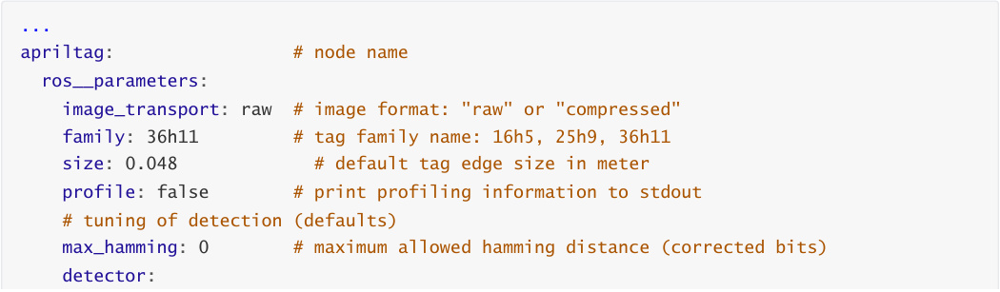


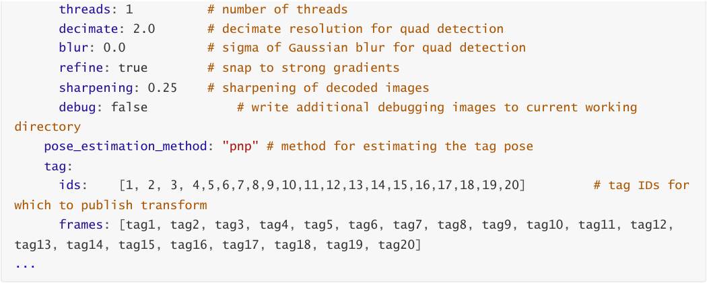


### 6.6 Inter-node Communication Diagram

Start during relocalization navigation operation:

```
 ros2 run rqt_graph rqt_graph

```

The apriltag node subscribes to the camera topic to detect tags and publishes the `/detections` topic.


calculates the vehicle's base_link position in the map coordinate system based on the recorded map

anchor coordinates of the tag, and publishes to `/initialpose` to trigger the slam_toolbox node's

positioning function to calculate the precise vehicle coordinates in the map from the pose constraint

graph.


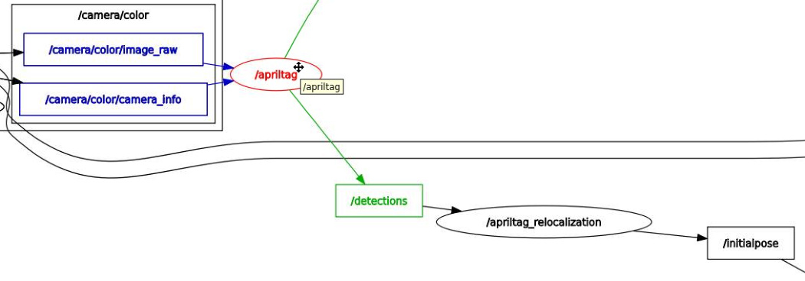
