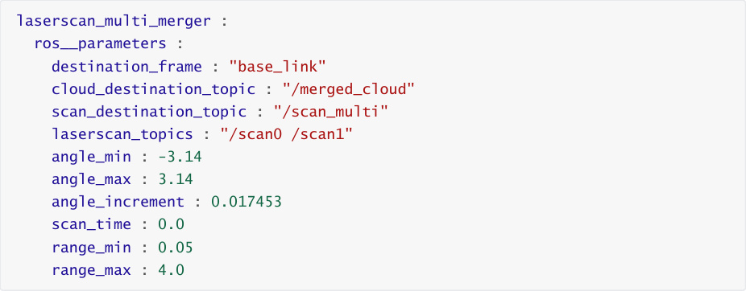
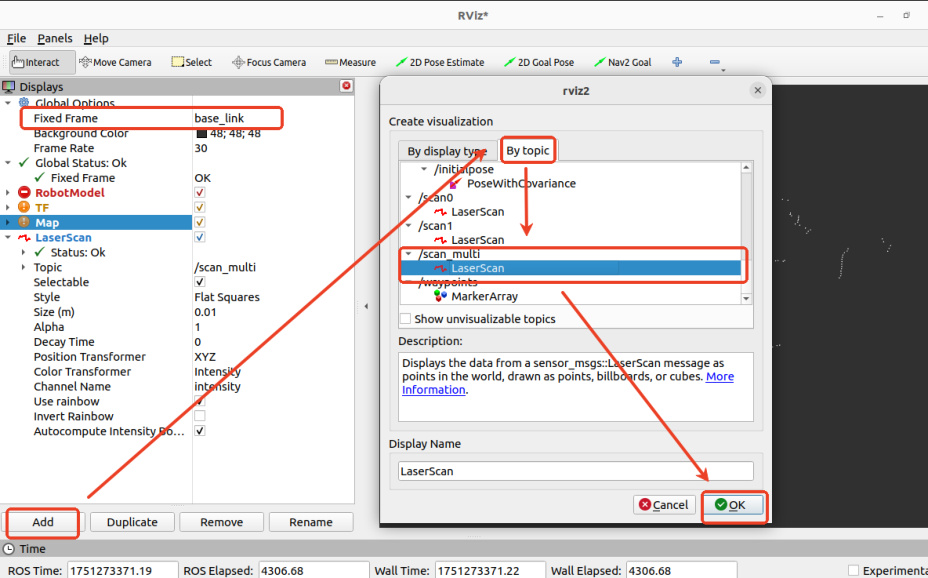
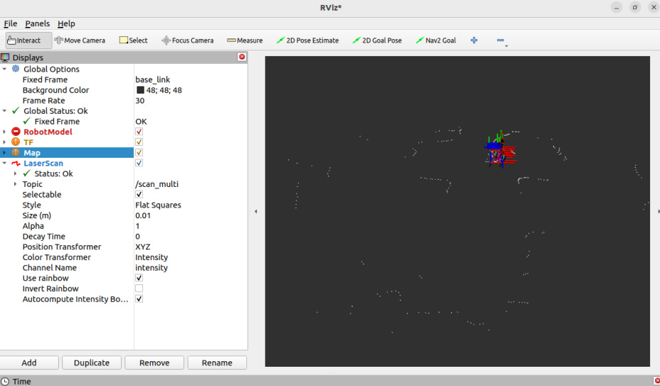
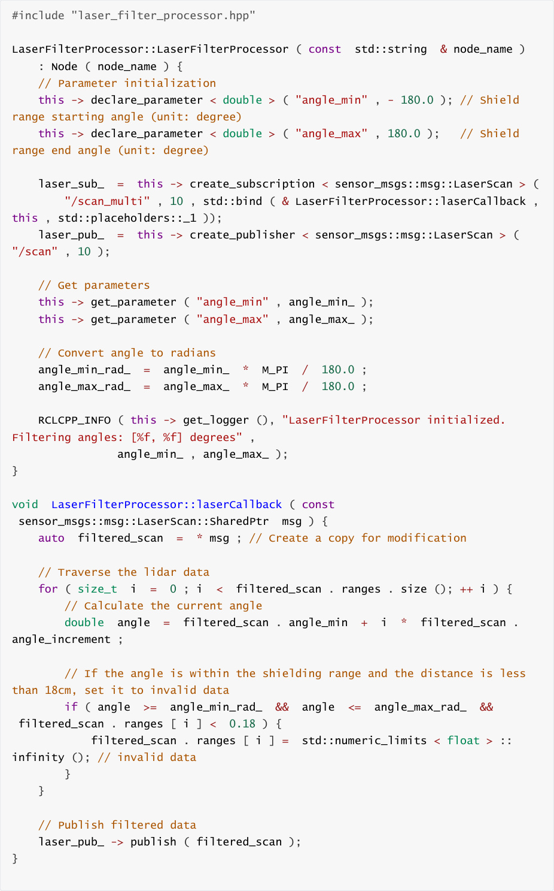
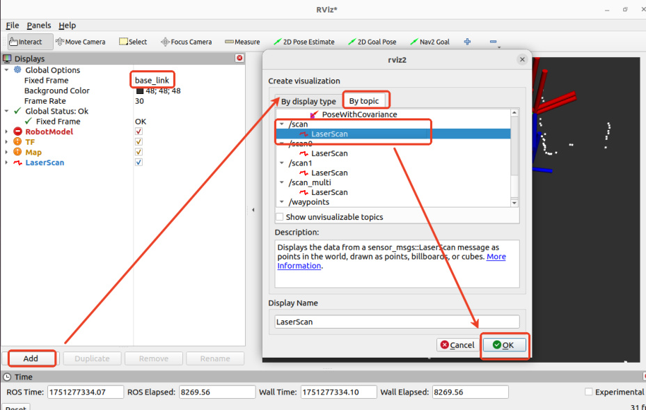
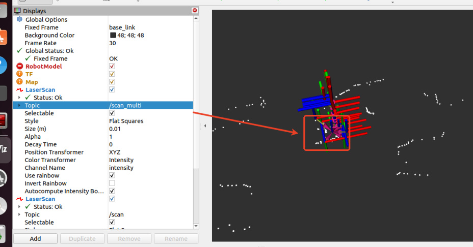
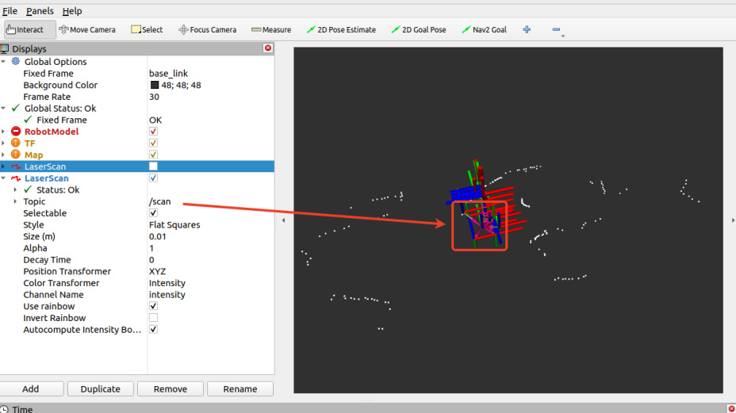
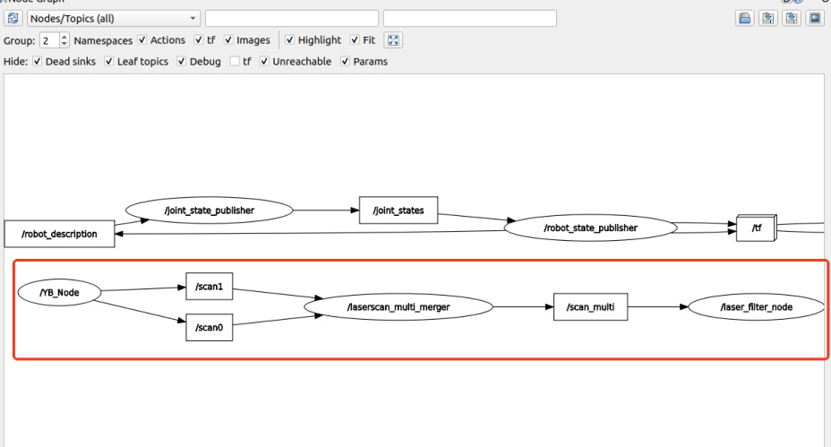

# Dual radar fusion and filtering

This product uses two radars, one on the left rear and one on the right front of the vehicle.

Because mapping and navigation algorithms typically only accept data from a single radar topic,

the data from both radars must be fused and filtered before mapping and navigation can begin.

Radar fusion can be achieved using the ira_laser_tools package.

## 1. ira_laser_tools package

### 1.1. Introduction to the Feature Package

The main functions of the ira_laser_tools package are as follows:

**Laser Scan Merge** : Merge data from multiple laser scanners into a single scan.

**Laser Scan Segmentation** : Split a single laser scan into multiple virtual scans.

**Angle limit** : Clip the angle range of laser scanning data

**Scan denoising** : removing noise points from laser scans

The front and rear dual radar fusion of this product is achieved by calling the laser scanning

merging interface here.

### 1.2. Function package source code

**laserscan_multi_merger.cpp** source code path:

Raspberry Pi 5 and Jetson-nano

The program code is in the running docker. The path in docker is

/root/M3Pro_ws/src/M3Pro_core/ira_laser_tools/src/laserscan_multi_merger.cpp

Orin Motherboard

The program code path is

/home/jetson/M3Pro_ws/src/M3Pro_core/ira_laser_tools/src/laserscan_multi_merger.cpp

**laserscan_merge.yaml** parameter file path:

Raspberry Pi 5 and Jetson-nano

The program code is in the running docker. The path in docker is

/root/M3Pro_ws/src/M3Pro_core/ira_laser_tools/config/laserscan_merge.yaml

Orin Motherboard

The program code path is

/home/jetson/M3Pro_ws/src/M3Pro_core/ira_laser_tools/config/laserscan_merge.yaml

The content of laserscan_merge.yaml is as follows,

The points of attention here are as follows:

destination_frame: the coordinate system after radar fusion, here is base_link

cloud_destination_topic: The topic of the fused radar point cloud data, here is /merged_cloud

scan_destination_topic: The topic of the fused radar data, here is /scan_multi

laserscan_topics: The radar topics that need to be fused are /scan0 and /scan1, which

correspond to the two previous and next radar data topics published by the underlying

control node.

angle_min and angle_max: Output the minimum and maximum angles of the scan, in

radians. Here, -3.14 to 3.14 indicates that the scan angle is 360 degrees.

angle_increment: Output the scan angle increment, here it is 0.017453, the unit is radian

range_min and range_max: Output the minimum and maximum distances of the scan, in

meters, here 0.05 meters to 4.0 meters

### 1.3. Program startup

This section requires entering commands in the terminal. The terminal you open depends on

your motherboard type. This section uses the Raspberry Pi 5 as an example. For Raspberry Pi and

Jetson-Nano motherboards, you'll need to open a terminal and enter commands to enter a

Docker container. Once inside the Docker container, enter the commands mentioned in this

section in the terminal. For instructions on entering a Docker container, refer to the product

tutorial **[Robot Configuration and Operation Guide] - [Enter the Docker (Jetson-Nano and**

**Raspberry Pi 5 users, see here)** .

Simply open the terminal on the Orin motherboard and enter the commands mentioned in this

section.

After the car successfully connects to the agent, enter the following command in the terminal to

start it:

After the program is running, you can use rviz to view the fused radar data. Enter the following

command to start rviz:

As shown in the figure below, add topic display in rviz and modify frame_id to view the data.

After adding, the white point cloud is the fused radar data, as shown in the figure below.

## 2. Radar Filtering

After successfully fusing the two radars using ira_laser_tools, we need to filter the fused data.

Otherwise, during the map building and navigation process, the vehicle body will be scanned by

the radar and treated as an obstacle. Therefore, we need to filter the fused radar data.

### 2.1. Function package source code

laser_filter_processor.cpp source code path:

Raspberry Pi 5 and Jetson-nano

The program code is in the running docker. The path in docker is

/root/M3Pro_ws/src/M3Pro_core/yahboom_laser_filter/src/laser_filter_processor.cpp

Orin Motherboard

The program code path is

/home/jetson/M3Pro_ws/src/M3Pro_core/yahboom_laser_filter/src/laser_filter_processor.cpp

The source code is as follows,

### 2.2 Program Startup

Enter the following command in the terminal to start radar filtering,

After the program is running, you can use rviz to view the fused radar data. Enter the following

command to start rviz:

As shown in the figure below, add topic display in rviz and modify frame_id to view the data.

After adding, the white point cloud is the fused radar data. Compared with scan_multi, you can

see that the points of the car body have been filtered out, as shown in the figure below.

Unfiltered /scan_multi point cloud data,

Filtered/scan point cloud data,

### 2.3 Node Communication

Enter the following command in the terminal to view the communication between nodes,

After running, select [Node/Topics(all)] in the upper left corner, and then click the refresh button

on the left, as shown below.

