# Cartographer-SLAM Mapping Algorithm
## 1. Course Content

1. Learn the Cartographer SLAM mapping algorithm for robot SLAM mapping functionality


After running the sample program, use the keyboard or controller to move the robot to complete map

construction and save the map.
## 2. Introduction to Cartographer

### 2.1 Introduction


Cartographer is a 2D and 3D SLAM (simultaneous localization and mapping) library open-sourced by Google

that supports the ROS system. It is a mapping algorithm based on graph optimization (multi-threaded backend

optimization, problem optimization built with Ceres). It can combine data from multiple sensors (e.g., LIDAR,

IMU, and cameras) to simultaneously calculate the sensor's position and map the environment around the

sensor.


The source code of Cartographer mainly consists of three parts: cartographer, cartographer_ros, and ceres
solver (backend optimization).


Cartographer adopts the mainstream SLAM framework, i.e., the three-stage process of feature extraction, loop

closure detection, and backend optimization. A certain number of LaserScans form a submap, and a series of

submaps constitute the global map. The cumulative error during the short process of constructing a submap

with LaserScans is small, but during the long process of building the global map with submaps, there will be

significant cumulative error. Therefore, loop closure detection is needed to correct the positions of these

submaps. The basic unit of loop closure detection is the submap, and loop closure detection uses a

scan_match strategy. The key content of Cartographer is the creation of submap submaps by fusing multi
sensor data (odometry, IMU, LaserScan, etc.) and the implementation of the scan_match strategy for loop

closure detection.


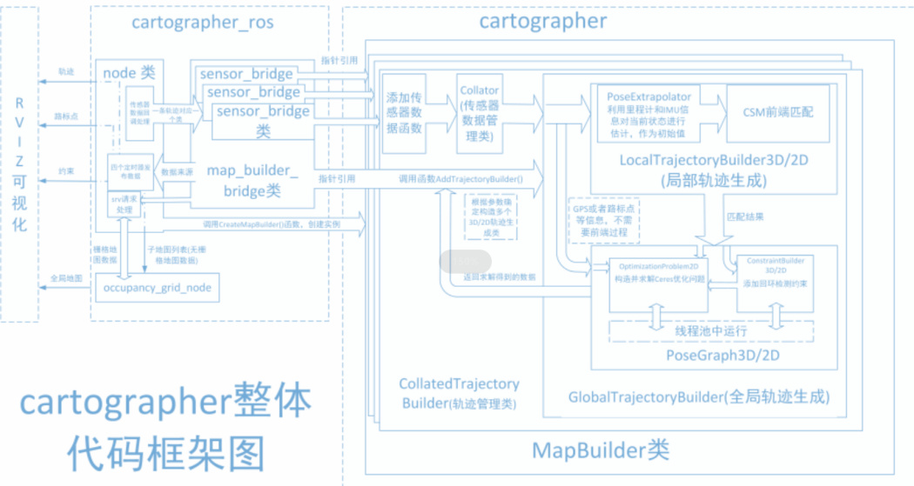
cartographer_ros


cartographer_ros runs under ROS and can receive various sensor data in the form of ROS messages. After

processing, it publishes them as messages for debugging and visualization.

### 2.2 Related Resources


[GitHub Repository](https://github.com/cartographer-project/cartographer)


[Official Documentation](https://google-cartographer.readthedocs.io/en/latest/)
## 3. Preparation

### 3.1 Content Description


This course uses jetson orin NX as an example. For Raspberry Pi and Jetson-nano motherboards, you need to

open a terminal on the host machine, enter the command to access the docker container, and then enter the

commands mentioned in this course within the docker container terminal. For the tutorial on accessing the

docker container from the host machine, refer to the [0. Instructions and Installation Steps] section of this

product tutorial, specifically [Entering the Car Docker (For Jetson-Nano and Raspberry Pi 5 Users)]. For orin and

NX motherboards, simply open a terminal and enter the commands mentioned in this course.

### 3.2 Start the Agent


**Note: All test cases must start the docker agent first. If already started, no need to restart.**


Enter the command in the robot terminal:


The terminal prints the following information, indicating a successful connection.


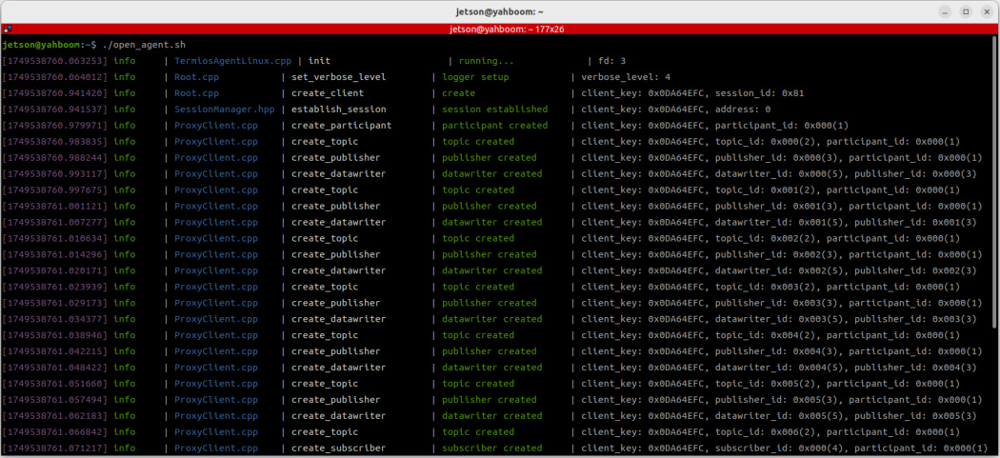
## 4. Running the Case

### 4.1 Mapping Process

**Note:**


**When mapping, slower speeds yield better results (especially rotation speed). High speed will**

**result in poor quality.**


**Jetson Nano and Raspberry Pi** series controllers need to enter the docker container first (see [Docker

Course Chapter - Entering the Robot Docker Container]).


Start the underlying sensor command on the robot terminal:


Then start the mapping command:


The rviz visualization can be started on either the robot side or the virtual machine side. **Choose one** method.

Do not start both on the virtual machine and the robot simultaneously.


Using the virtual machine as an example, open a terminal and start the rviz visualization interface:


Command to start the rviz visualization interface on the robot side:


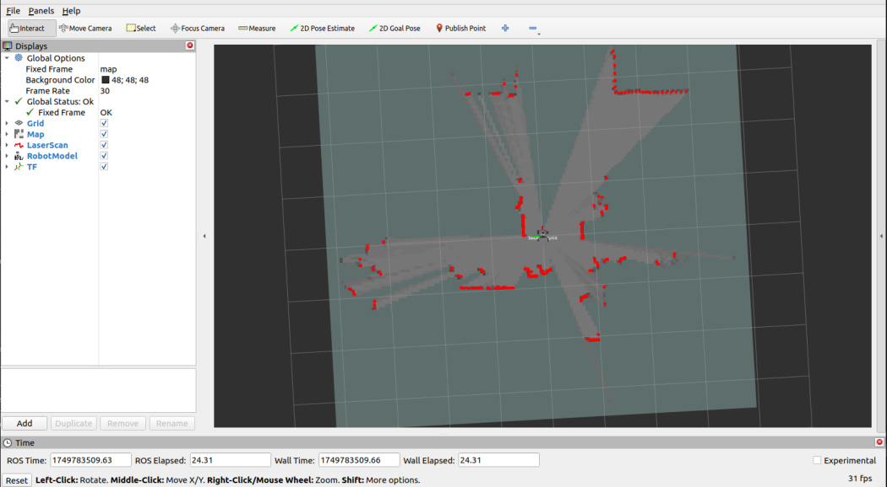
Open another terminal on the virtual machine to start the keyboard control node (a game controller can also

be used):

```
 ros2 run yahboomcar_ctrl yahboom_keyboard

```

Click the terminal window with the mouse, press z to reduce speed appropriately, and press I, <, J, L to control

the robot forward, backward, left turn, and right turn respectively. Control the robot to move slowly to

complete mapping.

### 4.2 Saving the Map


Open a new terminal on the robot side to save the map:

```
 ros2 launch slam_mapping save_map.launch.py

```

The terminal prompt **Map saved successfully** indicates the map was saved successfully.


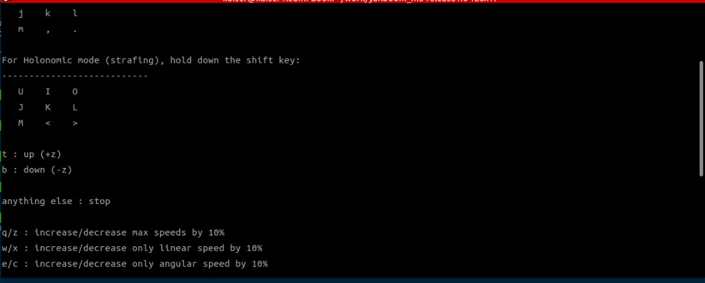

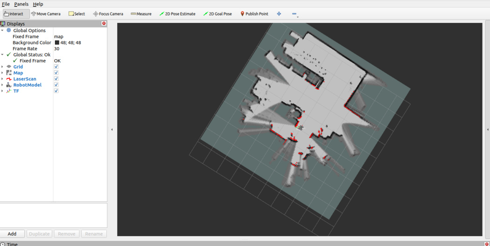
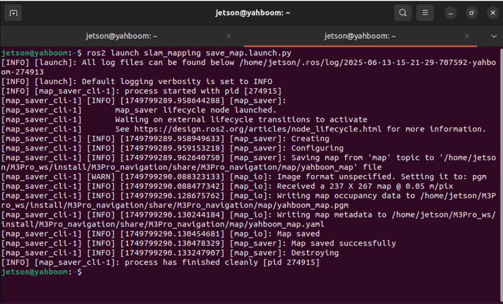

The map save path is as follows:


One pgm image and one yaml file yahboom_map.yaml


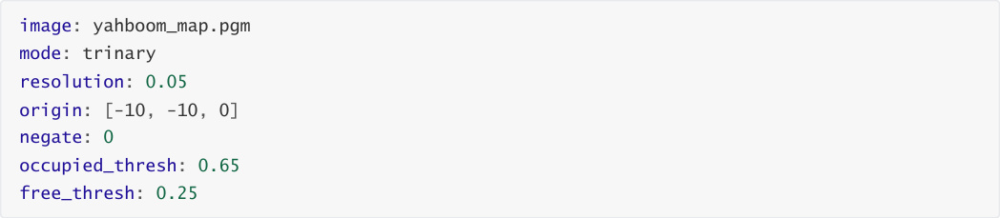


Parameter explanation:


image: The path to the map file, can be an absolute path or a relative path.


mode: This attribute can be one of trinary, scale, or raw. trinary is the default mode.


resolution: The resolution of the map, meters/pixel.


origin: The 2D pose (x, y, yaw) of the lower-left corner of the map. yaw is rotated counterclockwise

(yaw=0 means no rotation). Many parts of the current system may ignore the yaw value.


negate: Whether to invert the meaning of white/black, free/occupied (threshold interpretation is not

affected).


occupied_thresh: Pixels with an occupancy probability greater than this threshold are considered fully

occupied.


free_thresh: Pixels with an occupancy probability less than this threshold are considered completely

free.


### 4.3 Saving pbstream Format Map

The pbstream format map file is used for relocation navigation and will be explained in subsequent chapters.


After map construction is complete, open a new terminal and enter the command to finish the map trajectory:


Then open another terminal to save the pbstream format map file:


For jetson orin nano and jetson orin NX hosts, the save command is:


For jetson orin nano and Raspberry Pi hosts, the save command is:


First enter docker:


## 5. Node Analysis

### 5.1 Display Node Computation Graph


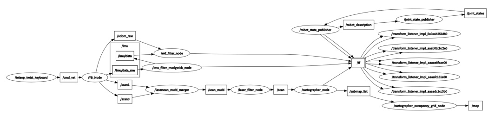
### 5.2 TF Transform

Run on the virtual machine terminal:


The image is too large. The original image can be viewed in this course's folder.


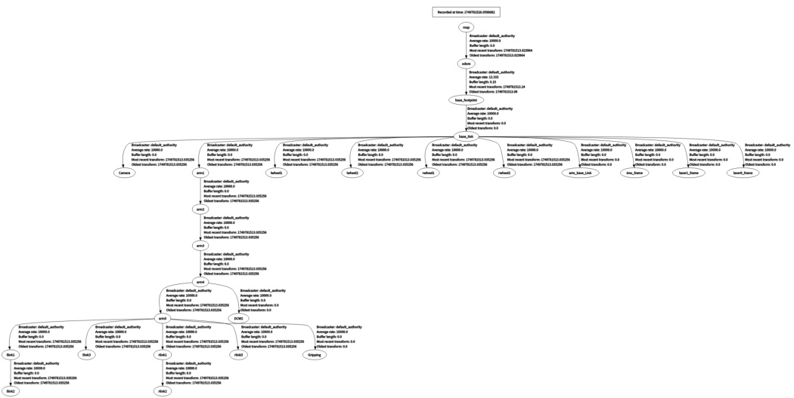
### 5.3 Cartographer Node Details


Enter the above command in the terminal to view the subscription and publication topics related to the

gmapping node.


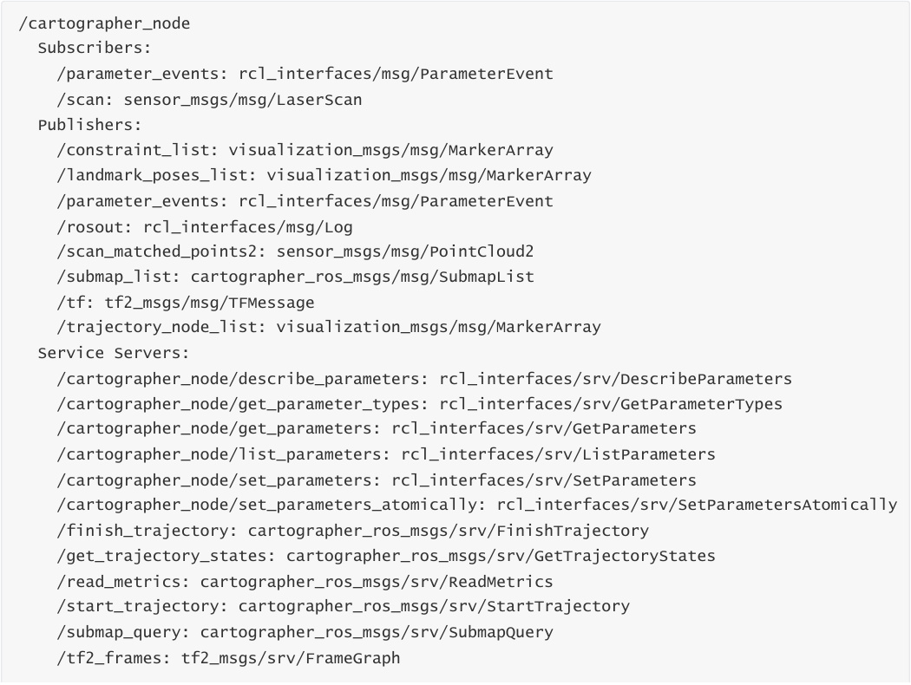
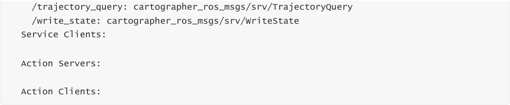
