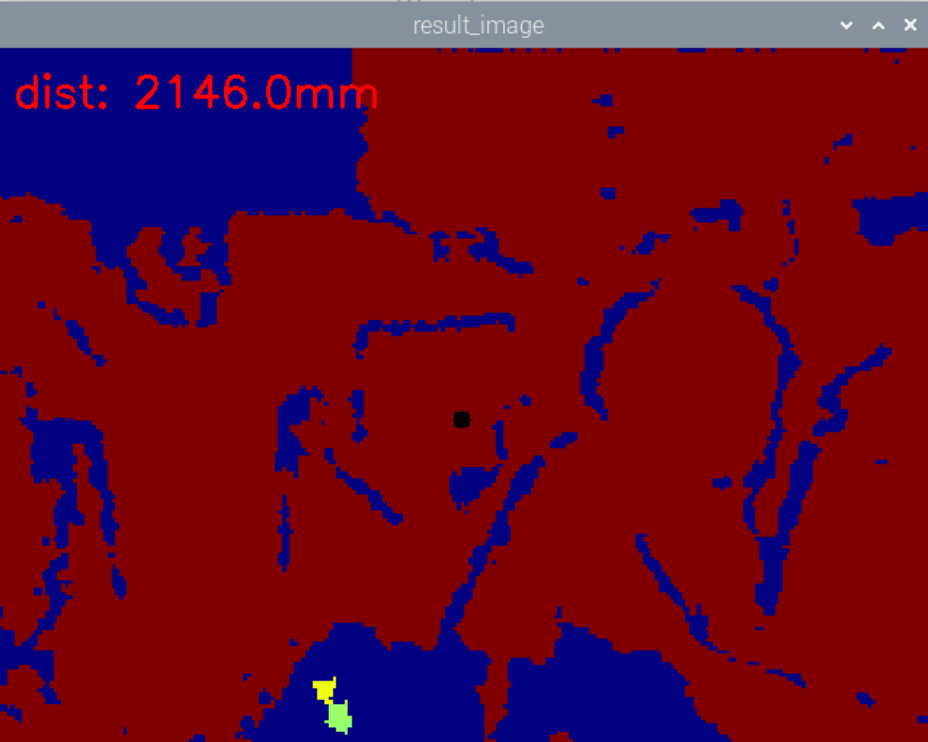
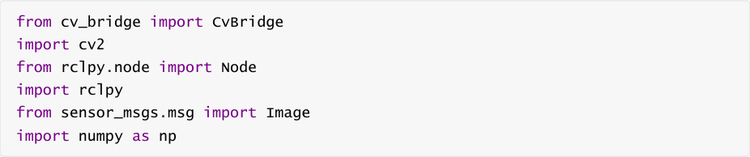
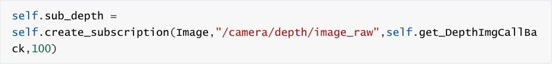
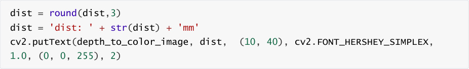
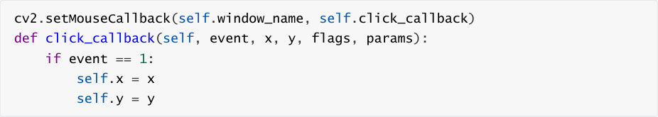

# Depth camera distance measurement

Depth camera distance measurement

1. Content Description

2. Program startup

3. Core code analysis

## 1. Content Description


This lesson uses a depth camera to measure distance within its range. This lesson requires

entering commands in a terminal.


This section requires entering commands in the terminal. The terminal you open depends on

your motherboard type. This lesson uses the Raspberry Pi 5 as an example. For Raspberry Pi and

Jetson-Nano boards, you need to open a terminal on the host computer and enter the command

to enter the Docker container. Once inside the Docker container, enter the commands mentioned

in this section in the terminal. For instructions on entering the Docker container from the host

computer, refer to this product tutorial **[Configuration and Operation Guide]--[Enter the**

**Docker (Jetson Nano and Raspberry Pi 5 users, see here)]** .


Simply open the terminal on the Orin motherboard and enter the commands mentioned in this

section.

## 2. Program startup


First, in the terminal, enter the following command to start the camera,


After successfully starting the camera, open another terminal and enter the following command

in the terminal to start the deep pseudo-color image conversion program:


After startup, as shown below,




Click the red area with the mouse to select the point to be measured. The selected point will turn

black and the distance measured by the depth camera will be printed directly in the upper left

corner of the image in millimeters.

## 3. Core code analysis


Program code path:


Raspberry Pi 5 and Jetson-Nano board

The program code is in the running docker. The path in docker

is `/root/yahboomcar_ws/src/yahboom_M3Pro_DepthCam/yahboom_M3Pro_DepthCam/Measure_`

```
   Distance.py

```

Orin Motherboard

The program code path

is `/home/jetson/yahboomcar_ws/yahboom_M3Pro_DepthCam/yahboom_M3Pro_DepthCam/Measu`

```
   re_Distance.py

```

Import the library files used





Defines the depth image decoding format


Define subscribers and define deep image topics





Define self.depth_bridge to convert the message format into an image format that openc can

handle


Convert image data message into image


Call the opencv image processing function cv2.applyColorMap to convert the depth map


Convert the image data Numpy array into a 32-bit single-precision floating-point array. This step

ensures that floating-point precision is used in subsequent calculations.


Get the depth information of a point. In a 2D image, use (x, y) to determine the position of a point.


Process the depth information and draw it into the image.





Call the opecv function to get the mouse click event, click a point in the valid area of the image,

and get the xy value of the point.





Draw the points selected by the mouse on the image and display the image.
