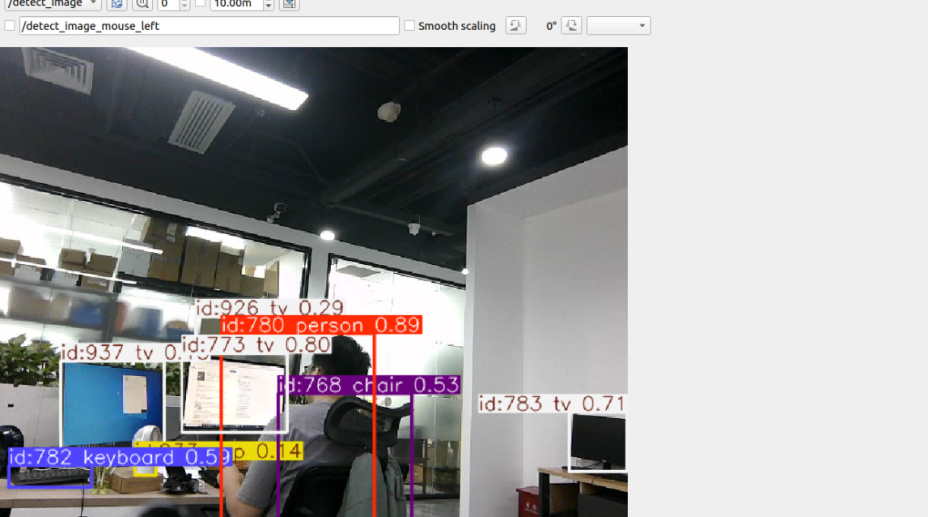
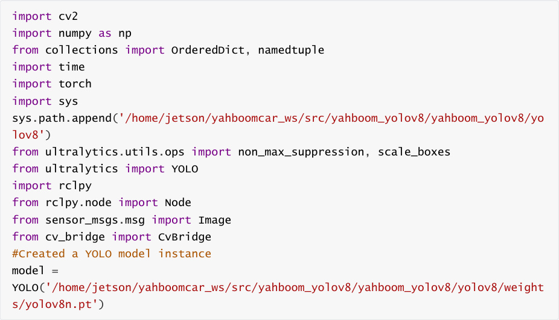
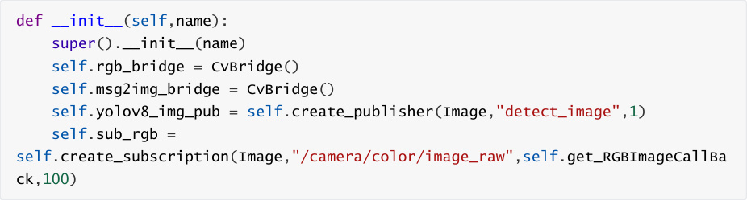
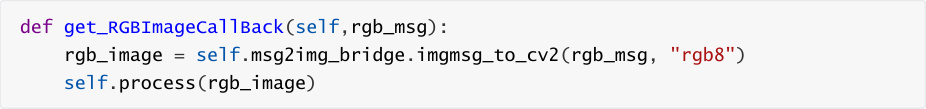
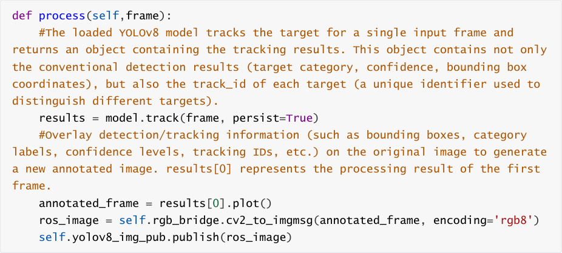

# Yolov8 Object Detection
## 1. Content Description

This section is exclusive to the **Orin motherboard** and primarily introduces the YOLOv8

framework and its use for object detection.

### 1.1 Introduction to YOLOv8

YOLOv8 is an object detection model launched by Ultralytics in 2023. Compared to previous

versions (such as YOLOv5), it offers significant improvements in accuracy, speed, and ease of use.

It is widely used in computer vision tasks such as object detection, image segmentation, and pose

estimation.

YOLOv8 Features:

**Architecture Upgrade** : Using **CSPDarknet53** as the underlying backbone network,

combined with an improved feature fusion network (PAN-FPN), it enhances the ability to

extract multi-scale features.

**Detection Head Optimization** : Adopting an **Anchor-Free** design, it directly predicts the

center point, width, and height of the object, avoiding the limitations of the pre-set anchor

box size in traditional anchor-based methods. This simplifies model design and improves

small object detection accuracy.

**Loss Function Improvement** : The classification loss uses **Varifocal Loss** (optimized for class

imbalance), and the localization loss combines **CIoU Loss** and **DFL (Distribution Focal Loss)

to improve the accuracy of bounding box prediction.

**Multi-Task Support** : In addition to object detection, it also supports **Instance**

**Segmentation** (mask-based object segmentation) and **Pose Estimation** (human keypoint

detection), while maintaining a unified model architecture.

**Engineering Optimization** : Provides a concise Python API and command-line tools, and

supports export to formats such as ONNX and TensorRT, facilitating deployment on edge

devices or the cloud.

YOLOv application scenarios:

Real-time monitoring (such as pedestrian and vehicle detection)

Autonomous driving (obstacle recognition)

Robotic vision (object grasping)

Industrial quality inspection (defect detection), etc.

Visit the official website [Explore Ultralytics YOLOv8 - Ultralytics YOLO Docs](https://docs.ultralytics.com/models/yolov8/#performance-metrics) to download the

trained model and learn more about using YOLOv8.

## 2. Program Startup

Enter the following command in the terminal to start the camera:

Next, open another terminal and enter the following command to start Yolov8 object detection:

Then open a third terminal and enter the following command to start rqt_image_view to view the

image:

Select the topic /detect_image in the upper left corner and click the refresh button on the right to

view the detected image, as shown below.

## 3. Core Code Analysis

Code Path: /home/jetson/yahboomcar_ws/src/yahboom_yolov8/yahboom_yolov8/yolov8_track.py

Import necessary library files:

Program initialization, definition of publishers and subscribers,

Color topic callback function get_RGBImageCallBack,

Image processing function process,

