# Transformer Model Tracking Algorithm

**Transformer Model Tracking Algorithm**

1. Course Content

2. Preparation

3. Starting the Tracking Case

4. Source Code Analysis

5. Attachments

## 1. Course Content


Learn about Transformer deep learning for target tracking
## 2. Preparation


Start the microROS agent and connect to the chassis using the following command:


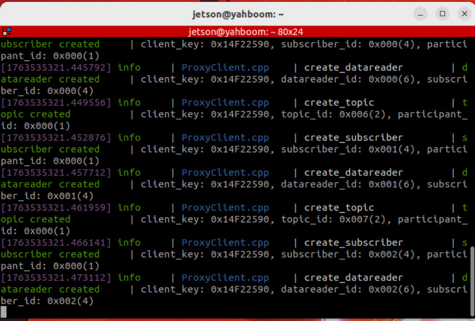

Start basic nodes such as camera, robotic arm assistance, and radar fusion:


## 3. Starting the Tracking Case


After the program starts, **Super Tracker window and rviz2 interface


In the Super Tracker window, press 'c' to enter selection mode. Use the mouse to select the

target object you want to track, and press Enter to confirm.


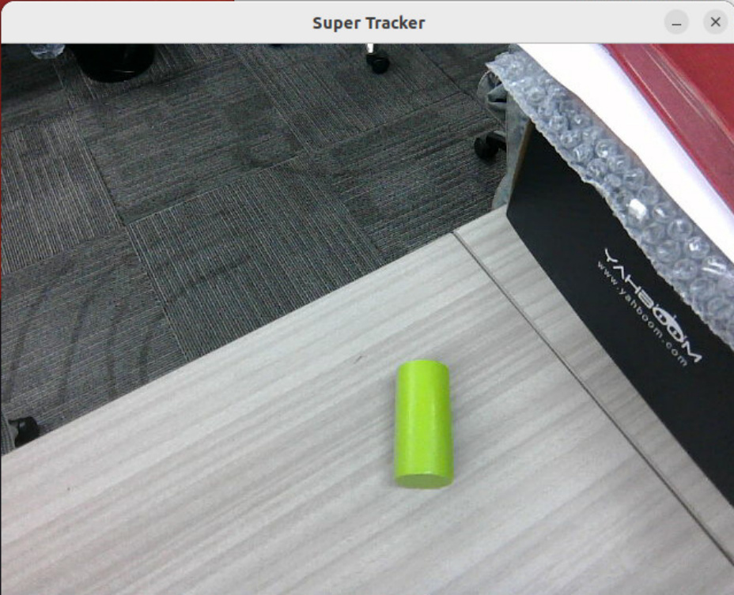

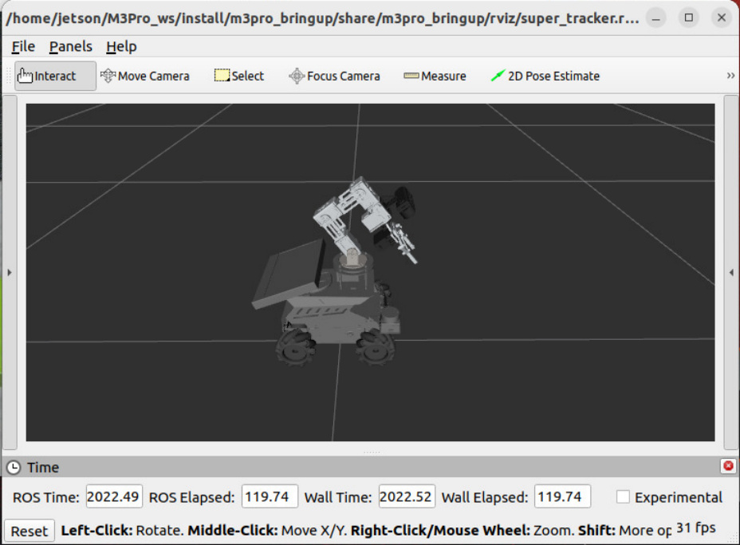
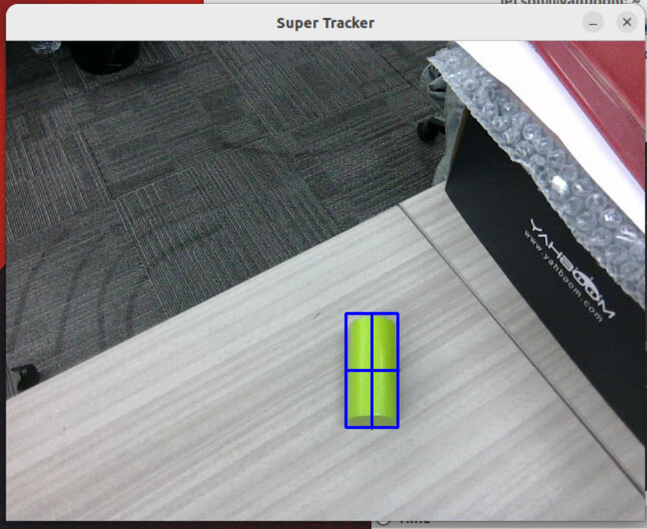

Then it will enter tracking mode. In tracking mode, the point cloud of the target object will be

segmented using PCL, which can be viewed in RViz.


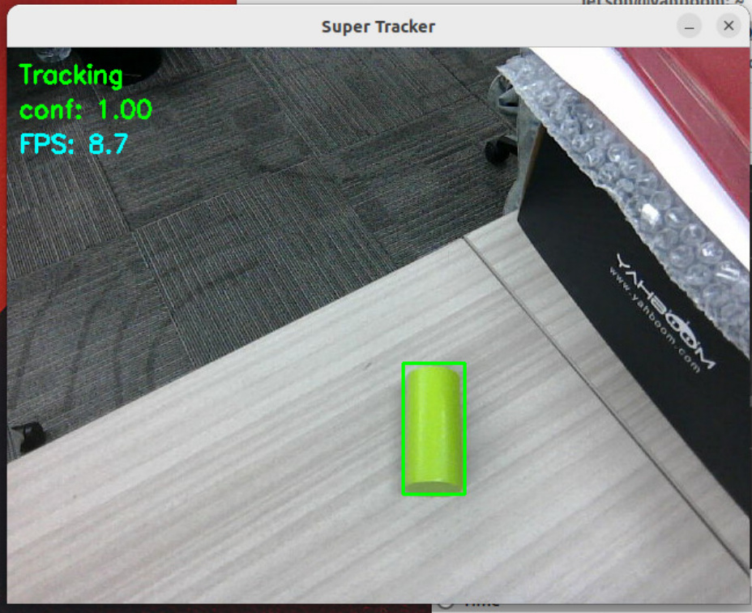
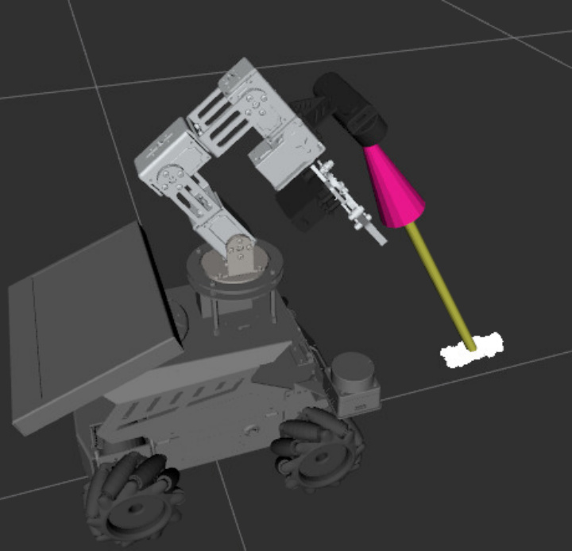

When the camera's perspective relative to the tracked object changes, the tracking bounding

box will adaptively deform to match.


If the target's confidence score drops too low during tracking, the bounding box will turn red,

and the system will begin searching for the target.


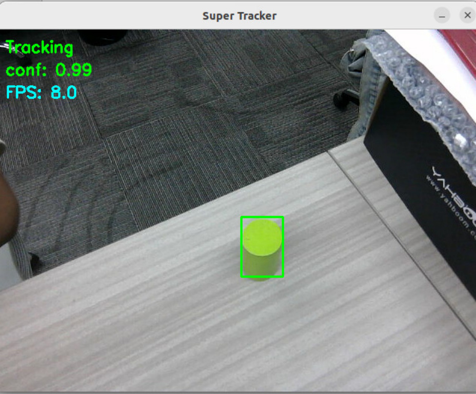
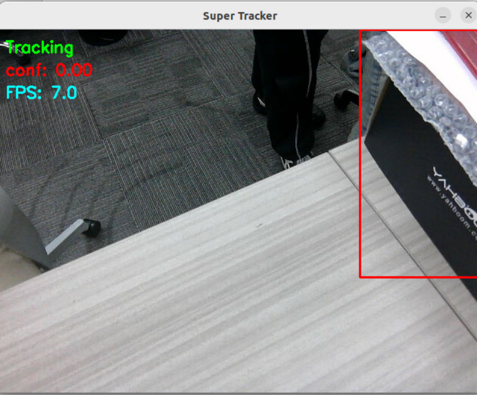

When the target reappears within the field of view, the system will automatically reacquire it.


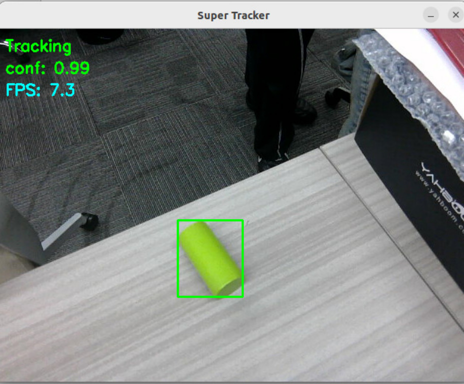
During the tracking process, the node publishes the ROI bounding box coordinates and


using the following command:


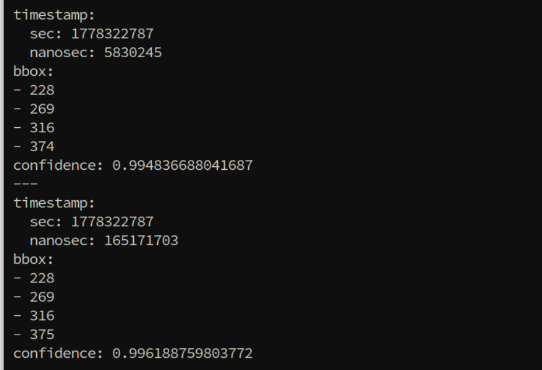

If you need to obtain the coordinates of the target object's point cloud centroid—specifically


command:


In the output, "Translation" represents the x, y, and z coordinates of the target object's point


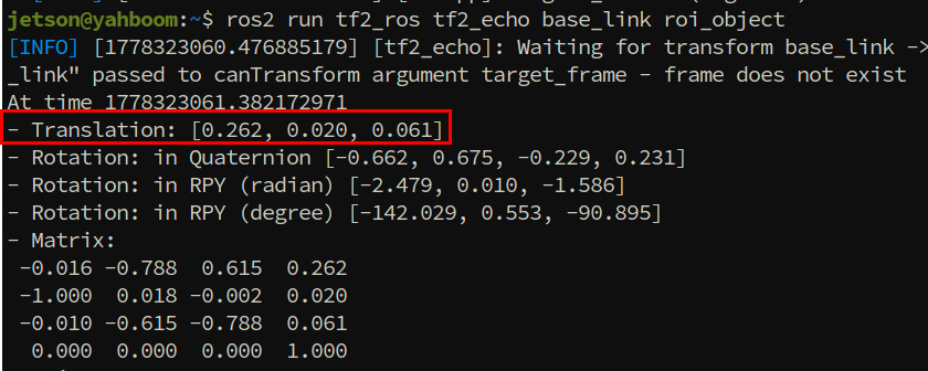
When you need to stop tracking an object, you can do so by making a service request:


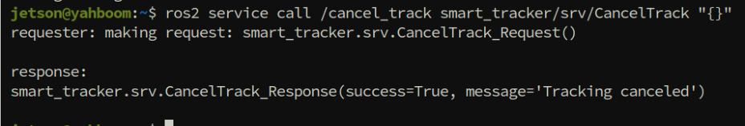


[!IMPORTANT]


In the **[OpenClaw Embodied Intelligence in Action]** chapter, the deep learning-based

tracking module discussed here will be utilized for robotic arm target tracking and

object grasping tasks.
## 4. Source Code Analysis


```
import os

from launch import LaunchDescription

from launch.actions import DeclareLaunchArgument

from launch.substitutions import LaunchConfiguration

from launch_ros.actions import Node

from ament_index_python.packages import get_package_share_directory

def generate_launch_description():

commom_param_file=os.path.join(get_package_share_directory('m3pro_bringup'),'con

fig','common.yaml')

super_track_model=os.path.join(os.path.expanduser('~'),'MODELS','tracker','super

_track_sim.onnx')

rviz_config=os.path.join(get_package_share_directory('m3pro_bringup'),'rviz','su

per_tracker.rviz')

declared_arguments = []

declared_arguments.append(

DeclareLaunchArgument(

"display_windows_only_track",

default_value='false',

description="",

)

)

declared_arguments.append(

DeclareLaunchArgument(

"display_windows",

default_value='true',

description="",

)

)

```

```
 # tracker node

 tracker_node = Node(

 package='smart_tracker',

 executable='super_tracker',

 name='super_tracker',

 parameters=[{

 'display_windows_only_track': LaunchConfiguration('display_windows_only_track'),

 'display_windows': LaunchConfiguration('display_windows'),

 'model_path': super_track_model,

 }],

 remappings=[('/image_raw', '/camera/color/image_raw') ],

 output='screen'

 # prefix='gdb -ex run --args'

 )

 # PCL segmentation node for ROI point cloud segmentation

 pclsegment_node = Node(

 package='smart_tracker',

 executable='pcl_segment',

 name='pcl_segment',

 parameters=[commom_param_file],

 output='screen'

 )

 rviz_node = Node(

 package = 'rviz2',

 executable = 'rviz2',

 name='rviz2',

 arguments=['-d', rviz_config],

 output='screen',

 )

 # Create launch description

 return LaunchDescription([

 *declared_arguments,

 tracker_node,

 pclsegment_node,

 rviz_node

 ])

## 5. Attachments

```

**Package** ) and the ONNX model file ( **Annex — Model File** ) can be found in the tutorial

attachments.

Functional Package: `ros`   - `humble`   - `smart`   - `tracker_0.0.0`   - `0jammy_arm64.deb` (Install using `apt`

`install` )

Model File: `super_track.onnx`
