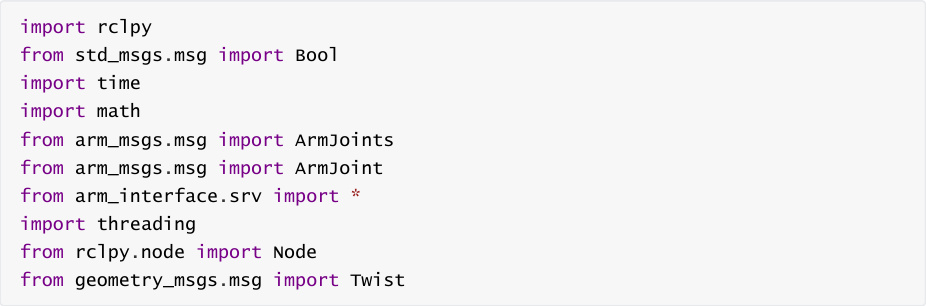
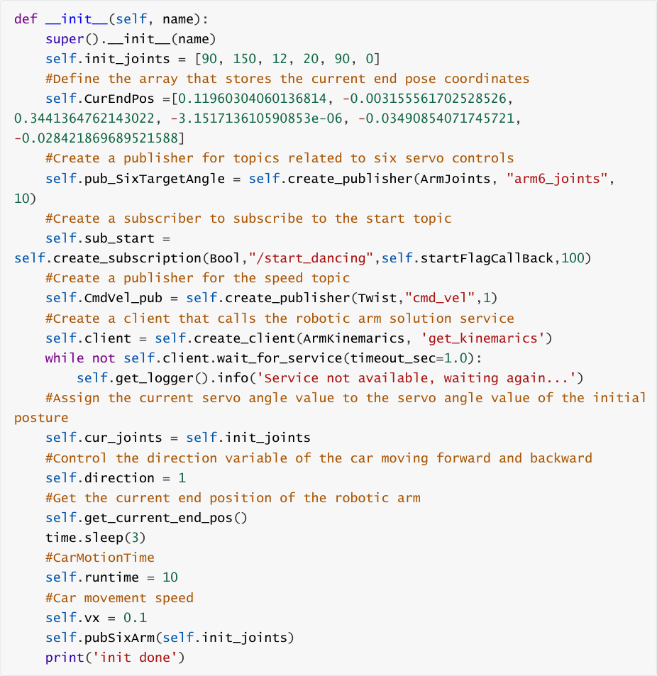
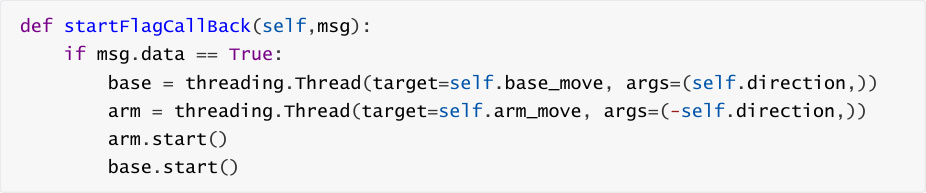
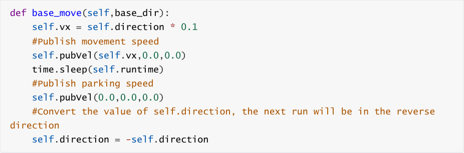
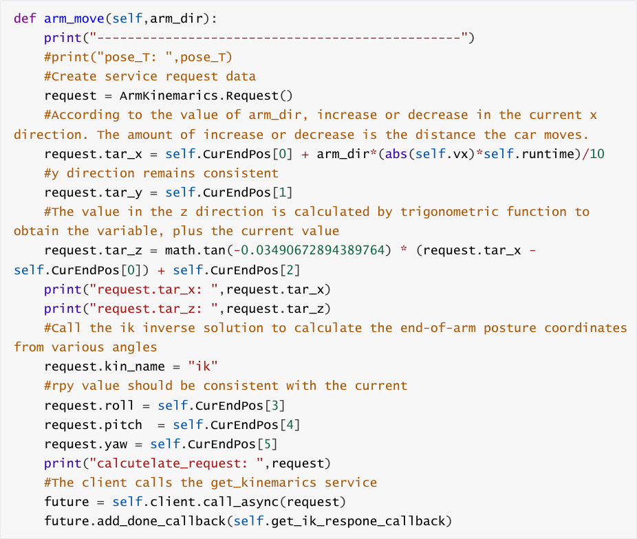
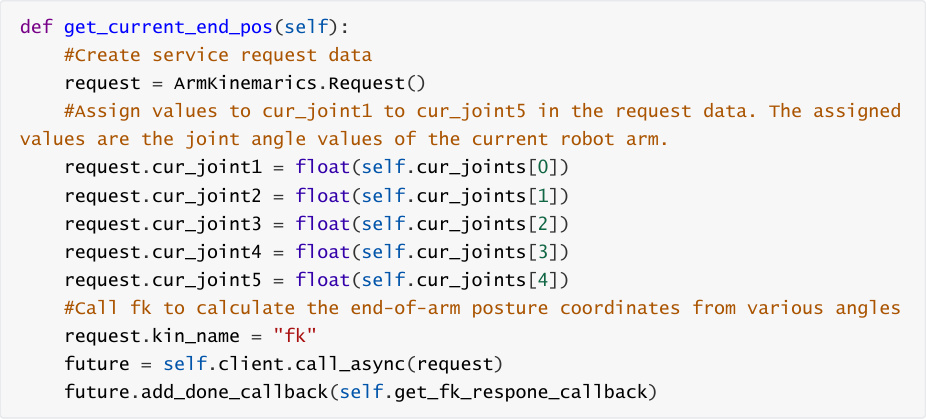
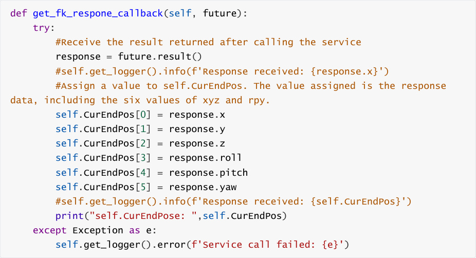

# Robotic arm chassis linkage control
## 1. Content Description

This course implements the use of an inverse solution algorithm for the robotic arm to calculate

the target pose of the robotic arm and control the robotic arm to move to that pose. At the same

time, the chassis also moves synchronously, with the robotic arm and chassis moving in tandem

relative to each other.


This section requires entering commands in the terminal. The terminal you open depends on

your motherboard type. This lesson uses the Raspberry Pi 5 as an example. For Raspberry Pi and

Jetson-Nano boards, you need to open a terminal on the host computer and enter the command

to enter the Docker container. Once inside the Docker container, enter the commands mentioned

in this section in the terminal. For instructions on entering the Docker container from the host

computer, refer to this product tutorial **[Configuration and Operation Guide]--[Enter the**

**Docker (Jetson Nano and Raspberry Pi 5 users, see here)]** .


Simply open the terminal on the Orin motherboard and enter the commands mentioned in this

section.

## 2. Program startup


First, open the terminal and enter the following command to start the robot arm solver.


In another terminal, enter


After the program is started, the robot arm will reach the initial posture. Then enter the following

command in the terminal to start it:


After posting this topic, the robot will move forward and the robotic arm will move backward. The

robot will move forward 1 meter and then stop. If the above message is posted again, the robot

will move back 1 meter.

## 3. Core code analysis


Code path:


Raspberry Pi and Jetson-Nano board


The program code is in the running docker. The path in docker

is `/root/yahboomcar_ws/src/M3Pro_demo/M3Pro_demo/ M3Pro_Dancing.py`


Orin Motherboard


The program code path is `/home/jetson/yahboomcar_ws/src/M3Pro_demo/M3Pro_demo/`

```
   M3Pro_Dancing.py

```

Import the used libraries,





The program initializes and creates publishers and subscribers,





The startFlagCallBack callback function processes the message data released. If the message is

true, two threads are started to control the operation of the robotic arm and chassis respectively.

The parameters passed in are self.direction and -self.direction, which indicate the relative

direction of movement.





base_move controls the chassis movement function,





arm_move controls the movement of the robotic arm.





get_ik_respone_callback receives the callback function that returns the result of calling the ik

service.

```
 def get_ik_respone_callback(self, future):

    try:

```

```
      response = future.result()

      joints = [0.0, 0.0, 0.0, 0.0, 0.0,0.0]

      #Assign values to servos 1-3. The assigned values are the values of the

 responses returned after the service is processed.

      joints[0] = int(response.joint1) #response.joint1

      joints[1] = int(response.joint2)

      joints[2] = int(response.joint3)

      joints[3] = int(response.joint4)

      joints[4] = 90

      joints[5] = 30

      print("compute_joints: ",joints)

      self.cur_joints = joints

      #Publish a topic about controlling the angles of six servos

      self.pubSixArm(joints)

      time.sleep(1.5)

    except Exception as e:

      self.get_logger().error(f'Service call failed: {e}')

```

get_current_end_pos gets the current end position function of the robotic arm.





get_fk_respone_callback receives the callback function that returns the result of calling the fk

service.



