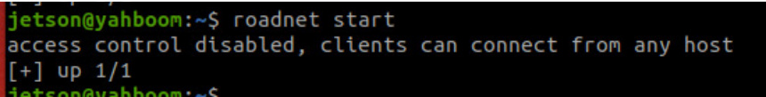
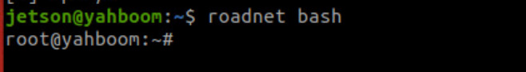
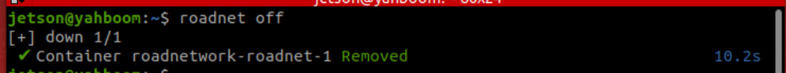
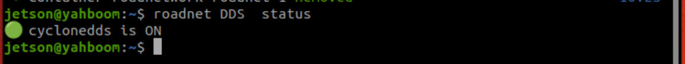
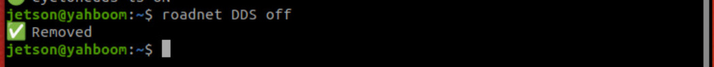
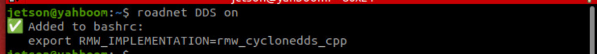

# Introduction to Road Network Planning

**Introduction to Road Network Planning**

1. Course Content

2. Introduction to Road Network Planning

3. Road Network Container Commands

## 1. Course Content


Understand the road network planning and navigation function
## 2. Introduction to Road Network Planning


The core of road network planning navigation function is to utilize Nav2's route server, which helps

users create, edit, and manage route maps for robot navigation. The route map represents the valid

paths that a robot can follow in its environment, consisting of nodes (waypoints) and edges (connections

between waypoints). Unlike ordinary free-space planning, path-based navigation ensures that the robot

follows specific, predefined paths.


Road network planning navigation is commonly used in the following scenarios:


Industrial environments where specific routes must be followed


Application case: Factory AGV robots transport parts along predefined road networks, with routes

avoiding production lines, personnel passages, and heavy equipment areas.


Warehouse operations requiring structured movement patterns


Application case: Parts warehouse, road network zones divided by material types, robots access

parts along fixed routes, ensuring FIFO (First In, First Out) while avoiding shelf collisions.


Application case: Hotel service robots, when robots deliver goods to different rooms, they only

travel along specific route networks.


Facilities with restricted areas or priority paths


Large outdoor urban or natural environments


Application case: Route planning in navigation software is based on urban lane networks,

autonomous sightseeing vehicles in scenic areas only travel along fixed road networks within the

park, avoiding ecological protection zones and dangerous road sections.

## 3. Road Network Container Commands


Start the road network container (Note: Need to start in the terminal of VNC, the Raspberry Pi

mainboard also starts on the host machine)




Open a terminal for a road network container




Stop the road network container


**Tip**


If you cannot immediately stop the road network container when using road network navigation,

you can directly shut down the road network container




DDS Configuration


When using road network navigation, it is necessary to switch from the default ROS FastDDS communication

middleware to cycloneDDS. Detailed explanation will be provided in subsequent courses. You can turn off

cycloneDDS when not using road network navigation.


**Note**


It is currently known that when using cycloneDDS as the middleware, the grid map cannot be saved

after Gmapping-SLAM mapping, other functions are unaffected


Check if cycloneDDS is currently in use




Disable cycloneDDS

```
roadnet DDS off

```



Enable cycloneDDS



