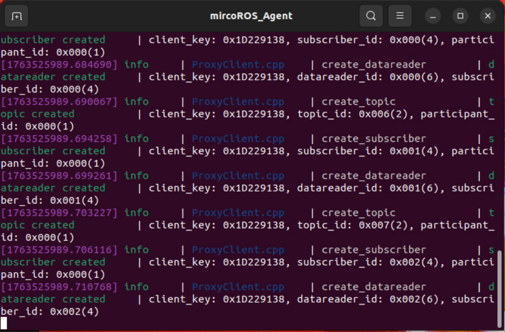
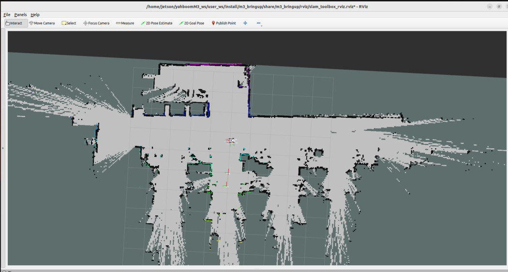
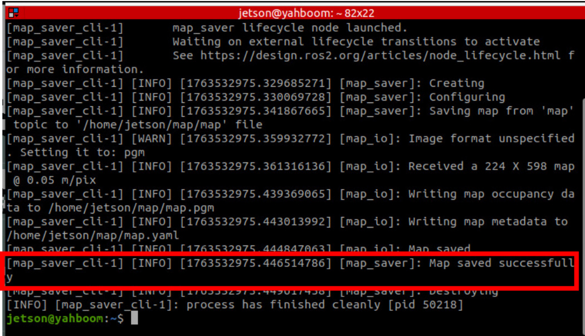
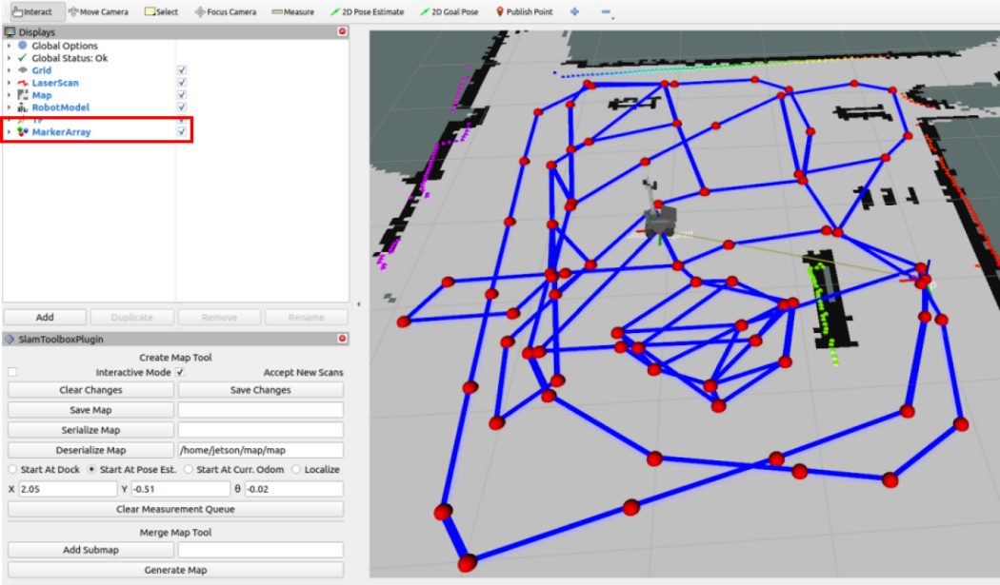
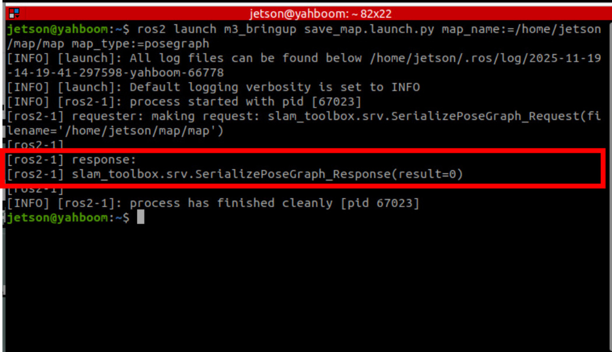
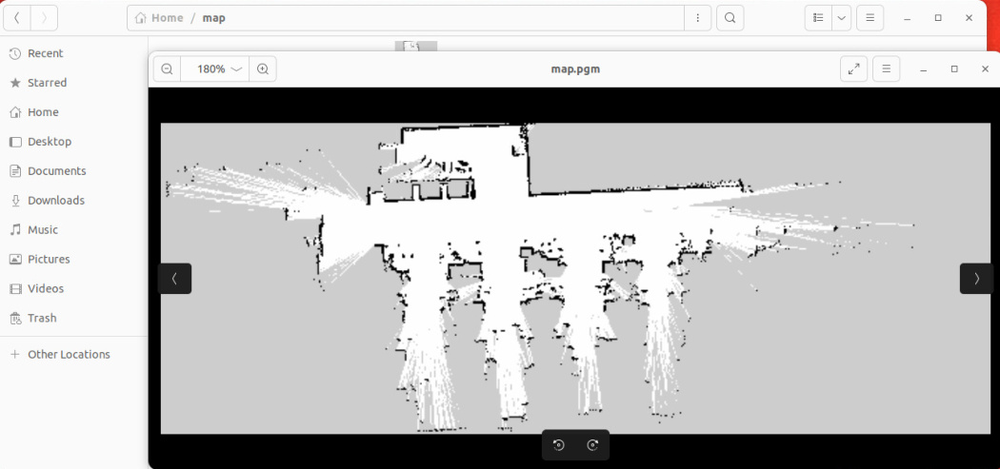

# Build A Pose Map

**Build A Pose Map**

1. Course Content

2. Building a Grid Map

## 1. Course Content


1. Use slam_toolbox to build grid maps and pose maps


**Note**


At least one grid map is required before marking the road network .geojson file


The pose map enables fast relocalization when marking waypoints and navigating, improving global

localization accuracy and enhancing waypoint marking accuracy

## 2. Building a Grid Map


If the chassis mircoROS agent communication is not started, first start the agent. If already started, no

need to restart




Enter the command in the terminal


Then start the keyboard control node (you can also use a gamepad)

```
ros2 run teleop_twist_keyboard teleop_twist_keyboard

```

Control the robot movement for mapping


Save the Grid Map





**Tip**


map_name is used to specify the **map name** of the grid map to be saved. If no launch parameter is




**Check pose point quantity (Important)**


Click the MarkerArray option in the Display panel of Rviz to view the pose points of the pose map.

Ensure there are sufficient pose points in the map area. If there are too few or no pose points in a

certain area, the positioning effect in that area during navigation will be relatively poor.


Save the Pose Map



**Tip**


the `slam_toolbox` pose map is saved


The terminal prompt `slam_toolbox.srv.SerializePoseGraph_Response(result=0)` confirms the pose map

has been saved





