# Road Network Annotation Description

**Road Network Annotation Description**

1. Course Contents

2. Prerequisites

### 2.1 Start Agent

### 2.2 Modify DDS

### 2.3 Start Road Network Container

3. Road Network Annotation

### 3.1 Start Road Network Annotation Node

### 3.2 Add Waypoints

### 3.3 Add Edges

4. Save Road Network Description File

5. Load and Modify Road Network Description

### 5.1 Load Road Network Description File

### 5.2 Edit Road Network

## 1. Course Contents


1. Use the route_tool tool to annotate `.geojson` format files describing road networks
## 2. Prerequisites

### 2.1 Start Agent


Start the microROS agent and connect to the chassis. If already started, no need to restart

```
 sh start_agent.sh

```

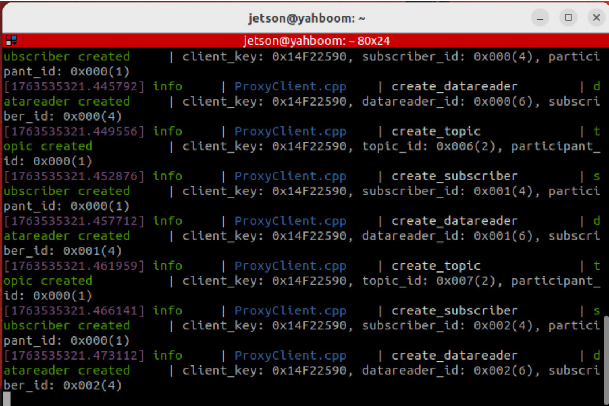
### 2.2 Modify DDS

Modify the ROS communication middleware DDS to use cyclonedds. Only modify when using road

network features


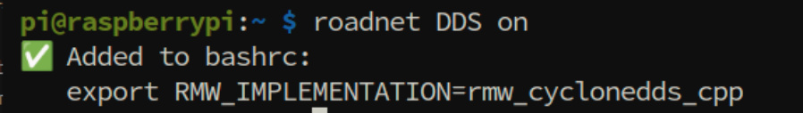

Check DDS status


**Refresh Environment Variables**


Orin board


Raspberry Pi board, restart container

### 2.3 Start Road Network Container


## 3. Road Network Annotation

When annotating road networks, we need to know the exact position of the vehicle on the map.

Therefore, we need to start the navigation node on the host machine first. The position can be known

through the base_footprint coordinate system (PI5 users should start in the `m3pro container` )


**Note**


Startup Parameter Description


**gui** Whether to start rviz. Here we choose not to start; it will be started in the docker container

later

### 3.1 Start Road Network Annotation Node


Start in the roadnet container terminal


**Note**


can be used directly in the roadnet container


In rviz, the map and two coordinate frames will be displayed. The map is the map coordinate frame, and

base_footprint is the coordinate frame of the projection point of the vehicle chassis center on the

ground. Through base_footprint, we can know the exact position of the vehicle on the map in real-time


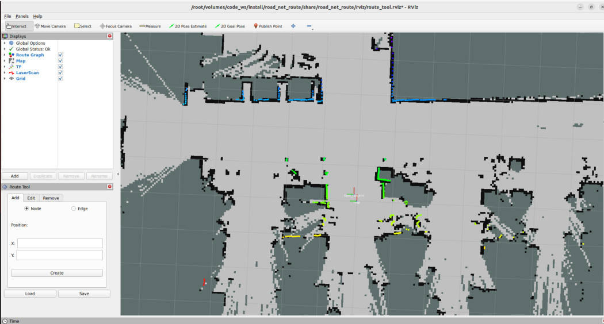
### 3.2 Add Waypoints

Then click the left mouse button on the blue dot at the center of the base_footprint coordinate frame.


coordinates. Then click Create to create a waypoint


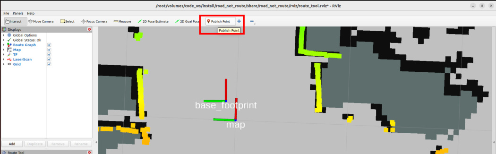
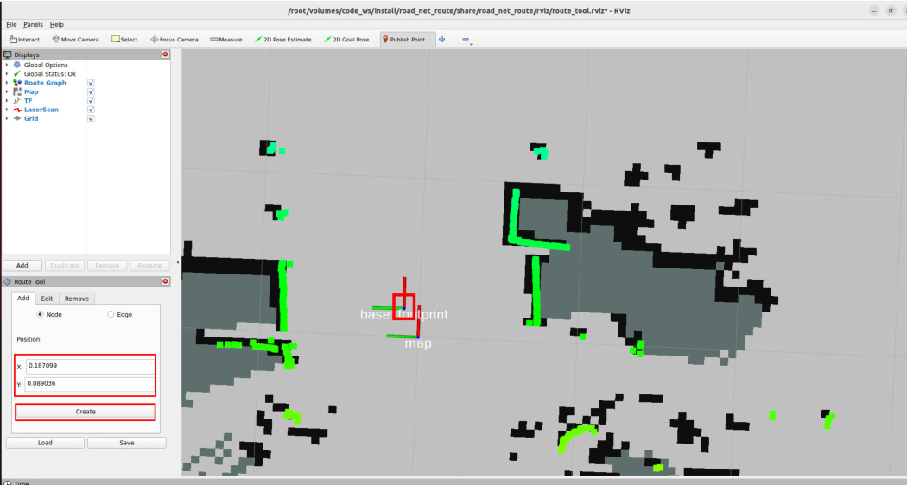

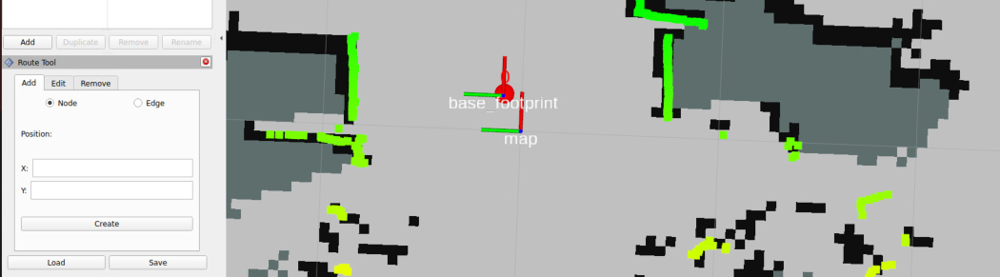

Next, move the vehicle to the next position where a waypoint needs to be annotated. In this example,

the vehicle is directly moved to the next position where a waypoint needs to be marked


**Tip**


or even by directly physically moving the vehicle to the next position where a waypoint needs to be

marked. Since there is a pose map, the vehicle's global position can be quickly and accurately located


As you can see, directly moving the vehicle causes the global localization to be lost, and the laser outline

no longer matches the map environmental features. Here we can use the pose map for rapid

relocalization


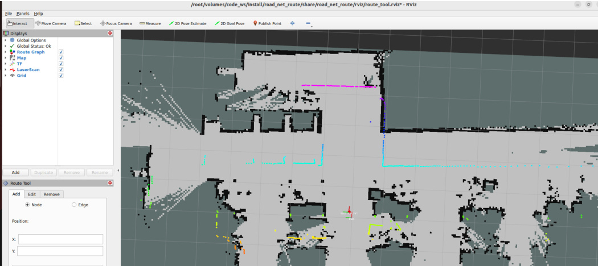

Then provide an estimated position near the approximate location of the vehicle


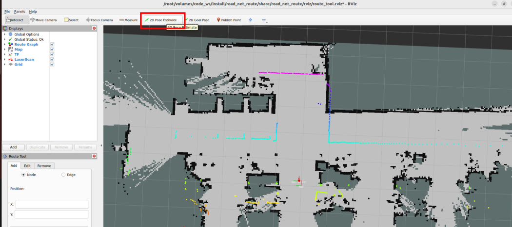
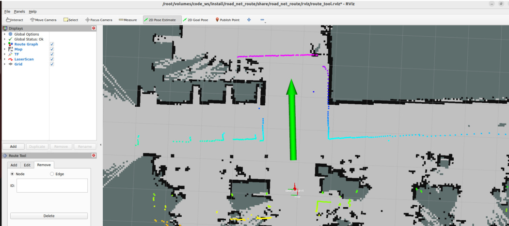

After this, the vehicle's accurate position in the global map will be immediately restored


**Tip**


The rapid relocalization principle here is to use slam_toolbox pure localization and pose map for

rapid scan-map matching


**Note:** When observing **deviation between the laser outline and map environmental features**

during subsequent waypoint annotation (due to cumulative odometry errors, wheel slippage,

manual movement, or other factors causing local localization errors), this method can be used to

quickly restore the vehicle's accurate position.


Repeat the above steps until all waypoints that need to be annotated are completed (annotate

waypoints according to your actual needs)


After annotation is complete, you can first close the left TF and LaserScan to inspect the waypoints


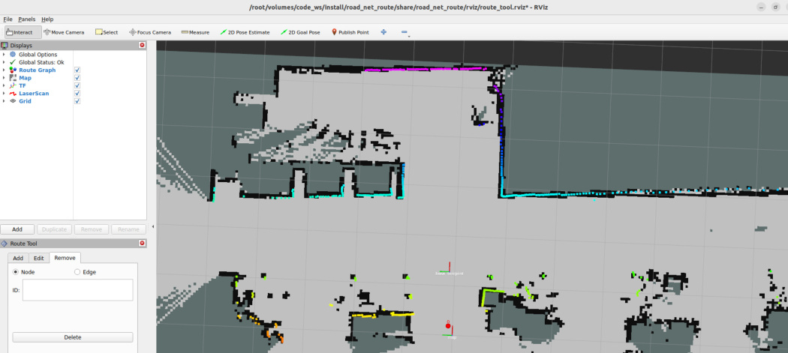
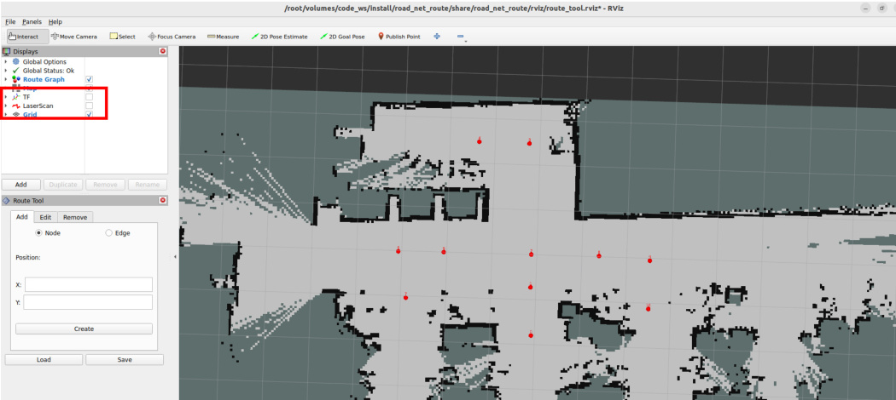
### 3.3 Add Edges

click Create to create an edge between waypoints


**Important**


**Attention!!!**


**The road network is a topological structure composed of points and edges. Edges have direction.**

For example, creating an edge 0---->1 here is unidirectional. If bidirectional edges are needed, you also

need to create edge 1---->0.


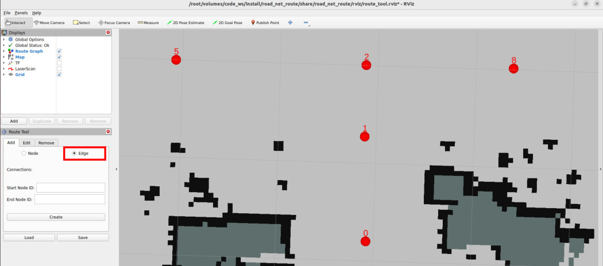
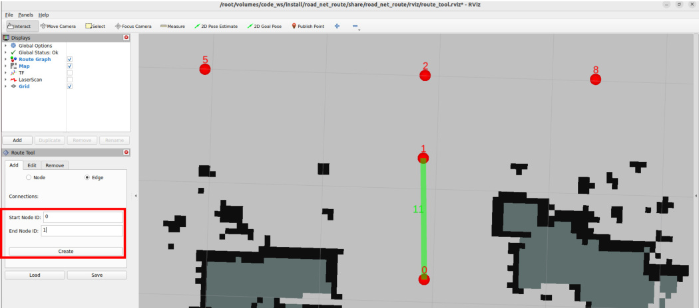

Next, we create the 1-0 edge so that waypoints 0 and 1 can travel bidirectionally


Repeat the above steps to complete all edge creation (whether to create unidirectional or bidirectional

edges depends on the actual scenario requirements)


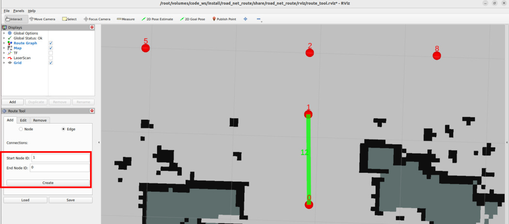
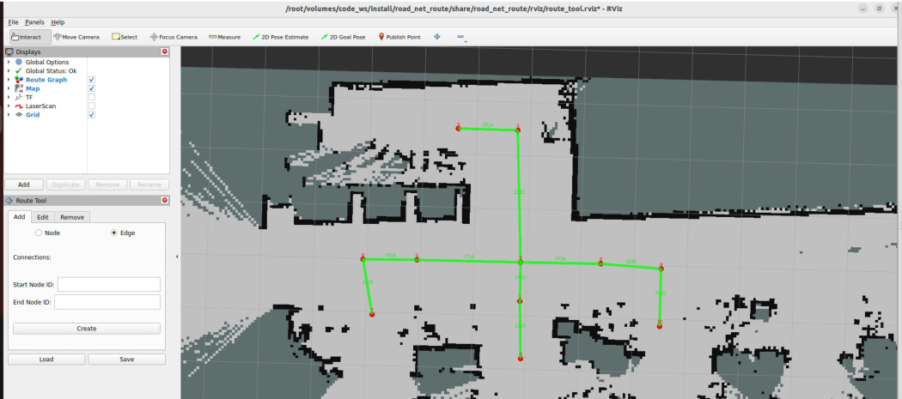
## 4. Save Road Network Description File

view the saved file on the host machine


Then fill in the file name in File name. It is recommended to keep the same name as the raster map for

easy identification. The file suffix must be **.geojson** . Finally, click save to save the road network

description file


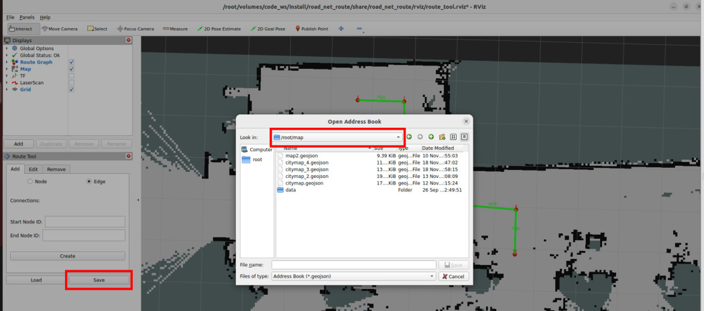
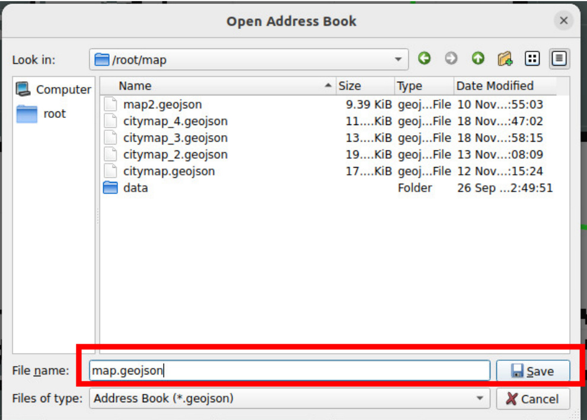

After successful save, the terminal will print a prompt


Afterwards, we can directly view the map.geojson road network description file from the host machine's


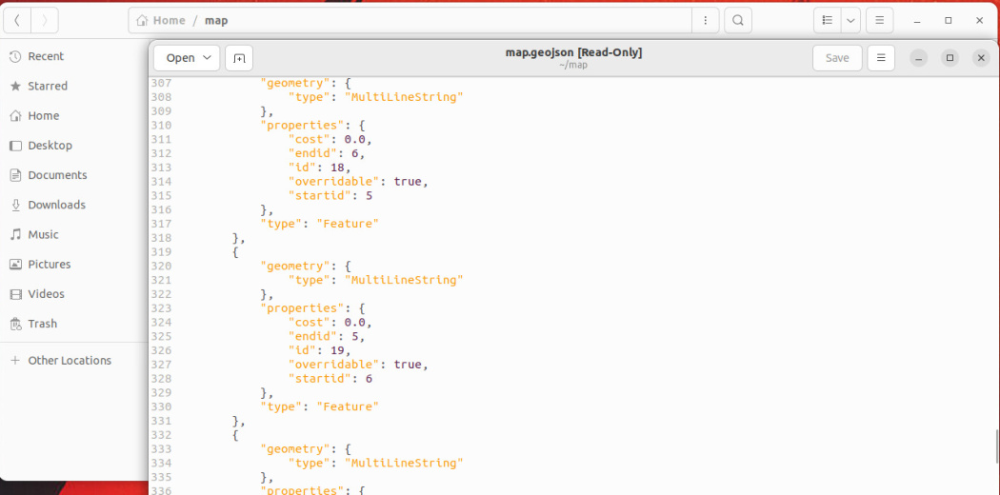
## 5. Load and Modify Road Network Description

### 5.1 Load Road Network Description File

If you need to modify a previous road network description file later, such as adding, removing, editing

points or edges, you can load the previous road network description file for editing


Start in the roadnet container terminal

```
 ros2 launch road_net_route route_tool.launch.py yaml_filename:=map.yaml

```

**yaml_filename** Parameter is the raster map file path of the road network to be annotated


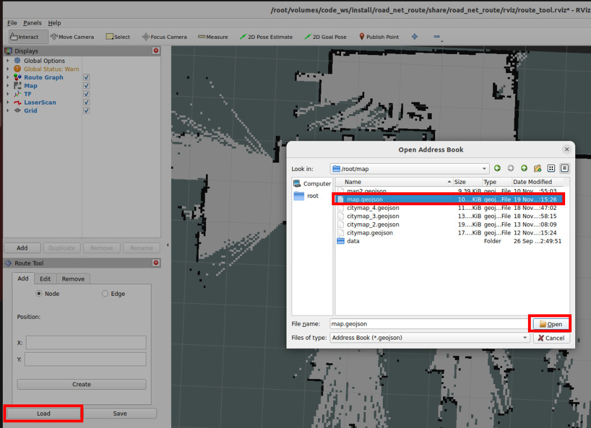
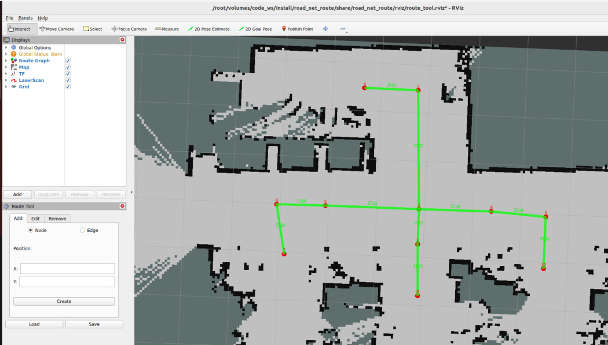
### 5.2 Edit Road Network

If you need to add new waypoints and edges, the operation is the same as the previous steps


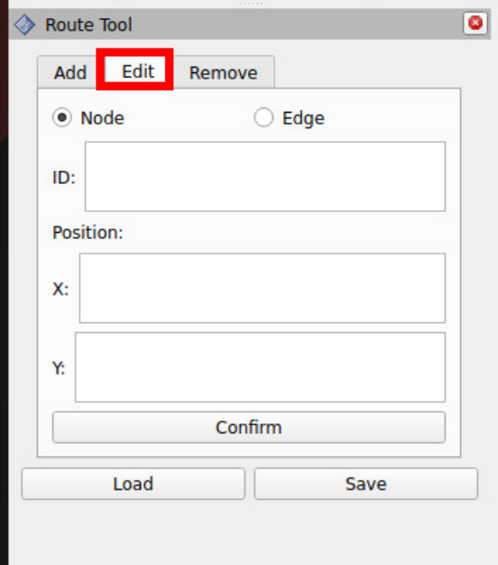
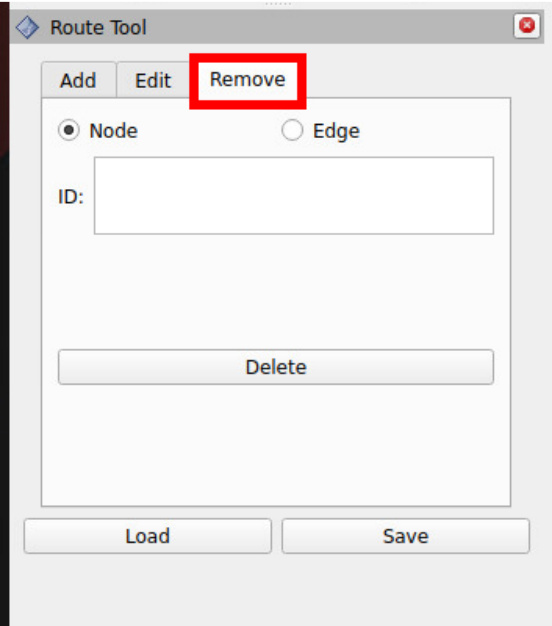
