# Planning And Navigation Between Waypoints

**Planning And Navigation Between Waypoints**

1. Course Content

2. Prerequisites

3. Navigation Between Waypoints

### 3.1 Navigation When Starting Position is Not on the Road Network

4 Source Code Analysis

### 4.1 route_bridge.py Analysis

### 4.2 conver_speed.py Analysis

5. Navigation Parameter Debugging

### 5.1 Navigation Controller Debugging

### 5.2 Obstacle Avoidance and Costmap Debugging

## 1. Course Content


Basic: Use the marked road network file for navigation between road networks on the map


Advanced: Master the debugging methods for navigation parameter files

## 2. Prerequisites


Use the following command to start the mircoROS agent and connect to the chassis


Start the road network container


Start the LiDAR fusion node and odometry fusion for the robot on the host machine (PI5 users start in


Start the road network planning navigation node (inside the roadnet container)


To improve the rviz startup speed, the robot model is not loaded by default. If you need to display the

robot model, check RobotModel in the left options panel.

## 3. Navigation Between Waypoints


Here we use road network navigation by publishing to the `/road_net_nav_id` topic in the terminal. For

example, if our robot is near waypoint 0 and we need to navigate to waypoint 7


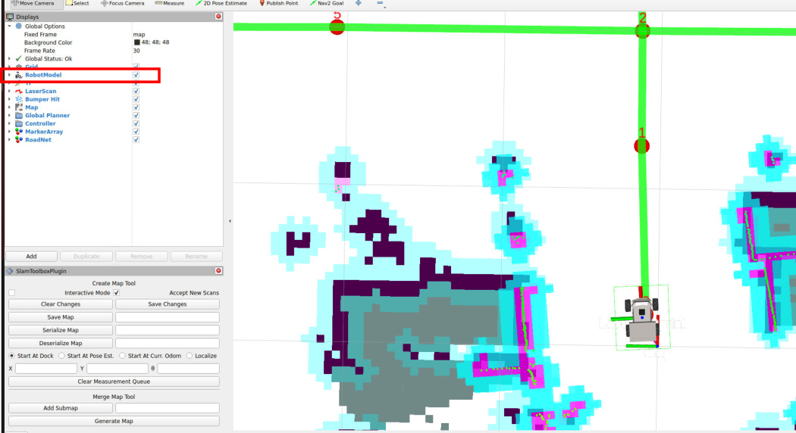


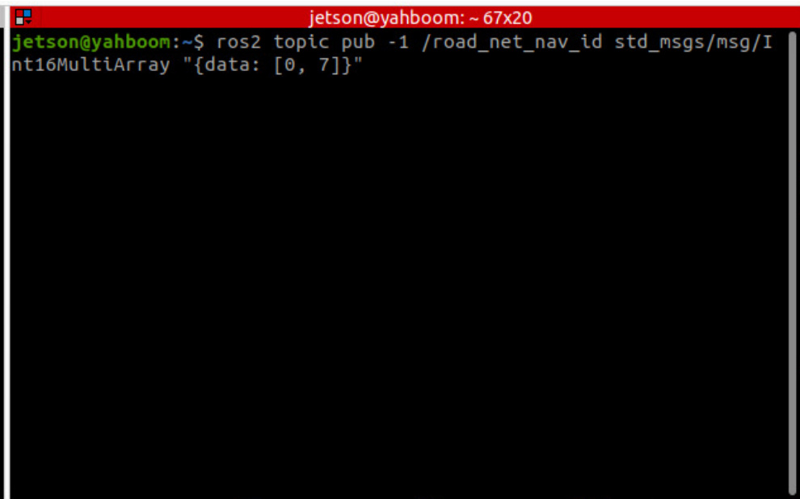

Then you can see in rviz that the planned global path is only planned within the road network


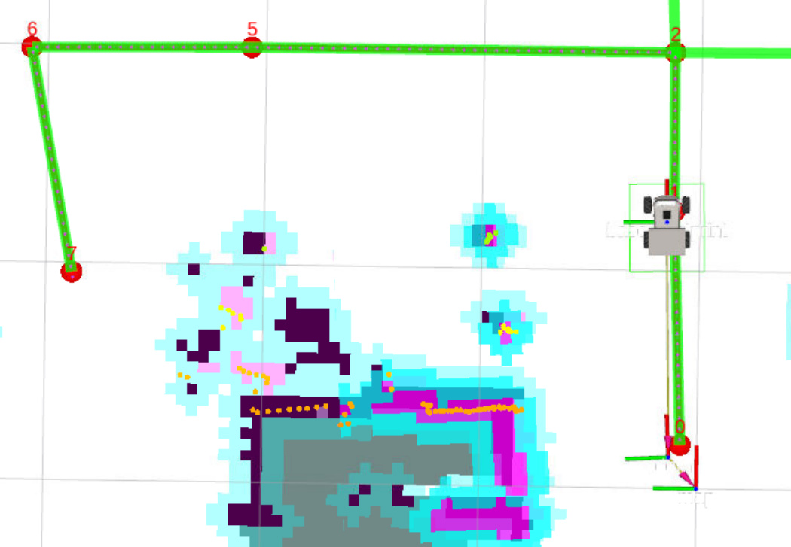
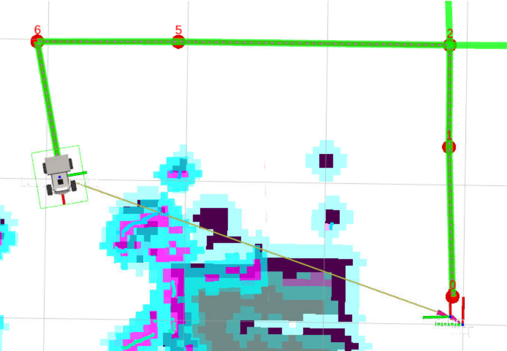
### 3.1 Navigation When Starting Position is Not on the Road Network

If the starting position is not on a road network node or edge, when executing road network navigation,

the robot will automatically enter the nearest road network edge first, then move along the road

network. For example, in the situation below, the robot is not in the road network. We observe that the

nearest waypoint is 0, and we plan to go to waypoint 10. Then publish the start and end point topic


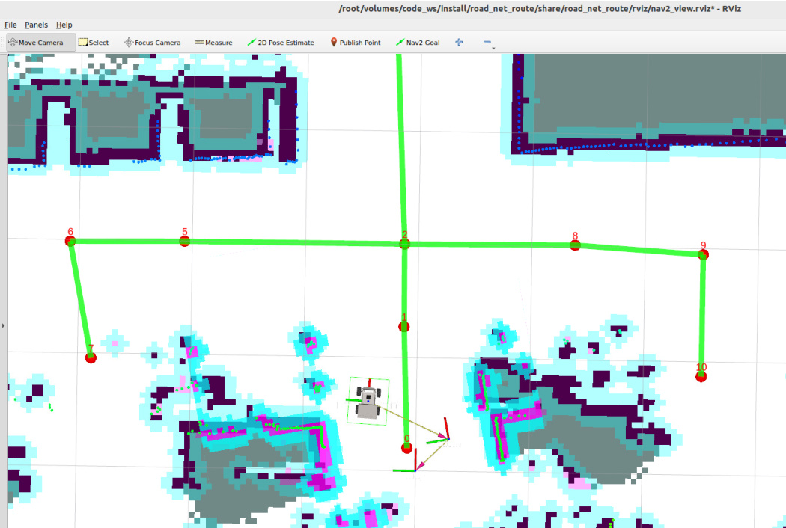

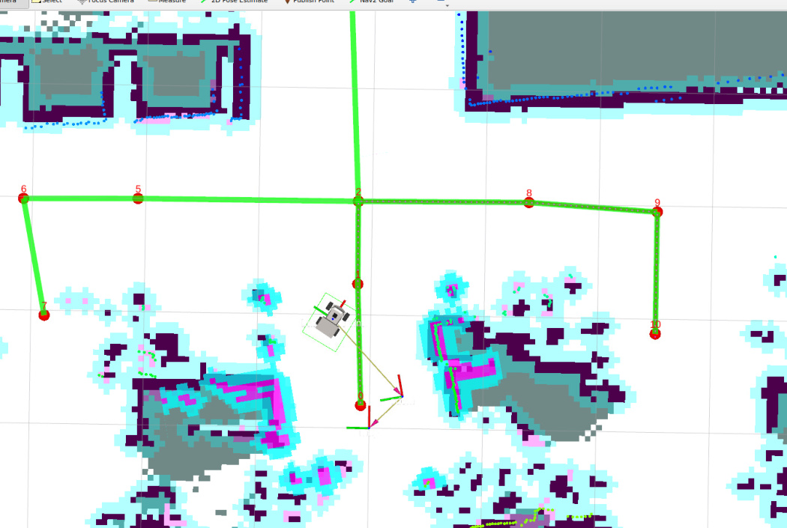
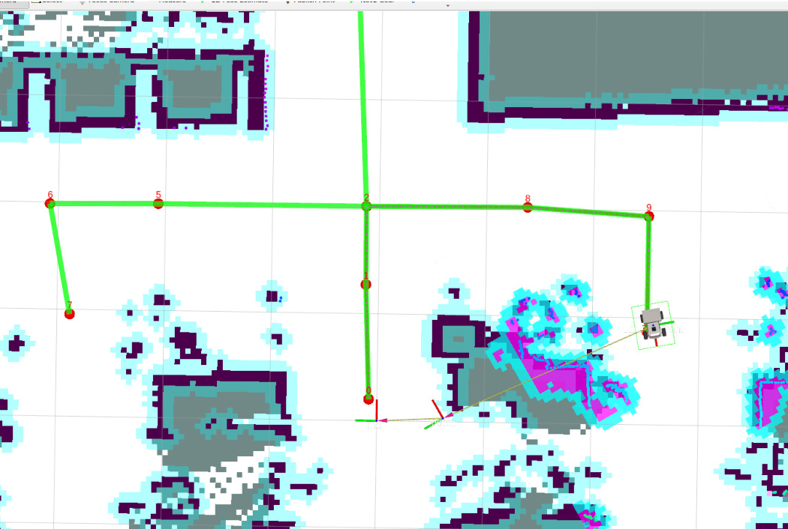
## 4 Source Code Analysis

Implementation source code path:

```
 $HOME/M3Pro_ws/RoadNetwork/volumes/code_ws/src/road_net_route/road_net_route/route_bridge.py

```


### 4.1 route_bridge.py Analysis

directly calls `getAndTrackRoute` to initiate road network navigation:


Input validation: If data length is not 2, report error; if `[-1, -1]`, cancel navigation.


Navigation execution: Call `self.navigator.getAndTrackRoute(start_id, goal_id)`, return navigation

task handle.


Feedback processing: Loop to get navigation feedback, monitor node switching


update the local path.


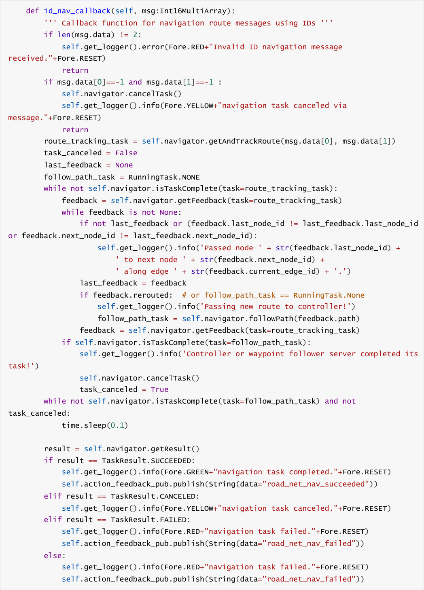


### 4.2 conver_speed.py Analysis

Since navigation2 in the roadnet container publishes velocity topics in `TwistStamped` format, while the

ROSMASTER-M3Pro chassis mircoROS node accepts Twist format velocity topics for chassis control, the

two cannot communicate directly. A bridge is needed to convert the velocity message format.


We can view the difference between the two message types using the following commands. The main


`TwistStamped` format velocity topic


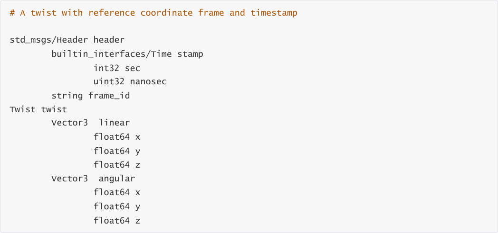


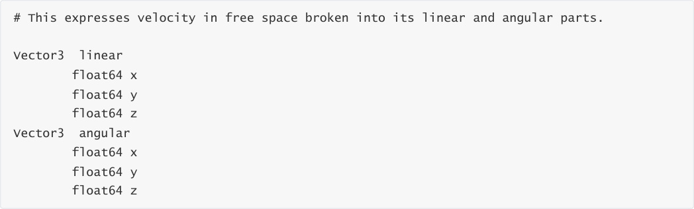


In the TwistStampedToTwist class initialization function, a TwistStamped format velocity topic subscriber

is defined. Then in the callback function, the TwistStamped format velocity is converted to Twist format

velocity topic and published.


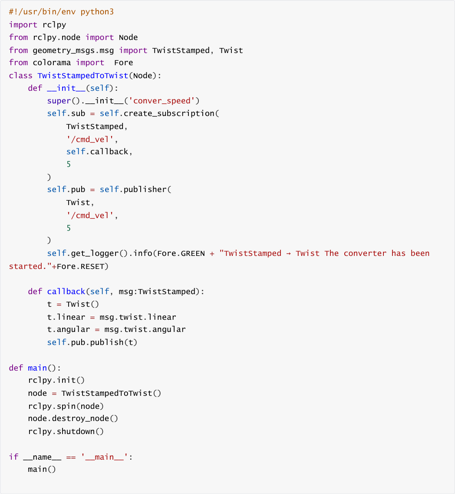
## 5. Navigation Parameter Debugging

Road network navigation parameter file path:


### 5.1 Navigation Controller Debugging

**Tip**


**Parameter Adjustment Guide**


If you need to adjust the movement speed and rotational angular velocity during navigation, adjust


If you need to adjust the accuracy of reaching the target point, adjust `xy_goal_tolerance` and


See comments below for other parameter adjustments


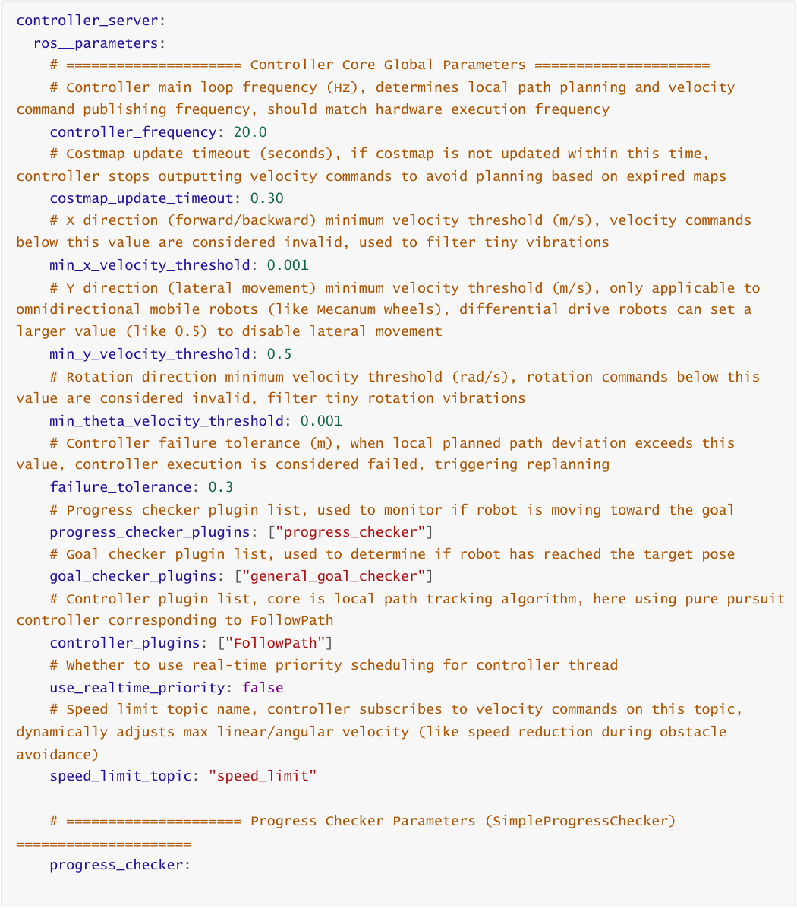
```
    # Progress checker plugin type, SimpleProgressChecker is basic implementation,

monitors robot movement distance and time

plugin: "nav2_controller::SimpleProgressChecker"

    # Minimum movement distance threshold (m), if robot does not move more than this

distance within movement_time_allowance, considered no progress

required_movement_radius: 0.05

    # Maximum allowed no-progress time (s), if still not meeting required_movement_radius

after this time, controller aborts task (error code 105)

movement_time_allowance: 10.0

  # ===================== Goal Checker Parameters (SimpleGoalChecker)

=====================

general_goal_checker:

    # Whether to use stateful checker, when set to True, continuously monitors target pose

until tolerance is met; False is single check only

stateful: True

    # Goal checker plugin type, SimpleGoalChecker is basic implementation, determines if

position and angle are within tolerance

plugin: "nav2_controller::SimpleGoalChecker"

    # XY plane position tolerance (m), robot position deviation from target less than this

value indicates position arrival

xy_goal_tolerance: 0.08

    # Heading angle tolerance (radians), robot heading deviation from target less than

this value indicates angle arrival

yaw_goal_tolerance: 0.03

  # ===================== Pure Pursuit Controller Parameters

(RegulatedPurePursuitController) =====================

FollowPath:

    # Local path tracking plugin type, RegulatedPurePursuitController is a speed-regulated

pure pursuit algorithm, suitable for differential drive robots

plugin: "nav2_regulated_pure_pursuit_controller::RegulatedPurePursuitController"

    # Desired linear velocity (m/s), target linear velocity for normal robot driving,

dynamically scaled by obstacle avoidance/curvature regulation

desired_linear_vel: 0.2

    # Lookahead distance (m), core parameter of pure pursuit algorithm, determines the

distance of path points the robot tracks, should match robot speed

lookahead_dist: 0.5

    # Minimum lookahead distance (m), prevents robot frequent turns due to too small

lookahead distance

min_lookahead_dist: 0.05

    # Maximum lookahead distance (m), prevents robot sluggishness due to too large

lookahead distance

max_lookahead_dist: 0.9

    # Lookahead time (s), when use_velocity_scaled_lookahead_dist is enabled, lookahead

distance = desired_linear_vel * lookahead_time

lookahead_time: 1.5

    # Angular velocity for rotating to target heading (rad/s), robot's rotation speed when

adjusting heading after reaching position

rotate_to_heading_angular_vel: 1.3

    # TF transform tolerance (s), allows maximum deviation between robot pose timestamp

and current time, solves TF delay problem

transform_tolerance: 0.5

```

```
    # Whether to use velocity scaled lookahead distance, when True, lookahead distance

dynamically changes with robot speed (faster speed, farther lookahead)

use_velocity_scaled_lookahead_dist: false

    # Minimum linear velocity when approaching target (m/s), when robot is close to

target, slow down to this value to avoid overshooting target

min_approach_linear_velocity: 0.05

    # Approach velocity scaling distance (m), when robot distance to target is less than

this value, start linear deceleration (from desired_linear_vel to

min_approach_linear_velocity)

approach_velocity_scaling_dist: 1.0

    # Whether to enable collision detection, when True, controller checks for collisions

on the lookahead path to avoid robot hitting obstacles

use_collision_detection: false

    # Maximum allowed time to collision up to carrot (s), only effective when

use_collision_detection is True, used to determine collision risk

max_allowed_time_to_collision_up_to_carrot: 1.0

    # Whether to enable linear velocity regulation based on path curvature, when True,

smaller turning radius results in lower linear velocity

use_regulated_linear_velocity_scaling: true

    # Whether to enable linear velocity regulation based on costmap, when True, closer

obstacles result in lower linear velocity

use_cost_regulated_linear_velocity_scaling: false

    # Minimum turning radius to trigger curvature regulation (m), when path curvature

corresponding turning radius is less than this value, start deceleration

regulated_linear_scaling_min_radius: 0.05

    # Minimum speed for curvature regulation (m/s), even if turning radius is extremely

small, linear velocity will not be lower than this value

regulated_linear_scaling_min_speed: 0.25

    # Whether to use fixed curvature lookahead distance, when True, lookahead distance is

determined by curvature_lookahead_dist

use_fixed_curvature_lookahead: false

    # Curvature lookahead distance (m), only effective when use_fixed_curvature_lookahead

is True

curvature_lookahead_dist: 1.0

    # Whether to enable "rotate to heading then move first", when True, if robot heading

deviates too much from path direction, rotate first then move

use_rotate_to_heading: true

    # Minimum angle to trigger rotate to heading (radians), when robot heading deviation

from path direction exceeds this value, start rotation adjustment

rotate_to_heading_min_angle: 0.785 # approximately 45 degrees

    # Maximum angular acceleration (rad/s²), limits robot rotation acceleration, avoids

sudden turns causing hardware damage

max_angular_accel: 1.2

    # Maximum search distance for robot pose (m), when controller cannot find matching

robot pose on path, search path points within this distance

max_robot_pose_search_dist: 10.0

    # Whether to interpolate curvature after goal point, when True, path after goal point

interpolates curvature to avoid robot sudden stop after reaching goal

interpolate_curvature_after_goal: false

    # Cost scaling distance (m), only effective when

use_cost_regulated_linear_velocity_scaling is True, used to calculate obstacle avoidance

deceleration weight

cost_scaling_dist: 0.08

```

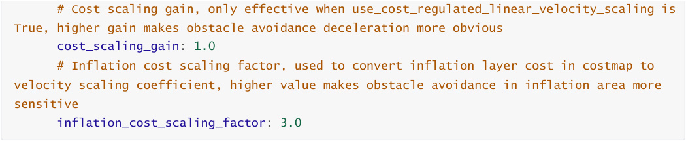


### 5.2 Obstacle Avoidance and Costmap Debugging

**Tip**


If the robot gets too close to obstacles in the map during navigation, you can adjust the inflation

area to keep the robot away from obstacles. Increase inflation_radius (inflation radius) and

cost_scaling_factor (scaling factor, higher value makes robot less likely to approach obstacles) in

local_costmap and global_costmap


See comments below for other parameter adjustments


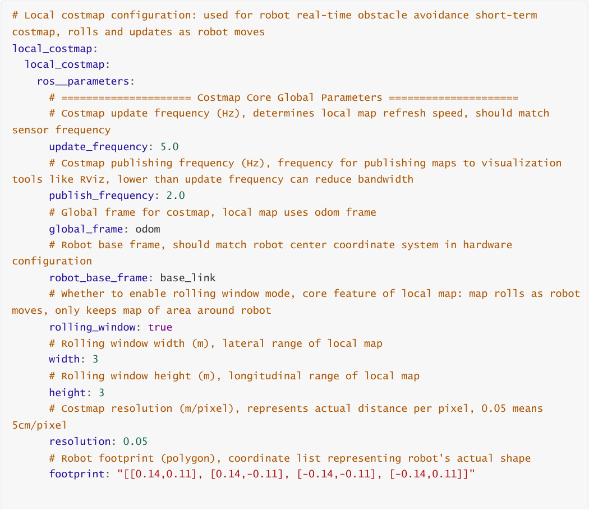


```
    # Robot footprint padding (m), additional safety distance outside actual footprint,

used as buffer for obstacle avoidance

footprint_padding: 0.0616

    # Costmap layer plugin list, loaded in order (voxel_layer: voxel obstacle layer;

inflation_layer: inflation layer)

plugins: ["voxel_layer", "inflation_layer"]

    # Costmap filter plugin list, used for post-processing maps (keepout_filter: keepout

zone filter)

filters: ["keepout_filter"]

    # Whether to always publish complete costmap, when True publishes full map on every

update, False publishes only changed areas (reduces bandwidth)

always_send_full_costmap: True

    # Service introspection mode, disabled means service introspection is disabled, 可选

enabled/verbose

service_introspection_mode: "disabled"

    # ===================== Filter Plugin: Keepout Filter (KeepoutFilter)

=====================

keepout_filter:

     # Filter plugin type, KeepoutFilter is used to mark keepout zones in costmap

plugin: "nav2_costmap_2d::KeepoutFilter"

     # Whether to enable keepout filtering, KEEPOUT_ZONE_ENABLED is an external parameter

(needs to be assigned true/false at startup)

enabled: KEEPOUT_ZONE_ENABLED

     # Subscription topic for keepout zone information, receives geometric shape and

position information of keepout zones (like PolygonStamped)

filter_info_topic: "keepout_costmap_filter_info"

     # Whether to override lethal cost of keepout zones, when True uses custom cost

instead of default lethal cost (255)

override_lethal_cost: True

     # Custom lethal cost for keepout zones, 200 means lower than default lethal cost

(255) but still a high-cost keepout zone

lethal_override_cost: 200

    # ===================== Layer Plugin: Inflation Layer (InflationLayer)

=====================

inflation_layer:

     # Layer plugin type, InflationLayer is used to generate inflation area around

obstacles to avoid robot collisions

plugin: "nav2_costmap_2d::InflationLayer"

     # Cost scaling factor, controls inflation area cost decay rate (higher value means

faster cost decay, smaller inflation area)

cost_scaling_factor: 3.0

     # Inflation radius (m), inflation range around obstacles, minimum safe distance from

robot footprint to obstacle

inflation_radius: 0.1

# Global costmap configuration: used for robot global path planning long-term costmap,

covers entire environment

global_costmap:

global_costmap:

ros__parameters:

    # ===================== Costmap Core Global Parameters =====================

```

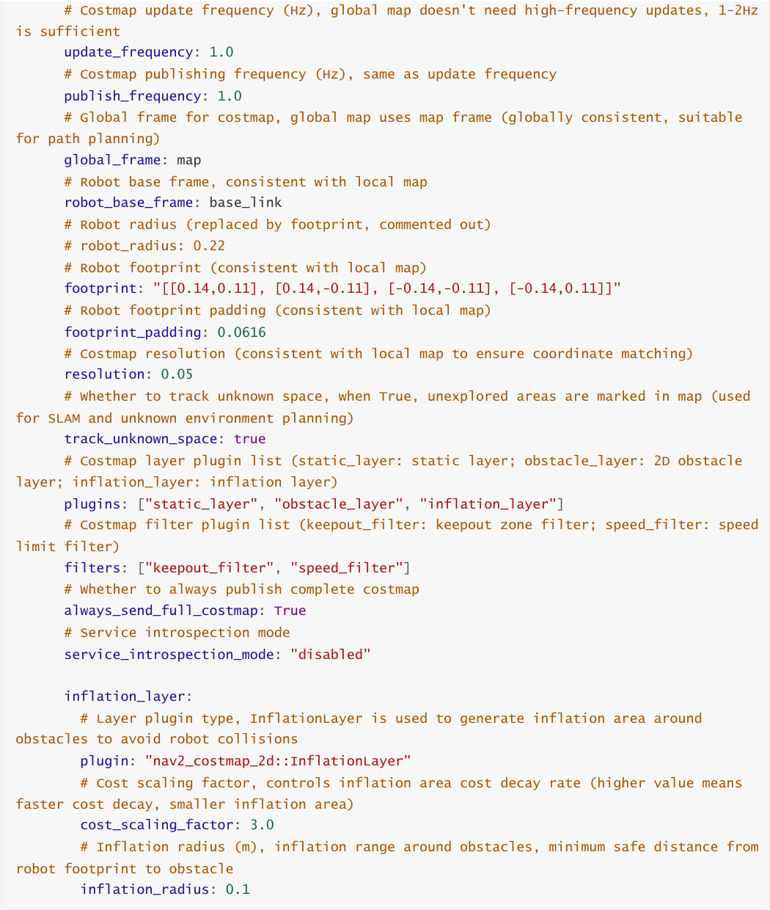
