# Road Network Navigation In Any Pose

**Road Network Navigation In Any Pose**

1. Course Content

2. Prerequisites

3. Road Network Planning Navigation for Any Pose

### 3.1 Application Example

4. Source Code Analysis

### 4.1 route_bridge.py Analysis

## 1. Course Content


Based on navigation between waypoints, combined with road network planning navigation functionality, to

achieve navigation to any pose.


**Note**


When navigation2's route_server performs road network navigation, it can only achieve fixed-pose

navigation. After arriving at the target waypoint, the robot always faces the direction of the edge in the

road network. In practical applications, we often need the robot to face a specified pose after arriving at

the target point to complete specific tasks. We only use road network planning navigation as the

intermediate global path.

## 2. Prerequisites


Use the following command to start the microROS agent and connect to the chassis:


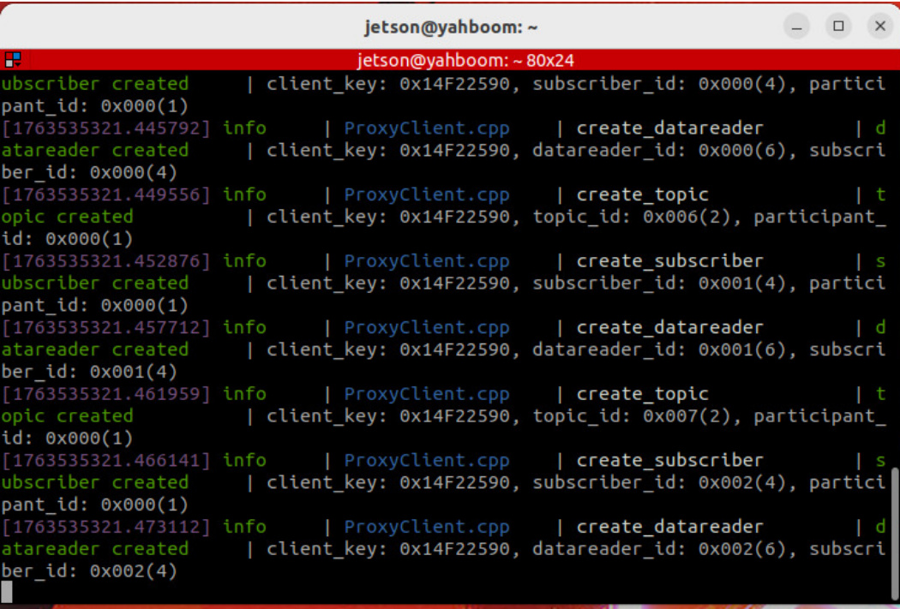

Start the road network container:


Open a terminal on the host machine to start the LiDAR fusion node and odometry fusion on the vehicle


Start the road network planning navigation node (inside the roadnet container):

```
roadnet bash

```

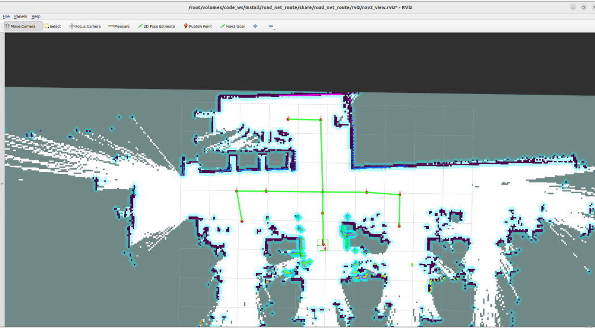
## 3. Road Network Planning Navigation for Any Pose

topic accepts a `PoseStamped` target pose, travels along the road network to the vicinity of the target

pose, and then accurately adjusts to the target pose. The topic publishing format is as follows:


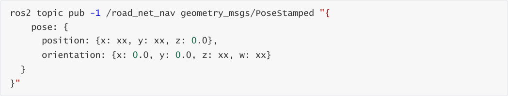


**Note**


A pose consists of position and orientation. For ground mobile robots, the position only includes planar x,

y coordinates, and the orientation only includes rotation around its own z-axis. In the pose:


**position: {x: xx, y: xx, z: 0.0}** is the position information


**orientation: {x: 0.0, y: 0.0, z: xx, w: xx}** is the robot rotation described by a quaternion

### 3.1 Application Example


For example, if we need the robot vehicle to travel only along the road network and then navigate to the

position above waypoint 8 on the map with a specified orientation (the orientation direction is as shown

by the arrow), we first need to know the coordinates of this pose point in the global map.


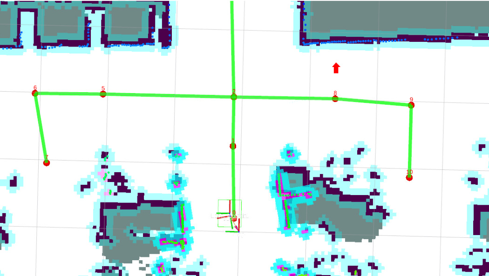

First, let the robot move to this target pose:


Use the following command to get the current robot's coordinates in the map:


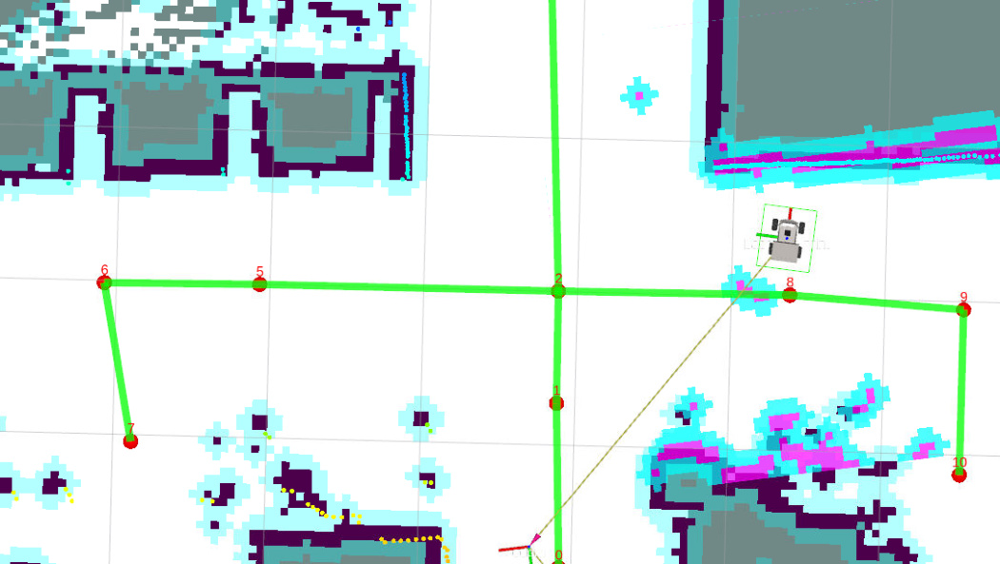


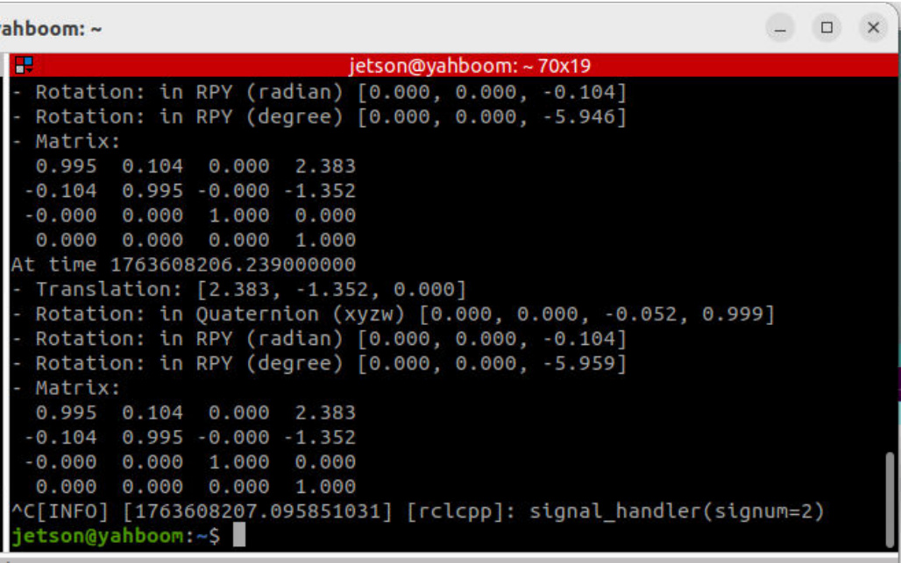

The `Translation` and `Rotation` are the robot vehicle's pose in the global map.


Then let the robot return to its starting position, and publish the target pose in the terminal:


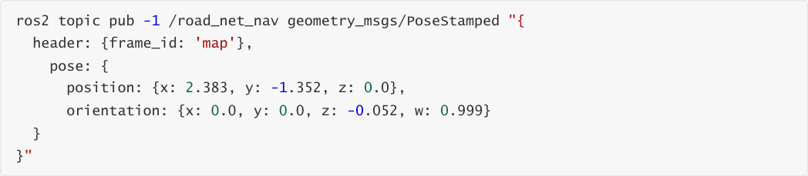


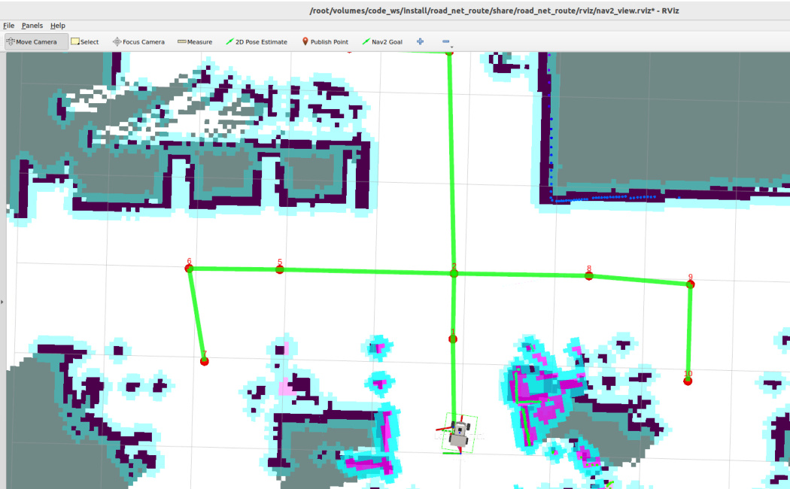

After that, the robot vehicle will first travel along the road network to a waypoint near the target point:


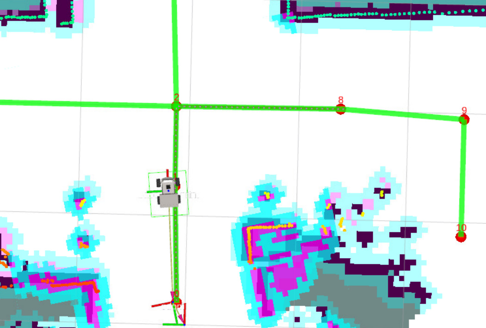
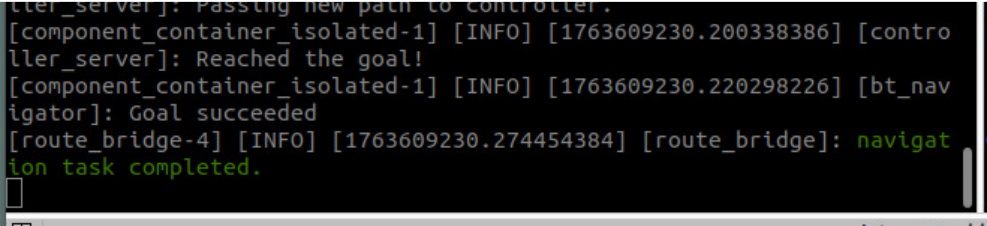

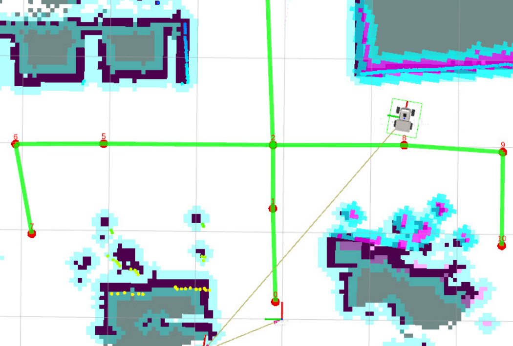
## 4. Source Code Analysis

Implementation source code path:


### 4.1 route_bridge.py Analysis

In the Route_Bridge class initialization function, a `road_net_nav` topic subscriber is created to receive


loss.


global map coordinate system ( `map` ), thereby getting the robot's current pose in the map.


Step 2: Construct the robot's current pose: Encapsulate the TF transform result (translation + rotation)


Step 3: Convert pose to road network waypoint ID: This is the **core transformation logic for road**

**network navigation** :


nearest node ID in the road network (via KDTree nearest neighbor search).


target node ID, to initiate navigation based on road network nodes.


Step 4: Final pose adjustment: Road network navigation only ensures the robot arrives at a waypoint


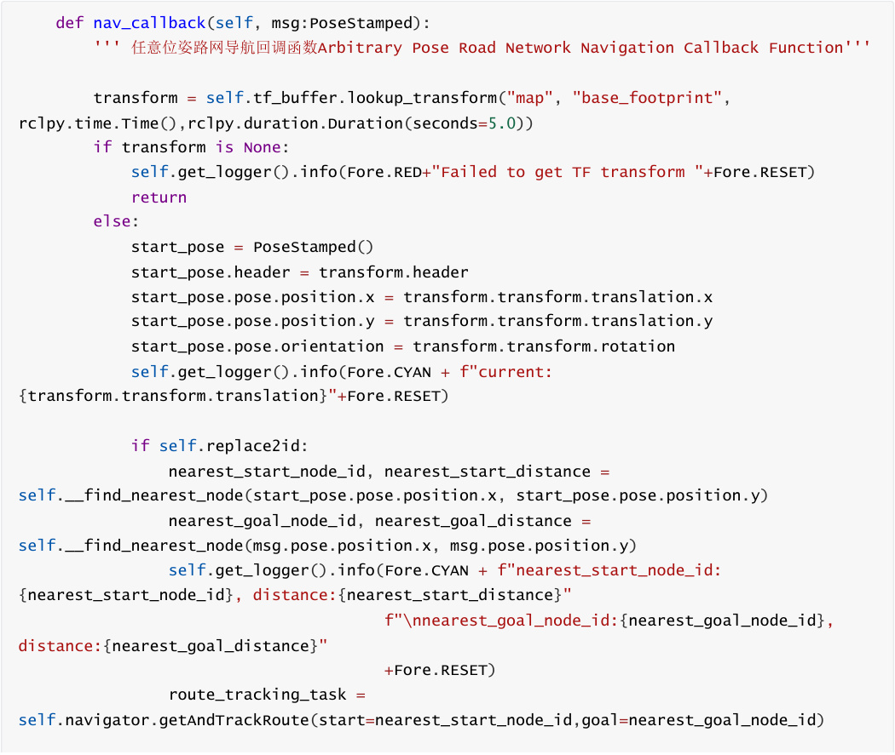
```
       else:

          route_tracking_task =

self.navigator.getAndTrackRoute(start=start_pose,goal=msg,use_start=False)

       task_canceled = False

       last_feedback = None

       follow_path_task = RunningTask.NONE

       while not self.navigator.isTaskComplete(task=route_tracking_task):

          feedback = self.navigator.getFeedback(task=route_tracking_task)

          while feedback is not None:

            if not last_feedback or (feedback.last_node_id !=

last_feedback.last_node_id or feedback.next_node_id != last_feedback.next_node_id):

              self.get_logger().info('Passed node ' + str(feedback.last_node_id) +

                 ' to next node ' + str(feedback.next_node_id) +

                 ' along edge ' + str(feedback.current_edge_id) + '.')

            last_feedback = feedback

            if feedback.rerouted: # or follow_path_task == RunningTask.None

              self.get_logger().info('Passing new route to controller!')

              follow_path_task = self.navigator.followPath(feedback.path)

            feedback = self.navigator.getFeedback(task=route_tracking_task)

          if self.navigator.isTaskComplete(task=follow_path_task):

            self.get_logger().info('Controller or waypoint follower server completed

its task!')

            self.navigator.cancelTask()

            task_canceled = True

       while not self.navigator.isTaskComplete(task=follow_path_task) and not

task_canceled:

          time.sleep(0.1)

       result = self.navigator.getResult()

       if result == TaskResult.SUCCEEDED:

          if self.__adjust_pose(msg):

            self.get_logger().info(Fore.GREEN+"navigation task

completed."+Fore.RESET)

            self.action_feedback_pub.publish(String(data="road_net_nav_succeeded"))

       elif result == TaskResult.CANCELED:

          self.get_logger().info(Fore.YELLOW+"navigation task canceled."+Fore.RESET)

       elif result == TaskResult.FAILED:

          self.get_logger().info(Fore.RED+"navigation task failed."+Fore.RESET)

          self.action_feedback_pub.publish(String(data="road_net_nav_failed"))

       else:

          self.get_logger().info(Fore.RED+"navigation task failed."+Fore.RESET)

          self.action_feedback_pub.publish(String(data="road_net_nav_failed"))

  def __adjust_pose(self,final_pose)->bool:

     ''' 调整到目标姿态 Adjust to target posture'''

     self.get_logger().info("adjusting final orientation...")

     final_orientation_task = self.navigator.goToPose(final_pose)

     while not self.navigator.isTaskComplete(task=final_orientation_task):

       time.sleep(0.1)

     orientation_result = self.navigator.getResult()

     if orientation_result == TaskResult.SUCCEEDED:

       return True

```

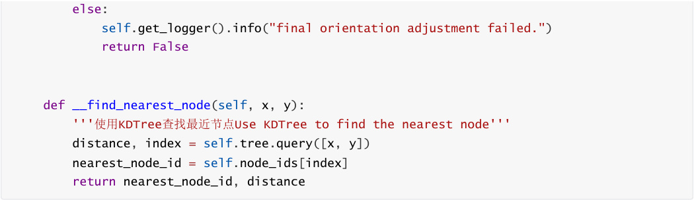


The `__load_roadnet_nodes` method is used during program initialization to parse the **GeoJSON**


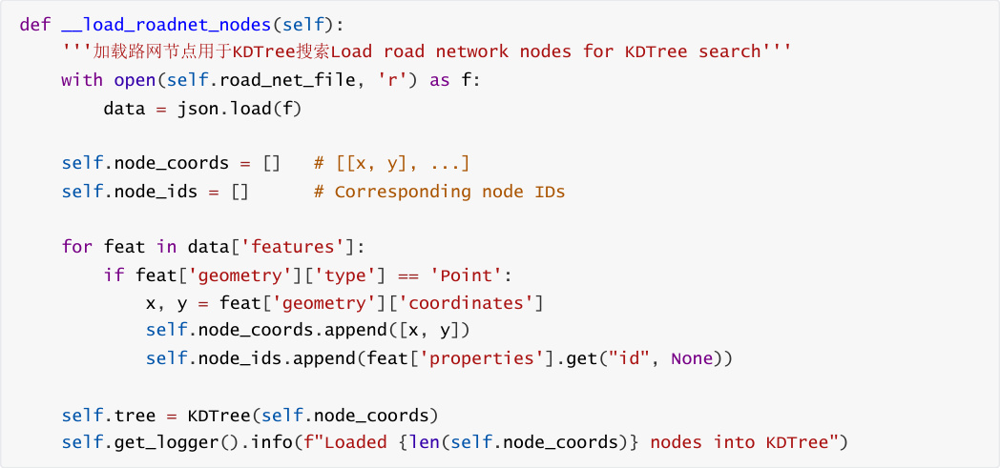
