# Path Re-planning

**Path Re-planning**

1. Course Content

2 Editing the Road Network

3. Running the Path Re-planning Case

### 3.1 Start the Agent

4. Querying Obstacle Cost Threshold

### 4.1 Viewing Obstacle Cost Values

### 4.2 Modifying the Threshold for Triggering Re-planning

5. Source Code Analysis

### 5.1 Obstacle Detection and Re-planning Strategy

### 5.2 Query Map Cost Value Implementation Method

## 1. Course Content


Basic


Run the sample program. Based on the road network planning and navigation, if an obstacle is detected

on the traveling path during operation, re-planning will be triggered to find a new path in the road network.


Advanced


1. Understand the implementation method of re-planning and how to modify re-planning strategies (the

strategy is not unique and can be implemented according to your needs).


2. Adjust the obstacle detection threshold based on the queried cost value.

## 2 Editing the Road Network


To demonstrate the re-planning function, we add some edges to the sample road network from the
## previous course. For the operation tutorial on loading and editing the road network, refer to: 03-Road

**Network Annotation** : **Loading and Modifying Road Network Description** section.


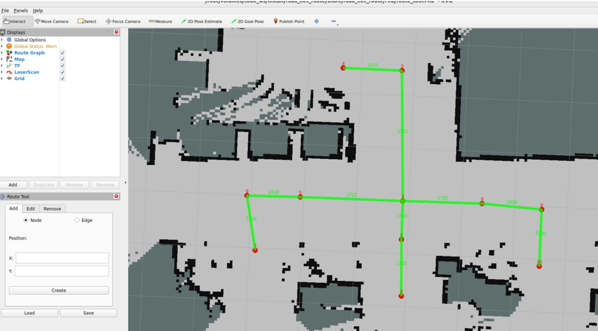

For example, add a bidirectional edge between waypoint 1 and 6


All operations will have corresponding records in the terminal


Then save the file


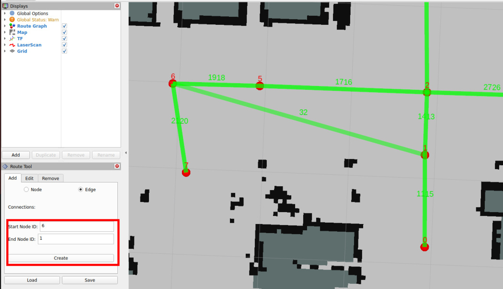
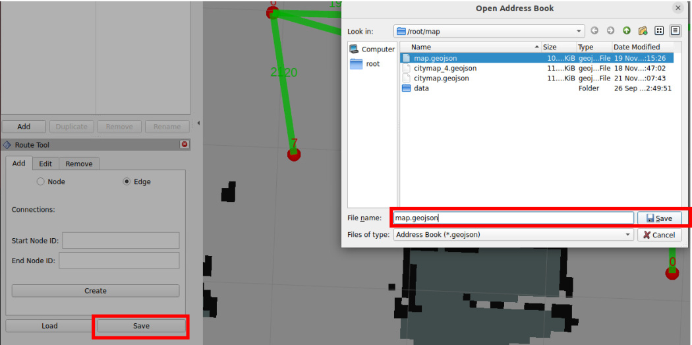
## 3. Running the Path Re-planning Case

### 3.1 Start the Agent

Use the following command to start the microROS agent and connect to the chassis


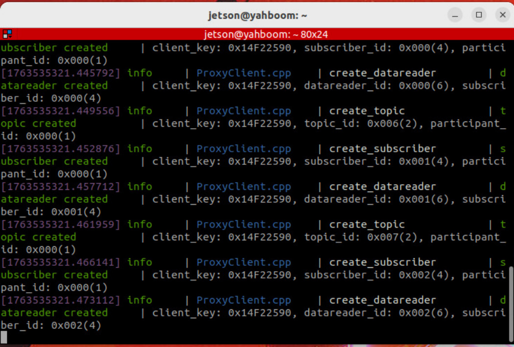
Start the road network container


Open a terminal on the host machine to start the LiDAR fusion node and odometry fusion (PI5 users


Start the road network route planning and navigation node (inside the roadnet container)

```
roadnet bash

```

The test scenario here is: travel from waypoint 8 to waypoint 6 along the road network, then place an

obstacle on the planned path to trigger the re-planning strategy


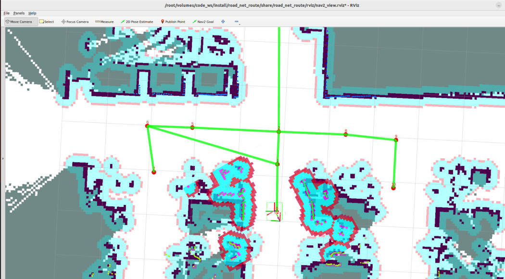


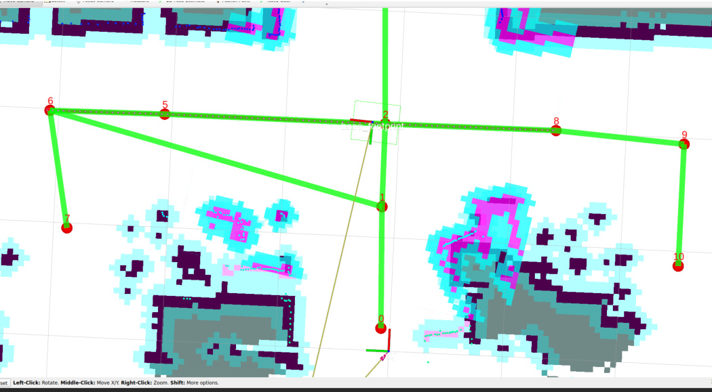

Here you can see the terminal will prompt that there is an obstacle on the path, then trigger re-planning


Here, after detecting an obstacle on the path, the path is impassable, and it retreats back to the

previously passed waypoint 8


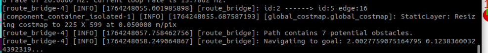

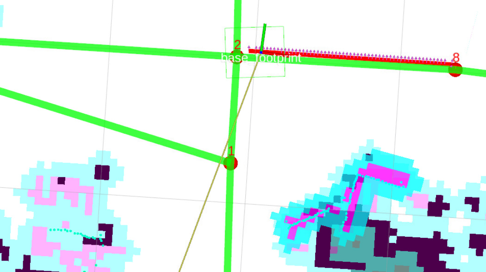
Then from waypoint 8, try to plan a drivable path again and reach the target waypoint 6

## 4. Querying Obstacle Cost Threshold


The obstacle detection on the path is determined by detecting the cost value on the global path and the

number of high-cost points on the global path. The threshold for triggering re-planning can be set by

yourself.


**Note**


The obstacle detection threshold is generally set to the factory default!!!


If there are special scenario requirements, you can refer to this part of the tutorial to adjust the

threshold for triggering re-planning.


The cost value is the value used in the costmap to describe the area occupied by obstacles. The

closer to the obstacle, the higher the cost value.

### 4.1 Viewing Obstacle Cost Values


Click the Publish Point tool, then use the left mouse button to click on the location on the map where

you want to view the cost value.


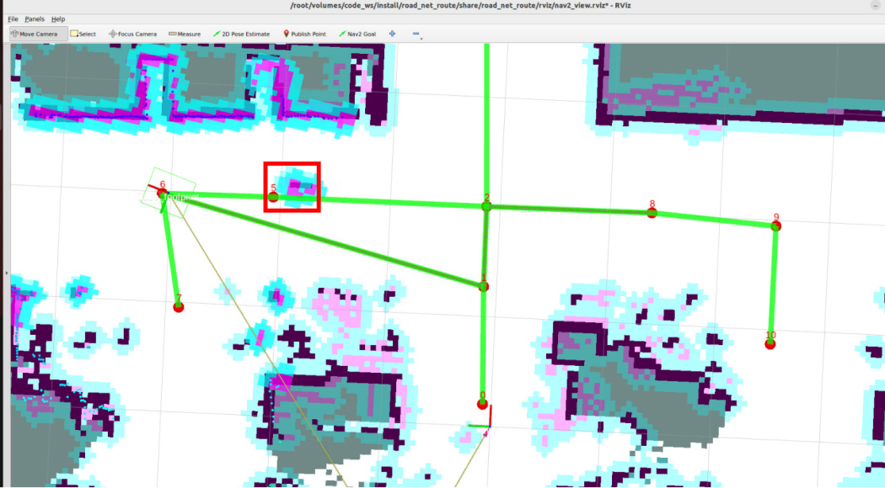
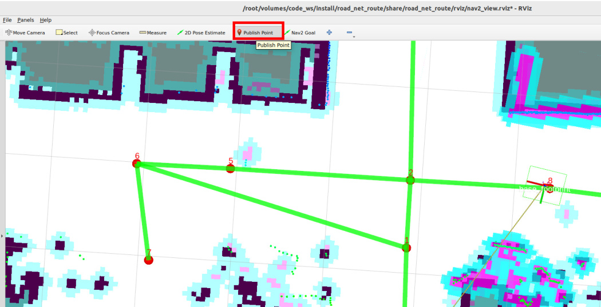

You can see that areas without obstacles have a cost value of 0, and the cost value at the center of the

obstacle is 99-100

### 4.2 Modifying the Threshold for Triggering Re-planning


Configuration file path


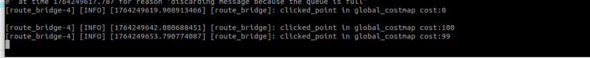


and `PATH_OBSTACLES_THRESHOLD` together determine the triggering threshold.


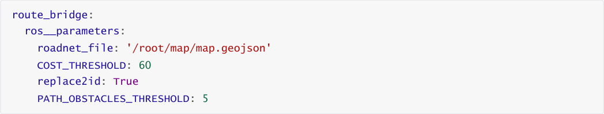


The specific obstacle detection logic is as follows:


which consists of multiple pose points. When performing road network navigation, all pose points on

the global path are checked whether they have high-cost values in the global costmap.


If the cost value of a pose point on the path exceeds the **COST_THRESHOLD**, that point on the


path is marked as a high-cost pose point.

Finally, calculate how many pose points on the global path are high-cost pose points.


If the total number of high-cost pose points is greater than **PATH_OBSTACLES_THRESHOLD**, the

path is considered impassable and re-planning needs to be performed.


**Tip**


If obstacle detection is not sensitive enough, you can increase **COST_THRESHOLD** and

**PATH_OBSTACLES_THRESHOLD** . If it is too sensitive, you can decrease these two values or adjust the

obstacle inflation radius (for modifying the obstacle inflation radius, refer to 04-Road Network Route

Planning and Navigation section 4.1 Navigation Controller Debugging).

## 5. Source Code Analysis


Implementation source code path:

```
 $HOME/M3Pro_ws/RoadNetwork/volumes/code_ws/src/road_net_route/road_net_route/route_bridge.py

### 5.1 Obstacle Detection and Re-planning Strategy

```

Iterate through each pose point of the global path, check whether there are obstacles exceeding the

threshold on the path through the global costmap, and return a boolean value indicating whether the

path is blocked.


map, each grid corresponds to a cost value).


outside the global costmap range, a warning log is printed, and that point is skipped.


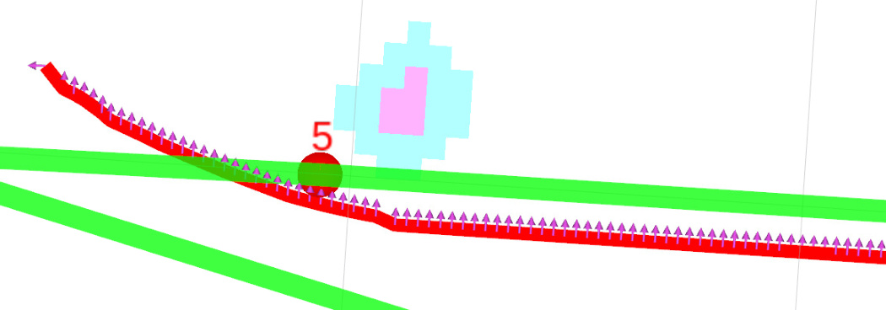
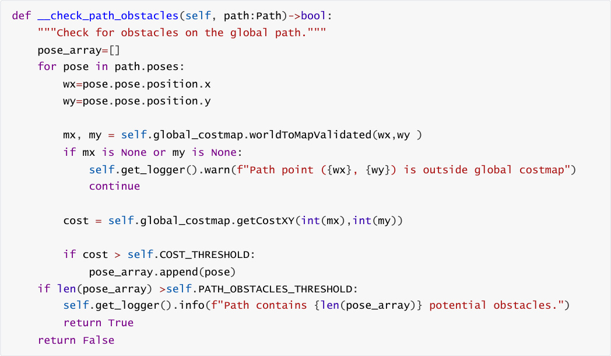


After detecting obstacles on the global path, let the robot **retreat to the previous waypoint** and re
plan the path.


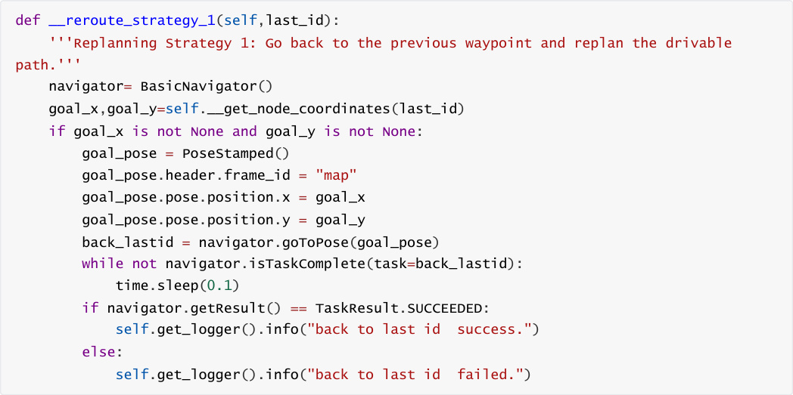


handle_id_navigation and handle_pose_navigation are the core code responsible for road network


planning and navigation. The following parts in these two functions contain the logic for detecting paths

and triggering re-planning.


When the path is detected to be infeasible, call **Re-planning Strategy 1** : let the robot **retreat to the**


navigation task of "retreat to this waypoint" → wait for the task to complete and print the result.

Withdraw the robot from the current obstacle area to a **safe predefined waypoint**, providing a stable

starting point for subsequent path re-planning.


The complete flow is as follows:


1. The robot normally executes path tracking, obtaining navigation feedback in real-time.


2. Check whether there are obstacles in the path from `feedback` :


If no obstacles: continue executing the original path, no processing needed.


If there are obstacles: trigger the re-planning logic.


3. The robot retreats to the previous safe waypoint ( `last_node_id` ).


5. Obtain feedback from the new path and let the robot continue moving while tracking the new

path.


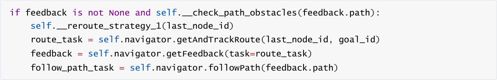


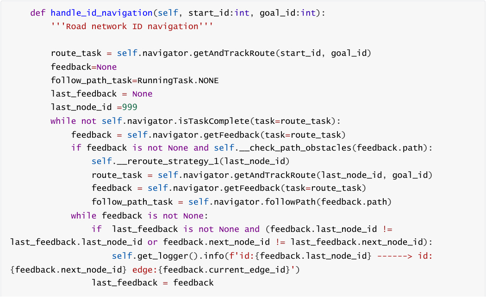


```
          last_node_id=feedback.last_node_id

          if feedback.rerouted :

            self.get_logger().info('reroute a new path to follow!')

            follow_path_task = self.navigator.followPath(feedback.path)

          feedback = self.navigator.getFeedback(task=route_task)

       if self.navigator.isTaskComplete(task=follow_path_task):

          print(follow_path_task)

          self.get_logger().info('Controller completed its task!')

          if follow_path_task != RunningTask.NONE :

            self.navigator.cancelTask()

     result = self.navigator.getResult()

     if result == TaskResult.SUCCEEDED:

       self.get_logger().info(Fore.GREEN+"navigation task completed."+Fore.RESET)

       self.action_feedback_pub.publish(String(data="road_net_nav_succeeded"))

     elif result == TaskResult.CANCELED:

       self.get_logger().warn("Navigation task canceled.")

     elif result == TaskResult.FAILED:

       self.get_logger().error("Navigation task failed.")

       self.action_feedback_pub.publish(String(data="road_net_nav_failed"))

  def handle_pose_navigation(self, goal_pose:PoseStamped):

     '''Arbitrary pose navigation'''

     transform = self.tf_buffer.lookup_transform("map", "base_footprint",

rclpy.time.Time(),rclpy.duration.Duration(seconds=5.0))

     if transform is None:

       self.get_logger().info(Fore.RED+"Failed to get TF transform "+Fore.RESET)

       return

     else:

       start_pose = PoseStamped()

       start_pose.header = transform.header

       start_pose.pose.position.x = transform.transform.translation.x

       start_pose.pose.position.y = transform.transform.translation.y

       start_pose.pose.orientation = transform.transform.rotation

       self.get_logger().info(Fore.CYAN + f"current:

{transform.transform.translation}"+Fore.RESET)

       nearest_start_node_id, nearest_start_distance =

self.__find_nearest_node(start_pose.pose.position.x, start_pose.pose.position.y)

       nearest_goal_node_id, nearest_goal_distance =

self.__find_nearest_node(goal_pose.pose.position.x, goal_pose.pose.position.y)

       if self.replace2id:

          self.get_logger().info(Fore.CYAN + f"nearest_start_node_id:

{nearest_start_node_id}, distance:{nearest_start_distance}"

                      f"\nnearest_goal_node_id:{nearest_goal_node_id},

distance:{nearest_goal_distance}"+Fore.RESET)

          route_task =

self.navigator.getAndTrackRoute(start=nearest_start_node_id,goal=nearest_goal_node_id)

       else:

          route_task =

self.navigator.getAndTrackRoute(start=start_pose,goal=goal_pose,use_start=True)

```

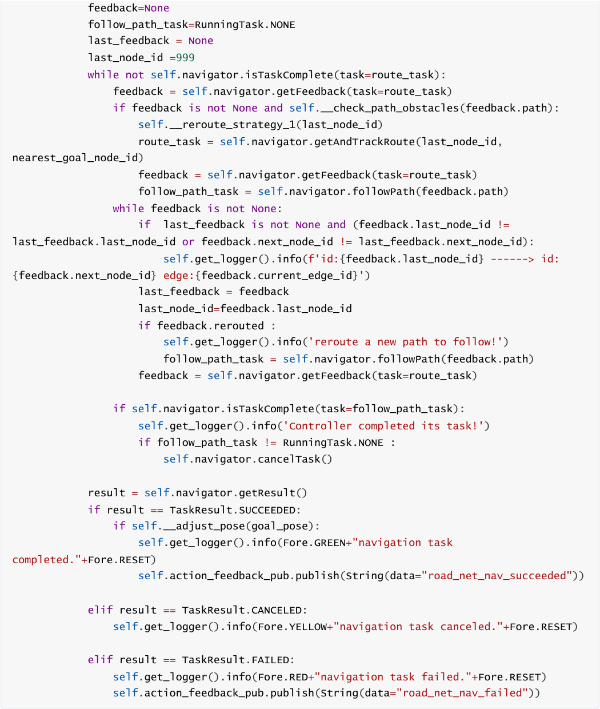


### 5.2 Query Map Cost Value Implementation Method

## The costmap is a 2D grid map (each grid corresponds to a small area in the real world, 0.05m×0.05m).


coordinates (grid coordinates are discrete integers, avoiding errors caused by floating-point input), to

obtain the **cost value** `cost` of that grid.


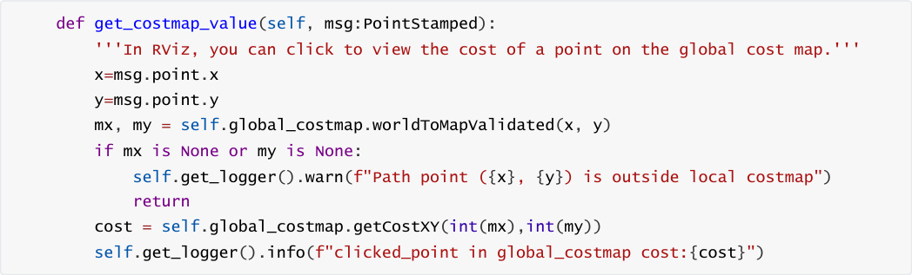
