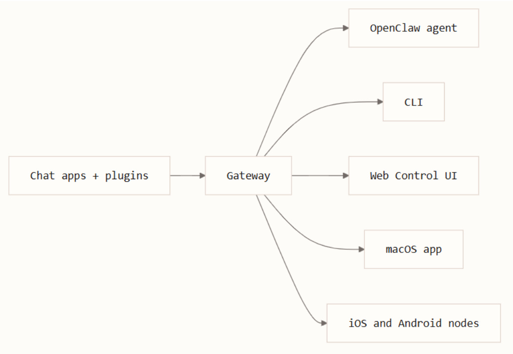
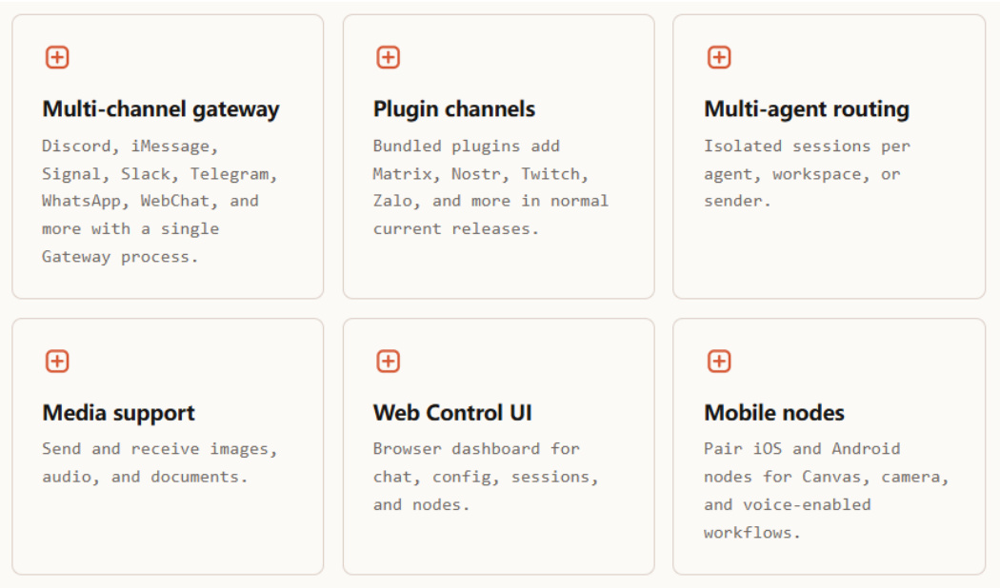

# Introduction to OpenClaw
**Course Overview**

This course will introduce the basic concepts of OpenClaw, helping you quickly understand what OpenClaw is,

its core features, and its unique advantages. Through this course, you will gain a preliminary understanding of

OpenClaw and lay the foundation for further in-depth learning.

**Course Content**

Understand the definition and core value of OpenClaw

Master the key features and characteristics of OpenClaw
## 1. What is OpenClaw
OpenClaw is a **self-hosted gateway** that connects your favorite chat apps and channel surfaces — built-in

channels plus bundled or external channel plugins such as Discord, Google Chat, iMessage, Matrix, Microsoft

Teams, Signal, Slack, Telegram, WhatsApp, Zalo, and more — to AI coding agents. You run a single Gateway

process on your own machine (or a server), and it becomes the bridge between your messaging apps and an

always-available AI assistant.

## 2. Core Features
**Multi-channel Support** : A single Gateway can connect to multiple chat channels simultaneously

**Session Management** : Creates independent sessions for each sender, maintaining coherent context

**Agent-native** : Specifically designed for coding agents, supporting tool usage, sessions, memory, and

multi-agent routing

**Self-hosted** : Runs on local hardware, with full control over your data

## 3. Unique Advantages
|Feature|Description|
|---|---|
|Self-hosted|runs on your hardware, your rules|
|Multi- channel|one Gateway serves built-in channels plus bundled or external channel plugins simultaneously|
|Agent-native|built for coding agents with tool use, sessions, memory, and multi-agent routing|

## 4. Summary
OpenClaw provides developers and advanced users with a convenient, secure, and controllable way to use AI

assistants. By connecting various chat channels, it makes it possible to communicate with AI agents anytime

and anywhere, while maintaining complete control over your data.
