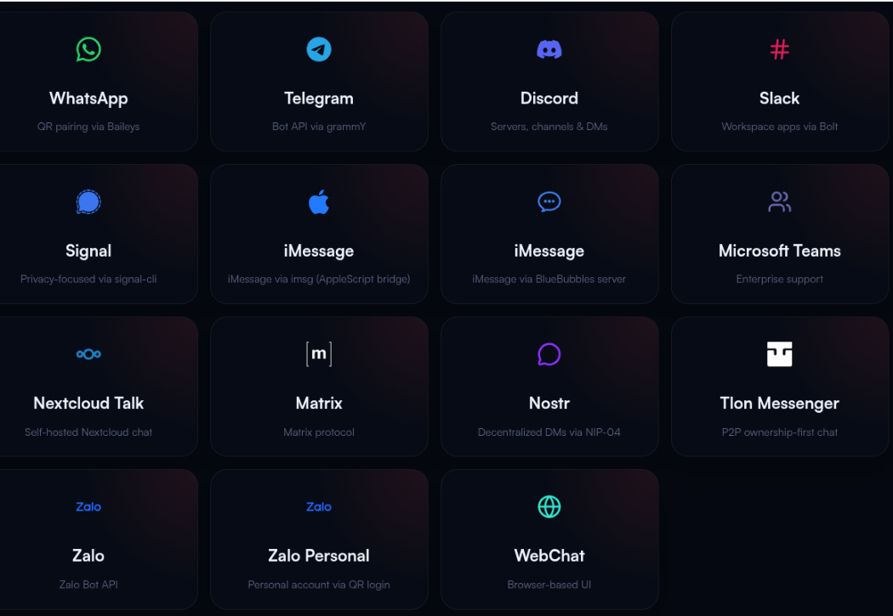
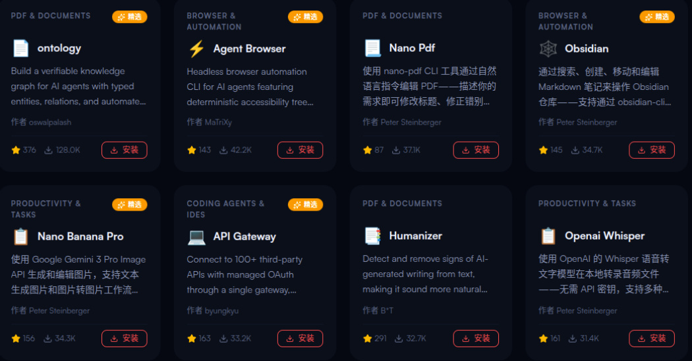
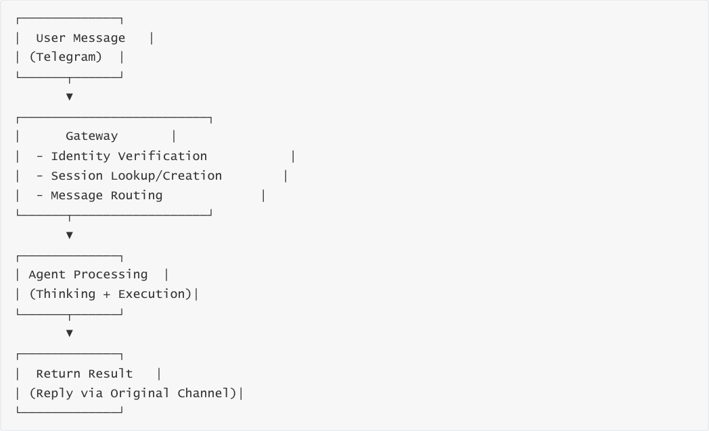

# OpenClaw Core Concepts
**OpenClaw Core Concepts**

2. Course Content

3. Core Concepts

### 3.1 Chat Channels

### 3.2 Agent

### 3.3 Sessions and Memory

### 3.4 Tools

### 3.5 Skills

### 3.6 Models

### 3.7 Gateway Architecture

4. Core Concepts Relationship Diagram

5. Chapter Summary

## 2. Course Content
This chapter will systematically explain the seven core concepts of OpenClaw:

1. **Chat Channels**   - The platform for communication between AI and users

2. **Agent**   - The core brain of the AI agent

3. **Sessions and Memory**   - Context management capabilities

4. **Tools**   - The hands and feet that execute specific operations

5. **Skills**   - Encapsulated functional modules

6. **Models**   - The engine that drives AI thinking

7. **Gateway**   - The nervous system hub of the system

## 3. Core Concepts
### 3.1 Chat Channels
**What are chat channels?**

Chat channels are communication platforms for user interaction with AI Agents. You can think of them as the

AI employee's "desk" or "workplace".

**Supported channel types:**

|Channel Type|Representative Platforms|
|---|---|
|Instant Messaging|Slack、Discord、Microsoft Teams|
|Social Apps|Telegram、WhatsApp、Signal|
|Web Interface|WebChat、REST API|

**Core characteristics of channels:**

**Plug and Play**    - Enable required channels without redeployment

**Many-to-Many Binding**   - One channel can connect to multiple Agents, and one Agent can serve

multiple channels

### 3.2 Agent
The Agent is the core decision-making unit of OpenClaw. You can think of it as your "virtual employee" or

"brain". Each Agent has independent:

**Persona Prompt**   - Defines the AI's behavioral style and role positioning

**Model Selection**    - Determines which LLM to use (such as GPT-4, Claude, etc.)

**Channel Binding**    - Specifies which platforms to work on

**Key Features:**

**Multi-Agent Parallel**    - A single OpenClaw instance can run multiple Agents

**Role Isolation**    - Different Agents do not interfere with each other, with independent configuration

### 3.3 Sessions and Memory
**Why is memory needed?**

The session and memory system allows AI to remember context and provide coherent conversational

experiences.

**OpenClaw's three-tier memory architecture:**

**Short-term Memory**

Storage format: Daily log files ( `memory/yyyy-mm-dd.md` )

Retention period: Recent 1-2 days of conversation

Use: Processing context of current tasks

**Near-term Memory**

Management method: Sliding window compression, preserving complete session archives

Use: Multi-round conversation context tracking

**Long-term Memory**

Storage content: User preferences, important decisions, historical experiences

Use: Achieving personalized intelligence and continuous learning

### 3.4 Tools
**What are tools?**

Tools are the "hands, feet, and senses" through which Agents interact with the external world, enabling AI to

execute actual operations. If the LLM is the brain, then tools are the limbs attached to that brain.

**Built-in OpenClaw tools:**

|Tool Type|Function Description|Use Cases|
|---|---|---|
|File System|Read/write files, create directories, search content|Document processing, data organization|
|Network Requests|HTTP API calls, Webhook triggers|Third-party service integration|
|Shell Commands|Execute system commands, run scripts|Automated operations, batch processing|
|Scheduled Tasks|Cron scheduling, periodic execution|Scheduled backups, daily report sending|

**Tool execution flow:**

### 3.5 Skills
**Skills vs Tools: What's the difference?**

**Tools (Tool)** are basic capabilities, such as "open file", "click mouse"

**Skills** are encapsulated business logic, such as "robotic arm grasping objects", "navigating to a certain

location"

**Analogy for Skills:**

If we compare an Agent to a robot:

**Agent** = Robot's brain (responsible for thinking and decision-making)

**Tools** = Robot's hands and feet (responsible for executing basic actions)

**Skills** = Robot's training manual (tells the robot how to complete specific work)

**Core characteristics of Skills:**

**Atomicity**    - A skill does only one thing (e.g., "grasp object")

**Non-decision**    - Skills execute passively, without deciding "whether to do"

**Standardization**    - Follows OpenClaw specifications, can be reused across scenarios

**Pluggable**    - Install/uninstall at any time

**Skill Sources:**

**ClawHub**   - Community-maintained skill marketplace

**Custom Skills**    - Developer-written (Markdown or TypeScript)

### 3.6 Models
**What are connected models?**

Models are large language models (LLMs) that drive Agent thinking. They are the "intelligence engine" of AI.

OpenClaw itself does not train models but serves as an "intermediate layer" connecting various LLM providers.

**Model roles:**

**Understanding Intent**    - Parse natural language user input

**Task Planning**    - Break down complex goals into executable steps

**Tool Selection**    - Decide which tool or skill to invoke

**Self-correction**    - Adjust strategy based on execution results

**Supported model providers:**

|Provider|Representative Models|Characteristics|
|---|---|---|
|**OpenAI**|GPT-4o、GPT-4 Turbo|Strong comprehensive ability, complete ecosystem|
|**Anthropic**|Claude 3.5、Claude Sonnet|Excellent long-text processing, high security|
|**Google**|Gemini Pro、Gemini Ultra|Strong multimodal capability|
|**Mistral**|Mistral Large、Mixtral|Open-source models, high cost-effectiveness|
|**Ollama**|Llama 3、Qwen, etc.|Local deployment, privacy protection|
|**Others**|Any OpenAI-compatible interface|Custom model integration|

### 3.7 Gateway Architecture
**What is the Gateway?**

The Gateway is OpenClaw's "nervous system hub" and "commander", a long-running background service. It

uniformly manages connections of all communication channels and coordinates communication between

Agents, clients, and nodes.

**Core responsibilities of the Gateway:**

**Message Routing**

Receives messages from 50+ channels (WhatsApp, Telegram, Slack, etc.)

Verifies user identity and permissions

Distributes to corresponding Agents based on session ID

**Session Management**

Maintains the state of all sessions

Supports "explicitly parallel, default serial" processing

Heartbeat detection and automatic retry

**Task Scheduling**

Scheduled task triggers (Cron)

Load balancing and failover

Performance monitoring and logging

**Gateway workflow:**

## 4. Core Concepts Relationship Diagram
**One-sentence summary of each concept's positioning:**

|Concept|Analogy|Core Function|
|---|---|---|
|Chat Channels|Office/Desk|User interaction entry|
|Agent|Virtual Employee/Brain|Decision and planning|
|Sessions and Memory|Work notes/Experience|Context management|
|Tools|Hands, feet, and senses|Basic execution capability|
|Skills|Training manual|Encapsulated business logic and processes|
|Models|Intelligence engine|Thinking and reasoning|

|Concept|Analogy|Core Function|
|---|---|---|
|Gateway|Nervous system hub|Scheduling and coordination|

## 5. Chapter Summary
OpenClaw is a local-first AI Agent operating system, not a simple chatbot

The role positioning and relationships of the seven core concepts

Hierarchical architecture design of channels, Agents, skills, and tools

Supported model providers and selection strategies

The key role of Gateway as the system hub
