# OpenClaw API-KEY Configuration
**OpenClaw API-KEY Configuration**

1. Course Overview

### 1.1 Course Content

2. API-KEY Application

### 2.1 Recommended Model Service Providers

3. Configuring OpenClaw API-KEY

### 3.1 Configuration Methods

### 3.2 Quick Configuration

#### 3.2.1 Configure baseUrl

#### 3.2.2 Fill in apiKey

4. Viewing Connected Model Status

### 4.1 View Configured Model List

### 4.2 Verify Configuration Success

5. Other Connection Methods (Advanced)

### 5.1 CLI Command Configuration API-KEY (Suitable for Beginners)

### 5.2 Modify Configuration File (Recommended Method)

Configuration File Location

Edit Configuration File

6. Common Issues and Solutions

### 6.1 Invalid API-KEY or Error

### 6.2 Cannot Access Model Service

7. Course Summary

## 1. Course Overview
This course will detail how to configure API-KEYs for AI models in OpenClaw, including the API-KEY application

process, two configuration methods (CLI command configuration and configuration file modification), and how

to verify if the configuration is successful. After completing this course, you will be able to successfully connect

and use various AI model service providers.

### 1.1 Course Content
Understand the types of model service providers supported by OpenClaw


Master the API-KEY application method


Learn how to view and verify the status of connected models
## 2. API-KEY Application
### 2.1 Recommended Model Service Providers
Refer to the accompanying tutorial [2. AI Large Model Development] — [01-Register for model service

provider account] for API-KEY application reference


OpenClaw supports many model service providers, including:


**OpenAI**      - GPT series (API + Codex)


**Anthropic**      - Claude series (API + Claude Code)


**Google**      - Gemini series


**Alibaba Cloud**       - Qwen Cloud, Tongyi Qianwen


**DeepSeek**      - DeepSeek models


**Zhipu AI**       - GLM models


**Moonshot**      - Kimi + Kimi Coding


**Ollama**      - Local models (Cloud + Local)


And many other service providers

You can freely choose a model service provider based on your actual needs and local network policies,

and register and apply for an API-KEY on the corresponding official website
## 3. Configuring OpenClaw API-KEY
### 3.1 Configuration Methods
OpenClaw provides two methods to configure API-KEY:


1. **CLI Command Configuration** (Suitable for beginners)


2. **Direct Configuration File Modification** (Suitable for developers)

### 3.2 Quick Configuration
Suitable for users who want to quickly get started and experience the service. You need to first register

for an Alibaba Cloud Bailian large model account and create an API-KEY (refer to the accompanying

tutorial [12.AI Model Development] — [01.Register a model service provider account])


The factory preset configuration file has already configured the Bailian model parameters. Simply fill in

the API-KEY to use it directly


Open the OpenClaw configuration file:


#### 3.2.1 Configure baseUrl
**Users in mainland China do not need to modify this, skip this step** . Users in overseas regions

should select the corresponding baseUrl based on their service region (go to the [Alibaba Cloud Bailian](https://bailian.console.aliyun.com/)

[console](https://bailian.console.aliyun.com/) homepage, switch to the target region in the upper right corner of the page, such as **Singapore**,


then select **API Key** in the left navigation bar to create an API Key)


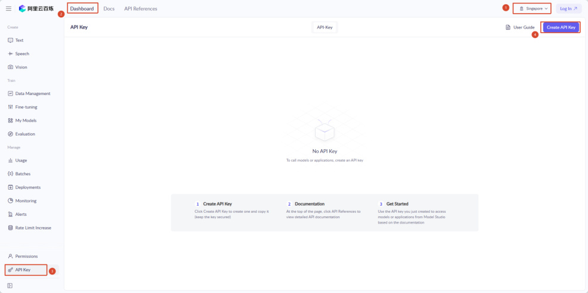

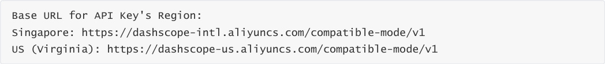
#### 3.2.2 Fill in apiKey
## 4. Viewing Connected Model Status
### 4.1 View Configured Model List
After configuration, you can use the following command to view the connected models:


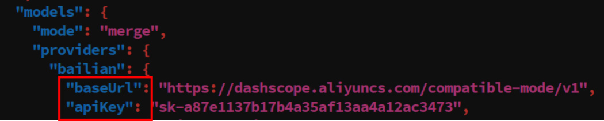


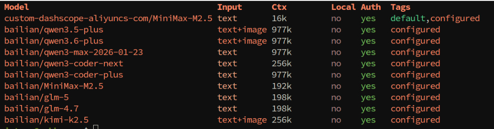
### 4.2 Verify Configuration Success
1. **Test Conversation**


Start the TUI interface and send a test message (such as "Hello") to confirm the model can respond

normally.

## 5. Other Connection Methods (Advanced)
If you have your own model provider or need to connect additional model providers later, refer to the

following tutorials

### 5.1 CLI Command Configuration API-KEY (Suitable for Beginners)
1. **Start Configuration Wizard**


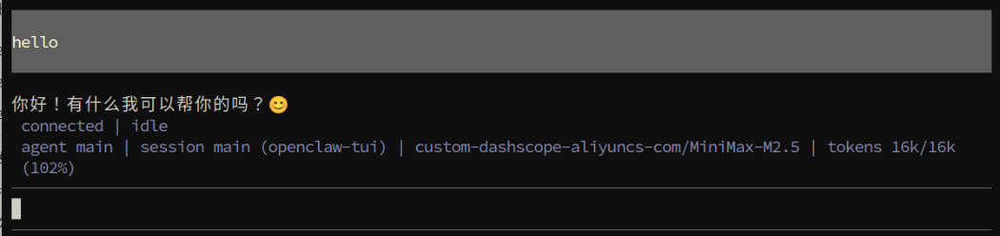


Select 【Yes】 and press Enter


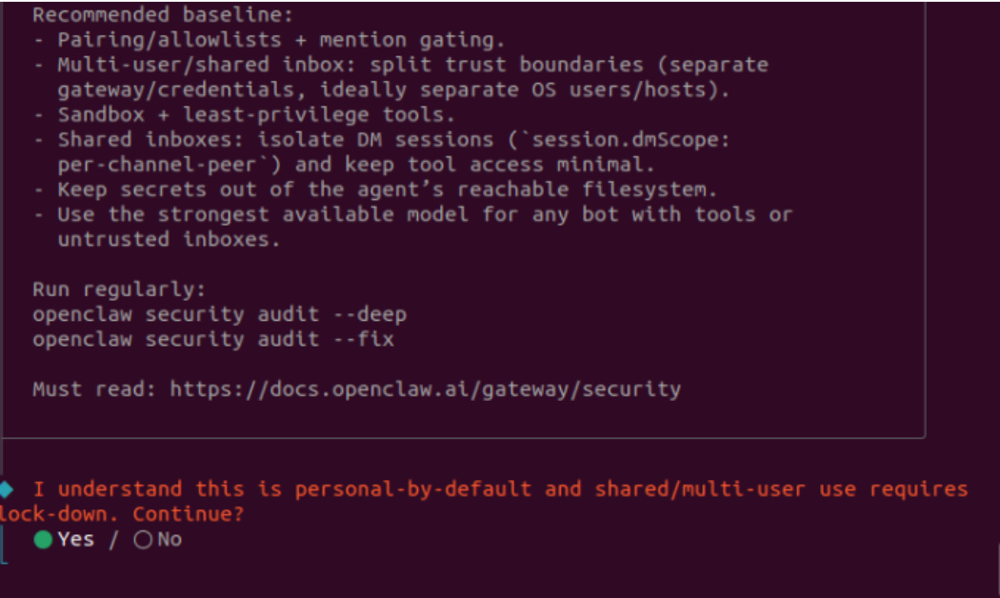

Select QuickStart for configuration mode and press Enter


2. **Select Model Service Provider**


Use the up and down arrow keys to select the service provider for which you have applied for an

API-KEY, and press Enter to confirm. Here, we take the Alibaba Cloud Bailian model provider as an

example. The configuration method for other model providers is the same.


Here, select custom provider **【Custom Provider】**


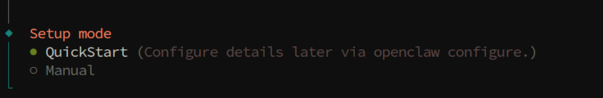

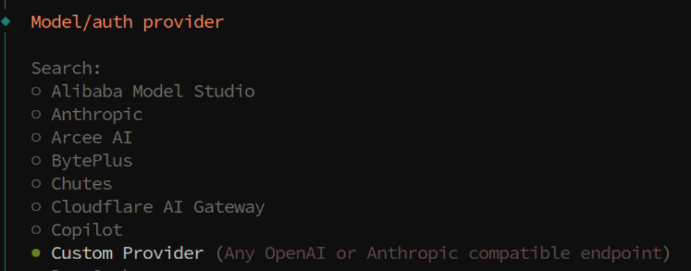
Fill in the base_url of the model provider


3. Enter API-KEY


After selecting a service provider, the system will prompt you to enter the corresponding API-KEY


Paste or enter your applied API-KEY and press Enter to confirm


Select **OpenAI-compatible** for the interface protocol


4. Fill in the model name. Here, we take MiniMax as an example


**Endpoint ID** is the model provider identifier and can be freely filled in


Leave **Model alias (optional)** blank


5. **Other Configuration**


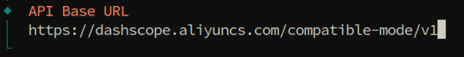

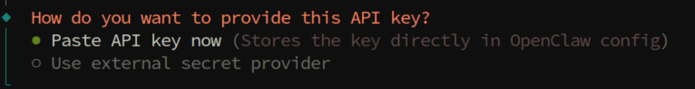

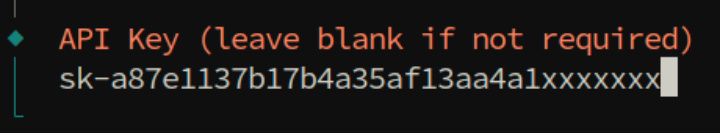

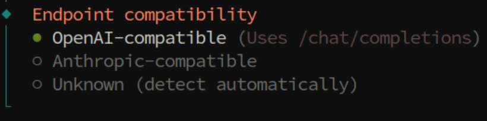


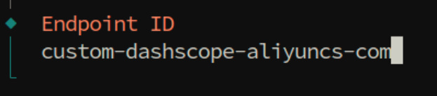

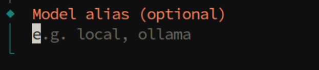
For other configuration items, select skip as shown in the figure below. No configuration needed.


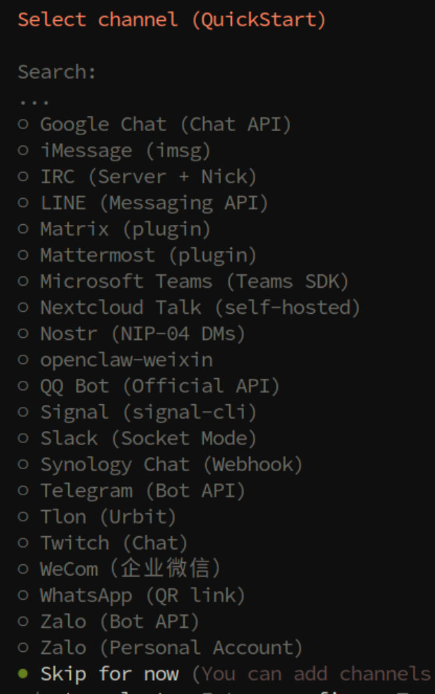

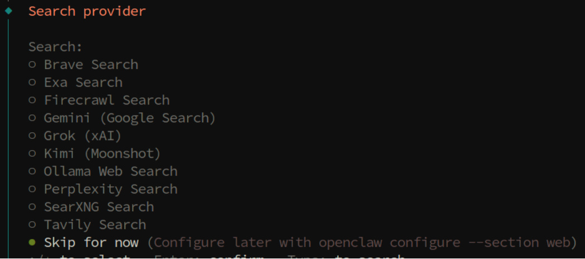
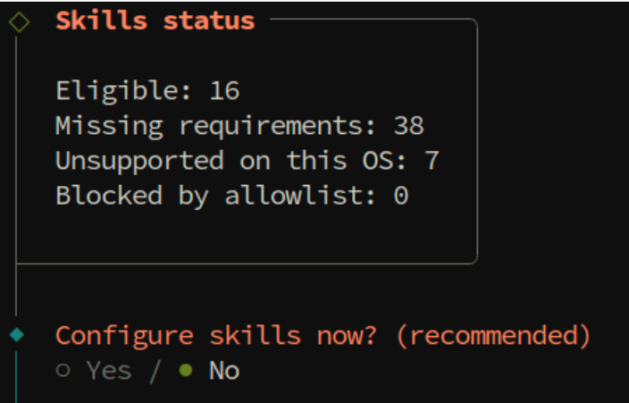

Press space to select **Skip for now** for Enable Hooks


Select Restart to restart the gateway and apply the configuration

### 5.2 Modify Configuration File (Recommended Method)
**Configuration File Location**


The configuration file is located at: `$HOME/.openclaw/openclaw.json`


**Edit Configuration File**


1. **Add Model Provider Configuration**


Add or modify the `models.providers` section in the configuration file:


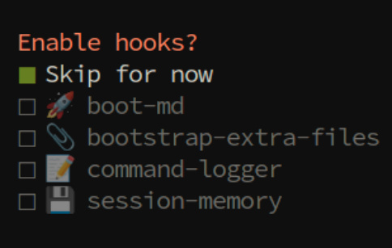

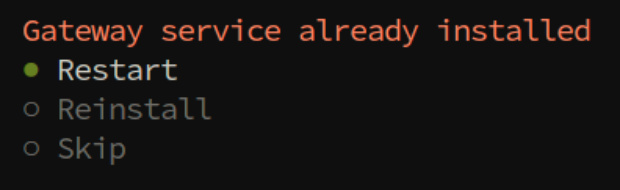
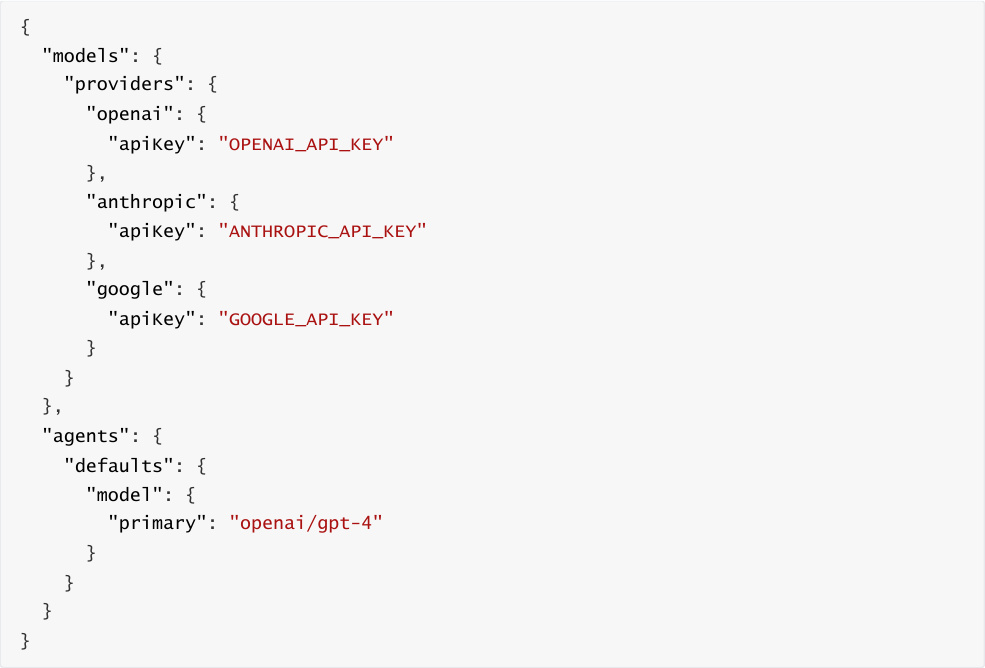


3. **Configuration Notes**


`models.providers` : Configure API-KEYs for various model service providers


4. **Save and Exit**


5. **Factory Default Bailian Configuration (Can be directly modified or referenced)**


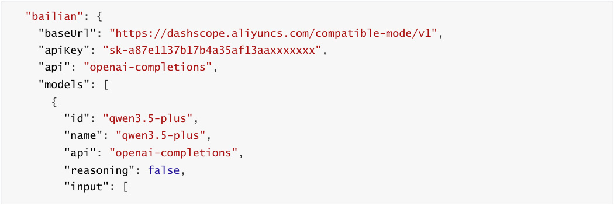


```
      "text",

      "image"

],

     "cost": {

      "input": 0,

      "output": 0,

      "cacheRead": 0,

      "cacheWrite": 0

},

     "contextWindow": 1000000,

     "maxTokens": 65536

},

{

     "id": "qwen3.6-plus",

     "name": "qwen3.6-plus",

     "api": "openai-completions",

     "reasoning": false,

     "input": [

      "text",

      "image"

],

     "cost": {

      "input": 0,

      "output": 0,

      "cacheRead": 0,

      "cacheWrite": 0

},

     "contextWindow": 1000000,

     "maxTokens": 65536

},

{

     "id": "qwen3-coder-next",

     "name": "qwen3-coder-next",

     "api": "openai-completions",

     "reasoning": false,

     "input": [

      "text"

],

     "cost": {

      "input": 0,

      "output": 0,

      "cacheRead": 0,

      "cacheWrite": 0

},

     "contextWindow": 262144,

     "maxTokens": 65536

},

{

     "id": "MiniMax-M2.5",

     "name": "MiniMax-M2.5",

     "api": "openai-completions",

     "reasoning": false,

     "input": [

```

```
      "text"

],

     "cost": {

      "input": 0,

      "output": 0,

      "cacheRead": 0,

      "cacheWrite": 0

},

     "contextWindow": 196608,

     "maxTokens": 32768

},

{

     "id": "glm-5",

     "name": "glm-5",

     "api": "openai-completions",

     "reasoning": false,

     "input": [

      "text"

],

     "cost": {

      "input": 0,

      "output": 0,

      "cacheRead": 0,

      "cacheWrite": 0

},

     "contextWindow": 202752,

     "maxTokens": 16384,

     "compat": {

      "thinkingFormat": "qwen"

}

},

{

     "id": "glm-4.7",

     "name": "glm-4.7",

     "api": "openai-completions",

     "reasoning": false,

     "input": [

      "text"

],

     "cost": {

      "input": 0,

      "output": 0,

      "cacheRead": 0,

      "cacheWrite": 0

},

     "contextWindow": 202752,

     "maxTokens": 16384,

     "compat": {

      "thinkingFormat": "qwen"

}

},

{

     "id": "kimi-k2.5",

```

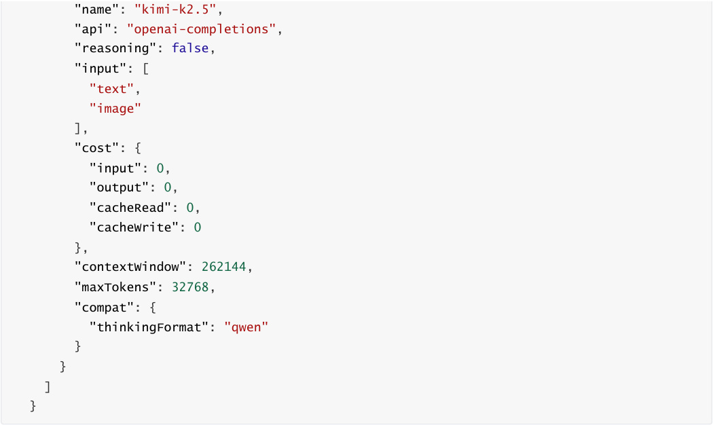


## 6. Common Issues and Solutions
### 6.1 Invalid API-KEY or Error
**Problem** : Prompt showing API-KEY is invalid or authentication failed after configuration


**Solution** :


1. Confirm whether the API-KEY is correct (be careful not to have extra spaces)


2. Check if the API-KEY has expired or been disabled


3. Confirm if the account balance is sufficient (some service providers require prepaid balance)

### 6.2 Cannot Access Model Service
**Problem** : Cannot connect to model service even with correct configuration


**Solution** :


1. Check if the network connection is normal


2. Confirm if the network in your area can access the service provider (some services may require special

network configuration)


3. Try switching to another model service provider for testing
## 7. Course Summary
Through this course, you have mastered:


✅ Types of model service providers supported by OpenClaw

✅ API-KEY application methods and precautions

✅ CLI command configuration method (suitable for beginners)

✅ Configuration file modification method (suitable for developers)

✅ Methods for viewing and verifying model configuration status

✅ Troubleshooting and solutions for common issues
