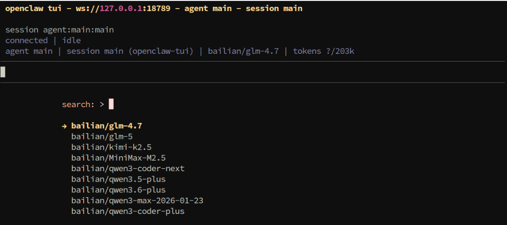
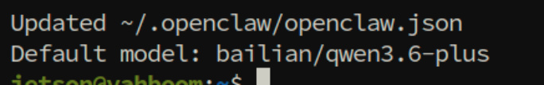
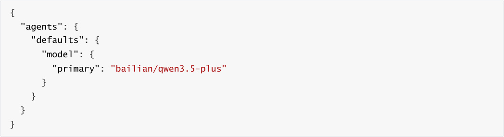
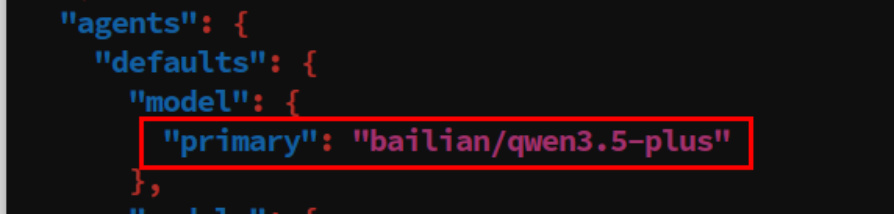
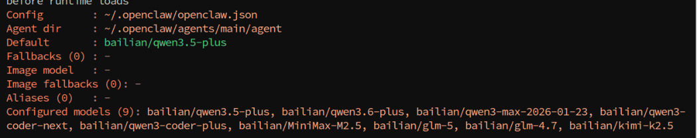
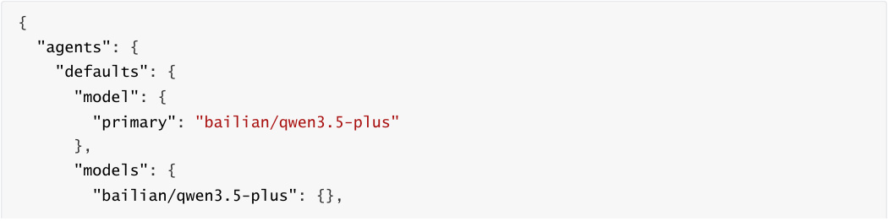
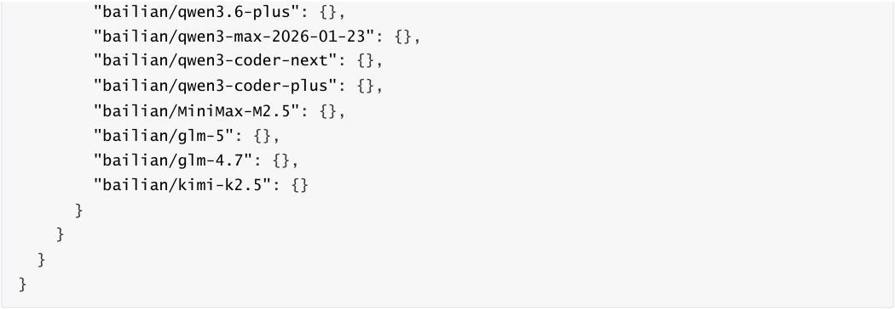
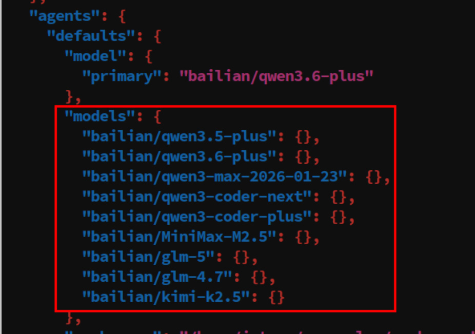
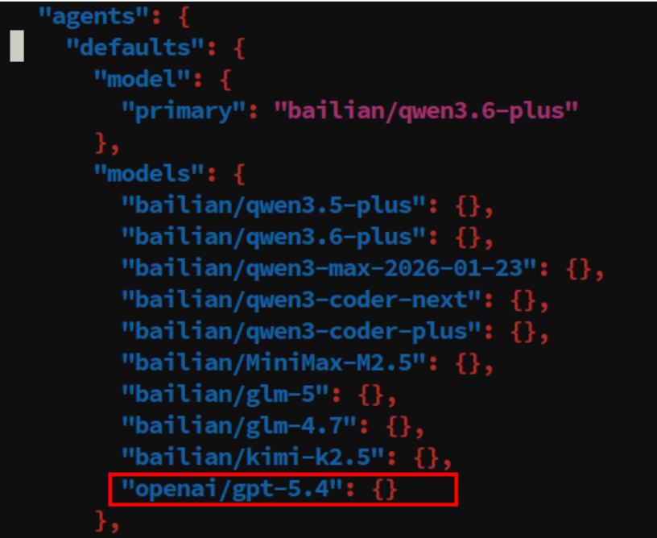

# OpenClaw Switch Models
**OpenClaw Switch Models**

1. Course Content

2. Temporarily Switch Session Model

### 2.1 Open TUI Session

### 2.2 Use /model to Switch Session Model

3. Switch Default Model

### 3.1 Switch via CLI

### 3.2 Switch via Configuration File

4. Add Model Options List

### 4.1 Add Models via Configuration File

### 4.2 Add Models via CLI Command

### 4.3 Model Reference Format Specification

5. Appendix: CLI Command Quick Reference

## 1. Course Content
This course will systematically introduce OpenClaw's model selection working mechanism and three model

switching operation methods.
## 2. Temporarily Switch Session Model
### 2.1 Open TUI Session
Enter in terminal


### 2.2 Use /model to Switch Session Model
|Command|Description|
|---|---|
|`/model`|View available model list, select and switch model|


the up and down arrow keys on the keyboard to select a model, then press Enter



## 3. Switch Default Model
### 3.1 Switch via CLI
The simplest way is to use the CLI command to set the default model directly:


Here, take switching to `bailian/qwen3.6-plus` model as an example

```
 openclaw models set bailian/qwen3.6-plus

### 3.2 Switch via Configuration File
```

configuration item:








Verify if the configuration takes effect:



## 4. Add Model Options List
OpenClaw. When this configuration item is set, users can only use models included in the list. This list

### 4.1 Add Models via Configuration File







### 4.2 Add Models via CLI Command
file:


**Parameter Description** :


`--merge` : Merge mode, merging new configuration with existing configuration instead of

completely overwriting



### 4.3 Model Reference Format Specification
In OpenClaw, all model references use a unified format:


Examples:

|Model Reference|Description|
|---|---|
|`anthropic/claude-opus-4-6`|Anthropic's Claude Opus model|
|`anthropic/claude-sonnet-4-6`|Anthropic's Claude Sonnet model|
|`openai/gpt-5.4`|OpenAI's GPT-5.4 model|
|`openrouter/moonshotai/kimi-k2`|Case where the model ID itself contains a slash|


reference in the format `openrouter/moonshotai/kimi-k2` .


## 5. Appendix: CLI Command Quick Reference
|Command|Purpose|
|---|---|
|`openclaw onboard`|Beginner guide, helping to quickly<br>complete initial configuration|
|`openclaw models list`|View all configured model lists|
|`openclaw models status`|View current model configuration status<br>details|
|`openclaw config set agents.defaults.models '<json>'`<br>`--strict-json --merge`|Safely add models to the allowlist|
|`/model`|View available model list in chat|
|`/model status`|View current model status details in chat|
