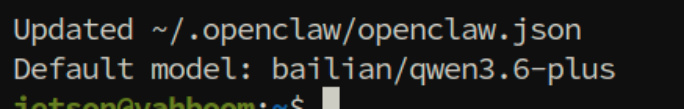
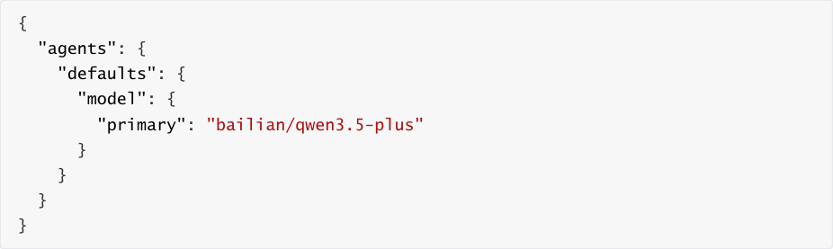
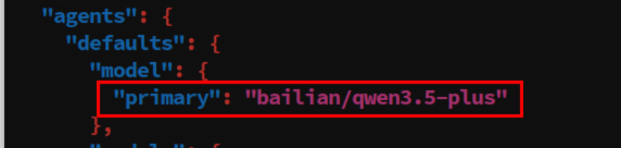
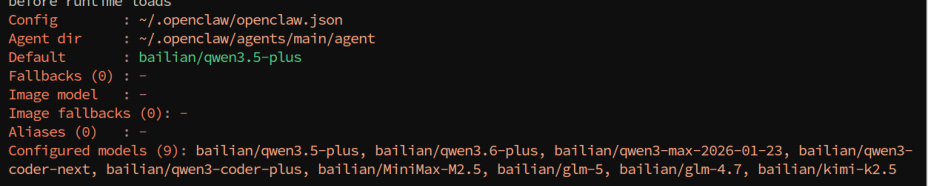
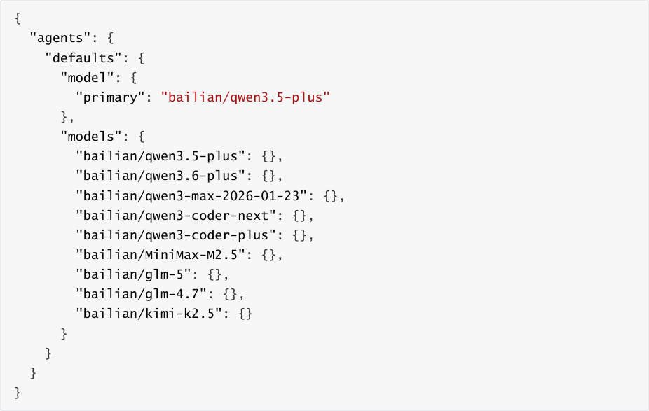
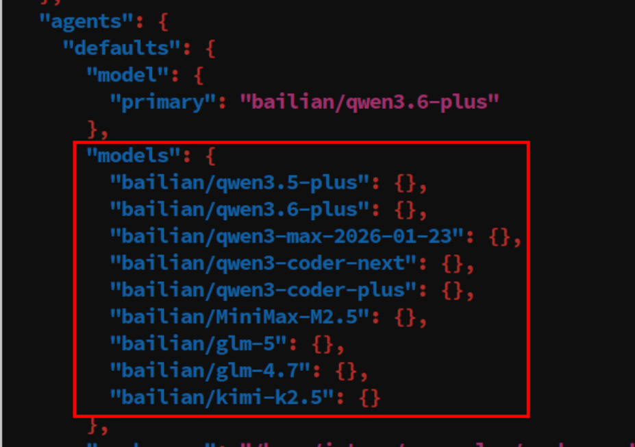
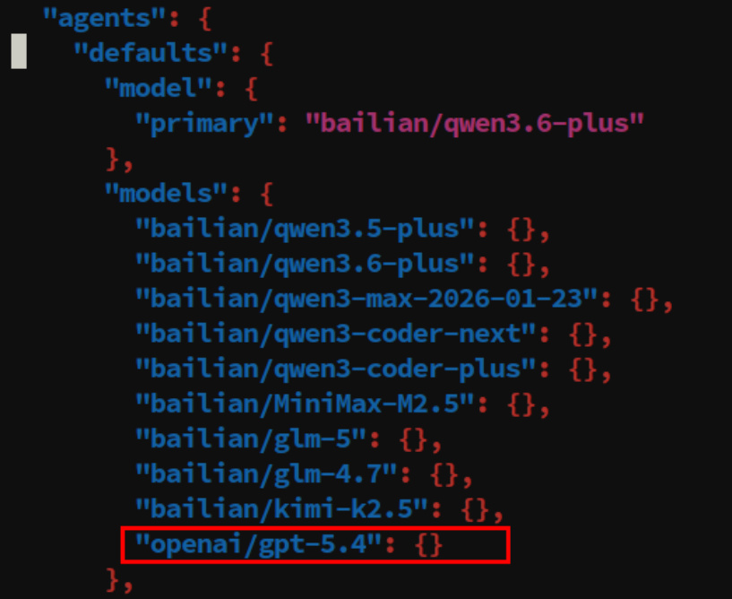

# OpenClaw Switch Models
**OpenClaw Switch Models**

1. Course Content

2. Temporarily Switch Session Model

### 2.1 Open TUI Session

### 2.2 Use /model to Switch Session Model

3. Switch Default Model

### 3.1 Switch via CLI

### 3.2 Switch via Configuration File

4. Add Model Option List

### 4.1 Add Models via Configuration File

### 4.2 Add Agent Model List via CLI Command

### 4.3 Model Reference Format Specification

5. Appendix: CLI Command Quick Reference

## 1. Course Content
This course systematically introduces OpenClaw's model selection working mechanism and three

model switching operation methods.
## 2. Temporarily Switch Session Model
### 2.1 Open TUI Session
Enter in terminal

### 2.2 Use /model to Switch Session Model
|Command|Description|
|---|---|
|`/model`|View available model list, select and switch models|

`plus`, use the up/down arrow keys to select the model, then press Enter

## 3. Switch Default Model
### 3.1 Switch via CLI
The simplest way is to use the CLI command to directly set the default model:

### 3.2 Switch via Configuration File

Verify if the configuration has taken effect:

## 4. Add Model Option List
available models. Once this configuration item is set, users can only use models included in

command and session overrides.

### 4.1 Add Models via Configuration File
allow list:

### 4.2 Add Agent Model List via CLI Command
the JSON file:

### 4.3 Model Reference Format Specification
In OpenClaw, all model references use a unified format:

Examples:

|Model Reference|Description|
|---|---|
|`anthropic/claude`-`opus`-`4`-`6`|Anthropic Claude Opus model|
|`anthropic/claude`-`sonnet`-`4`-`6`|Anthropic Claude Sonnet model|
|`openai/gpt`-`5.4`|OpenAI GPT-5.4 model|
|`openrouter/moonshotai/kimi`-`k2`|Case where the model ID itself contains a slash|

`openrouter/moonshotai/kimi`  - `k2` format must be provided for the reference.

## 5. Appendix: CLI Command Quick Reference
|Command|Usage|
|---|---|
|`openclaw onboard`|New user guide, helps quickly complete initial configuration|
|`openclaw models list`|View all configured model lists|
|`openclaw models status`|View current model configuration status details|
|`openclaw config set` `agents.defaults.models '<json>'`|Safely add models to the allow list|
|`/model`|View available model list in chat|
|`/model status`|View current model status details in chat|
