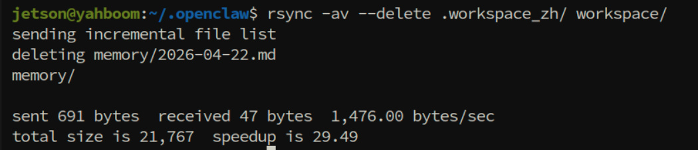
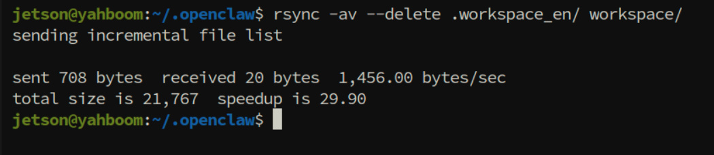

# OpenClaw System Prompt Words
**OpenClaw System Prompt Words**

1. Course Content

Course Overview

2. 📂 Switch Workspace

3. AGENTS.md

4. SOUL.md

5. IDENTITY.md

6. HEARTBEAT.md

7. 🛠️ TOOLS.md

8. 👤 USER.md

9. 🧠 MEMORY.md

## 1. Course Content
**Course Overview**

💡 OpenClaw adopts an innovative **"file as prompt"** architecture — the behavior, identity, memory, tool

usage rules, etc. of AI Agents are all defined and loaded through multiple Markdown files in the

Workspace.

📂
## 2.  Switch Workspace
OpenClaw's system prompt words and skills are stored in the workspace path:

ROSMASTER-M3Pro has factory-preset Chinese and English workspace content with the same meaning

but different languages

Users in different regions can switch the language of OpenClaw workspace documents according to

their needs

Chinese Workspace (prompt words and skills content in Chinese)

English Workspace (prompt words and skills content in English)

After configuration, restart the OpenClaw gateway to take effect

**Warning**

path are Chinese and English template files. It is recommended not to modify them.

## 3. AGENTS.md
Function Description

AGENTS.md defines the top-level specifications for how Agents operate in the workspace. 📖 It can be

understood as the Agent's **"user manual"** - telling the Agent how to start up, how to manage memory, what

things it can do, and what things it absolutely cannot do.

Content Structure

AGENTS.md mainly includes the following core sections:

|Section|Description|
|---|---|
|First Run|Guides the Agent through the initialization process when first started (reads BOOTSTRAP.md)|
|Mechanical Body|Describes the Agent's physical carrier (robotic arm, chassis, camera) and control methods|
|Session Startup|Specifies the startup process and file reading order for each session|
|Memory System|Defines the layered architecture of daily records and long-term memory|
|Red Line Rules|Lists absolutely prohibited behaviors (destructive commands, modifying robot program code)|
|Operation Specifications|Distinguishes between freely executable operations and operations that need to be confirmed first|

|Section|Description|
|---|---|
|Memory Maintenance|Memory organization and update mechanism during heartbeats|

**Note**

⚠️ The factory AGENTS.md prompt restricts OpenClaw from modifying robot program code

## 4. SOUL.md
Function Description

SOUL.md is the Agent's **"soul" and kernel** 🧠. It defines the Agent's thinking methods and behavioral

guidelines when facing tasks — how to control the robot body, how to find and use skills, how to plan and

execute actions, and under what circumstances it should pause or refuse to execute. SOUL.md shapes the

core behavioral patterns of the Agent as a "robot operator".

Working Principle

SOUL.md is read by the Agent at session startup and serves as the underlying guiding principle for task

execution. It does not specify concrete skill parameters but rather dictates how the Agent **should approach**

**any task with what kind of thinking process** . For example, the Agent is forced to check the skills database

before starting any task and cannot execute based on intuition or memory alone — this habit of "checking

documentation before acting" is defined by SOUL.md.

## 5. IDENTITY.md
Function Description

IDENTITY.md defines the AI Agent's **self-awareness and personality traits** . It defines who the Agent "is" — its

name, personality, language style, and basic identity positioning. This file gives the Agent a consistent

personality when interacting with users.

Working Principle

At each session startup, the Agent reads IDENTITY.md and establishes "self-awareness" based on it. This

information affects the Agent's tone when answering questions, the way it proactively offers help, and the style

of building relationships with users. For example, an Agent set as "friendly and gentle" will naturally use more

亲和 (approachable) language expressions when responding to users.
## 6. HEARTBEAT.md
Function Description

HEARTBEAT.md is the configuration file that controls the **heartbeat detection mechanism** in OpenClaw ⏰.

The heartbeat mechanism allows the Agent to periodically "wake up" and execute background inspection and

maintenance tasks without user-initiated sessions. This is similar to robot automatic timed inspection — the

Agent can silently complete memory organization, status checks, and other work in the background.

Working Principle

The OpenClaw gateway regularly checks the content of the HEARTBEAT.md file to determine whether to trigger

Agent heartbeat API calls:

**File is empty or contains only comments** : Skip heartbeat calls, Agent will not be woken up in the

background

**Note**

💤 In the factory configuration of the robot, the heartbeat mechanism is closed by default.

## 7. 🛠 TOOLS.md

Function Description

TOOLS.md is the Agent's **localized notes for tool usage** 📝. In the OpenClaw system, "Skills" define the

general working methods of tools, while TOOLS.md records the Agent's own unique configurations and

personalized settings. Simply put: Skills are instruction manuals (general), and TOOLS.md is your personal

notes (unique).

Working Principle

During a session, the Agent reads both related Skills documentation to understand the general usage of tools

and reads TOOLS.md to get configurations unique to its deployment environment.
## 8. 👤 USER.md

Function Description

USER.md is the exclusive file for the Agent to **understand and remember user information** . If IDENTITY.md

is the window for the Agent to know "who I am", then USER.md is the window for the Agent to know "who you

are interacting with". It records the user's basic information, preferences, project background, and other

contextual information to help the Agent provide more personalized and thoughtful service.

Working Principle

At each session startup, the Agent reads USER.md according to the process specified in AGENTS.md. Through

this file, the Agent can:

Know how to address the user (name, form of address)

Understand the user's timezone, preferences, and other background information

Remember what the user cares about and projects being worked on

🧠
## 9.  MEMORY.md
Function Description

MEMORY.md is the AI Agent's **long-term memory file** 📚. In OpenClaw's memory system, there are two levels

of memory storage:

1. 📓 **Daily Records** ( `memory/YYYY-MM-DD.md` ): Records raw events and conversation logs that occur each

day, similar to a human's "diary"

human's "long-term memory" — containing important events, learned experiences, key decisions, and

insights

Working Principle

The loading and use of MEMORY.md follows these rules:

**Loaded only in main sessions** : When the user converses directly with the Agent, the Agent reads

MEMORY.md to retrieve long-term memory

**Autonomously maintained by Agent** : The Agent can freely read, edit, and update MEMORY.md during

main sessions

**Note**

In actual user operation, you can:

✏️ **Proactively write important information** : Write content you think the Agent should remember

long-term directly into MEMORY.md

👀 **Observe Agent autonomous maintenance** : After the Agent runs for a period, check the content

that automatically accumulates in MEMORY.md

🔄 **Manage memory content** : Regularly check and organize MEMORY.md, remove outdated

information, ensuring long-term memory remains refined and accurate
