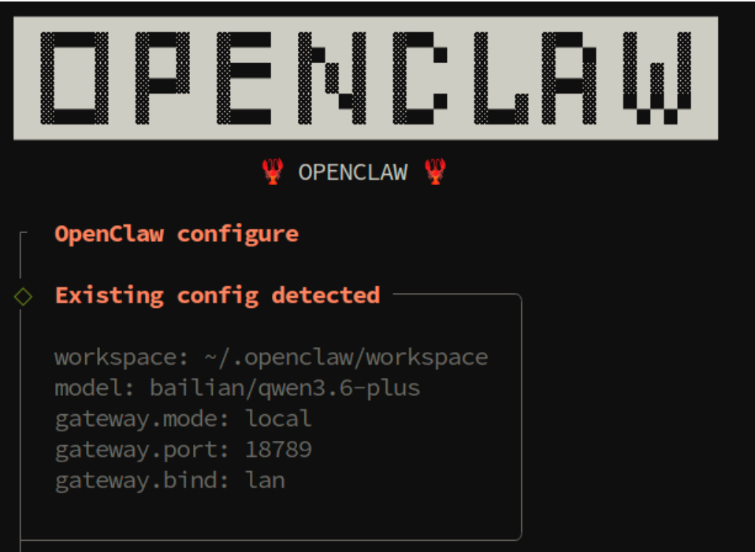
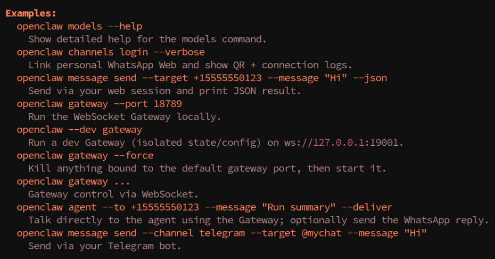
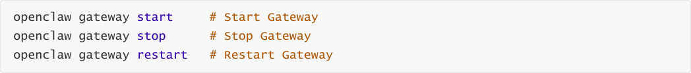
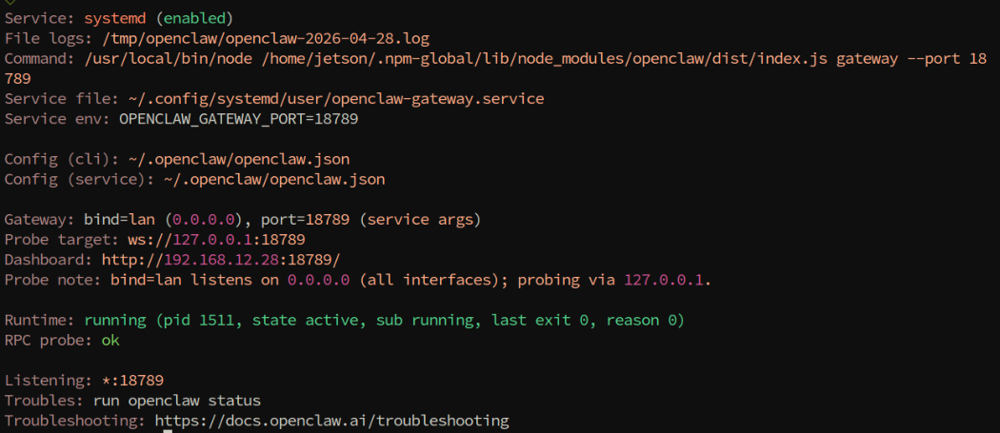
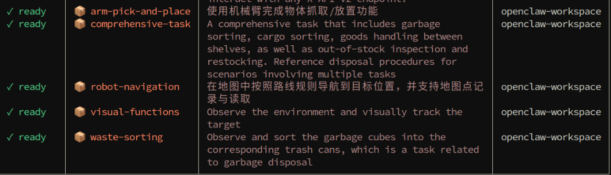
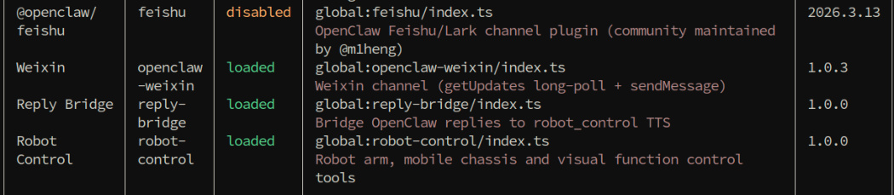
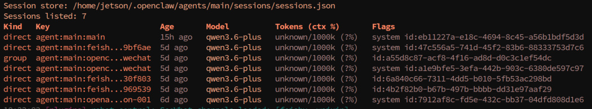
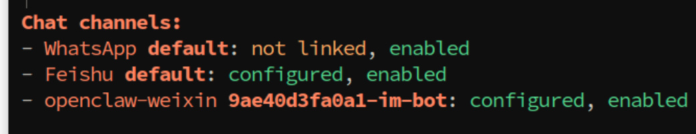

# OpenClaw Common CLI Commands
**OpenClaw Common CLI Commands**

1. Course Content

Course Overview

2. Initial Configuration

### 2.1 configure —— Configuration Wizard

### 2.2 View OpenClaw Version

### 2.3 View Help Information for All Available Commands

3. Gateway Management

4. Model Management

### 4.1 View Model List and Status

### 4.2 Set Default Model

5. Skills and Plugin Management

### 5.1 Skills Basic Operations

### 5.2 Plugin Management

6. Configuration, Logs, and Other Practical Commands

### 6.1 View Logs

### 6.2 Session Management

### 6.3 Communication Channel Management

## 1. Course Content
**Course Overview**


OpenClaw CLI is the command-line management tool provided by the OpenClaw robot system. This section

will introduce some of the most frequently used CLI commands.
## 2. Initial Configuration
`openclaw onboard` is OpenClaw's interactive beginner guide command, which has been explained in the API
KEY configuration chapter:


Configure API Key and model access information


Set Gateway running parameters


Select Skills to enable


### 2.1 configure —— Configuration Wizard
interactive configuration interface:



### 2.2 View OpenClaw Version
### 2.3 View Help Information for All Available Commands

## 3. Gateway Management
OpenClaw's default gateway is set to start automatically on boot





View detailed running status of the Gateway, including runtime, connection count, and other

information:



## 4. Model Management
### 4.1 View Model List and Status
List all configured models and their basic information:


View the status of all current models, including connection status, latency, availability, etc.:

```
 openclaw models status

### 4.2 Set Default Model
```

Set a certain model as the system default model, which will be used for subsequent conversations:


**Note:** The model name must exactly match the identifier in the configuration. You can view available

model names through `openclaw models list` .


## 5. Skills and Plugin Management
### 5.1 Skills Basic Operations
List all currently installed Skills:

```
 openclaw skills list

### 5.2 Plugin Management
```

List all currently installed plugins:

```
 openclaw plugins list

```

Enable or disable a certain plugin:

## 6. Configuration, Logs, and Other Practical Commands
### 6.1 View Logs





mode.


### 6.2 Session Management
View a list of all currently active sessions:

```
 openclaw sessions

### 6.3 Communication Channel Management
```

View all available communication channels (Feishu, WeChat, etc.)






