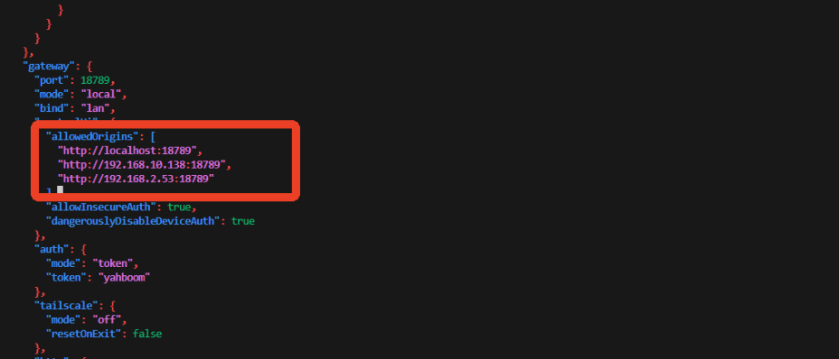
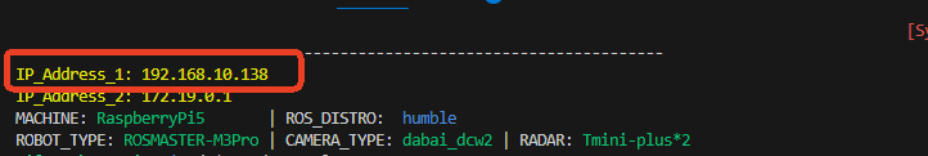
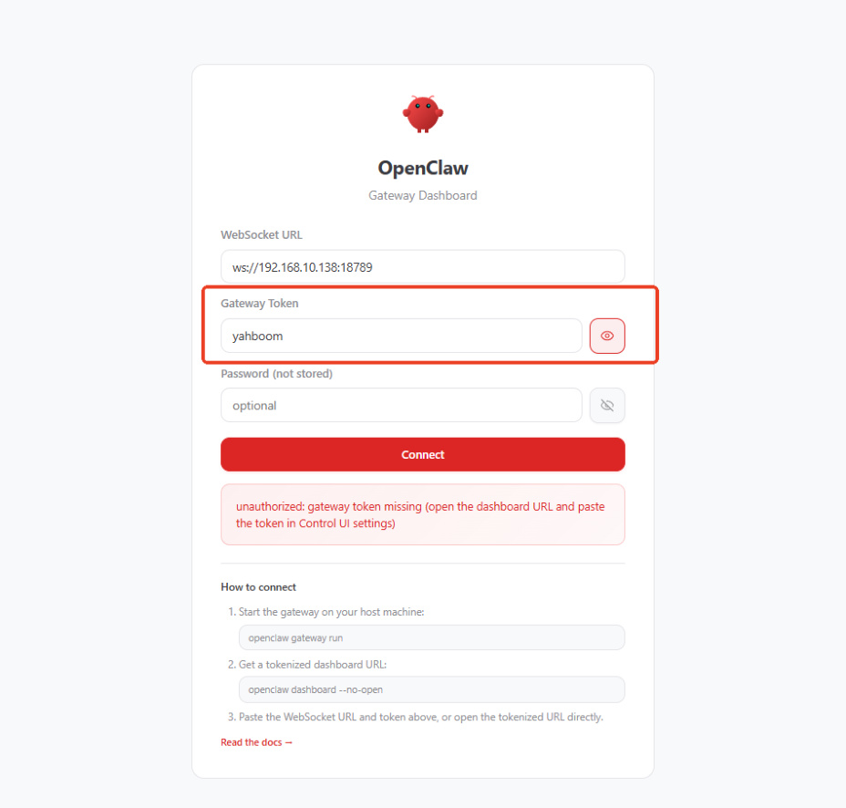
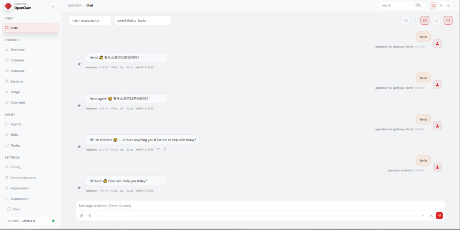
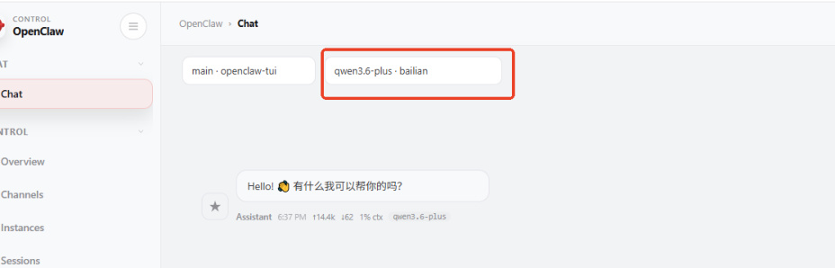
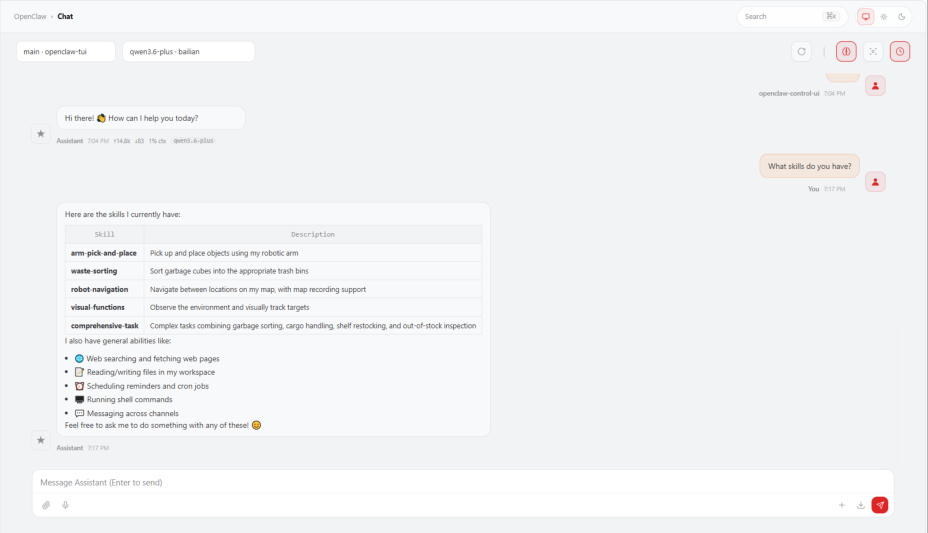

# OpenClaw Webchat Interaction
**OpenClaw Webchat Interaction**

1. Course Content

Course Overview

Learning Objectives

2. Adding Allowed Addresses

3. Accessing Web UI

4. Model Switching and Dialogue

5. Common Chat Commands

6. Common Errors and Solutions

### 6.1 Cannot Open Web Page

### 6.2 Token Verification Failed

### 6.3 No Response or Model Loading Failed

### 6.4 Allowed Address Configuration Not Taking Effect

## 1. Course Content
**Course Overview**

OpenClaw WebChat is a browser-based web interaction interface. You don't need to install any

client software - simply enter the address in your computer's browser to communicate with the

robot. This course will introduce in detail how to interact with OpenClaw through WebChat.

**Learning Objectives**

Learn to configure WebChat's allowed addresses (Allowed Origins)

Master the method to access OpenClaw Web UI through browser

Be able to perform model switching and dialogue in the web interface

Understand common issues and solutions during WebChat usage
## 2. Adding Allowed Addresses
Set the address whitelist for accessing WebChat in the OpenClaw configuration file:

Find the `gateway.controlUi.allowedOrigins` configuration item and enter the robot IP

If your robot has multiple IP addresses, separate them with commas

You can check the robot IP address in various ways, for example by opening a new terminal

**Save and exit**

Restart the gateway to apply the configuration

## 3. Accessing Web UI
Open a browser on a computer in the same network segment as the robot, enter `robot`

`IP:18789` in the address bar, and the page will redirect to the gateway dashboard interface

Enter `yahboom` in the gateway token field, then click Connect

Then you will enter OpenClaw's Web interface, where you can chat with OpenClaw, monitor

and configure parameters, etc.

## 4. Model Switching and Dialogue
In the model selection box at the top of the Web interface, you can select a configured model

to temporarily switch the current session model

After selecting a model, you can chat with OpenClaw in the dialogue box

## 5. Common Chat Commands
In the WebChat dialogue box, besides directly typing text to chat with OpenClaw, you can also use

commands:

|Command|Description|Example|
|---|---|---|
|`/model [model` `name]`|Switch the model for current session|`/model gpt`-`4o`|
|`/stop`|Stop the currently generating response|Just type`/stop`|
|`/new`|Start a new session (clear current dialogue history)|Just type`/new`|
|`/reset`|Reset the current session (alias for`/new` )|Just type`/reset`|
|`/compact`|Compact session context to save Tokens|`/compact`|
|`/fast [on/off]`|Toggle fast mode (disable thought chain output)|`/fast on`|
|`/status`|View current running status and execution info|Just type`/status`|
|`/help`|Show brief help information|Just type`/help`|
|`/commands`|View complete directory of all available commands|Just type `/commands`|
|`/think [level]`|Set the output level of thought chain|`/think off`|

**Note:** Slash commands must be sent as **standalone messages** (i.e., only the command

itself in the dialogue box), and cannot be mixed with regular chat text.

## 6. Common Errors and Solutions
### 6.1 Cannot Open Web Page
**Phenomenon:** The browser shows unable to access or connection timeout after entering the

address.

**Possible Causes and Solutions:**

**Gateway not running**   - Make sure OpenClaw Gateway is started, execute `openclaw`

`gateway status` to check status

**Network unreachable**   - Confirm computer and robot are on the same LAN, use `ping`

`robot IP` to test connectivity

correct

**Firewall blocking**   - Check if the robot firewall has allowed port 18789

### 6.2 Token Verification Failed
**Phenomenon:** After entering the token, the prompt shows authentication failed and cannot

connect.

**Possible Causes and Solutions:**

case sensitivity)

### 6.3 No Response or Model Loading Failed
**Phenomenon:** Successfully entered the Web interface, but OpenClaw doesn't reply after sending

a message.

**Possible Causes and Solutions:**

**Model not properly configured**   - Execute `openclaw models list` and `openclaw models`

`status` in terminal to check if the model is configured and available

**API-KEY not set or expired**   - Refer to the API-KEY configuration section to reconfigure

dialogue box

**Gateway connection disconnected**   - Restart the gateway: `openclaw gateway restart`

### 6.4 Allowed Address Configuration Not Taking Effect
**Phenomenon:** Filled in allowedOrigins but still cannot access.

**Possible Causes and Solutions:**

**Gateway not restarted**   - After modifying the configuration file, you must execute

`openclaw gateway restart` to take effect

the robot
