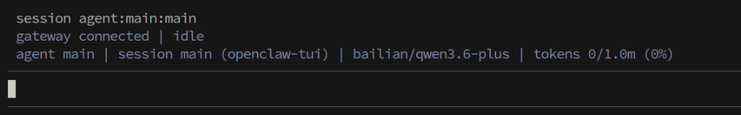
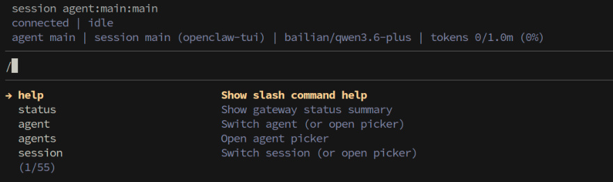
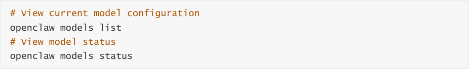
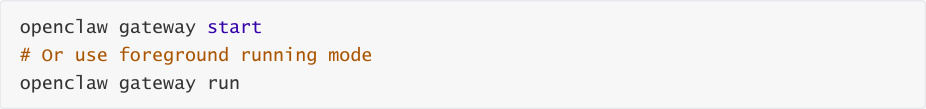

# OpenClaw Tui Interaction
**OpenClaw Tui Interaction**

1. Course Content

Course Overview

Learning Objectives

2. Opening TUI Dialogue

Applicable Scenarios

3. Common TUI Terminal Chat Commands

4. Common Errors and Solutions

### 4.1 Invalid API

### 4.2 Model Quota Exceeded

### 4.3 Gateway Not Running

### 4.4 Session Exception or Freezing

## 1. Course Content
**Course Overview**

OpenClaw TUI (Terminal User Interface) is a terminal-based text interaction interface. Without a

graphical desktop environment, you can directly chat with the OpenClaw robot in the command

line. TUI interaction is especially suitable for scenarios where you connect to the robot remotely

via SSH and perform pure text interaction in the terminal.

**Learning Objectives**

Master the method to start a terminal interaction session via the `openclaw tui` command

Learn advanced usage of starting TUI with parameters

Be familiar with common chat commands (slash commands) in TUI terminal

Be able to troubleshoot and resolve common errors during TUI usage
## 2. Opening TUI Dialogue
**Applicable Scenarios**

TUI dialogue is mainly applicable to the following scenarios:

**SSH Remote Connection**   - After logging into the robot remotely via SSH, you can directly

perform text interaction with OpenClaw in the terminal

**Lightweight Interaction**   - Compared with Web UI, TUI uses fewer resources and starts

faster, suitable for quick debugging and daily use

Enter the following command directly in the terminal to start the TUI dialogue interface:

[!NOTE]

You can chat with the robot by typing text like in WebChat

As long as the session ID is the same, dialogue history is synchronized between

WebChat and TUI
## 3. Common TUI Terminal Chat Commands
Chat commands in TUI terminal are exactly the same as slash commands in WebChat, and

**standalone messages**

## 4. Common Errors and Solutions
### 4.1 Invalid API
**Phenomenon:** After sending a message, the robot prompts API-KEY invalid, authentication failed,

or returns 401 error.

**Possible Causes and Solutions:**

correct, restart the gateway after reconfiguring

**API-KEY expired**   - Go to the model service provider's platform to check if the API-KEY has

expired, regenerate a new KEY and update the configuration

**Model service provider address error**   - Confirm the API address (base URL)

corresponding to the model in `openclaw models list` is filled correctly

### 4.2 Model Quota Exceeded
**Phenomenon:** After sending a message, the prompt shows model call quota limit reached (Rate

Limit / Quota Exceeded), or returns 429 status code.

**Possible Causes and Solutions:**

**Quota exhausted**   - Model service providers have daily/hourly call frequency or Token

limits for free/trial accounts, please check account quota status

**Multi-session concurrent consumption**   - Having multiple sessions open simultaneously

for parallel conversations will accelerate quota consumption,建议减少并发会话数量

switch to another configured model to continue the conversation

### 4.3 Gateway Not Running
connection refused, or stuck in connecting state for a long time.

**Possible Causes and Solutions:**

**Gateway not started**   - Start the Gateway service first:

**Gateway stopped or crashed** - Check Gateway running status and restart:

**Port occupied** - The default Gateway port is occupied by another program, check port

occupancy:

### 4.4 Session Exception or Freezing
**Phenomenon:** TUI interface not responding, no return after sending a message for a long time,

or interface displaying abnormally.

**Possible Causes and Solutions:**

response, then resend the message

**Terminal window size issue**   - Adjust the terminal window size and re-execute the

command, some terminal windows may cause display issues if too small

space
