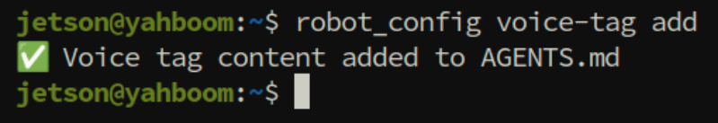
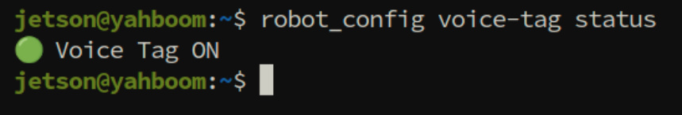
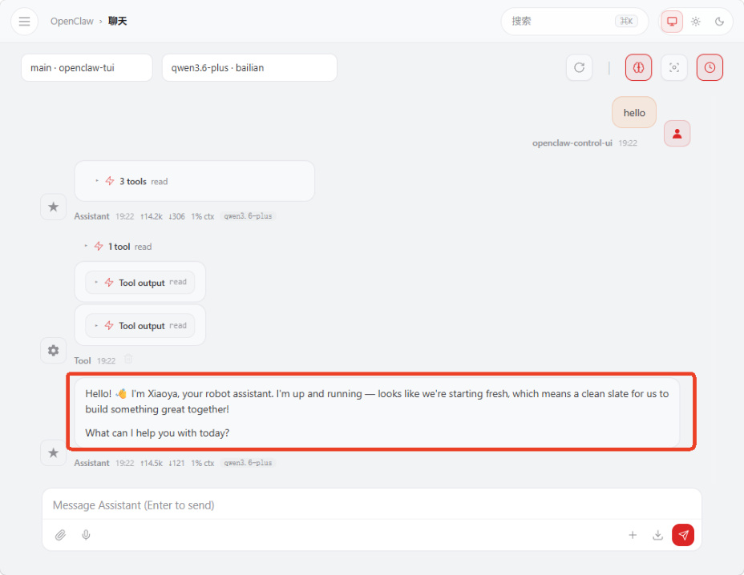
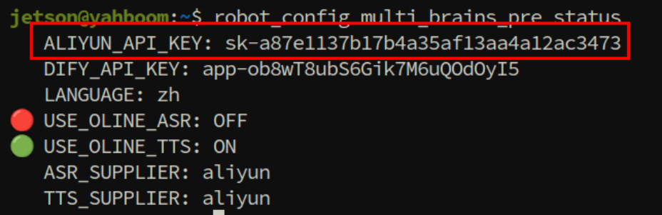
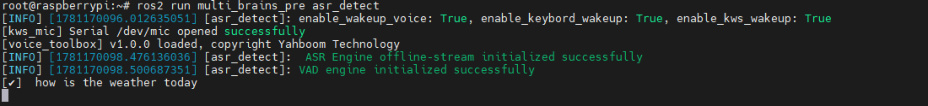
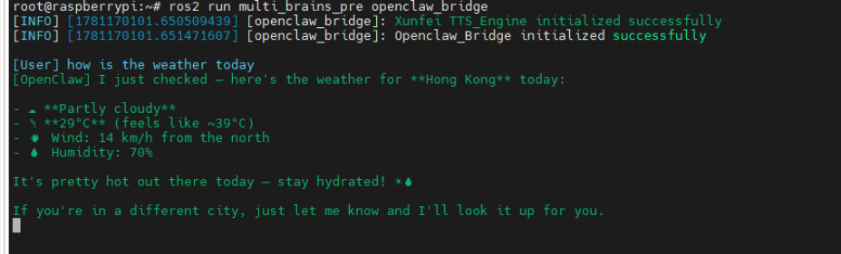
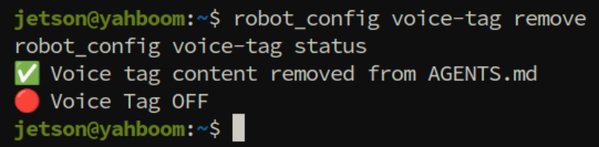
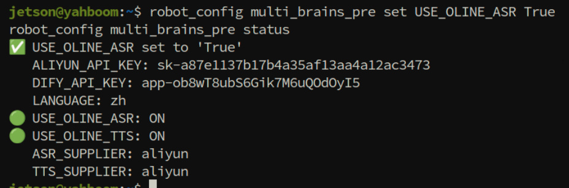
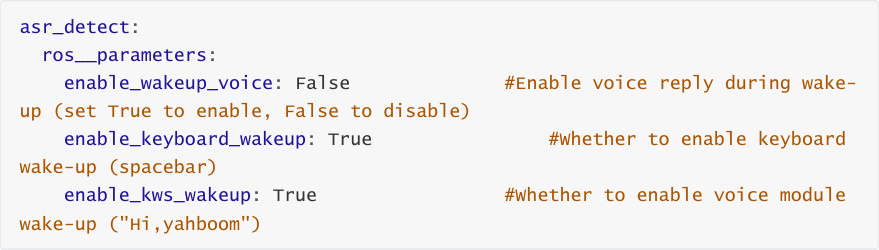
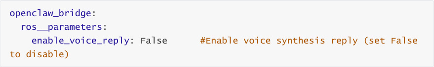

# OpenClaw Voice Dialogue Interaction
**OpenClaw Voice Dialogue Interaction**

1. Course Content

Course Overview

Learning Objectives

2. Enabling and Disabling Voice Tags

3. Configuring Voice Model Parameter Files

### 3.1 Selecting Configuration Parameter Files

### 3.2 Configuring Voice Model API-KEY

4. Starting Voice Node Program and MCP Service

5. Voice Dialogue

6. Common Problems and Solutions

7. Function Q&A


`.multi_brains_pre_example_zh.yaml` in the config directory under the m3pro_bringup package?

2. I don't want OpenClaw to output voice reply tags. How to disable it?

3. How to set online voice recognition instead of using local voice recognition?


5. How to disable voice reply during wake-up?

6. How to disable the voice synthesis function of the openclaw_bridge node, and not perform voice

synthesis?

7. Do I need to recompile the m3pro_bringup package after modifying configuration parameters?

8. Why can't asr_detect and openclaw_bridge be started in a launch file, and need to be started

separately?

9. Why are OpenClaw text replies very long, but voice replies are short?

10. There's no voice tag in OpenClaw's reply, no voice reply? How to make the voice reply all

content?

11. Can I directly modify the multi_brains_pre_setting.yaml file instead of using the robot_config

command to set parameters?

## 1. Course Content
**Course Overview**


This section is a practical tutorial explaining how to use the voice dialogue interaction feature of

the OpenClaw framework on the ROSMASTER-M3Pro robot.


**Learning Objectives**


Master the method to enable and disable OpenClaw voice reply tags

Master the steps to configure voice model parameter files and API-KEY

Master the process to start MCP service and multi_brains_pre voice node program

Master the operation method for voice dialogue through wake-up words
## 2. Enabling and Disabling Voice Tags
[!NOTE]


ROSMASTER-M3Pro has the OpenClaw voice reply tag disabled by default from the

factory. When you need to use the voice function, enable and disable it through the


robot_config command.


Enable voice tag (run in the host terminal on Raspberry Pi motherboard as well):




Verify if the modification was successful:


The prompt "Voice Tag ON" proves the voice tag is enabled


Restart the OpenClaw gateway to apply the configuration:





Test the reply:


to avoid interference from previously loaded old AGENTS.md. Enter the test statement.


will automatically parse this tag, then call the MCP interface for speech synthesis and

playback.



## 3. Configuring Voice Model Parameter Files
ROSMASTER-M3Pro uses offline streaming voice recognition engine by default from the

factory. Online voice synthesis uses Alibaba Cloud Bailian (中国大陆地区参数默认使用阿里云百

炼语音合成) in mainland China regions, and iFlytek voice synthesis in international regions.

### 3.1 Selecting Configuration Parameter Files
**Configuration for international users only**, mainland China users skip this step 3.1

(configuration files use Chinese by default from the factory)

### 3.2 Configuring Voice Model API-KEY
If you (mainland China users) need to use Alibaba Cloud Bailian's online voice recognition

and voice synthesis model services, refer to this step.

Only mainland China users configure Alibaba Bailian voice API-KEY (international Bailian does

not provide voice services yet, international users use iFlytek online voice service by default)


For example:


Verify parameters:



## 4. Starting Voice Node Program and MCP Service
OpenClaw's interaction with the robot relies on the MCP service, so you need to start the

MCP service node first.


Start the voice recognition node:


After starting, the log will prompt the loaded voice recognition model. The factory default

uses the offline streaming voice recognition engine.


Start the voice playback node and openclaw_bridge:





After starting, the log will prompt the loaded voice synthesis model engine.


## 5. Voice Dialogue
Use the wake-up word "Hi,yahboom" to wake up the robot and start the dialogue.


The factory default provides two wake-up methods: voice module wake-up and

keyboard wake-up. Keyboard wake-up is done via the spacebar.

If using the local voice recognition engine, it will perform streaming voice recognition.


The openclaw_bridge node will display OpenClaw's text reply and perform speech synthesis

and playback for the content within the voice tags.

## 6. Common Problems and Solutions
See this chapter's [Common Errors and Solutions] for details.
## 7. Function Q&A
## 1. What are the hidden files
.multi_brains_pre_example_en.yaml **and**
.multi_brains_pre_example_zh.yaml **in the config**
**directory under the m3pro_bringup package?**


**Answer:** These two files are configuration parameter template files for the multi_brains_pre voice

module:


`.multi_brains_pre_example_zh.yaml` is the Chinese configuration template (used by

default from the factory)

`.multi_brains_pre_example_en.yaml` is the English configuration template (for

international users)


When using, you need to copy the corresponding template file and rename it to


operation steps.



## 2. I don't want OpenClaw to output voice reply tags. How to
**disable it?**


**Answer:** Remove the voice reply tag through the following command to disable it:


1. Remove the voice tag:


2. Verify the removal result (displaying "Voice Tag OFF" means it's disabled):



## 3. How to set online voice recognition instead of using local
**voice recognition?**


After completing the settings, run the following command to verify if the parameters took effect:


supplier, voice model, etc.) can also be modified via `robot_config multi_brains_pre set`

`<parameter name> <value>` .



## 4. How to view the complete parameters of
parameter has detailed comments explaining its purpose and value range:


The complete configuration file content and the meanings of each parameter are as follows:

```
 ####################

 #General Settings

 ####################

 ALIYUN_API_KEY: 'sk-a87e1137b17b4a35af13aa4a12ac3473' #Aliyun

 API_KEY

 LANGUAGE: 'zh'

 #Language

 ####################

 # OPENCLAW Configuration Options

 ####################

 OPENCLAW_BASE_URL: 'http://127.0.0.1:18789/v1'

 OPENCLAW_API_KEY: 'yahboom'

 OPENCLAW_SESSION: 'robot-session-001'

 OPENCLAW_MODEL: 'default'

 ####################

 # dify Configuration Options

 ####################

 DIFY_BASE_URL: "http://localhost/v1" #dify

 Server Address

 DIFY_API_KEY: "app-ob8wT8ubS6Gik7M6uQOdOyI5" #dify

 Application API

 ####################

 #Voice Recognition Function Settings

 ####################

 USE_ONLINE_ASR : True

  #Whether to use online voice recognition

 ASR_SUPPLIER : 'aliyun' #Voice

 recognition model supplier: aliyun, xunfei

 ONLINE_ASR_MODEL : 'paraformer-realtime-v2'

  #Voice recognition model

 SAMPLE_RATE: 16000                            #Voice

 recognition audio sample rate, resampled by the program

 NO_SPEECH_TIMEOUT: 5.0

  #Timeout after wake-up, exit wake-up state if no voice activity within

 NO_SPEECH_TIMEOUT after wake-up

 ASR_THRESHOLD : 3                            #ASR

 recognition result threshold, unit: characters

 TRAILING_SOUND: 1.5

 #Trailing sound detection duration, unit: seconds

 ####################

 #Local Voice Recognition Settings

 ####################

```

```
STREAMING_ASR: True

#Whether to start streaming voice recognition, only effective for offline voice

recognition

NUM_THREADS: 2

 #Offline model inference CPU threads: 2

####################

#Voice Synthesis Function Settings

####################

USE_ONLINE_TTS : True

 #Whether to use online voice synthesis

TTS_SUPPLIER : 'aliyun' #Voice

synthesis model supplier: aliyun, xunfei, baidu

####################

#Baidu Voice Synthesis

####################

BAIDU_API_KEY : 'lQ3ybx9UsPMCvpqZKpgxxx' #Baidu

Qianfan API_KEY

BAIDU_SECRET_KEY : 'KBT3iWvMu1QXUVUL0CeNrKDhc129xxxx' #Baidu

Qianfan SECRET_KEY

PER : 4

#Speaker

PIT : 5

#Pitch, 0-15, default 5

VOL : 5

#Volume, 0-9, default 5

CUID : 'IN7dAbz1thDJKVhLdypkpB6sDVGxxx'

#Device Identifier

####################

#Bailian (Tongyi) Voice Synthesis

####################

TONGYI_TTS_MODEL : "cosyvoice-v2" #Voice

model name

VOICE_TONE : "longwan_v2"

#Speaker: Longwan, other voice colors refer to Bailian voice synthesis

documentation

####################

#MCP Function Settings

####################

MCP_PORT: 8000                              #MCP

port

MCP_HOST: "0.0.0.0"

#Listening network segment

MCP_TRANSPORT: "streamable-http"

 #Communication protocol

####################

#System Configuration Items (Modify with caution)

####################

DEVICE_SR_DEFAULT : 48000

#Microphone hardware sample rate, determined by hardware, cannot be modified

MIC_SERIAL_PORT : "/dev/mic"

 #Microphone serial port alias

```

## 5. How to disable voice reply during wake-up?
1. Edit the ROS node configuration file:


modifications take effect:





## 6. How to disable the voice synthesis function of the
**openclaw_bridge node, and not perform voice synthesis?**


to disable the voice synthesis function. Operation steps are as follows:


1. Edit the ROS node configuration file:


3. When starting the `openclaw_bridge` node, you need to pass this configuration file to make

the modifications take effect:



## 7. Do I need to recompile the m3pro_bringup package after
**modifying configuration parameters?**


**Answer:** No, recompilation is not required. The m3pro_bringup package was built using `colcon`

`build` -- `symlink` - `install` -- `packages` - `select m3pro_bringup` for symlink installation. Files in the

installation directory are symbolically linked to the source directory. Therefore, modifications to

configuration files take effect directly without recompilation.

## 8. Why can't asr_detect and openclaw_bridge be started in a
**launch file, and need to be started separately?**


terminal (displaying real-time text content during the voice recognition process and dialogue

results). ROS 2's launch system runs nodes in the background, blocking the real-time display of

standard output streams, which prevents users from seeing the streaming text content.

Therefore, these two nodes need to be started in separate terminal windows respectively.

## 9. Why are OpenClaw text replies very long, but voice replies
**are short?**


**Answer:** Voice replies are concise summaries of text, only replying with key information. The


follows:


Reduce the time consumption of voice synthesis. Too long text will significantly increase the

time required for voice synthesis

Too long voice synthesis will increase the token consumption cost of the voice model

In most scenarios, only short voice replies are needed. Text replies are already detailed

enough.

## 10. There's no voice tag in OpenClaw's reply, no voice reply?
**How to make the voice reply all content?**


You can ask OpenClaw to must perform voice reply during the conversation

If you need the voice to reply all complete content, you can ask OpenClaw during the

conversation

## 11. Can I directly modify the multi_brains_pre_setting.yaml
**file instead of using the robot_config command to set**
**parameters?**


Yes, robot_config essentially modifies the parameter key-value pairs in

```
   $HOME/M3Pro_ws/src/m3pro_bringup/config/multi_brains_pre_setting.yaml

```
