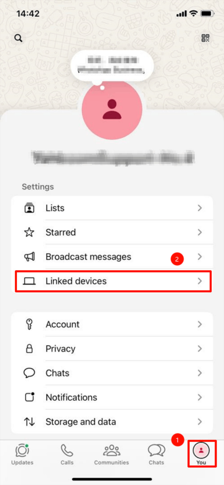
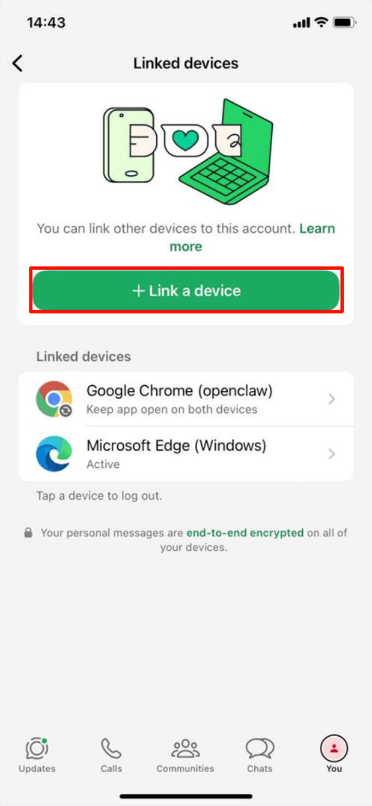
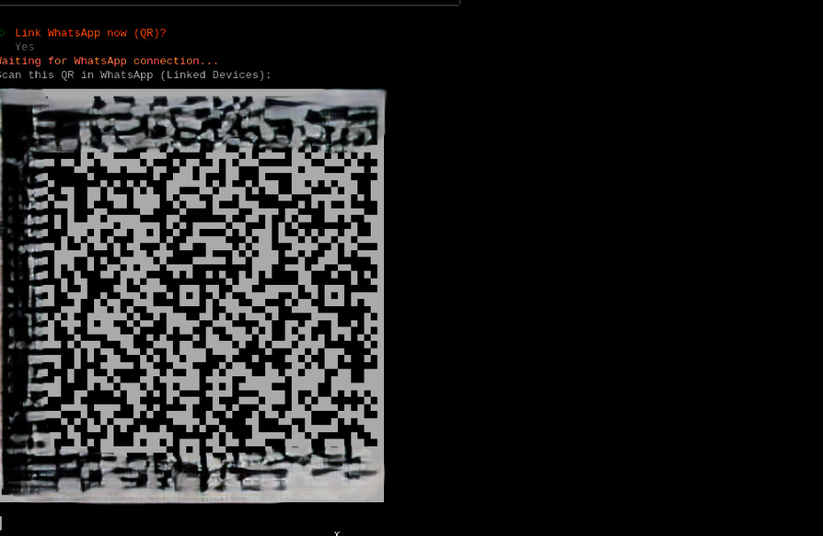
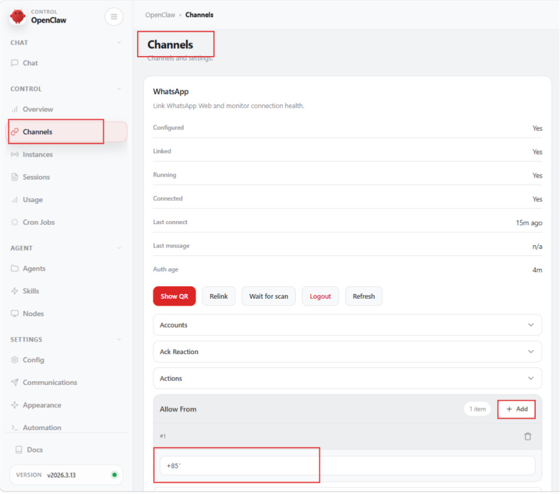
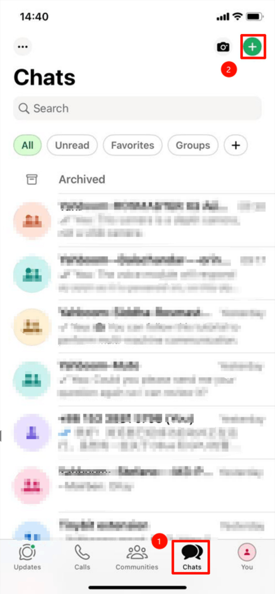
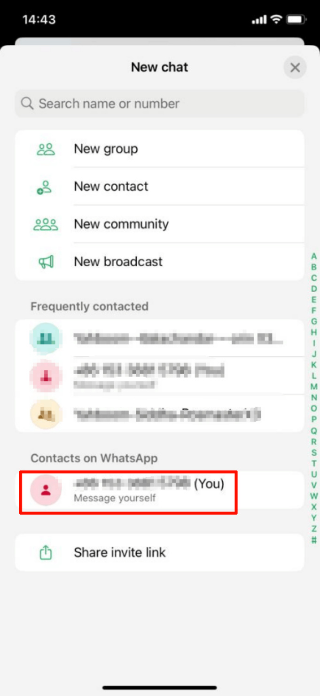
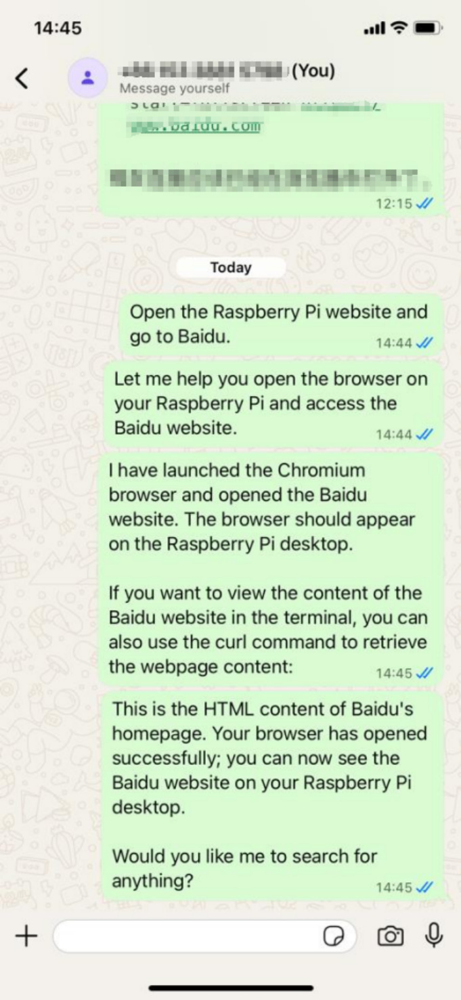

# OpenClaw WhatsApp Interaction
**OpenClaw WhatsApp Interaction**

1. Course Content

Course Overview

Learning Objectives

2. Binding WhatsApp

3. Dialogue Interaction

## 1. Course Content
[!NOTE]

WhatsApp is suitable for international users. Users in China are recommended to use

WeChat, Feishu, and other mobile communication channels.

**Course Overview**

WhatsApp is one of the mobile chat interaction methods supported by OpenClaw. After

binding the WhatsApp channel, users can chat with the robot anytime and anywhere

through their mobile phone.

Supports sending text and voice messages to control the robot, suitable for international

users.

Combined with the Robot-Control plugin, you can remotely control the robot to perform

various tasks through WhatsApp.

**Learning Objectives**

1. Learn to bind WhatsApp channel and complete device association by scanning QR code.

2. Master the method to configure WhatsApp receiving number in OpenClaw WebChat.

3. Be able to chat with the robot through WhatsApp.
## 2. Binding WhatsApp
Enter in terminal:

Open WhatsApp on your phone, click your profile → Linked Devices

Click "Link New Device", then scan OpenClaw's QR code

Scan the QR code on the phone to connect

"Linked after restart" appears, proving the connection is successful

Restart the OpenClaw gateway:

Open the OpenClaw WebChat page:

For opening method, refer to [01-openclaw webchat interaction]

Click in order: Channels → WhatsApp → Allow Form → + Add

Enter your phone number, configuration complete

## 3. Dialogue Interaction

Click "Send message to yourself"

After that, you can chat with OpenClaw through WhatsApp

