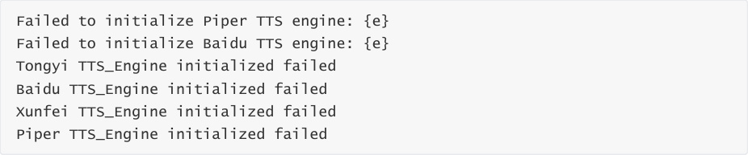
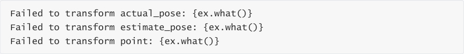
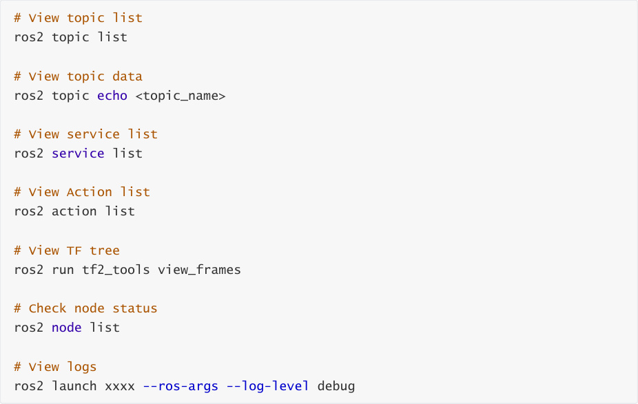

# Common Errors And Solutions
**Common Errors And Solutions**

Section 1: multi_brains_pre Package

### 1.1 Configuration File Related Errors

Error 1.1.1: Configuration File Not Found

Error 1.1.2: YAML Parsing Failed

### 1.2 ASR Voice Recognition Related Errors

Error 1.2.1: ASR Engine Initialization Failed

Error 1.2.2: Voice Recognition Failed

Error 1.2.3: VAD Engine Initialization Failed

Error 1.2.4: Audio Stream Open Failed

Error 1.2.5: No Speech Detected

Error 1.2.6: Unsupported Language

### 1.3 TTS Voice Synthesis Related Errors

Error 1.3.1: TTS Engine Initialization Failed

Error 1.3.2: Voice Synthesis Failed

### 1.4 Voice Wake-up Module Serial Communication Related Errors

Error 1.4.1: Serial Port Open Failed

#### 1.4.2: Serial Reconnection Failed

#### 1.4.3: Serial Send Failed

### 1.5 ROS Communication Related Errors

Error 1.5.1: Action Server Unavailable

Error 1.5.2: Action Goal Rejected

### 1.6 LLM Service Related Errors

Error 1.6.1: Dify Connection Failed

Error 1.6.2: Model Request Failed

### 1.7 Motion Control Related Errors

Error 1.7.1: TF Transform Acquisition Failed

Error 1.7.2: TF Timestamp Too Old

Error 1.7.3: Joint Values Not Initialized

### 1.8 Audio Playback Related Errors

Error 1.8.1: Wake-up Audio Load Failed

Section 2: waste_classify Module

### 2.1 Model Loading Related Errors

Error 2.1.1: Model File Not Found

Error 2.1.2: YOLO Model Initialization Error

Error 2.1.3: Model Inference Start Failed

### 2.2 Image Detection Related Errors

Error 2.2.1: Image Shape Not Initialized

Error 2.2.2: Image Save Failed

Section 3: pcl_seg Point Cloud Segmentation Module

### 3.1 Depth Image Processing Errors

Error 3.1.1: Invalid ROI Region (Common)

Error 3.1.2: No Depth Image

Error 3.1.3: No Valid Depth Points in Circular Region

Error 3.1.4: Target Point Outside Image Boundary

Error 3.1.5: Invalid Radius Value

### 3.2 TF Transform Related Errors

Error 3.2.1: TF Transform Not Available

Error 3.2.2: TF Transform Failed

### 3.3 Point Cloud Processing Related Warnings

Error 3.3.1: ROI Point Cloud Empty

Error 3.3.2: No Cluster Found


Error 3.3.3: No Valid Center Data

Section 4: super_tracker Object Tracking Module

### 4.1 Tracker Initialization Errors

Error 4.1.1: Tracker Creation Failed

Error 4.1.2: Display Window Configuration Conflict

### 4.2 Image Frame Processing Warnings

Error 4.2.1: Empty or Invalid Frame Received

### 4.3 ROI Selection Errors

Error 4.3.1: Selecting ROI on Empty Frame

Error 4.3.2: Invalid ROI Selected

Error 4.3.3: Setting Track ROI Failed

Error 4.3.4: Tracking Start Failed

Section 5: General Troubleshooting Suggestions

### 5.1 Log Level Adjustment

### 5.2 Common Diagnostic Commands


Section 1: multi_brains_pre Module


### 1.1 Configuration File Related Errors

### 1.2 ASR Voice Recognition Related Errors

### 1.3 TTS Voice Synthesis Related Errors

### 1.4 Serial Communication Related Errors

### 1.5 ROS Communication Related Errors

### 1.6 LLM Service Related Errors

### 1.7 Motion Control Related Errors

### 1.8 Audio Playback Related Errors

Section 2: waste_classify Module


### 2.1 Model Loading Related Errors

### 2.2 Image Detection Related Errors

Section 3: pcl_seg Point Cloud Segmentation Module

### 3.1 Depth Image Processing Errors

### 3.2 TF Transform Related Errors

### 3.3 Point Cloud Processing Related Warnings

Section 4: super_tracker Object Tracking Module


### 4.1 Tracker Initialization Errors

### 4.2 Image Frame Processing Warnings

### 4.3 ROI Selection Errors


**Section 1: multi_brains_pre Package**
### 1.1 Configuration File Related Errors
**Error 1.1.1: Configuration File Not Found**


**Error Log:**


**Cause:**


The multi_brains_pre_setting.yaml configuration file path does not exist


The file was deleted or moved


**Solution:**


1. Copy multi_brains_pre_setting.yaml from the attached source code to the specified directory


**Error 1.1.2: YAML Parsing Failed**


**Error Log:**


**Cause:**


YAML file format error (incorrect indentation, special characters not escaped, etc.)


**Solution:**


1. Modify multi_brains_pre_setting.yaml, refer to the factory file format in the attached source

code

### 1.2 ASR Voice Recognition Related Errors
**Error 1.2.1: ASR Engine Initialization Failed**


**Error Log:**


**Cause:**


API Key configuration error or invalid

Model name not supported

Network issue (online ASR)

Key file decryption failed (iFlytek ASR)


**Solution:**


2. Confirm the model name being used is in the supported list:

paraformer-realtime-v2/v1

paraformer-realtime-8k-v2/v1

gummy-realtime-v1/gummy-chat-v1

3. For iFlytek ASR, check if the key file path and decryption are correct


4. Test network connection


**Error 1.2.2: Voice Recognition Failed**


**Error Log:**


**Cause:**


API invalid

Online voice recognition service unavailable


**Solution:**


1. Check network connection stability

2. Check if API quota is exhausted


**Error 1.2.3: VAD Engine Initialization Failed**


**Error Log:**


**Cause:**


VAD model file does not exist

Model path configuration error

voice_toolbox library not installed correctly


**Solution:**


1. Check if the `silero_vad.int8.onnx` model file was deleted

2. Download the VAD model file from the attached source code


**Error 1.2.4: Audio Stream Open Failed**


**Error Log:**


**Cause:**


Microphone device not connected

Audio device occupied by other programs


**Solution:**


1. Check if the microphone device is properly connected


3. Close other programs occupying the audio device


**Error 1.2.5: No Speech Detected**


**Warning Log:**


**Cause:**


Microphone volume too low

Environment noise too loud


**Solution:**


1. Increase microphone input volume

2. Reduce environment noise

3. Speak closer to the microphone


**Error 1.2.6: Unsupported Language**


**Warning Log:**


**Cause:**


Configured unsupported language code

LANGUAGE parameter set incorrectly


**Solution:**


1. Change the LANGUAGE parameter to 'zh' (Chinese) or 'en' (English)

2. Check the language setting in the configuration file

**$HOME/M3Pro_ws/src/m3pro_bringup/config/multi_brains_pre_setting.yaml**

### 1.3 TTS Voice Synthesis Related Errors
**Error 1.3.1: TTS Engine Initialization Failed**


**Error Log:**


**Cause:**


TTS model file missing

API Key configuration error

Configuration file read failed

Key file decryption failed (iFlytek TTS)


**Solution:**


1. **Piper TTS** :


2. **Online TTS (Aliyun/Baidu/iFlytek)** :


Check if the corresponding API Key is correctly configured

Verify network connection

3. Check if the configuration file format is correct



**Error 1.3.2: Voice Synthesis Failed**


**Error Log:**


**Cause:**


TTS engine not correctly initialized?

Online voice service unavailable?


**Solution:**


1. Confirm TTS engine is correctly initialized

2. View specific error messages for targeted handling

### 1.4 Voice Wake-up Module Serial Communication Related
**Errors**


**Error 1.4.1: Serial Port Open Failed**


**Error Log:**


**Cause:**


Voice wake-up serial device does not exist

Hardware connection issue


**Solution:**


2. Check if the hardware connection is secure

#### 1.4.2: Serial Reconnection Failed
**Warning Log:**


**Cause:**


Hardware device disconnected


**Solution:**


1. Re-plug the USB device


#### 1.4.3: Serial Send Failed
**Error Log:**


**Cause:**


Serial connection already disconnected

Buffer overflow

Voice wake-up device not responding


**Solution:**


1. Check serial connection status

2. Restart the program

3. Check if the hardware device is working normally

### 1.5 ROS Communication Related Errors
**Error 1.5.1: Action Server Unavailable**


**Warning Log:**


**Cause:**


common_service node not started


**Solution:**


1. Confirm the common_service node is started

2. Use `ros2 action list` to check available actions


**Error 1.5.2: Action Goal Rejected**


**Warning Log:**


**Cause:**


Audio file path does not exist


**Solution:**


1. Check if the audio file exists

2. View specific rejection reason logs


### 1.6 LLM Service Related Errors
**Error 1.6.1: Dify Connection Failed**


**Error Log:**


**Cause:**


Dify service not started

BASE_URL configuration error

**API Key invalid** (highest probability, dify application's API does not match DIFY_API_KEY in

the configuration file)


**Solution:**


1. Confirm Dify service is started and running normally

2. Check DIFY_BASE_URL configuration (e.g., [http://localhost/v1)](http://localhost/v1)

3. Verify DIFY_API_KEY is correct

4. Use curl to test connection: `curl`  - `H "Authorization: Bearer {API_KEY}"`

```
   {BASE_URL}/meta

```

**Error 1.6.2: Model Request Failed**


**Error Log:**


**Cause:**


Dify service exception

Model service down

Model api has no quota

Timeout


**Solution:**


1. Check Dify service status

2. View Dify service logs

3. Check api account

4. Restart Dify service


### 1.7 Motion Control Related Errors
**Error 1.7.1: TF Transform Acquisition Failed**


**Error Log:**


**Cause:**


TF tree incomplete

pcl_segment node not publishing TF

Object tracking lost the target


**Solution:**


2. Confirm pcl_segment node is running normally

3. Ensure the node is tracking the target


**Error 1.7.2: TF Timestamp Too Old**


**Warning Log:**


**Cause:**


TF publishing frequency too low

System delay too high, CPU load too high

Object tracking lost the target


**Solution:**


1. Increase TF publishing frequency

2. Optimize system performance

3. Increase `tf_tolerance` parameter value

4. Close nodes that are not needed


**Error 1.7.3: Joint Values Not Initialized**


**Warning Log:**


**Cause:**


Robotic arm query service call failed

Initialization process not completed


**Solution:**


1. Check if the robotic arm service is working normally

2. Verify if the arm_util node is started


3. View service call logs

### 1.8 Audio Playback Related Errors
**Error 1.8.1: Wake-up Audio Load Failed**


**Error Log:**


**Cause:**


Audio file directory does not exist

File format not supported


**Solution:**


2. Confirm WAV file exists and format is correct

3. Check file read permissions

4. Reinstall the multi_brains_pre package


**Section 2: waste_classify Module**
### 2.1 Model Loading Related Errors
**Error 2.1.1: Model File Not Found**


**Error Log:**


**Cause:**


YOLO model path configuration error

File deleted or moved


**Solution:**


2. Confirm model file exists

3. Re-download the YOLO model file from the attached source code


**Error 2.1.2: YOLO Model Initialization Error**


**Error Log:**


**Cause:**


Factory system python environment corrupted

Model file format error


Insufficient memory


**Solution:**


1. Check if the model file is a valid ONNX format


3. Check if system memory is sufficient


**Error 2.1.3: Model Inference Start Failed**


**Error Log:**


**Cause:**


Shared memory creation failed

Multi-process start failed

Insufficient resources


**Solution:**


1. Check system shared memory limit: `sysctl kernel.shmmax`

2. View system logs for detailed error information

### 2.2 Image Detection Related Errors
**Error 2.2.1: Image Shape Not Initialized**


**Error Log:**


**Cause:**


Camera not started

Image topic not publishing


**Solution:**


1. Confirm camera node is started

```
   /camera/color/image_raw
```

3. Restart the carbase launch file


**Error 2.2.2: Image Save Failed**


**Error Log:**


**Cause:**


Output directory does not exist

Insufficient disk space

Camera node not started


**Solution:**


1. Check file path configuration


**Section 3: pcl_seg Point Cloud Segmentation Module**
### 3.1 Depth Image Processing Errors
**Error 3.1.1: Invalid ROI Region (Common)**


**Warning Log:**


**Cause:**


Tracking box coordinates exceed image boundaries

Tracking box size is zero or negative

Target area has no depth information


**Solution:**


1. Check if tracking box coordinates are reasonable

2. Use rviz to check if the target has depth information


**Error 3.1.2: No Depth Image**


**Warning Log:**


**Cause:**


Depth camera not started

Topic subscription failed

Depth image not publishing


**Solution:**


1. Confirm depth camera driver is started


3. Verify camera hardware connection

4. Restart the camera node


**Error 3.1.3: No Valid Depth Points in Circular Region**


**Warning Log:**


**Cause:**


Target point too far, too close, or no depth information near the target point

Depth value invalid (0 or exceeding threshold)


**Solution:**


1. Adjust camera observation angle or target point position

2. Check if the depth camera is working normally

3. Use rviz to check if the target has depth information

4. Reduce ambient lighting


**Error 3.1.4: Target Point Outside Image Boundary**


**Warning Log:**


**Cause:**


Requested coordinates exceed image range

Coordinate calculation error

Image resolution changed


**Solution:**


1. Verify coordinate calculation logic

2. Check image resolution configuration

3. Increase boundary checking

4. Use valid coordinate values


**Error 3.1.5: Invalid Radius Value**


**Warning Log:**


**Cause:**


Radius parameter is negative or zero

Parameter passing error


**Solution:**


1. Ensure radius value is positive

2. Check service call parameters

3. Use reasonable radius values (recommended 5-50 pixels)


### 3.2 TF Transform Related Errors
**Error 3.2.1: TF Transform Not Available**


**Warning Log:**


**Error Log:**


**Cause:**


Missing necessary transforms in TF tree

Camera coordinate system not configured

TF publishing node not started


**Solution:**


2. Ensure camera driver publishes correct TF

3. Check if the transform from base_link to camera is correctly defined


**Error 3.2.2: TF Transform Failed**


**Error Log:**





**Cause:**


Coordinate frame does not exist

Transform data abnormal

Timestamp issue


**Solution:**


1. Check if coordinate frame names are correct

2. Verify TF data validity

3. Check timestamp synchronization

### 3.3 Point Cloud Processing Related Warnings
**Error 3.3.1: ROI Point Cloud Empty**


**Debug Log:**


**Cause:**


No valid depth values in ROI area

Distance threshold set too small

Target exceeds distance range


**Solution:**


2. Adjust ROI area size

3. Ensure target is within effective distance

4. Check depth image quality


**Error 3.3.2: No Cluster Found**


**Debug Log:**


**Cause:**


Point cloud density insufficient

Clustering parameter settings improper

Target too small or too far


**Solution:**


2. Increase `cluster_max_size` parameter


4. Ensure target is close enough and clear


**Error 3.3.3: No Valid Center Data**


**Warning Log:**


**Cause:**


No depth image processed yet

Clustering failed


**Solution:**


1. Ensure depth image is being processed normally

2. Check if point cloud segmentation succeeded


**Section 4: super_tracker Object Tracking Module**


### 4.1 Tracker Initialization Errors
**Error 4.1.1: Tracker Creation Failed**


**Error Log:**


**Cause:**


Model file does not exist


**Solution:**


1. Check model file path: `$HOME/MODELS/tracker/mixformer_v2_sim.onnx`

2. Adjust `num_threads` parameter


**Error 4.1.2: Display Window Configuration Conflict**


**Error Log:**


**Cause:**


Both display parameters set to true simultaneously

Configuration logic conflict


**Solution:**


1. Enable only one of the parameters:


2. Modify the configuration file to ensure they are not both true

### 4.2 Image Frame Processing Warnings
**Error 4.2.1: Empty or Invalid Frame Received**


**Warning Log:**


**Cause:**


Camera not properly publishing images


**Solution:**


1. Check camera node running status

2. Use `ros2 topic hz /camera/color/image_raw` to check publishing frequency


### 4.3 ROI Selection Errors
**Error 4.3.1: Selecting ROI on Empty Frame**


**Error Log:**


**Cause:**


No image frame received yet

Image frame is empty


**Solution:**


1. Wait for the camera to properly publish images before selecting ROI

2. Check camera connection

3. Confirm image topic has data


**Error 4.3.2: Invalid ROI Selected**


**Warning Log:**


**Cause:**


User cancelled ROI selection

Selected ROI width/height is zero or negative


**Solution:**


1. Re-select a valid ROI area

2. Ensure the ROI area has sufficient size (recommended at least 20x20 pixels)

3. Completely frame the target on the image


**Error 4.3.3: Setting Track ROI Failed**


**Error Log:**


**Cause:**


Image frame is empty

Tracker initialization exception

ROI coordinates invalid


**Solution:**


1. Ensure a valid image frame is passed in

2. Check if ROI coordinates are within the image range

3. Verify tracker status

4. Re-initialize the tracker


**Error 4.3.4: Tracking Start Failed**


**Error Log:**


**Cause:**


Current camera image invalid

ROI setting failed

Tracker exception


**Solution:**


1. Confirm camera image is normal

2. Check ROI coordinate validity

3. View specific error logs


**Section 5: General Troubleshooting Suggestions**
### 5.1 Log Level Adjustment
If you encounter problems, enable debug log mode and send the complete error content to

technical support

ROS log level: `ros2 launch xxxx` -- `ros`   - `args` -- `log`   - `level debug`

### 5.2 Common Diagnostic Commands

