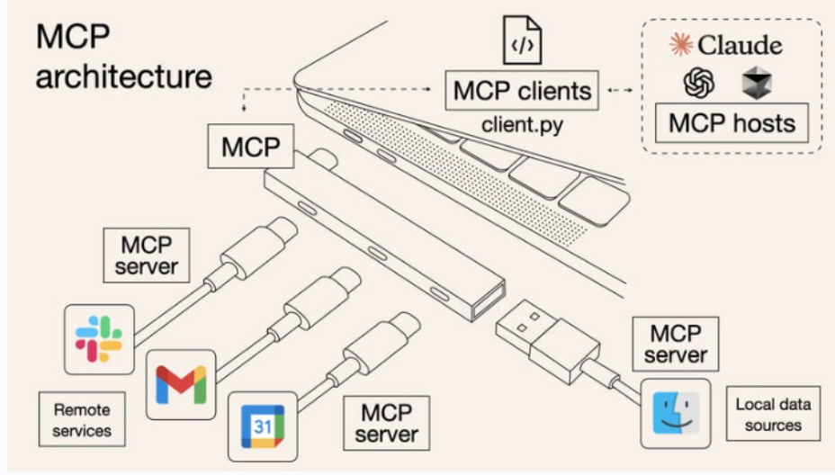
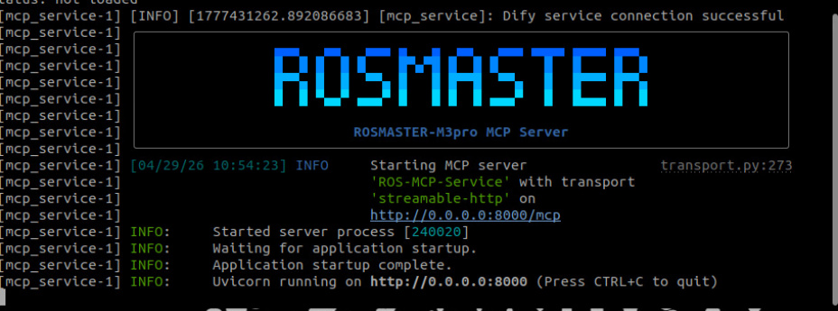
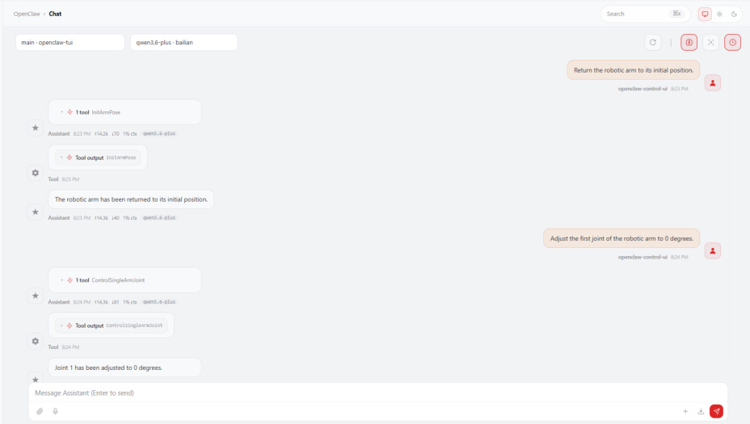
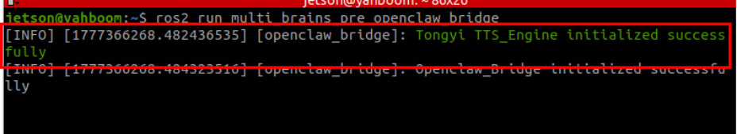
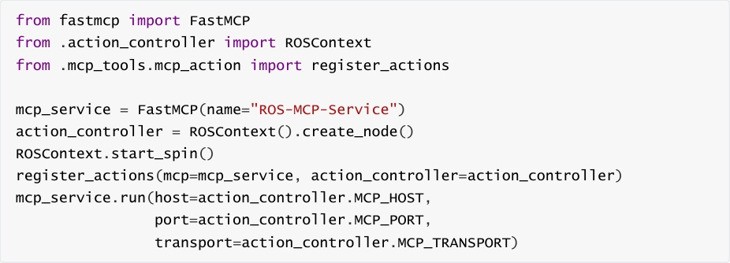
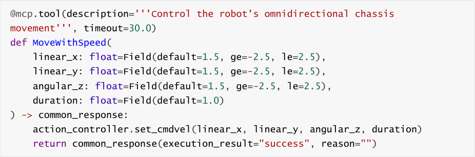
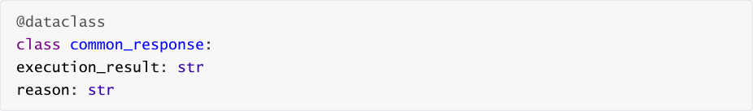

# OpenClaw Integration with Robot MCP Interface
**OpenClaw Integration with Robot MCP Interface**

1. Course Content

Course Overview

Learning Objectives

2. Preparation

3. Introduction to the MCP Protocol

4. OpenClaw Robot Control Communication Architecture

5. Launching the MCP Service

6. Controlling the Robot with OpenClaw

7. Source Code Analysis

### 7.1 🖥 MCP Service

### 7.2 🛠 MCP Tools

### 7.3 💬 MCP Message Interface

8. Summary of Robot MCP Functional Interfaces

## 1. Course Content
**Course Overview**


This lesson explains how to implement intelligent robot control using the OpenClaw framework

and the MCP (Model Context Protocol) interface.


**Learning Objectives**


1. Understand the basic principles of the MCP protocol.

2. Control the robot using OpenClaw.
## 2. Preparation
Start the MicroROS chassis agent (if already started, no need to repeat the process)


## 3. Introduction to the MCP Protocol
MCP (Model Context Protocol) is an open protocol used to connect large language models

with external tools and services. In this system, OpenClaw uses the MCP protocol to translate

user natural language commands into specific robot operation commands.

After the AI model parses the user's commands, it selects the corresponding MCP Tool for

execution. The MCP service then translates the tool call into ROS2 Action commands, driving

the robot chassis, robotic arm, and other hardware to perform actions.




Through the ROSMASTER-M3Pro's MCP service interface, the robot can be connected to any

AI model, agent, or AI tool that supports MCP, enabling robot control.
## 4. OpenClaw Robot Control Communication
**Architecture**


The communication architecture for the OpenClaw-controlled robot is divided into four layers:


1. **User Interaction Layer:** Sends natural language commands via interaction channels such as

Web Chat, WeChat, Feishu, etc.

2. **AI Decision Layer:** The LLM within OpenClaw parses user intent and selects the

corresponding MCP Tool.

3. **MCP Service Layer:** Operates based on the FastMCP framework; it registers over 20 tool

functions—covering chassis movement, robotic arm control, visual recognition, etc.—and

communicates with the robot hardware via ROS2 Actions, Topics, and Services.

4. **Robot Execution Layer:** The MicroROS chassis agent receives commands and drives the

robot hardware—such as the chassis and robotic arm—to execute the specified actions.

```
 ┌─────────────┐

 │ OpenClaw  │

 └──────┬──────┘

 │

 ▼

 ┌─────────────┐

 │robot-control|

 │  Plugin  |

 └──────┬──────┘

 │ MCP Protocol

 ▼

 ┌─────────────┐

 │ MCP Server │

 └──────┬──────┘

 │

 ▼

 ┌───────────────────────────┐

 │ ROS2 Communication Stack │

 │ Topics/Services/Actions  │

```

```
 └──────┬────────────────────┘

 │

 ▼

 ┌──────────────────────────┐

 │ Hardware Driver Layer  │

 └──────┬───────────────────┘

 │

 ▼

 ┌───────────────────┐

 │ Robot Hardware  │

 └───────────────────┘

## 5. Launching the MCP Service
```

Launch via Terminal



## 6. Controlling the Robot with OpenClaw
On your PC, open the Web Chat UI and log in while connected to the same local area

network (LAN) as the robot's onboard computer.


[!NOTE]


For the interaction method with OpenClaw, you may select any of the options listed in

the "02-openclaw Interaction Methods" section. For this demonstration, we will use the

Web Chat interface as an example.


Here, we will demonstrate and test OpenClaw's control capabilities using the robotic arm as

an example:

Return the robotic arm to its initial position.

Adjust the first joint of the robotic arm to 0 degrees.




If you require the robot to provide spoken responses, you must also launch the


Once launched, the logs will indicate which speech synthesis model engine has been loaded.

## 7. Source Code Analysis
### 7.1 🖥 MCP Service


Source Code Path:





following tasks:


1. Creates a FastMCP service instance, named `"ROS`  - `MCP`  - `Service"` .


4. Starts the MCP service, listening on the specified host and port.





### 7.2 🛠 MCP Tools

Source Code Path:


All tools adhere to a unified registration pattern: they use the `@mcp.tool()` decorator to define

their descriptions and timeout durations, employ Pydantic Fields to constrain parameter ranges,





💬
### 7.3  MCP Message Interface
Source Code Path


for MCP Tools.


operation was successful based on the `execution_result` field:





Other message types include:


`waste_recognition_result` : Results of waste recognition detection

## 8. Summary of Robot MCP Functional Interfaces
For details, please refer to the appendix located in this chapter's folder: **MCP Function**

**Summary.md**
