# OpenClaw Multi-Agent Intelligent Agents
**OpenClaw Multi-Agent Intelligent Agents**

1. Course Content

Course Overview

Learning Objectives

2. Creating Agents

### 2.1 Creating Agents Using the CLI Wizard

### 2.2 Agent Directory Structure

### 2.4 Configuring Bindings

### 2.5 Restarting the Gateway to Apply Configuration

3. Editing Agent Prompts

### 3.2 Editing Steps

### 3.3 Configuration Example: Creating a Customer Support Bot Agent

4. Deleting Agents

### 4.1 Deleting via CLI Commands

### 4.2 Manually Cleaning Up Agent Directories

### 4.3 Cleaning Up Binding Configurations

## 1. Course Content
**Course Overview**

OpenClaw's multi-agent intelligent agent feature allows multiple **isolated agents** to run

within the same gateway. Each agent has its own independent workspace, state directory,

and session history.

The multi-agent architecture is suitable for scenarios with multiple roles, such as one agent

responsible for programming development and another for social media operations, with

data isolation and no interference between them.

**Learning Objectives**

1. Understand the concept and applicable scenarios of OpenClaw multi-agent intelligent

agents.

2. Master the creation of new agents using CLI commands.

3. Master the methods for editing agent prompt files (AGENTS.md / SOUL.md / IDENTITY.md,

etc.).

4. Master the operation of deleting an agent.
## 2. Creating Agents
OpenClaw runs one agent by default (agentId is `main` ). Additional isolated agents can be created

using the following methods.

### 2.1 Creating Agents Using the CLI Wizard
quickly create new agents:

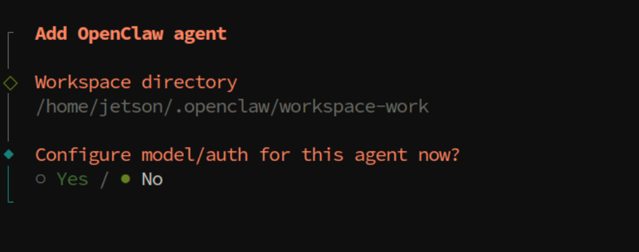

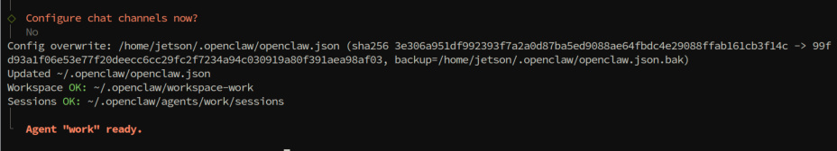

Upon execution, OpenClaw automatically performs the following actions:

### 2.2 Agent Directory Structure
Once an agent is created, a complete file structure is generated within the

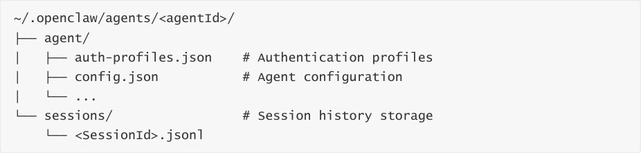

The agent's workspace files are located within their respective workspace directories, where you

can edit the bootstrap files to define the agent's behavior and personality. ### 2.3 Verifying Agent

Creation

Once creation is complete, you can view all agents and their binding statuses using the following

command:

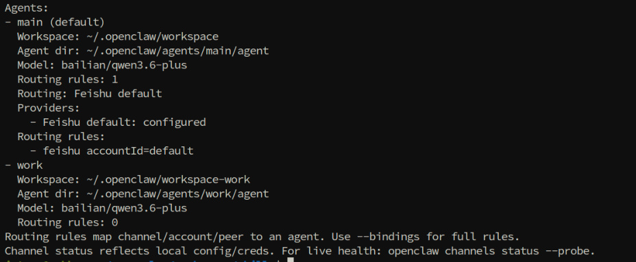
### 2.4 Configuring Bindings
A _Binding_ is a rule that routes messages from a channel account to a specific agent. Each binding

consists of:

**agentId** : The ID of the target agent.

**match** : The matching rule (based on channel, peer account, etc.).

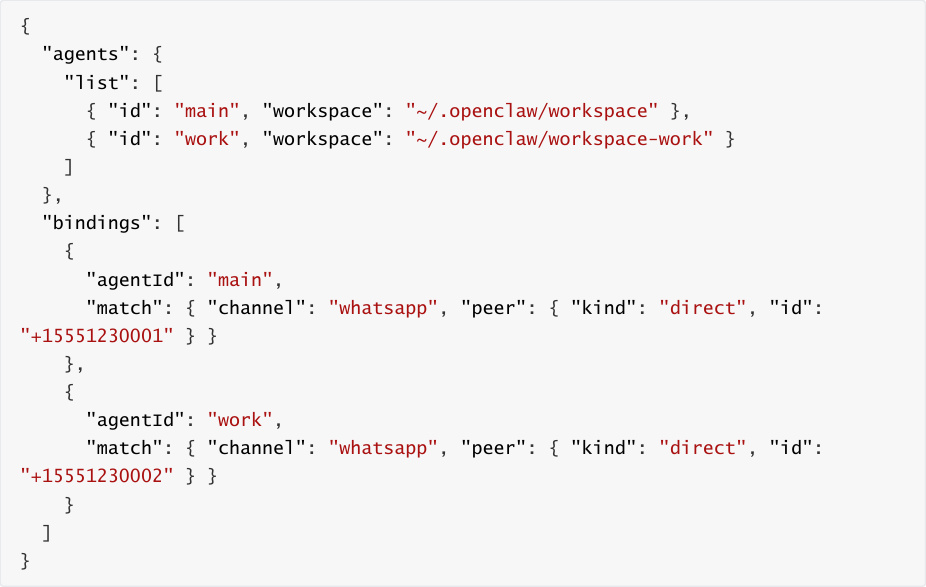
### 2.5 Restarting the Gateway to Apply Configuration
After creating agents or modifying binding configurations, you must restart the Gateway:

After restarting, verify the status of the agents and channels:

## 3. Editing Agent Prompts
Each agent's personality, behavioral rules, and capabilities are defined through _Bootstrap Files_

located within its workspace. By editing these files, you can customize the agent's prompts. ###

### 3.1 Introduction to Bootstrap Files

In the first turn of a new session, OpenClaw injects the following workspace files into the agent's

context:

|File|Purpose|
|---|---|
|`AGENTS.md`|Operational instructions and memory; defines the behavioral rules the agent must follow.|
|`SOUL.md`|Persona, boundaries, and tone; defines the agent's personality traits.|
|`IDENTITY.md`|Agent name, vibe, and emoji identifier.|
|`TOOLS.md`|User-maintained instructions and conventions for tool usage.|
|`USER.md`|User profile and preferred forms of address.|
|`BOOTSTRAP.md`|One-time initial setup ritual (can be deleted once completed).|

### 3.2 Editing Steps
**Step 1: Navigate to the Agent's Workspace Directory**

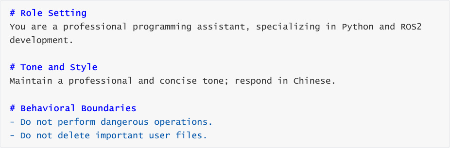

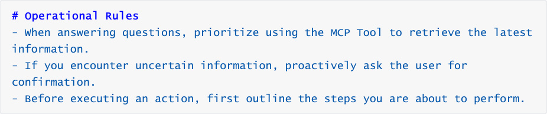

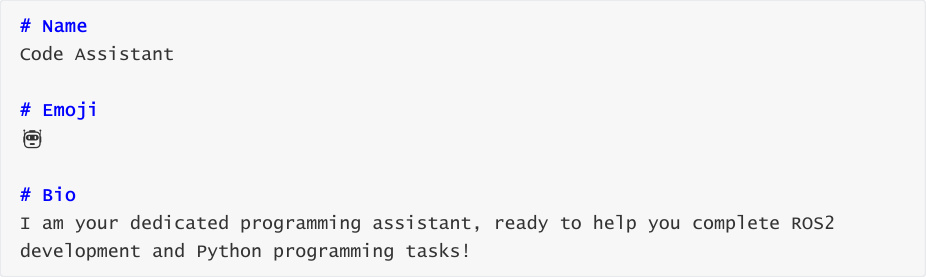

**Step 5: Restart the Gateway to Apply Changes**

[!TIP]

The content of the bootstrap file is injected into the LLM context during the very first

turn of a new session; therefore, you must start a new session to see the effects of any

modifications.

Empty files will be skipped and will not be injected into the context.

If a file is missing, OpenClaw will inject a placeholder line indicating "Missing File."

### 3.3 Configuration Example: Creating a Customer Support Bot
**Agent**

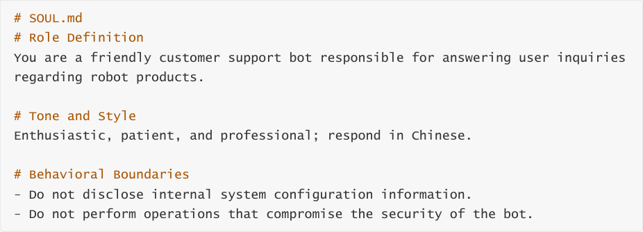

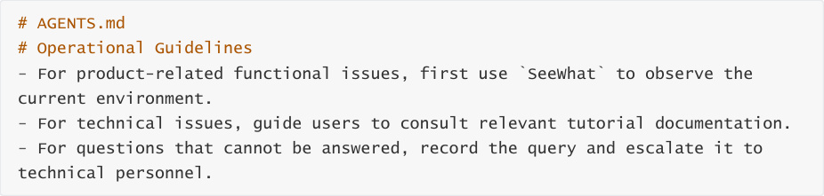

## 4. Deleting Agents
### 4.1 Deleting via CLI Commands
To delete an agent that is no longer needed, use the following command:

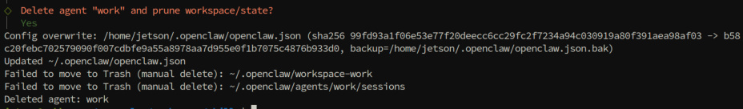
### 4.2 Manually Cleaning Up Agent Directories
After executing the CLI command, it is recommended to also clean up the following residual data:

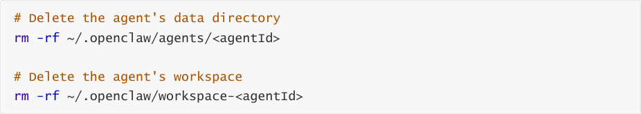

### 4.3 Cleaning Up Binding Configurations
After deleting an agent, you must also remove the corresponding binding records and agent list

2. Remove the entry for the specific agent from `agents.list` .

4. Save the file, then restart the gateway:

[!WARNING]

Deleting an agent will **permanently remove** that agent's session history,

authentication configurations, and all associated data.

Before proceeding with the deletion, please ensure that you have backed up any

important data.

If the agent is currently running, it is recommended to first disable any associated

channel bindings before performing the deletion.
