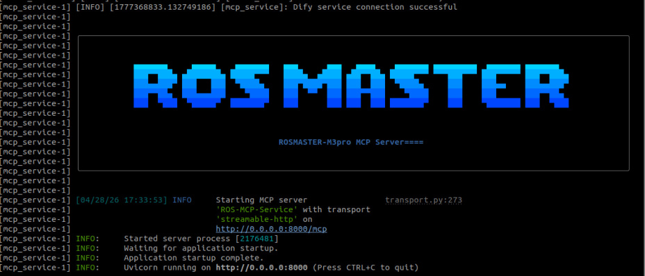
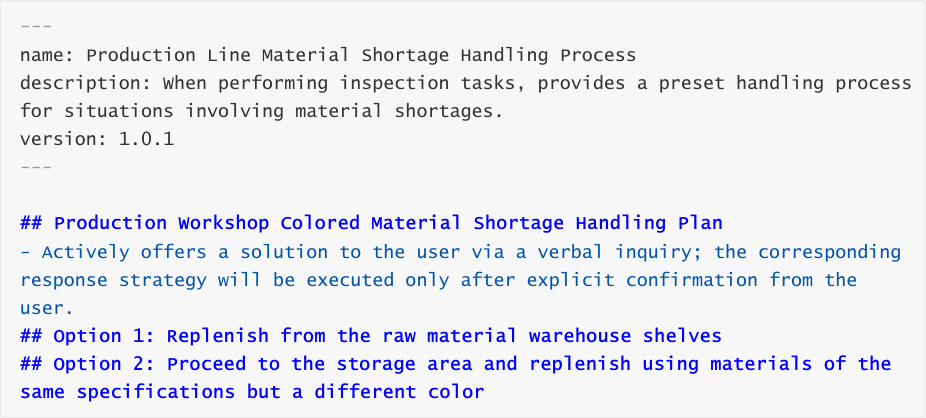
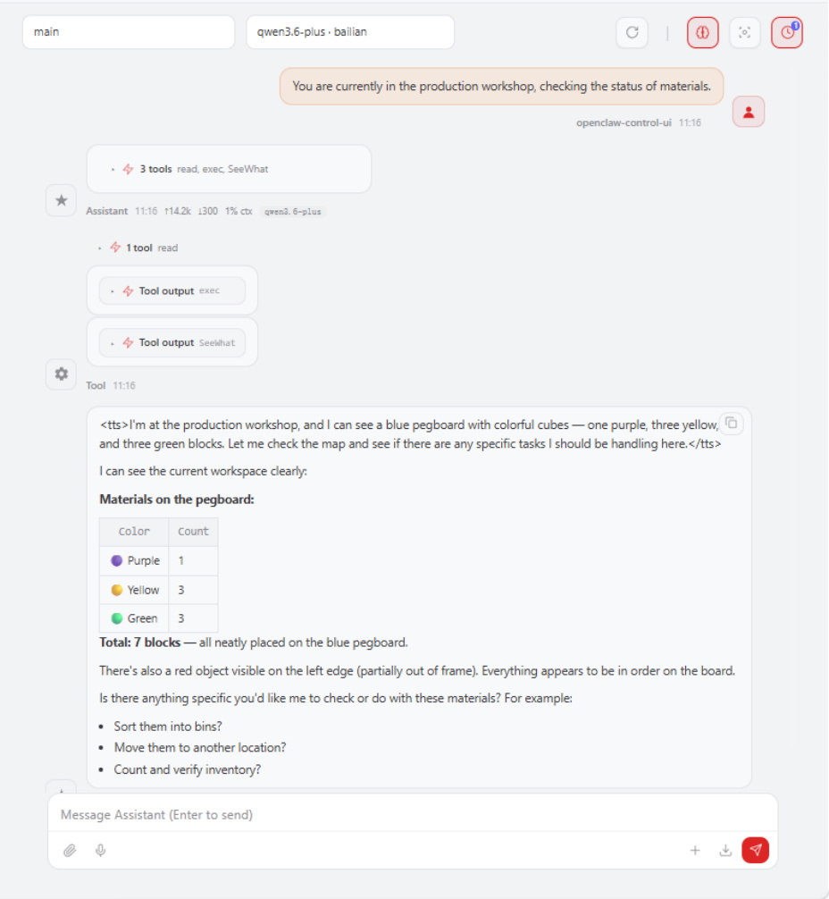
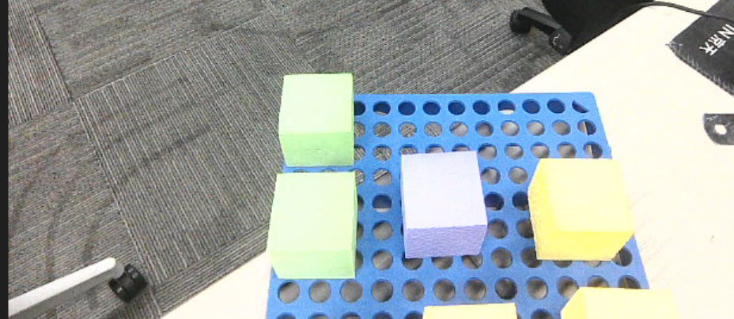
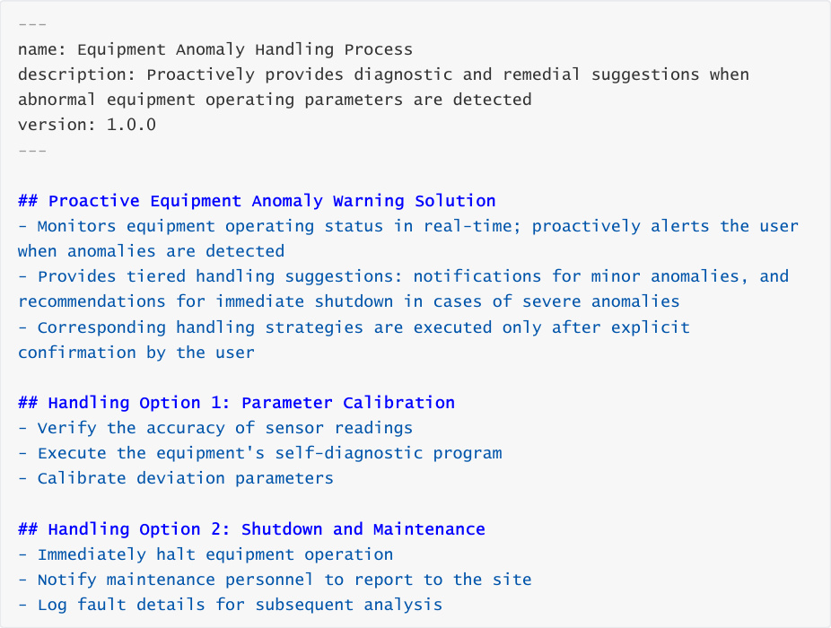
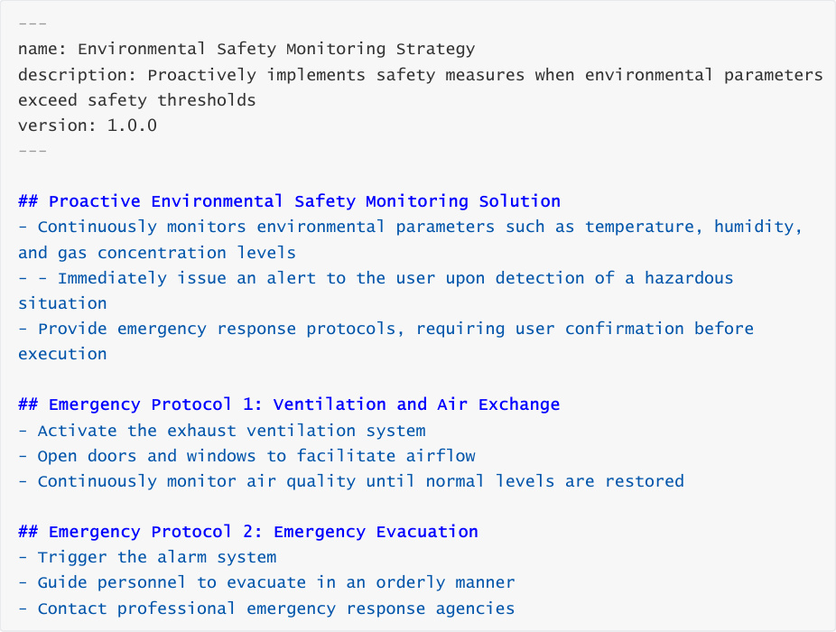
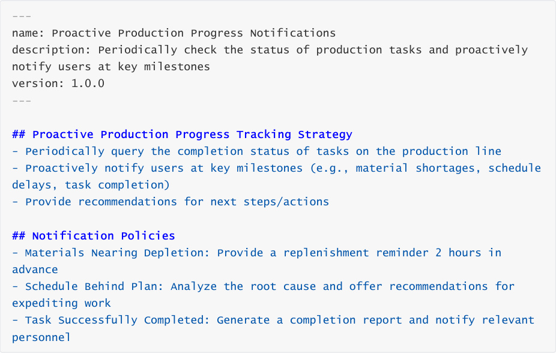
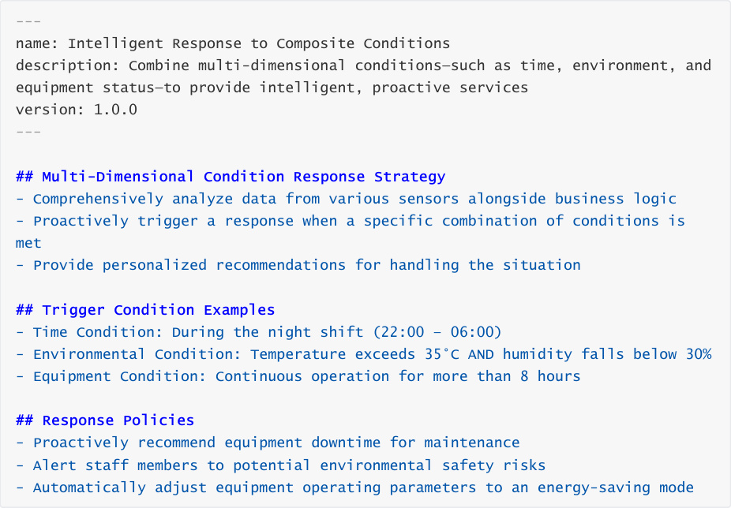

# OpenClaw Active Interaction
**OpenClaw Active Interaction**

1. Course Content

Course Overview

Preparation

2. Creating a New Skill

3. Creating a Skill for Handling Special Situations

4. Case Demonstration

5. Extended Applications

### 5.1 Equipment Fault Pre-warning and Handling

### 5.2 Environmental Safety Monitoring

### 5.3 Production Progress Tracking and Notifications

### 5.4 Multi-Condition Composite Trigger Strategy

## 1. Course Content
**Course Overview**

Based on "skills," you will write response strategies for specific scenarios, enabling OpenClaw

to actively provide solutions when encountering unexpected situations.

This section is a course on solution design tailored to specific application scenarios;

therefore, you must first master the prerequisite courses: [OpenClaw Basics], [OpenClaw

Interaction Methods], and [OpenClaw Skills Development].

**Preparation**

First, complete the [OpenClaw Skills Development] course section to master the process of

creating new skills.

Launch the MicroROS chassis agent (if it is already running, do not launch it again).

Launch nodes such as the odometry, TF, manipulator assistance, and camera nodes.

Launch the MCP service.

this step may be skipped.

## 2. Creating a New Skill
Refer to the content in [OpenClaw Skills Development].

## 3. Creating a Skill for Handling Special Situations

After creation is complete, restart the OpenClaw gateway for the changes to take effect

## 4. Case Demonstration
[!NOTE]

You may write the commands yourself according to your specific needs. The following

serves as a case demonstration; you may choose any interaction method you prefer.

Here, the WebChat interface is used as an example.

## 5. Extended Applications
OpenClaw's proactive interaction capabilities can be applied to a wide variety of scenarios. The

following provides several reference examples for custom solutions:

### 5.1 Equipment Fault Pre-warning and Handling

### 5.2 Environmental Safety Monitoring

### 5.3 Production Progress Tracking and Notifications

### 5.4 Multi-Condition Composite Trigger Strategy

