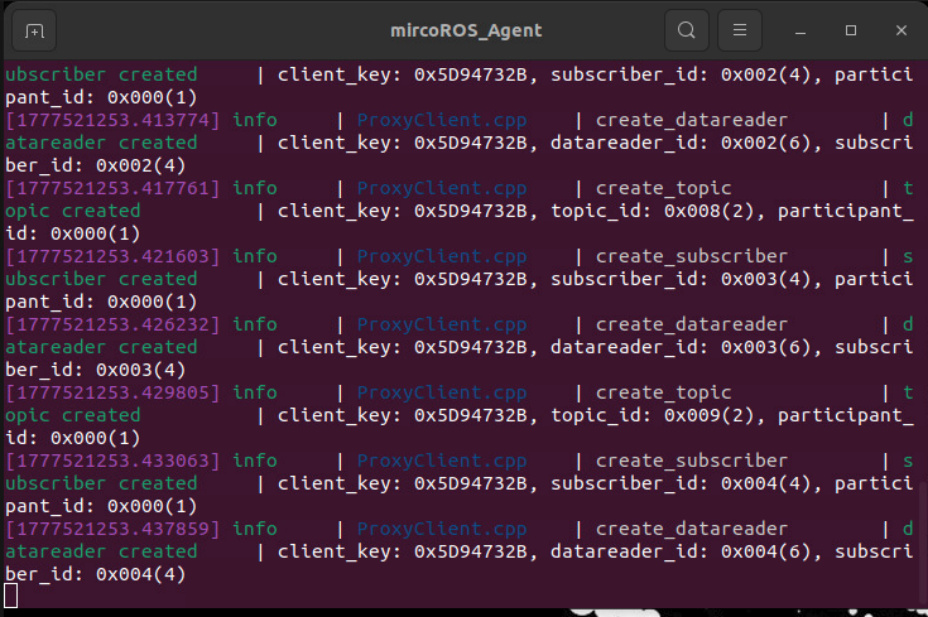
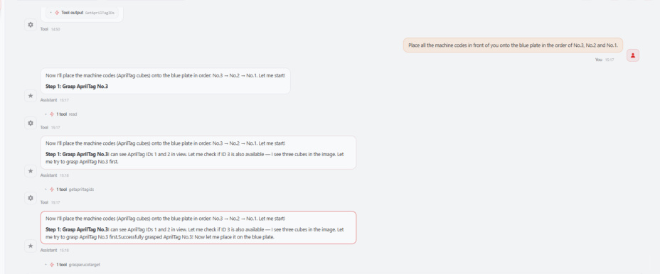
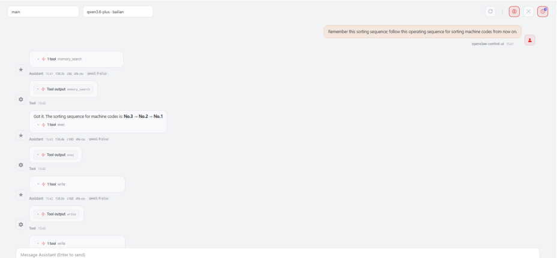
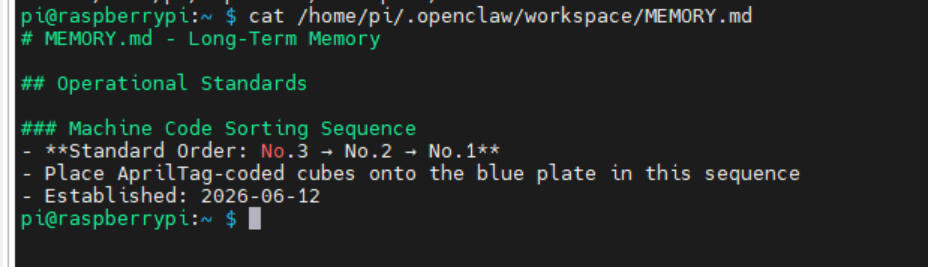
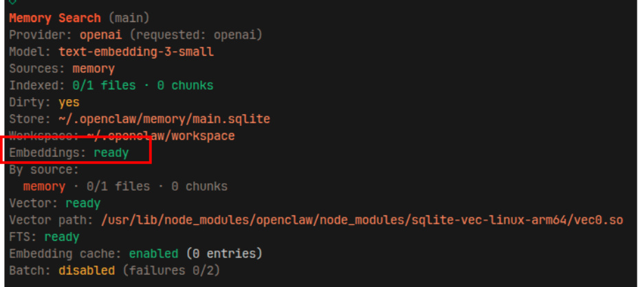
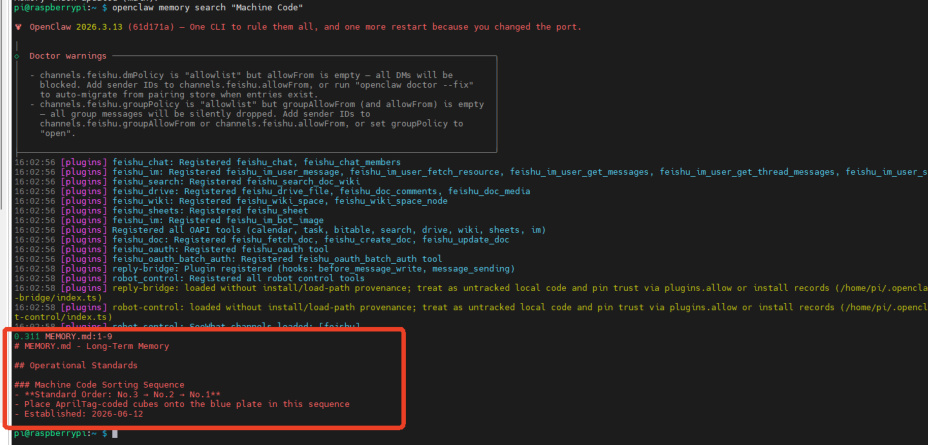

# OpenClaw Vector Memory
**OpenClaw Vector Memory**

1. Course Content

Course Overview

What is Vector Memory?

How It Works

Use Cases

Workflow

Features

2. Preparation

3. Memory Function Demonstration Case

4. Retrieving Memories via Vector Search

### 4.1 Preparation

### 4.2 Configuring the Embeddings Model API Key

### 4.3 Verifying Vector Memory

## 1. Course Content
**Course Overview**

OpenClaw possesses powerful memory capabilities, enabling robots to remember important

information during dialogue and intelligently retrieve and use this memory in subsequent

interactions. This section introduces OpenClaw's Vector Memory (Semantic Memory) system, an

intelligent memory retrieval mechanism based on semantic understanding.

**What is Vector Memory?**

Vector Memory is OpenClaw's built-in **semantic search memory system** . It achieves intelligent

memory retrieval through the following core technologies:

**Vector Embeddings:** Converts memory documents into high-dimensional vector

representations, enabling the computer to understand the semantic meaning of the text.

**Semantic Retrieval:** Matches queries based on semantic similarity—rather than mere

keyword matching—allowing it to understand synonyms and related concepts.

**How It Works**

1. **Vectorization Processing**

representations.

Supports semantic understanding, going beyond simple keyword matching.

2. **Semantic Retrieval**

Matches queries based on their semantic meaning, rather than exact keywords.

Returns the most relevant text snippets along with their location information.

**Use Cases**

|Scenario|Example|
|---|---|
|Recalling Past Decisions|"The previous decision regarding sorting order"|
|Finding Relevant Experience|"How to handle a robotic arm grasping failure"|
|Task Context|"The project the user mentioned last week"|
|Personal Preferences|"The user's preferred interaction style"|

**Workflow**

**Features**

**Intelligent Matching:** Understands synonyms and related concepts.

**Automatic Referencing:** Search results include the file path and line number.

**Complements File Memory:** Vector Memory is used for retrieval, while File Memory is used

for persistent storage.

## 2. Preparation
First, study the [OpenClaw Skills Development] section to master the process of creating new

skills.

Start the MicroROS chassis agent (if it is already running, do not restart it).

Launch nodes such as the odometry, TF, robotic arm assistance, and camera nodes.

Launch the MCP Service

this step can be omitted.

## 3. Memory Function Demonstration Case
[!TIP]

The case presented here serves solely as a demonstration reference; you are free to

engage in conversations according to your own specific needs. The following illustrates

a demonstration scenario, using WebChat as an example.

In this example, we instruct the robot to memorize the current sorting workflow.

Subsequently, during future conversations, we can request that the robot execute sorting

tasks based on this previously established workflow. Alternatively, when encountering

similar tasks, the robot will retrieve relevant memory fragments from its memory bank to

inform its comprehensive reasoning process.

OpenClaw's memory content is stored in a file located at the following path; you can inspect

this file to view the specific content memorized during the case demonstrated above:

## 4. Retrieving Memories via Vector Search
OpenClaw supports the slicing and retrieval of memory documents using vector-based

methods. This approach is particularly well-suited for performing semantic searches within

large-scale memory archives.

[!TIP]

OpenClaw's built-in default method is **full-text search mode**, which is suitable for the

vast majority of use cases. If you have higher requirements regarding memory

capabilities, you can refer to the tutorial below to enable **vector memory mode** by

integrating an external **embeddings** model.

### 4.1 Preparation
You need to register an account with a provider that offers **embeddings** models. The

demonstration below uses the **OpenRouter** platform as an example; for account

registration and API key application instructions, please refer to the tutorial: [AI Large Model

Development — Registering Model Service Accounts — 3. OpenRouter Platform Account].

### 4.2 Configuring the Embeddings Model API Key
Set the model provider (using the OpenAI API protocol):

Set the `baseUrl` . Here, OpenRouter is used as an example; if you are using an **embeddings**

Set the **embeddings** model name. Here, `"openai/text`  - `embedding`  - `3`  - `small"` is used as an

example; if you are using a different **embeddings** model, replace this with the actual model

name:

Set the **embeddings** model's API Key:

Restart the OpenClaw gateway for the changes to take effect:

### 4.3 Verifying Vector Memory
Check the status of the vector memory configuration to ensure it is active. If the output

appears as shown below, the configuration was successful (the "Vector" field indicates the

file path of the data slices):

After completing the initial configuration, you may manually update the index once:

Test whether the memory retrieval function can successfully retrieve the memory snippets

from the demonstration case described above.

degree of semantic similarity. Typically, results with a score greater than 0.3 are considered

to have good relevance.

