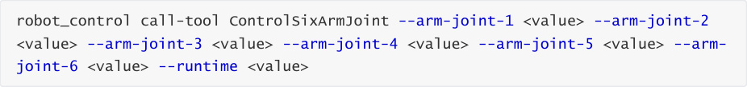

# Tool Commands
**MoveWithSpeed**

Controls the movement of the robot's omnidirectional chassis using velocity commands.

|Parameter|Type|Required|Description|
|---|---|---|---|
|--`linear`-`x`|number|no|Linear velocity in the X direction|
|--`linear`-`y`|number|no|Linear velocity in the Y direction|
|--`angular`-`z`|number|no|Angular velocity around the Z-axis|
|--`duration`|number|no|Duration of movement (in seconds)|

**Move**

Controls the robot's chassis to move a specified distance.

|Parameter|Type|Required|Description|
|---|---|---|---|
|--`distance`|number|yes|Movement distance (in meters)|
|-- `direction`|string|no|Movement direction: 'forward', 'backward', 'left' (strafe), 'right' (strafe)|

**GetCurrentArmJointAngles**

Retrieves the current joint angles of the robotic arm.

**GetEndEffectorPose**

Retrieves the pose (position and orientation) of the end effector (including the gripper and

camera).

**ControlSixArmJoint**

Simultaneously controls all 6 joints of the robotic arm; Joint 6 controls the gripper angle.

|Parameter|Type|Required|Description|
|---|---|---|---|
|--`arm`-`joint`- `1`|integer|Yes|Angle for Joint 1|
|--`arm`-`joint`- `2`|integer|Yes|Angle for Joint 2|
|--`arm`-`joint`- `3`|integer|Yes|Angle for Joint 3|
|--`arm`-`joint`- `4`|integer|Yes|Angle for Joint 4|
|--`arm`-`joint`- `5`|integer|Yes|Angle for Joint 5|
|--`arm`-`joint`- `6`|integer|Yes|Gripper angle; range [0, 180], where 180 = fully open, 0 = fully closed.|
|--`runtime`|integer|No|Duration of the movement (in milliseconds); a lower value results in faster movement. Default: 1500; Range: [0, 2000].|

**ControlSingleArmJoint**

Sets a single joint of the robotic arm to a specified angle.

|Parameter|Type|Required|Description|
|---|---|---|---|
|--`arm`-`joint`- `id`|integer|Yes|Joint ID (1-6), corresponding to robotic arm joints 1 through 6; Joint 6 corresponds to the gripper.|
|--`angle`|integer|Yes|Target angle; for Joint 6 (gripper), the range is [0, 180], where 180 = fully open, 0 = fully closed.|
|--`runtime`|integer|No|Movement duration (milliseconds); a smaller value results in faster movement. Default: 1500. Range: [0, 2000].|

**Place**

Place an object at the specified coordinates.

|Parameter|Type|Required|Description|
|---|---|---|---|
|--`place`-`x`|number|Yes|X-coordinate (meters)|
|--`place`-`y`|number|Yes|Y-coordinate (meters)|
|--`place`-`z`|number|Yes|Z-coordinate (meters)|

**Pick**

Pick up an object.

|Parameter|Type|Required|Description|
|---|---|---|---|
|--`x1`|integer|Yes|X1-coordinate of the target object's top-left corner|
|--`y1`|integer|Yes|Y1-coordinate of the target object's top-left corner|
|--`x2`|integer|Yes|X2-coordinate of the target object's bottom-right corner|
|--`y2`|integer|Yes|Y2-coordinate of the target object's bottom-right corner|

**AdjustCameraView**

Adjusts the camera's viewpoint using pitch and yaw angles, and returns the adjusted image.

|Parameter|Type|Required|Description|
|---|---|---|---|
|--`pitch`|integer|No|Pitch angle adjustment: positive = up, negative = down. Recommended step size: 5–10 degrees.|
|--`yaw`|integer|No|Yaw angle adjustment: positive = right, negative = left. Recommended step size: 5–10 degrees.|

**SeeWhat**

Captures an image from the camera and returns the file path where the image is saved.

**InitArmPose**

Restores the robotic arm to its preset initial pose.

**GetBbox**

Detects a target object based on a description and returns its bounding box coordinates.

|Parameter|Type|Required|Description|
|---|---|---|---|
|--`query`|string|Yes|A description of the target object's position and visual features within the current view.|

**GetPlacePoint**

Identifies the coordinates for a placement point and verifies whether it lies within the robotic

arm's reachable workspace.

|Parameter|Type|Required|Description|
|---|---|---|---|
|--`query`|string|Yes|A description of the target placement point's position and visual features.|

**AdjustChassisFitArmRange**

Quickly adjust the mobile chassis to position the target point within the robotic arm's workspace.

|Parameter|Type|Required|Description|
|---|---|---|---|
|--`x`|number|Yes|Target X-coordinate (m)|
|--`y`|number|Yes|Target Y-coordinate (m)|
|--`z`|number|Yes|Target Z-coordinate (m)|

**RecordMapLocation**

Save the current location to the map file.

|Parameter|Type|Required|Description|
|---|---|---|---|
|--`name`|string|Yes|Location name|
|--`symbol`|string|Yes|Location identifier|

**GetMapMapping**

Retrieve the mapping between all location names and their corresponding identifiers

**Navigation**

Navigate to a target location using its identifier

|Parameter|Type|Required|Description|
|---|---|---|---|
|--`location`|string|yes|The identifier corresponding to the location in the map mapping file|

**GetWasteRecognitionResults**

Retrieve waste recognition results from the YOLO model

**GraspWaste**

Grasp a waste object

|Parameter|Type|Required|Description|
|---|---|---|---|
|--`waste`- `name`|string|yes|The name of the waste object to be grasped (obtained from the waste recognition results)|

**PlaceWaste**

Place a waste object

**TTS**

Robot voice broadcast (Text-to-Speech)

|Parameter|Type|Required|Description|
|---|---|---|---|
|--`text`|string|yes|The text to be broadcast|

**Rotate**

Rotate in place by a specified angle

|Parameter|Type|Required|Description|
|---|---|---|---|
|--`angle`|number|yes|Rotation angle (in degrees); negative = clockwise/right, positive = counter-clockwise/left|

**TargetTrack**

Visual tracking of a target object

|Parameter|Type|Required|Description|
|---|---|---|---|
|--`x1`-`or`-`cmd`|string|yes|Enter the string "cancel" to stop tracking; enter an integer as the x1 coordinate of the target tracking bounding box (JSON string)|
|--`y1`|string|no|JSON string|
|--`x2`|string|no|JSON string|
|--`y2`|string|no|JSON string|

**GetTargetDist**

Calculates the distance between a target and the robot's chassis based on the object's

description.

|Parameter|Type|Required|Description|
|---|---|---|---|
|--`query`|string|yes|A description of the target object's position and visual features within the current field of view|

**GraspArUcoTarget**

Grasps an AprilTag target with the specified ID.

|Parameter|Type|Required|Description|
|---|---|---|---|
|--`target`-`id`|integer|yes|The ID of the AprilTag to be grasped|

**GetAprilTagIDs**

Retrieves the IDs of AprilTags currently within the field of view.

**FollowLine**

Follows a colored line on the ground.

|Parameter|Type|Required|Description|
|---|---|---|---|
|--`color`|string|yes|The color of the line to follow; options: red, green, blue, yellow|

**Useful Commands**

**Command Summary Table**

|Command|Parameters|Function|
|---|---|---|
|MoveWithSpeed|--`linear`-`x` ,--`linear`-`y` ,-- `angular`-`z` ,--`duration`|Controls the robot's omnidirectional chassis movement via velocity commands|
|Move|--`distance` ,--`direction`|Controls the robot's chassis to move a specified distance|
|GetCurrentArmJointAngles|None|Retrieves the current angles of each joint of the robotic arm|
|GetEndEffectorPose|None|Retrieves the pose (position and orientation) of the end effector (including the gripper and camera)|
|ControlSixArmJoint|--`arm`-`joint`-`1` ~ --`arm`-`joint`- `6` ,--`runtime`|Simultaneously controls the 6 joints of the robotic arm; Joint 6 controls the gripper angle|
|ControlSingleArmJoint|--`arm`-`joint`-`id` ,--`angle` ,-- `runtime`|Sets a single joint of the robotic arm to a specified angle|
|Place|--`place`-`x` ,--`place`-`y` ,-- `place`-`z`|Places an object at a specified coordinate position|
|Pick|--`x1` ,--`y1` ,--`x2` ,--`y2`|Picks up an object|
|AdjustCameraView|--`pitch` ,--`yaw`|Adjusts the camera's field of view using pitch and yaw angles|
|SeeWhat|None|Captures an image from the camera and returns the path where the image is saved|
|InitArmPose|None|Restores the robotic arm to its preset initial pose|
|GetBbox|--`query`|Detects and returns the bounding box coordinates of a target object based on a description|
|GetPlacePoint|--`query`|Finds the coordinates for a placement point and checks if it lies within the robotic arm's reachable workspace|

|Command|Parameters|Function|
|---|---|---|
|AdjustChassisFitArmRange|--`x` ,--`y` ,--`z`|Quickly adjusts the mobile chassis to ensure the target point falls within the robotic arm's working range|
|RecordMapLocation|--`name` ,--`symbol`|Saves the current location to the map mapping file|
|GetMapMapping|None|Retrieves the mapping relationship between all location names and their corresponding identifiers|
|Navigation|--`location`|Navigates to a target location using the target point's identifier|
||GetWasteRecognitionResults|None|
|GraspWaste|--`waste`-`name`|Grasps a waste object|
|PlaceWaste|None|Places a waste object|
|TTS|--`text`|Robot voice broadcast|
|Rotate|--`angle`|Rotates in place by a specified angle|
|TargetTrack|--`x1`-`or`-`cmd` ,--`y1` ,--`x2` ,--`y2`|Visual tracking of a target object|
|GetTargetDist|--`query`|Calculates the distance between a target object and the robot chassis based on an object description|
|GraspArUcoTarget|--`target`-`id`|Grasps an AprilTag target with a specified ID|
|GetAprilTagIDs|None|Retrieves the IDs of AprilTags currently within the field of view|
|FollowLine|--`color`|Follows a colored line on the ground|
