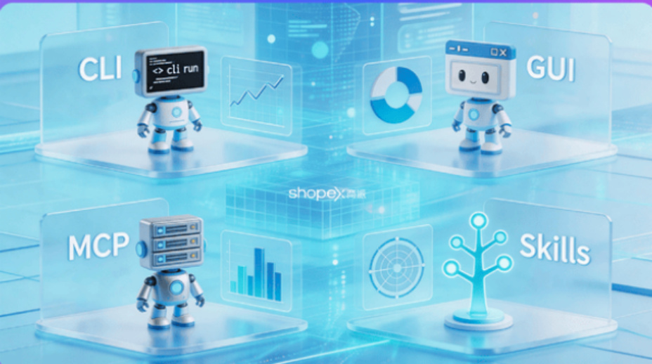
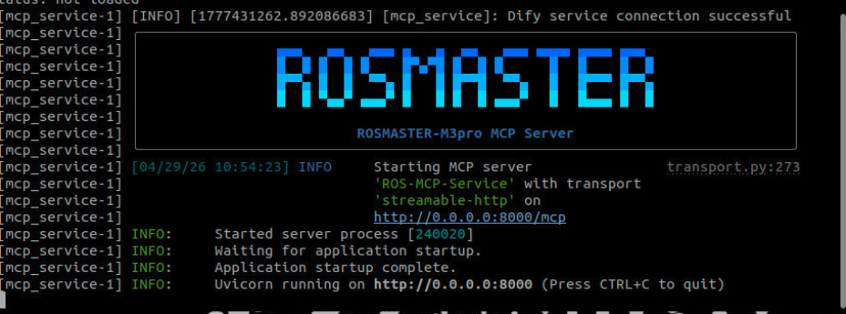
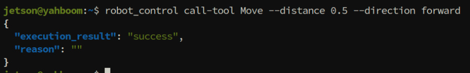
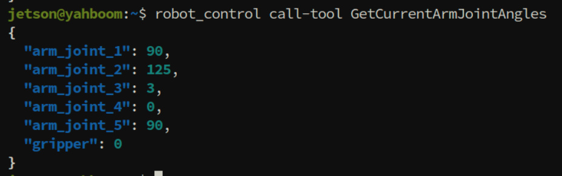
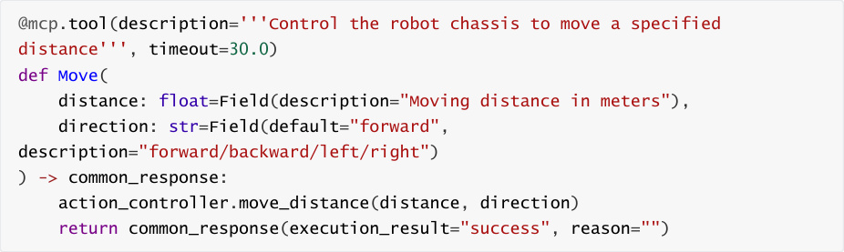

# Robot CLI Command Tool
**Robot CLI Command Tool**

1. Course Content

Course Overview

Learning Objectives

2. Preparation

3. Introduction to CLI Tools

### 3.1 What is a Robot CLI Control Tool?

### 3.2 Why are CLI command tools needed?

4. Communication Architecture for CLI-Controlled Robots

5. Launching the MCP Service

6. Controlling the Robot via CLI

### 6.1 CLI Command Overview

### 6.2 Command Format

### 6.3 Examples

7. Source Code Analysis

### 7.1 MCP Service

### 7.2 CLI Source Code

## 1. Course Content
**Course Overview**


This section explains the use of the robot CLI (Command Line Interface) command tool.

Through the command line interface, users can directly control various functions of the

robot, such as chassis movement, robotic arm manipulation, visual recognition, navigation

and positioning, and waste sorting.

The CLI command tool encapsulates all MCP Tool interfaces, allowing for quick robot control

without relying on AI models, facilitating functional testing and debugging.

Compared to indirectly controlling robots through AI platforms such as OpenClaw, the CLI

command tool provides a more direct and efficient interaction method, suitable for

developers to perform functional verification, interface testing, and secondary development.


**Learning Objectives**


1. Understand the functional positioning and application scenarios of robot CLI command

tools.

2. Be familiar with the functions, parameters, and usage formats of CLI commands.
## 2. Preparation
Start the MicroROS chassis agent (if already started, no need to start again)


Start nodes such as odometry, tf, robotic arm assistance, and camera nodes.


## 3. Introduction to CLI Tools
### 3.1 What is a Robot CLI Control Tool?
A robot CLI (Command Line Interface) control tool is a command-line-based robot control


with the MCP server. It encapsulates the robot's low-level control interface, transforming complex

ROS2 communication into concise command-line instructions. Users can control the robot to

perform various actions simply by entering commands in the terminal.

### 3.2 Why are CLI command tools needed?
**Direct Remote SSH Control:** By remotely logging into the robot's terminal via SSH, users can

directly execute CLI commands to control the robot.

**AI-Independent Direct Control:** Bypassing AI platforms such as OpenClaw, users can

rapidly manipulate the robot directly through the command-line interface, thereby reducing

system dependencies and latency.

**Independent Function Testing:** Specific functions can be invoked individually for testing

purposes; this avoids the "black box" nature of AI-driven operations, making it easier to

pinpoint and troubleshoot issues.

**Rapid Interface Verification:** The CLI allows for the rapid iteration and testing of all robot

control interfaces—verifying both functional completeness and parameter ranges—to

ensure that every module is operating correctly.

**Native AI-to-CLI Compatibility:** AI models are inherently compatible with command-line

interfaces; this enables AI to directly generate and execute CLI commands to control the

robot, facilitating highly efficient collaboration between AI and the CLI.

## 4. Communication Architecture for CLI-Controlled
**Robots**

```
 ┌─────────────┐

 │ CLI Tool  │

 └──────┬──────┘

```



```
 │ MCP Protocol

 ▼

 ┌─────────────┐

 │ MCP Server │

 └──────┬──────┘

 │

 ▼

 ┌──────────────────────────┐

 │ ROS2 Communication Stack │

 │ Topics/Services/Actions │

 └──────┬───────────────────┘

 │

 ▼

 ┌───────────────────────┐

 │ Hardware Driver Layer │

 └──────┬────────────────┘

 │

 ▼

 ┌────────────────┐

 │ Robot Hardware │

 └────────────────┘

## 5. Launching the MCP Service
```

Launch via Terminal



## 6. Controlling the Robot via CLI
### 6.1 CLI Command Overview
This section provides a summarized overview of the CLI commands. For complete

documentation on CLI usage, please refer to the "CLI Command Summary" document

located in the tutorial folder for this section.


|Command|Parameters|Function|
|---|---|---|
|MoveWithSpeed|--`linear`-`x` ,--<br>`linear`-`y` ,--<br>`angular`-`z` ,--<br>`duration`|Control the robot's omnidirectional<br>base movement via velocity<br>commands|
|Move|--`distance` ,--<br>`direction`|Control the robot's base to move a<br>specified distance|
|GetCurrentArmJointAngles|None|Retrieve the current angles of each<br>robotic arm joint|
|GetEndEffectorPose|None|Retrieve the pose (position and<br>orientation) of the end-effector<br>(including gripper and camera)|
|ControlSixArmJoint|--`arm`-`joint`-`1` ~ --<br>`arm`-`joint`-`6` ,--<br>`runtime`|Simultaneously control all 6 robotic<br>arm joints; Joint 6 controls the gripper<br>angle|
|ControlSingleArmJoint|--`arm`-`joint`-`id` ,<br>--`angle` ,--<br>`runtime`|Set a single robotic arm joint to a<br>specified angle|
|Place|--`place`-`x` ,--<br>`place`-`y` ,--<br>`place`-`z`|Place an object at a specified<br>coordinate position|
|Pick|--`x1` ,--`y1` ,--`x2` ,<br>--`y2`|Pick up an object|
|AdjustCameraView|--`pitch` ,--`yaw`|Adjust the camera's field of view via<br>pitch and yaw angles|
|SeeWhat|None|Capture an image from the camera<br>and return the image's save path|
|InitArmPose|None|Restore the robotic arm to its preset<br>initial pose|
|GetBbox|--`query`|Detect and return the bounding box<br>coordinates of a target object based<br>on a description|
|GetPlacePoint|--`query`|Retrieve placement coordinates and<br>check if they lie within the robotic<br>arm's reachable workspace|
|AdjustChassisFitArmRange|--`x` ,--`y` ,--`z`|Quickly adjust the mobile chassis to<br>bring the target point within the<br>robotic arm's working range|
|RecordMapLocation|--`name` ,--`symbol`|Save the current position to the map<br>mapping file|


|Command|Parameters|Function|
|---|---|---|
|GetMapMapping|None|Retrieve the mapping relationship<br>between all location names and their<br>corresponding identifiers|
|Navigation|--`location`|Navigate to a target location using its<br>identifier|
|GetWasteRecognitionResults|None|Retrieve waste recognition results<br>from the YOLO model|
|GraspWaste|--`waste`-`name`|Grasp a waste object|
|PlaceWaste|None|Place a waste object|
|TTS|--`text`|Robot voice broadcast|
|Rotate|--`angle`|Rotate in place by a specified angle|
|TargetTrack|--`x1`-`or`-`cmd`,--<br>`y1`,--`x2`,--`y2`|Visual tracking of a target object|
|GetTargetDist|--`query`|Calculate the distance between a<br>target object and the robot chassis<br>based on the object's description|
|GraspArUcoTarget|--`target`-`id`|Grasp an AprilTag target with a<br>specified ID|
|GetAprilTagIDs|None|Retrieve the IDs of AprilTag tags<br>currently within the field of view|
|FollowLine|--`color`|Follow a colored line on the ground|

### 6.2 Command Format
All CLI commands adhere to a unified command format:


of parameters vary for different commands.


### 6.3 Examples
Move the robot chassis forward by 0.5 meters:




Retrieve the angles of all joints on the robotic arm:





[!TIP]


When accessing the MCP server via the CLI, the CLI tool requires importing Python

libraries during initialization, resulting in a "cold start" delay of approximately 2–3

seconds.

## 7. Source Code Analysis
### 7.1 MCP Service
For details, please refer to [03-openclaw: Integrating Robot MCP Interfaces], where this topic

has been explained in depth.

### 7.2 CLI Source Code
The source code for the CLI tool registers various robot control functions as "MCP Tools" via the


moves the robot chassis a specified distance) as an example to explain the source code:





Code Explanation:


1. **@mcp.tool()** : A decorator from the FastMCP framework used to register this function as a


specifies the direction of movement (forward/backward/left/right). Both parameters utilize


encapsulates the Action-based communication interface with the robot's hardware.

4. **common_response** : A standardized return format. `execution_result` indicates the


event of a failure.
