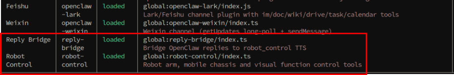
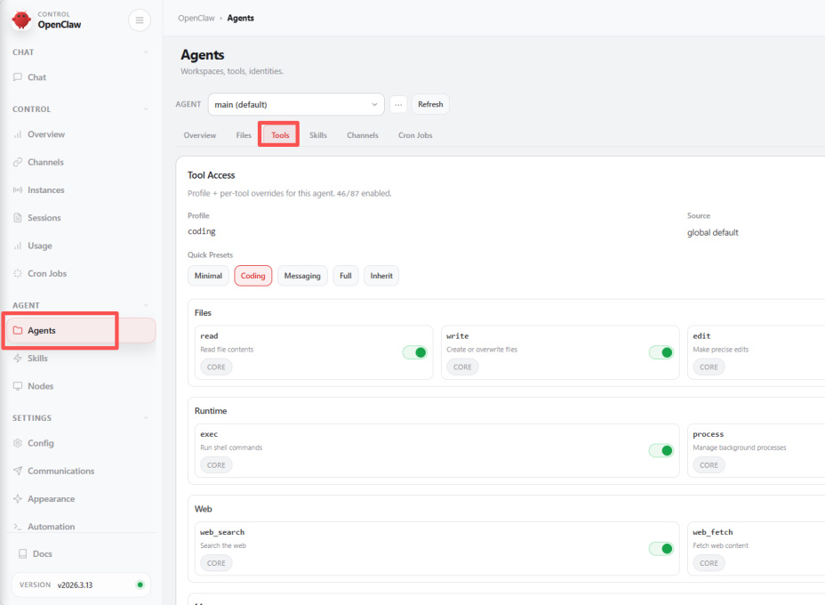
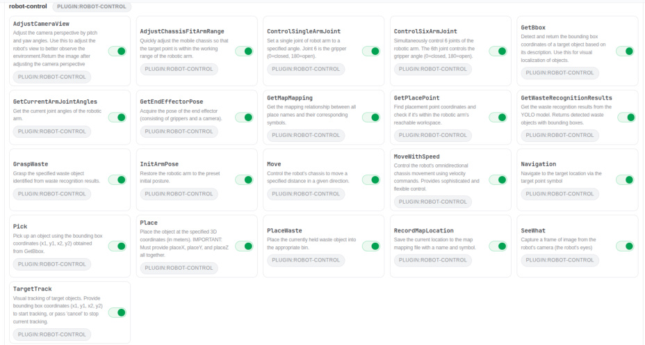
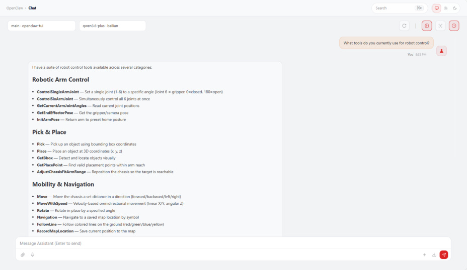
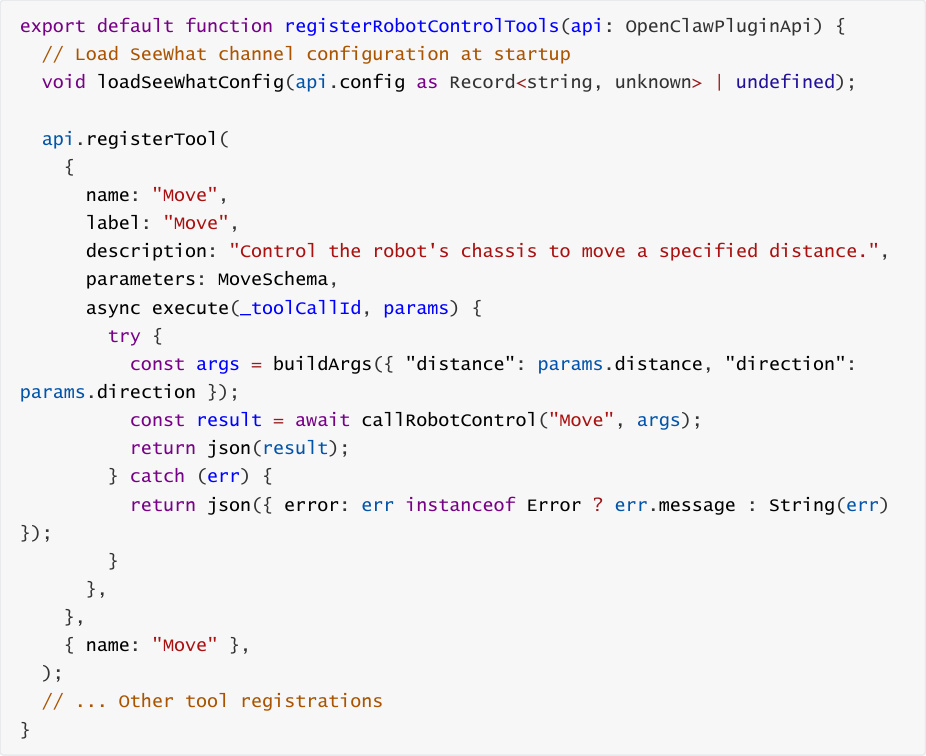

# Robot-Control Plugin Tool
**Robot-Control Plugin Tool**

1. Course Content

Course Overview

Learning Objectives

2. Preparation

3. OpenClaw Plugins

4. Introduction to the robot-control Plugin

5. Plugin Tool Management

6. Source Code Analysis

### 6.1 Plugin Entry Point and Tool Registration

### 6.2 MCP Client Communication

## 1. Course Content
**Course Overview**


The robot-control plugin is the core plugin for OpenClaw robot control. It acts as a bridge

between OpenClaw AI and robot hardware, translating user's natural language commands

into specific robot operation commands via the MCP protocol.

The plugin encapsulates over 20 robot control

tools, including chassis movement, robotic arm control, vision recognition, navigation and

positioning, and waste sorting, providing a unified management interface and API.


**Learning Objectives**


1. Understand the role and function of the robot-control plugin within the OpenClaw

framework.

2. Master the installation, viewing, and basic management operations of the plugin.

3. Understand the working principle of the plugin communicating with the robot via the MCP

protocol.

4. Be able to manage and call robot control tools through the OpenClaw WebChat interface.
## 2. Preparation
Start the MicroROS chassis agent (if already started, no need to start again)


Start the odometry, tf, robotic arm assistance, camera nodes, etc.


Start the MCP service


## 3. OpenClaw Plugins
Introduction to Plugin Functionality


The OpenClaw plugin system is part of the OpenClaw... The platform's functionality extension

mechanism allows OpenClaw to add various capabilities by installing different plugins. Currently,

the core plugins related to robot control include:


**Robot-Control Plugin** : The core plugin for robot control, providing a comprehensive suite of

robot operation functions such as chassis movement, robotic arm control, visual recognition,

and navigation/localization.

**Reply-Bridge Plugin** : A speech synthesis bridging plugin used to parse OpenClaw's speech

tags, automatically performing speech synthesis and broadcasting the output.

View Installed Plugins




In the plugin list, "Robot-Control" is the plugin used by OpenClaw to control the robot, while

the "Reply-Bridge" plugin is used to parse OpenClaw's speech tags and automatically handle

speech synthesis and broadcasting.

## 4. Introduction to the robot-control Plugin
operational mechanism is as follows:


**Communication Mechanism** : After the LLM within OpenClaw parses a user's natural

language instruction, it utilizes the `robot`   - `control` plugin to invoke the MCP protocol

interface. This passes the instruction to the MCP server, which then uses the ROS2

communication stack to control the robot's hardware and execute the requested action.

**Toolset** : The plugin registers over 20 "MCP Tools" that correspond exactly to the available

CLI command tools, covering functions such as chassis movement, robotic arm control,

visual recognition, navigation/localization, waste sorting, and voice broadcasting.

**Extensibility** : When paired with the `Reply`   - `Bridge` plugin, it enables speech synthesis and

broadcasting capabilities, thereby endowing the robot with the ability to engage in voice
based interactions.


The plugin's communication architecture is illustrated below:

```
 ┌─────────────┐

 │ OpenClaw  │

 └──────┬──────┘

 │

 ▼

 ┌─────────────┐

 │robot-control|

 │  Plugin  |

```

```
 └──────┬──────┘

 │ MCP Protocol

 ▼

 ┌─────────────┐

 │ MCP Server │

 └──────┬──────┘

## 5. Plugin Tool Management
```

Log in to the OpenClaw WebChat interface, then navigate to **Agent**   - **Tools** .


available plugin tools.


functions correspond to the MCP and CLI interfaces).

If you need to manually disable a specific tool, simply click to toggle it off; then, click **Save** to

save the changes and restart the OpenClaw gateway.





You can also directly query OpenClaw to view the currently available robot control tools.

## 6. Source Code Analysis
### 6.1 Plugin Entry Point and Tool Registration
Source Code Directory:





The plugin source code is located in the `index.ts` file within the plugin directory. It utilizes the





Code Explanation:


function) along with associated metadata.

2. **Parameters Schema** : Defines the parameter structure and constraints using


compatible format, and `callRobotControl` is then used to invoke the robot control

interface.

### 6.2 MCP Client Communication
the MCP server over the HTTP protocol:

```
 const MCP_ENDPOINT = "http://localhost:8000/mcp";

 class McpClient {

  private sessionId: string | null = null;

  private initialized = false;

  async ensureInitialized(): Promise<void> {

    if (this.initialized) return;

```

```
    await this.sendRequest("initialize", {

     protocolVersion: "2025-03-26",

     capabilities: {},

     clientInfo: { name: "openclaw-plugin", version: "1.0.0" },

 });

    await this.sendNotification("notifications/initialized");

    this.initialized = true;

 }

  async callTool(name: string, args: Record<string, unknown>) {

    await this.ensureInitialized();

    return await this.sendRequest("tools/call", { name, arguments: args });

 }

 }

```

Code Description:


invocation and sends tool call requests via the JSON-RPC protocol.

2. callRobotControl **Helper Function** : Encapsulates the complete tool calling workflow,

translating CLI-style arguments into the MCP parameter format. It prioritizes direct

invocation via MCP but automatically falls back to CLI command execution in the event of a

failure, thereby ensuring high availability.


command if the direct HTTP call to MCP fails, thereby ensuring the reliability of tool

invocations.
