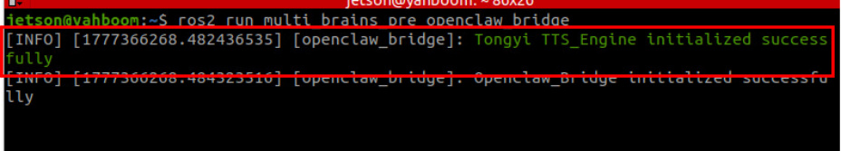
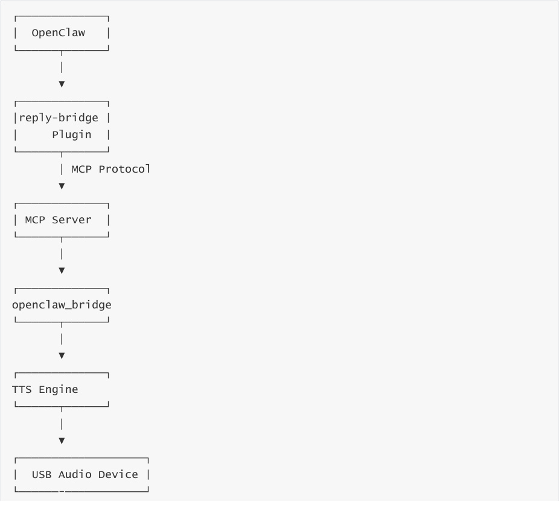
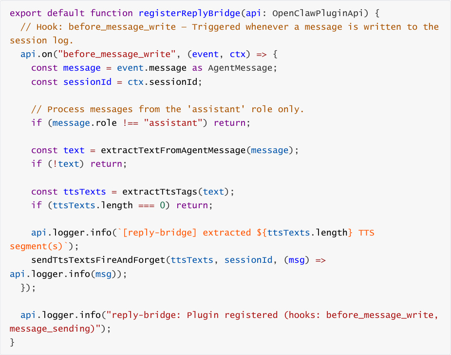
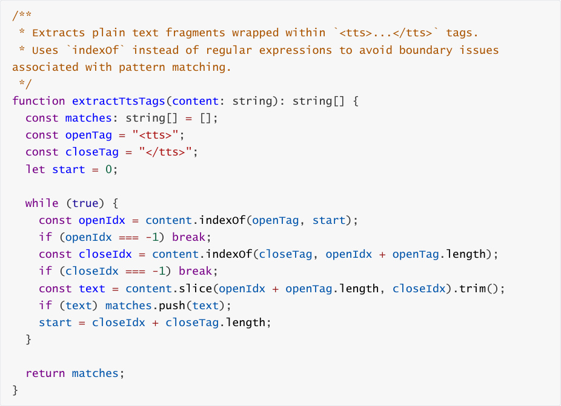

# Reply-Bridge Plugin Tool
**Reply-Bridge Plugin Tool**

1. Course Content

Course Overview

Learning Objectives

2. Prerequisites

4. Demonstration Case

5. Source Code Analysis

### 5.1 Plugin Entry Point and Hook Registration

## 1. Course Content
**Course Overview**

The Reply-Bridge plugin is a speech synthesis bridging plugin for OpenClaw. It listens to

the MCP server's TTS tool for speech synthesis, and plays the speech through a USB audio

device.

When used in conjunction with the `robot`   - `control` plugin, this enables voice-based

conversational interaction for the robot, allowing it to "speak."

**Learning Objectives**

1. Understand the functionality of the `reply`  - `bridge` plugin.

2. Master the installation, inspection, and basic management operations for the plugin.

3. Comprehend the underlying principles of how the plugin utilizes the MCP protocol to invoke

TTS (Text-to-Speech) synthesis.

4. Be able to implement voice broadcasting capabilities within OpenClaw interaction scenarios

## 2. Prerequisites
Launch the MicroROS chassis agent (if already running, do not launch again).

Launch the MCP service.

## 3. Introduction to the reply - bridge  Plugin

The `reply` - `bridge` plugin is an official OpenClaw plugin designed to bridge text-to-speech

synthesis. Its operational mechanism is as follows:

**Listening Mechanism:** The plugin registers two hooks— `before_message_write` and

plugin automatically extracts the text content enclosed within the tags.

**Speech Synthesis:** Utilizing its built-in MCP client, the plugin invokes the `TTS` tool on the

MCP server to convert the extracted text into speech.

ultimately broadcasting the synthesized speech through a USB audio device.

**Deduplication Mechanism:** The plugin features a built-in session-level deduplication

mechanism to prevent the repetition of identical TTS segments. Text content is not repeated

during a conversation, thereby avoiding speech redundancy.

The plugin communication architecture is as follows:

## 4. Demonstration Case
Refer to the sections: [02-openclaw Interaction Methods] — [03-openclaw Voice

Conversation Interaction]
## 5. Source Code Analysis
### 5.1 Plugin Entry Point and Hook Registration
Source Code Directory:

OpenClaw Plugin API. The core code is as follows:

Code Explanation:

1. **Registration Entry Point** : `export default function registerReplyBridge(api)` serves

as the plugin's default export function; OpenClaw automatically invokes this function during

written. This fires when the AI generates a response and writes it to the conversation history,

serving as the primary channel for TTS processing.

3. **Role Filtering** : The condition `message.role !== "assistant"` ensures that only response

messages from the AI assistant are processed, while user messages are ignored.

from the initial message text to the final TTS playback.

5. **"Fire-and-Forget" Mode** : The TTS invocation employs a "fire-and-forget" pattern; it does not

block the message-writing process, thereby ensuring a smooth user experience.

### 5.2 TTS Tag Extraction and Deduplication Mechanism
follows:

Code Explanation:

1. extractTtsTags() : Scans the text segment by segment using `indexOf` to extract all

expressions to avoid edge cases related to special characters and nested pattern matching,

thereby enhancing parsing stability.

the text segments that have already been spoken within each session; this ensures that the

same text is not repeated during a single session, thereby preventing speech redundancy.
