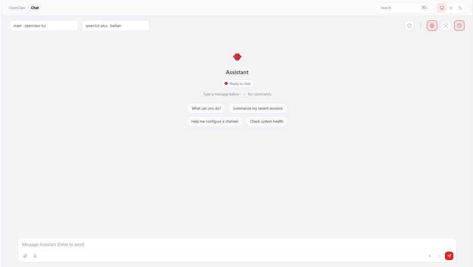
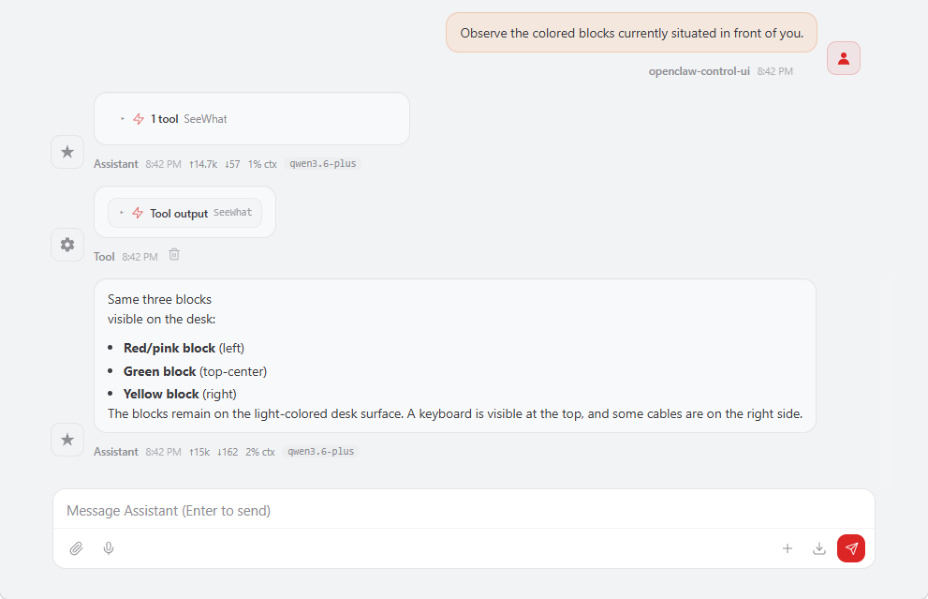
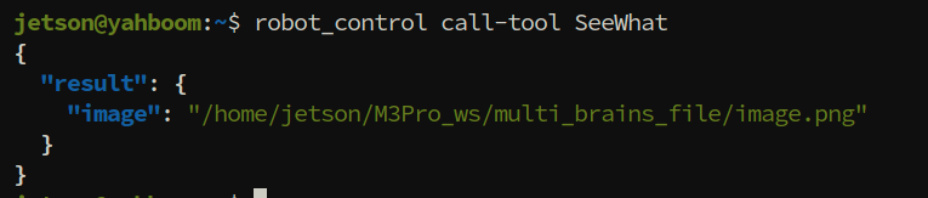
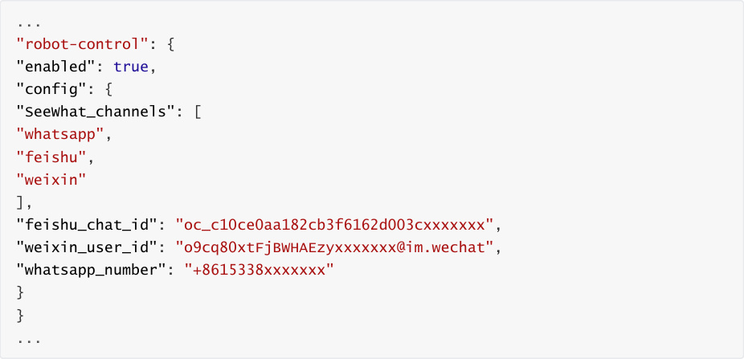
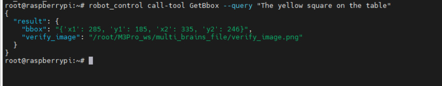
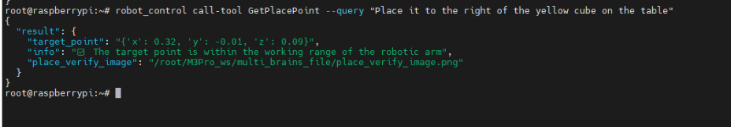
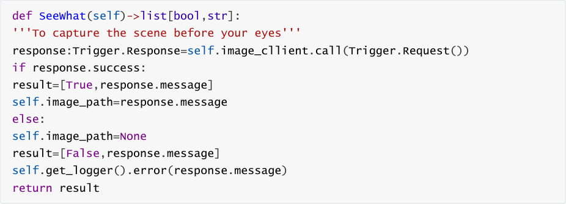
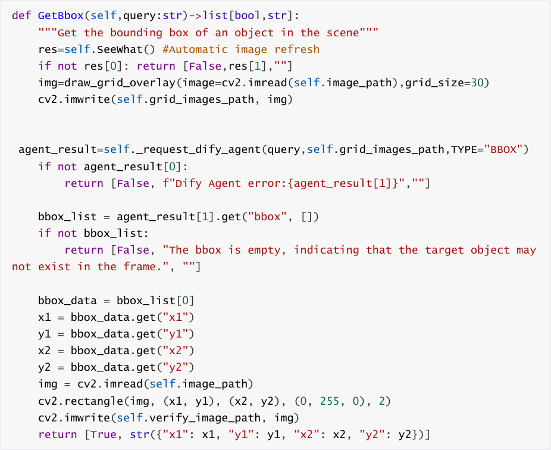
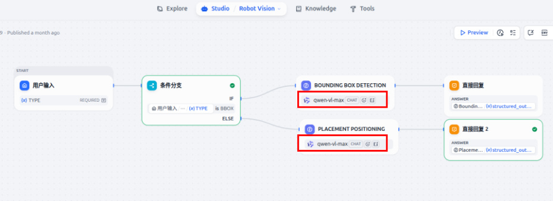

# OpenClaw Multimodal Vision
**OpenClaw Multimodal Vision**

1. Course Content

Course Overview

Learning Objectives

2. Preparation

3. Vision-related control interfaces

4. Case Demonstration

### 4.1 Initiating OpenClaw Interaction

### 4.2 Visual Observation and Comprehension

### 4.3 Configuring SeeWhat's Automatic Sending Channels

#### 4.3.1 Configuring the WhatsApp Channel

### 4.4 Retrieving Target Bounding Box Coordinates

### 4.5 Obtaining Placement Point Coordinates

5. Source Code Analysis

### 5.1 `SeeWhat()`      - Capturing Camera Images

### 5.2 `GetBbox()`      - Retrieving Target Bounding Box Coordinates


6. Functional Q&A

### 6.1 What should I do if the visual model fails to accurately select the target object?

7. Common Issues and Solutions

## 1. Course Content
**Course Overview**


OpenClaw multimodal vision provides visual perception capabilities through the MCP

interface, enabling robots to "understand" their surroundings.

Covers 3 core vision tools: SeeWhat (capture images), GetBbox (detect bounding boxes), and

GetPlacePoint (obtain placement point coordinates).

Supports configuring SeeWhat automatic sending channels to automatically push images

observed by the robot to communication channels such as Lark, WeChat, and WhatsApp.


**Learning Objectives**


1. Understand the functions and uses of the 3 vision control interfaces provided by OpenClaw.

2. Master the configuration method of SeeWhat automatic sending channels.

3. Master the method of directly calling vision tools through CLI.

4. Understand the role of vision tools in the robotic arm grasping process.
## 2. Preparation
The API-KEY of the model supplier in Dify has been configured.

The Dify service has been started and can be accessed normally.

Start the MicroROS chassis agent (if it's already running, no need to repeat the process)


Start the odometry, TF, robotic arm assistance, camera nodes, etc.


Start the MCP service


If you need voice response, you need to start openclaw_bridge separately; otherwise, you

can omit this step.


## 3. Vision-related control interfaces
[!NOTE]


For detailed functions, parameters, and usage of the interfaces, please refer to the

tutorials 【01-Openclaw Access to Robot MCP Interface】 and 【02-Robot CLI

Command Tools】

|Number|Tool Name|Function Description|
|---|---|---|
|1|SeeWhat|Capture camera image and return save path|
|2|GetBbox|Detect bounding box coordinates of target object|
|3|GetPlacePoint|Retrieve Placement Point Coordinates and Check Reachability|


## 4. Case Demonstration
### 4.1 Initiating OpenClaw Interaction
Use any available interaction method to converse with OpenClaw; this demonstration uses

Web Chat.





[!TIP]


You may formulate your conversational prompts according to your specific needs; the

following serves as a case demonstration.

### 4.2 Visual Observation and Comprehension
Observe the colored blocks currently situated in front of you.


When the `SeeWhat` tool on the MCP server is invoked, it automatically saves an image to

allow for a review of the observed content. The image path is:






### 4.3 Configuring SeeWhat's Automatic Sending Channels
This feature enables the robot to automatically transmit images from its observation

viewpoint to designated mobile communication channels whenever it invokes `SeeWhat` to

observe its environment.

Configuration Parameter Path: `$HOME/.openclaw/openclaw.json` . You may either modify

the configuration file directly or configure it using CLI commands; the following example

demonstrates configuration via CLI commands.


[!IMPORTANT]


`SeeWhat_channels` specifies the channels designated for automatic transmission;

images will only be sent to the channels listed within this array.





#### 4.3.1 Configuring the WhatsApp Channel
Set the phone number for the `SeeWhat_channels` WhatsApp configuration.


Restart the gateway for the changes to take effect.


Upon restart, the OpenClaw logs will indicate the channel used for automatic messaging.


[!NOTE]


You can now converse with OpenClaw; whenever vision-related functions are invoked,

images will be automatically sent to the configured communication channel.

### 4.4 Retrieving Target Bounding Box Coordinates
Retrieves the bounding box of a target object. This function is automatically invoked when


provides the capability to retrieve target bounding box coordinates based on natural

language descriptions.


If the target object is present within the camera's field of view, the system will return the

bounding box coordinates as well as the file path to an image annotated with the bounding

box. These bounding box coordinates are subsequently used by the `OpenClaw` tool to

determine the next course of action.


The path to the automatically saved image is:





You can use the image containing the bounding boxes (shown here) to verify whether the

vision model has accurately identified and boxed the target object.


[!IMPORTANT]


The accuracy of the visual bounding box selection depends on the capabilities of the

vision model; this directly impacts the robotic arm's grasping and visual tracking

functions. If the vision model frequently fails to select targets accurately, please refer to
## 6. Function Troubleshooting to modify the vision model within the Robot Vision

application in Dify.


### 4.5 Obtaining Placement Point Coordinates
This tool is used to determine the spatial coordinates of a target placement point—based on

a natural language description—when the robotic arm needs to place an object at a specific

location. It also verifies whether the specified point lies within the robotic arm's operational

workspace.


If a point matching the description exists within the camera's field of view, the tool will return


the path to the verification image, and an indication of whether the point falls within the

robotic arm's operational workspace.


Verification image save path:





## 5. Source Code Analysis
Source Code Path


The following section provides an explanation of the source code for three core vision-related

### 5.1 SeeWhat()  — Capturing Camera Images





**Code Explanation:**


Trigger client) to trigger the camera to take a picture.


an error message is logged.


higher-level functions.

4. **Image Path:** `$HOME/M3Pro_ws/multi_brains_file/image.png`

### 5.2 GetBbox()  — Retrieving Target Bounding Box

**Coordinates**





**Code Explanation:**


that the subsequent detection is based on the current scene.


onto the image, assisting the Dify visual model with pixel-level localization.


along with the conversation history; the parameter `TYPE="BBOX"` instructs the Agent to

return bounding box coordinates.

4. **Result Parsing:** The `bbox` list is extracted from the JSON response returned by the Agent to


5. **Image Verification:** A green rectangular bounding box is drawn onto the original image and

saved as `verify_image.png`, facilitating manual verification of the bounding box's accuracy.

```
 def GetPlacePoint(self,query:str)->list[bool,str]:

    save_result=self.SeeWhat()

    if not save_result[0]:

      return [False, f"SeeWhat error:{save_result[1]}",""]

    img=draw_grid_overlay(image=cv2.imread(self.image_path),grid_size=20)

    cv2.imwrite(self.grid_images_path, img)

  agent_result=self._request_dify_agent(query,self.grid_images_path,TYPE="POINT")

    if not agent_result[0]:

      return [False, f"Dify Agent error:{agent_result[1]}",""]

    point_data = agent_result[1].get("point", {})

    x = point_data.get("x")

    y = point_data.get("y")

    if x==-1 and y==-1:

      return [False, "point is empty; the target point may not exist in the

 frame.", ""]

    img=cv2.imread(self.image_path)

    cv2.circle(img, (x, y), self.target_circle, (0, 0, 0), 2) #circle

    cv2.circle(img, (x, y), 3, (0, 0, 255), -1)        #center

    cv2.imwrite(self.place_verify_image_path, img)

    request = GetTargetPose.Request(x=float(x), y=float(y),

 radius=self.target_circle)

    result:GetTargetPose.Response = self.get_pose_client.call(request)

    if not result.success:

      self.get_logger().error(f"GetTargetPose failed: {result.message}")

      return [False, str(result.message),""]

    point = str({"x": round(result.pose.position.x, 2),

           "y": round(result.pose.position.y, 2),

           "z": round(result.pose.position.z, 2)

 })

    if result.pose.position.x<=self.place_distance[2] and result.pose.position.y

 <= self.place_distance[3]:

```

`msg="` ✅ `The target point is within the working range of the robotic arm"`
```
    else:
```

`msg="` ❌ `The target point is outside the working range of the robotic`
```
 arm"

    return [True,msg,point]

```

**Code Explanation:**


as the placement task requires higher-precision pixel localization.


coordinates of a single point.


location is not present within the current view.


while a solid red dot marks the detected center; the resulting image is saved as


7. **Workspace Range Check:** The converted 3D coordinates are checked to determine if they


readable status message is returned.


**(internal method)**

```
 def _request_dify_agent(self, query:str, image_path: str, TYPE:str):

    with open(image_path, "rb") as file:

      files = {"file": ("image", file, "image/png")}

      response = self.dify_client.file_upload("yahboom", files)

      file_id = response.json().get("id")

    kwargs = {

      "inputs":{"TYPE": TYPE},

      "query":query,

      "user":"yahboom",

      "response_mode":"blocking"

 }

    image = [

 {

        "type": "image",

        "transfer_method": "local_file",

        "upload_file_id": file_id,

 }

 ]

    kwargs["files"] = image

    try:

      chat_response = self.dify_client.create_chat_message(**kwargs)

      chat_response.raise_for_status()

      result:dict = chat_response.json()

      parsed_answer = json.loads(result.get("answer"))

```

```
      res = [True, parsed_answer]

    except Exception as e:

      self.get_logger().error(f"Error: {e}")

      res= [False, str(e)]

    return res

```

**Code Explanation:**


referencing in messages.


the Agent to return either bounding box coordinates or point coordinates.

3. **Image Referencing:** References the previously uploaded image within the message using


4. **Blocking Mode:** Sets `response_mode="blocking"` to wait synchronously for the Agent to

complete its inference.

## 6. Functional Q&A
### 6.1 What should I do if the visual model fails to accurately
**select the target object?**


Switch the visual model currently being used within Dify.

Log in to the Dify Admin Console and update the visual model configured for "Robot Vision."

## 7. Common Issues and Solutions
Please refer to the appendix of this chapter: [Common Issues & Troubleshooting Solutions].



