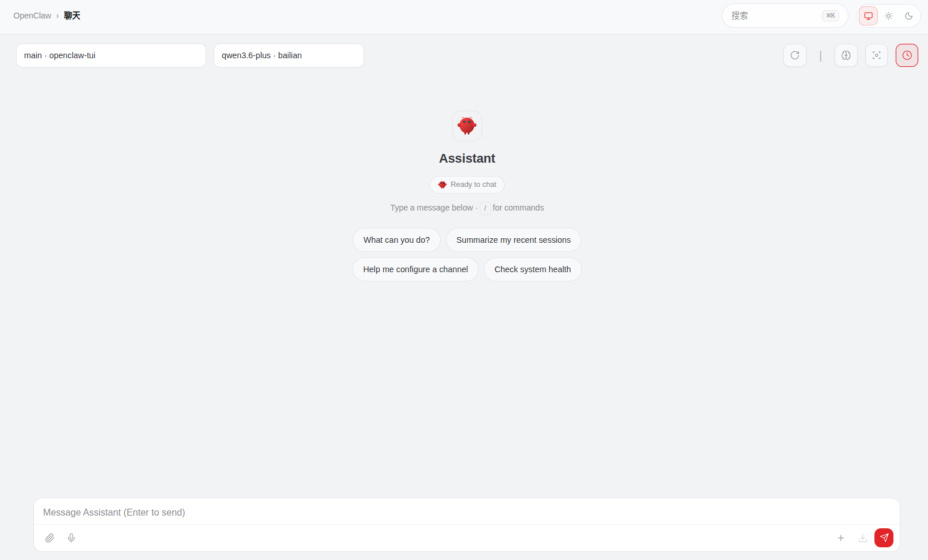
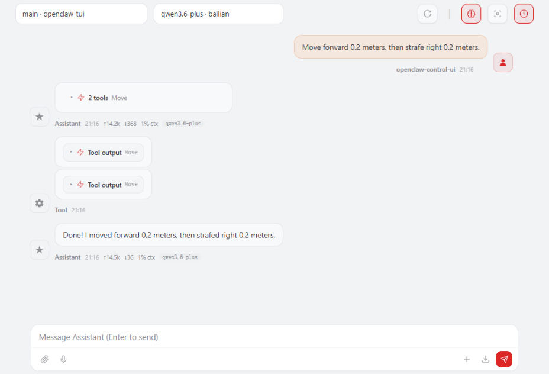
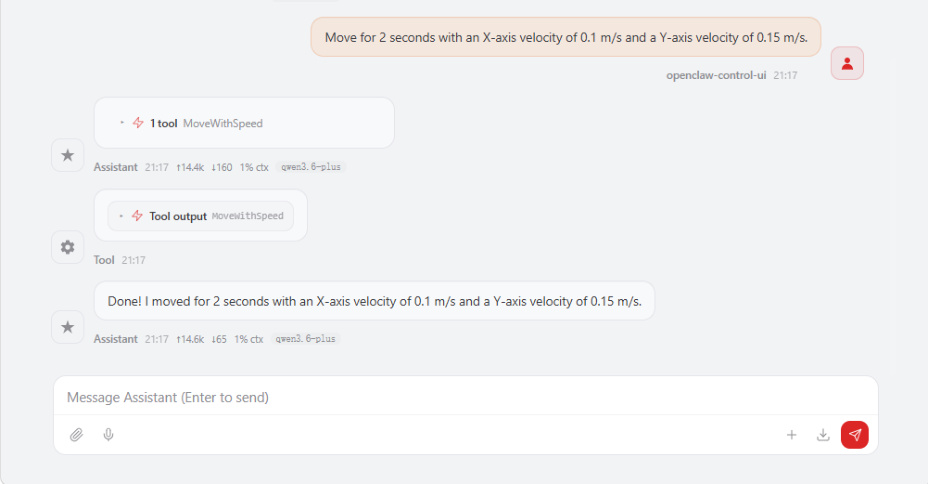
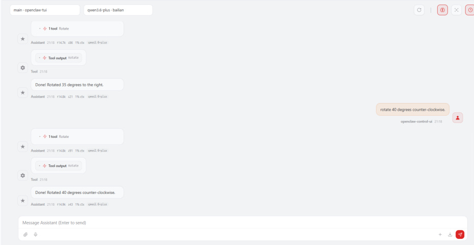
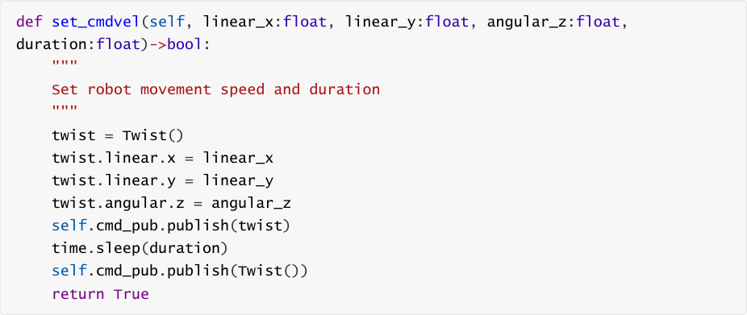

# OpenClaw Chassis Control
**OpenClaw Chassis Control**

1. Course Content

Course Overview

Learning Objectives

2. Preparation

3. Chassis Control Interfaces

4. Demonstration

### 4.1 Initiating OpenClaw Interaction

### 4.2 Chassis Movement Control

### 4.3 Chassis Omnidirectional Movement Control

### 4.4 Chassis In-Place Rotation

5. Source Code Analysis


### 5.2 `move_by_odom()`      - Precise Distance Movement Based on Odometry (Low-Level


### 5.4 Explanation of the Underlying Implementation Architecture

6. Common Issues and Solutions

## 1. Course Content
**Course Overview**


OpenClaw Chassis Control serves as a foundational function for robot motion control.

Through the MCP interface, it provides three chassis control tools: MoveWithSpeed (velocity

control), Move (distance-based movement), and Rotate (in-place rotation).

It supports omnidirectional chassis control, allowing for simultaneous control of linear

velocities in the X and Y directions, as well as angular velocity around the Z-axis, thereby

enabling forward/backward movement, lateral translation, and in-place rotation.

Precise distance and angle control are achieved through Odometry (Odom) feedback,

ensuring high motion accuracy.


**Learning Objectives**


1. Understand the functions and applications of the three chassis control interfaces provided

by OpenClaw.

2. Master the interactive methods—specifically via WebChat—for controlling chassis

movement, omnidirectional motion, and turning.
## 2. Preparation
Launch the MicroROS Chassis Agent (if already running, do not launch again).


Launch the Odometry, TF, Manipulator Assist, Camera, and other relevant nodes.


Launch the MCP Service.


otherwise, this step may be skipped.


## 3. Chassis Control Interfaces
[!NOTE]


For detailed information regarding the functions, parameters, and usage of these

interfaces, please refer to the tutorials: [01-Integrating OpenClaw with the Robot MCP

Interface] and [02-Robot CLI Command Tools].

|No.|Tool Name|Function Description|
|---|---|---|
|1|MoveWithSpeed|Control the robot's omnidirectional chassis velocity|
|2|Move|Move the robot's chassis a specified distance|
|3|Rotate|Rotate in-place by a specified angle|


## 4. Demonstration
### 4.1 Initiating OpenClaw Interaction
Interact with OpenClaw using any available interaction method. Initiating a conversation—

this section demonstrates the process using Web Chat.



[!TIP]


You can formulate the conversational prompts according to your specific

requirements; the following serves as a demonstration example.

### 4.2 Chassis Movement Control
Move forward 0.2 meters, then strafe right 0.2 meters.

### 4.3 Chassis Omnidirectional Movement Control
through the vector composition of velocities. For example:

Move for 2 seconds with an X-axis velocity of 0.1 m/s and a Y-axis velocity of 0.15 m/s.





### 4.4 Chassis In-Place Rotation
Rotate 35 degrees to the right, then rotate 40 degrees counter-clockwise.

## 5. Source Code Analysis
Source Code Path:





The following section provides an explanation of the source code for three core chassis control





**Code Explanation:**


`Twist()` message to bring the robot to a halt.

3. **Omnidirectional Control:** By simultaneously setting the linear velocities (x and y) and the

angular velocity (z), movement in any arbitrary direction is achieved through the vector

composition of these velocities.


**on Odometry (Low-Level Implementation of** Move **)**

```
 def move_by_odom(self, distance: float, direction: str = 'forward') -> bool:

    '''Move a specified distance based on odometer'''

    linear_speed = self.odom_linear_speed

    timeout = self.odom_timeout

    start_pose = self._get_current_odom_pose()

    if start_pose is None:

      self.get_logger().error("Failed to get current odometry position")

      return False

    twist = Twist()

    if direction == 'forward':

      twist.linear.x = abs(linear_speed) if distance >= 0 else
 abs(linear_speed)

    elif direction == 'backward':

      twist.linear.x = -abs(linear_speed) if distance >= 0 else

 abs(linear_speed)

    elif direction == 'left':

      twist.linear.y = abs(linear_speed) if distance >= 0 else
 abs(linear_speed)

    elif direction == 'right':

      twist.linear.y = -abs(linear_speed) if distance >= 0 else

 abs(linear_speed)

    else:

      self.get_logger().error(f"Unknown direction: {direction}")

      return False

    start_time = time.time()

    while rclpy.ok():

      current_time = time.time()

      if current_time - start_time > timeout:

        self.get_logger().warn("Movement timeout")

        self.cmd_pub.publish(Twist())

        return False

      current_pose = self._get_current_odom_pose()

      if current_pose is None:

        time.sleep(0.1)

        continue

      moved_distance = calculate_distance(start_pose, current_pose)

      if moved_distance >= abs(distance) - self.odom_position_tolerance:

        self.cmd_pub.publish(Twist())

```

```
        self.get_logger().info(f"Movement complete! Total distance:

 {moved_distance:.3f}m")

        break

      self.cmd_pub.publish(twist)

      time.sleep(0.1)

    self.cmd_pub.publish(Twist())

    return True

```

**Code Explanation:**


2. **Odometry Loop Control:** Retrieves the current pose using `_get_current_odom_pose()` and

calculates the distance traveled— `calculate_distance(start_pose, current_pose)`
during each loop iteration.

3. **Precision Control:** The operation terminates once the target distance is reached within the


4. **Timeout Protection:** If the target is not reached within the `odom_timeout` duration (default:

30s), the operation terminates and returns a failure status.


**Odometry (Underlying Implementation for** Rotate **)**

```
 def rotate_by_odom(self, angle: float, angular_speed: float = None, timeout:

 float = None) -> bool:

    '''Based on the odometer rotating at a specified angle (angle unit:

 degrees)'''

    if angular_speed is None:

      angular_speed = self.odom_angular_speed

    if timeout is None:

      timeout = self.odom_timeout

    angle_rad = math.radians(angle)

    start_pose = self._get_current_odom_pose()

    if start_pose is None:

      self.get_logger().error("Failed to get current odometry position")

      return False

    start_yaw = get_yaw_from_quaternion(start_pose.orientation)

    target_yaw = start_yaw + angle_rad

    target_yaw = normalize_angle(target_yaw)

    twist = Twist()

    twist.angular.z = abs(angular_speed) if angle >= 0 else -abs(angular_speed)

    start_time = time.time()

    while rclpy.ok():

      current_time = time.time()

      if current_time - start_time > timeout:

        self.get_logger().warn("Rotation timeout")

        self.cmd_pub.publish(Twist())

        return False

```

```
      current_pose = self._get_current_odom_pose()

      if current_pose is None:

        time.sleep(0.1)

        continue

      current_yaw = get_yaw_from_quaternion(current_pose.orientation)

      angle_diff = calculate_angle_diff(target_yaw, current_yaw)

      if abs(angle_diff) <= self.odom_angle_tolerance:

        self.cmd_pub.publish(Twist())

        return True

      self.cmd_pub.publish(twist)

      time.sleep(0.1)

    self.cmd_pub.publish(Twist())

    return False

```

**Code Explanation:**


positive value indicates a clockwise rotation, while a negative value indicates a counter
clockwise rotation.


difference between the current angle and the target angle; the process terminates once the

difference falls within the `odom_angle_tolerance` (default: 0.05 rad ≈ 2.86°).

4. **Direction Determination:** `abs(angular_speed) if angle >= 0 else`

variable.

### 5.4 Explanation of the Underlying Implementation
**Architecture**


|MCP Tool|Underlying<br>Function|Control<br>Method|Precision Mechanism|
|---|---|---|---|
|MoveWithSpeed|`set_cmdvel()`|Open-loop<br>velocity control|No feedback; suitable for<br>rapid start/stop operations|
|Move|`move_by_odom()`|Closed-loop<br>odometry<br>feedback|Position tolerance: ±0.005<br>m|
|Rotate|`rotate_by_odom()`|Closed-loop<br>odometry<br>feedback|Angle tolerance: ±0.05 rad|


[!NOTE]


The three functions listed above are defined within the `ActionController` class and


making them accessible to OpenClaw and the CLI—by registering the `@mcp.tool()`

decorator.
## 6. Common Issues and Solutions
For details, please refer to the "Summary of Common Issues and Solutions" section within

this tutorial chapter.


[!TIP]


For more detailed operational procedures regarding chassis control, please refer to the

"Navigation & Transport" and "Waste Sorting" case studies found in _OpenClaw_

_Embodied AI in Action_ .
