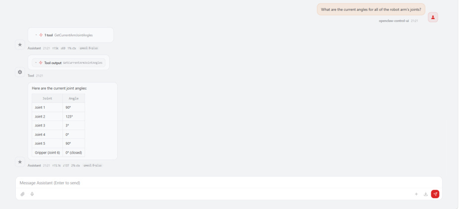
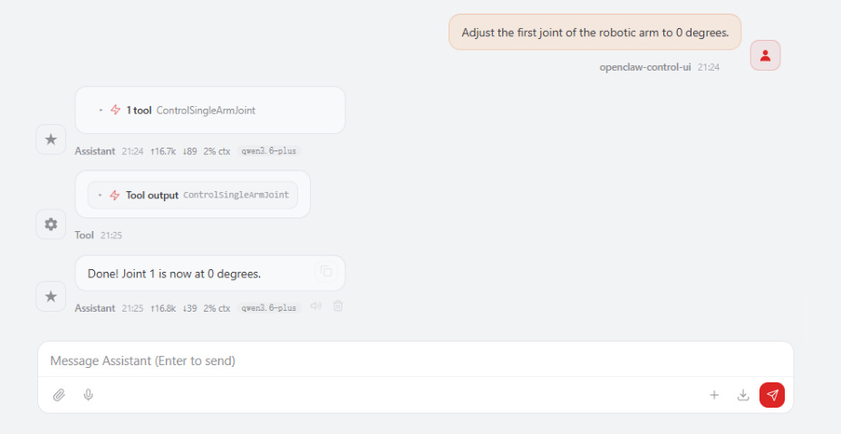
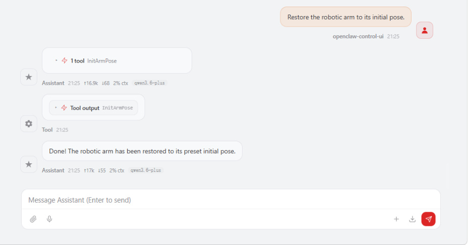
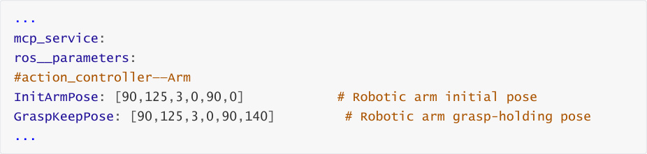
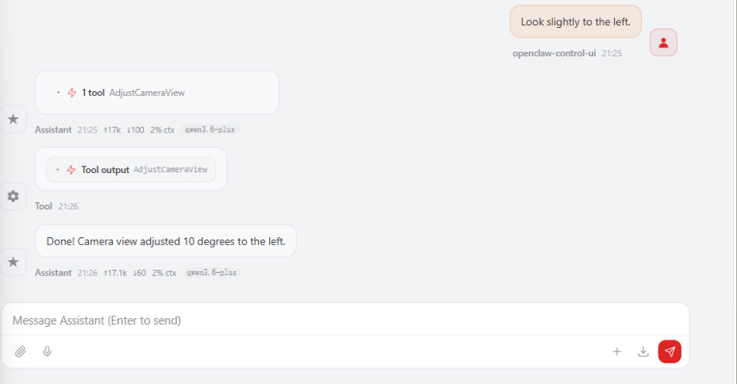
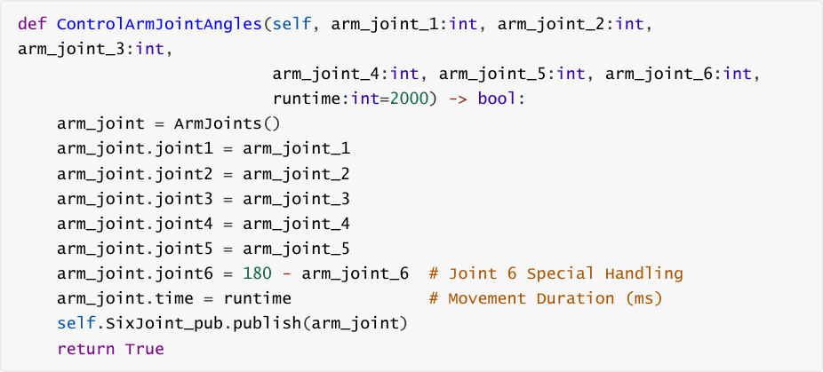
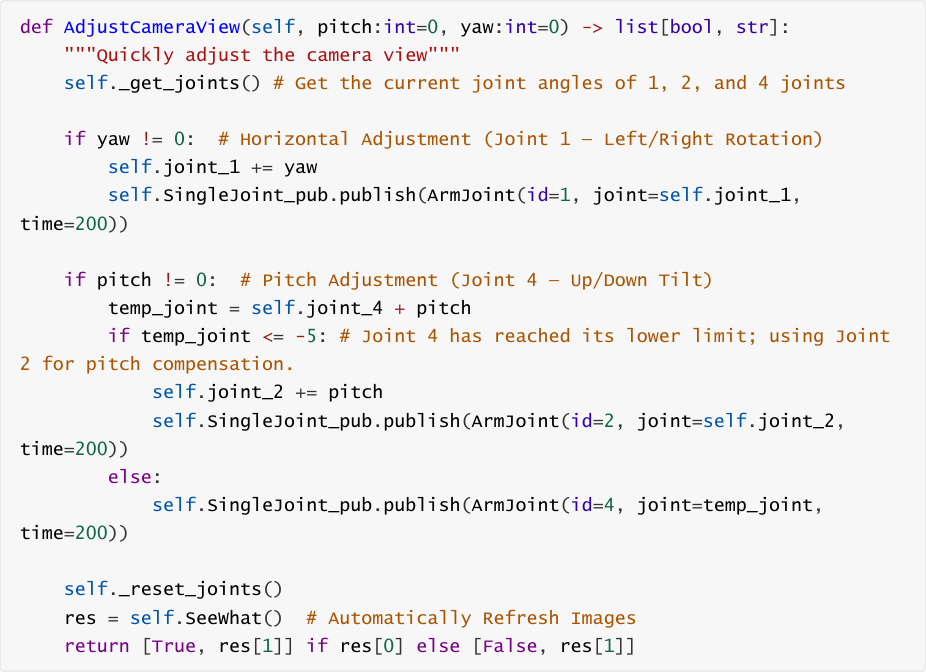
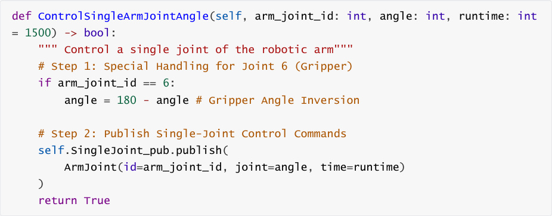

# OpenClaw Robotic Arm Control
**OpenClaw Robotic Arm Control**

1. Course Content

Course Overview

Learning Objectives

2. Preparation

3. Robotic Arm Related Control Interfaces

4. Case Demonstrations

### 4.1 Initiating OpenClaw Interaction

### 4.2 Retrieving Current Robot Arm Joint Angles

### 4.3 Retrieving End-Effector Pose

### 4.4 Simultaneously Controlling All 6 Robot Arm Joints

### 4.5 Controlling Individual Robotic Arm Joints

### 4.6 Restoring the Robotic Arm to its Preset Initial Pose

### 4.7 Adjusting the Camera Viewpoint

5. Source Code Analysis


6. Common Issues and Solutions

## 1. Course Content
**Course Overview**


OpenClaw robotic arm control is one of the core functions of the OpenClaw platform,

translating AI natural language commands into robotic arm control operations via the MCP

protocol.

Covers 8 robotic arm control interfaces: joint angle acquisition, end-effector pose acquisition,

simultaneous multi-joint control, single-joint control, camera view adjustment, and initial

pose recovery.


**Learning Objectives**


1. Understand the interface functions of OpenClaw for controlling robotic arms.

2. Master the practical methods and application scenarios of each robotic arm control

interface.

3. Be able to optimize grasping and placement accuracy by adjusting configuration file

parameters.
## 2. Preparation
The API-KEY of the model provider in Dify has been configured.

The Dify service has been started and can be accessed normally.

Start the MicroROS chassis agent (if it is already started, no need to start it again).


Start nodes such as odometer, TF, robotic arm assistance, and camera nodes


Start the MCP service


If you need voice response, you need to start openclaw_bridge separately; otherwise, you

can omit this step.


## 3. Robotic Arm Related Control Interfaces
[!NOTE]


For detailed information regarding interface functions, parameters, and usage, please

refer to the tutorials: [01-OpenClaw Robot MCP Interface Integration] and [02-Robot CLI

Command Tool].

|No.|Tool Name|Function Description|
|---|---|---|
|1|GetCurrentArmJointAngles|Retrieve current robot arm joint angles|
|2|GetEndEffectorPose|Retrieve end-effector pose|
|3|ControlSixArmJoint|Simultaneously control all 6 robot arm joints|
|4|ControlSingleArmJoint|Control a single robot arm joint to a specified angle|
|5|AdjustCameraView|Adjust camera view|
|6|InitArmPose|Restore robot arm to preset initial pose|


## 4. Case Demonstrations
### 4.1 Initiating OpenClaw Interaction
Use any available interaction method to converse with OpenClaw; the Web Chat interface is

used for this demonstration.


[!TIP]


You may formulate commands according to your specific needs; the following serves as

a case demonstration.

### 4.2 Retrieving Current Robot Arm Joint Angles
"What are the current angles for all of the robot arm's joints?"



### 4.3 Retrieving End-Effector Pose
"Tell me the current pose of the robot arm's gripper."

### 4.4 Simultaneously Controlling All 6 Robot Arm Joints
"Have the robot arm perform a dance for me."

Openclaw autonomously decides and choreographs robotic arm dance movements; actual

results may vary, as output content differs depending on the specific model used.

### 4.5 Controlling Individual Robotic Arm Joints
Adjust the first joint of the robotic arm to 0 degrees.



### 4.6 Restoring the Robotic Arm to its Preset Initial Pose
Restore the robotic arm to its initial pose.


The initial pose can be modified via the configuration file.








### 4.7 Adjusting the Camera Viewpoint
Look slightly to the left.



## 5. Source Code Analysis
Source code path:


ControlArmJointAngles() **— Control 6 Joints Simultaneously**





**Code Explanation** :


point and its angle definition follow opposite conventions.

The `runtime` parameter controls the duration of the movement (in milliseconds); a higher

value results in a slower and smoother motion.





**Code Description** :


**yaw** : Adjusts Joint 1 to rotate the camera left or right; positive values rotate to the right,

while negative values rotate to the left.

**pitch** : Primarily adjusts Joint 4 to tilt the camera up or down; when Joint 4 reaches its lower

limit (-5°), it automatically switches to Joint 2 to provide pitch compensation.


returning the file path of the new image.

```
 def InitArmPose(self) -> bool:

    '''Initialize the robotic arm to a safe pose.'''

    # Step 1: Create Joint Message Object

    arm_joint = ArmJoints()

    # Step 2: Set the target angles for the 6 joints.

    arm_joint.joint1 = self.init_arm_pose[0]

    arm_joint.joint2 = self.init_arm_pose[1]

    arm_joint.joint3 = self.init_arm_pose[2]

    arm_joint.joint4 = self.init_arm_pose[3]

    arm_joint.joint5 = self.init_arm_pose[4]

    arm_joint.joint6 = self.init_arm_pose[5]

    # Step 3: Set movement duration (2000ms = 2 seconds)

    arm_joint.time = 2000

    # Step 4: Publish Joint Angles to a Topic

```

```
    self.SixJoint_pub.publish(arm_joint)

    # Step 5: Wait for the robotic arm movement to complete.

    time.sleep(1.0)

    return True

```

**Function Description** :


1. **Safe Pose Initialization** : Restores the robotic arm to a preset safe initial pose, preventing it

from occupying hazardous or interfering positions.
## 2. 6-Joint Synchronous Control : Simultaneously controls the arm's 6 joints (joint1 through

joint6) to move to their respective target angles.

3. **Motion Duration Control** : Sets the motion duration to 2 seconds via the parameter


substantially reached its target position before returning.


**Use Cases** :


Ensure the robotic arm is in a standard starting pose prior to commencing a grasping task.

Restore the robotic arm to a safe position upon completion of a grasping task to avoid

interfering with the chassis's movement.

Reset the robotic arm's pose following a program exception or emergency stop.


**Configuration Parameters** :


typically configured within the configuration file. The typical initial pose for the M3Pro robot is as

follows:


joint1 (Base Rotation): 0°

joint2 (Shoulder Joint): 0°

joint3 (Elbow Joint): 0°

joint4 (Wrist Pitch): 0°

joint5 (Wrist Yaw): 0°

joint6 (Gripper Open/Close): 0° (Closed State)





**Function Description:**


1. **Independent Joint Control:** Allows for the individual control of a specific joint on the robotic

arm without affecting the state of the other joints.

2. **Gripper Angle Inversion:** The 6th joint (the gripper) undergoes special processing: `angle =`

`180`   - `angle` . This is because the 0° and 180° positions of the gripper correspond to the

closed and open states, respectively; therefore, an angle inversion is required to ensure

intuitive control.


seconds) and can be adjusted as needed to modify the movement speed.


**Parameter Description:**


|Parameter|Type|Description|Range|
|---|---|---|---|
|`arm_joint_id`|int|Joint ID (1–6)||
|`angle`|int|Target Angle (°)|Varies by joint type; typically 0–180°|
|`runtime`|int|Movement Duration<br>(ms)|Default: 1500; Recommended Range:<br>500–3000|


**Use Cases:**


**Fine-Tuning:** During grasping or placement operations, when only a specific joint requires

minor adjustment (e.g., adjusting only the opening/closing of the gripper).

**Posture Recovery:** After a task is completed, individually returning a specific joint to a safe

angle.

## 6. Common Issues and Solutions
Please refer to the appendix lesson within this section: [Summary of Common Errors and

Solutions].
