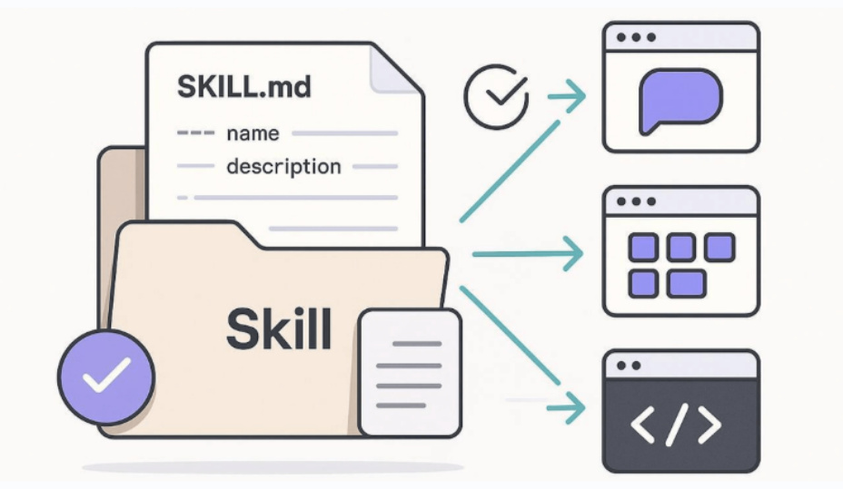
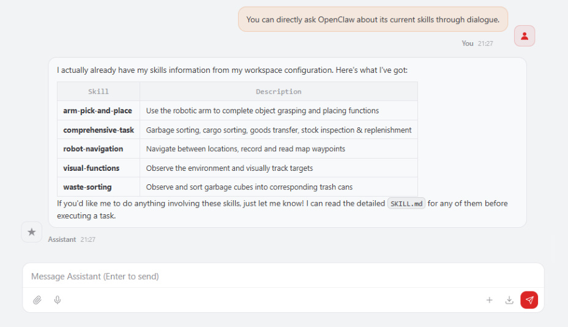
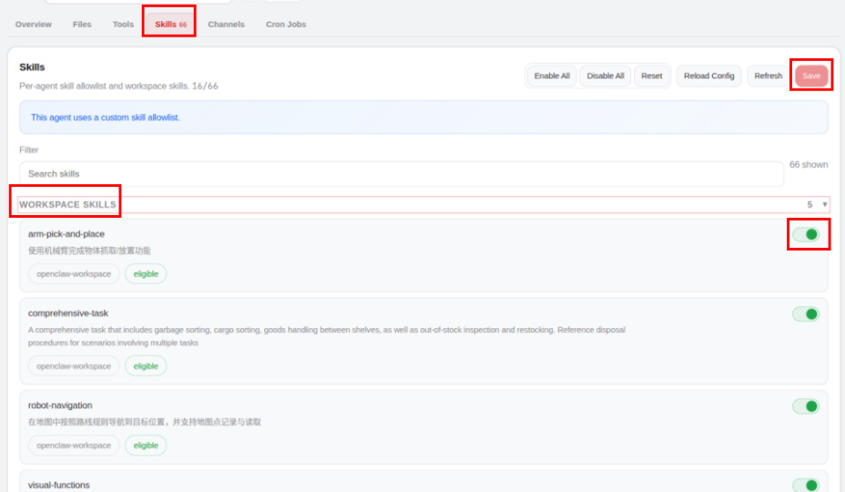
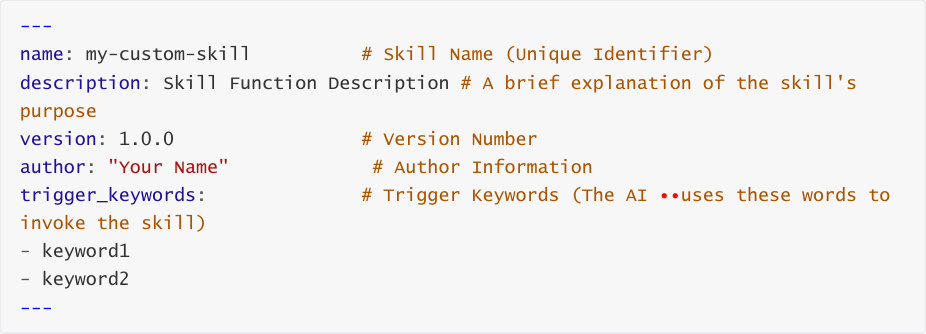

# OpenClaw Skills Development
**OpenClaw Skills Development**

1. Course Content

Course Overview

Learning Objectives

2. Introduction to Skills

3. Robot's factory-preset skills

🦾 ① arm-pick-and-place (Robotic Arm Grasp & Place)

♻ ② waste-sorting (Waste Sorting)

🧭 ③ robot-navigation (Navigation & Localization)

👁 ④ visual-functions (Visual Functions)

⚙ ⑤ comprehensive-task (Comprehensive Task)

4. Agent Skill Management

5. Custom Skill Development

### 5.1 How to Develop Your Own Skills

### 5.2 Skill Creation

### 5.3 Skill Documentation Format

### 5.4 Writing Skill Content

### 5.5 Enabling Skills in OpenClaw

## 1. Course Content
**Course Overview**

OpenClaw Skills is a set of advanced task instructions for developers. It orchestrates multiple

MCP Tools into a complete workflow according to business logic, guiding the AI model to call

the right tool at the right time to complete complex tasks.

The robot comes pre-installed with 5 core skills: robotic arm grasping and placement, waste

sorting, navigation and positioning, visual tracking, and integrated tasks, covering the robot's

main application scenarios.

**Learning Objectives**

1. Understand the concept, principles, and functions of OpenClaw Skills.

2. Be familiar with the functions and usage of the 5 core skills pre-installed on the robot.

3. Master the operation of enabling and disabling skills in the Agent.
## 2. Introduction to Skills
Skills are a **task-level workflow instruction set** .

Each Skill includes complete information such as: trigger keywords, tool dependencies,

coordinate system description, step-by-step operation process, and exception handling

rules.

The AI model, based on the workflow defined in the skill files, calls the MCP Tool step by step

to complete the entire closed loop from environmental perception → decision planning →

action execution → result verification.

Skill files are stored in the `$HOME/.openclaw/workspace/skills` directory, with each skill

corresponding to a subdirectory. The `SKILL.md` file within defines the complete skill

instructions.

## 3. Robot's factory-preset skills
You can directly ask OpenClaw about its current skills through dialogue.

Skills File Path:

The robot comes pre-installed with the following 5 core skills:

🦾 **① arm-pick-and-place (Robotic Arm Grasp & Place)**

**Function:** Uses the robotic arm to perform object grasping and placing operations.

**Trigger Keywords:** grasp / pick / place / grab / move

**Core Tools:** Pick / Place / SeeWhat / AdjustCameraView / GetPlacePoint / GetBbox

**Workflow:** Observe scene → Locate target → Execute grasp → Verify result → Place at target

point.

♻ **② waste-sorting (Waste Sorting)**

**Function:** Uses visual recognition to identify waste types and sort them into corresponding

bins; navigates to each bin location to complete the disposal.

**Trigger Keywords:** sort / grasp / pick up / collect waste / waste classification / observe waste

**Core Tools:** GetWasteRecognitionResults / GraspWaste / Navigation / PlaceWaste

**Workflow:** Retrieve recognition results → Grasp waste → Navigate to corresponding bin →

Place waste into bin.

🧭 **③ robot-navigation (Navigation & Localization)**

**Function:** Navigates to a target location within a map according to defined route rules;

supports recording and retrieving specific map locations.

**Core Tools:** Navigation / GetMapMapping / RecordMapLocation

**Workflow:** Retrieve map mapping → Locate target destination → Execute navigation

(supports up to 3 retries).

mapping.

👁 **④ visual-functions (Visual Functions)**

**Function:** Observes the environment and performs visual tracking of target objects.

**Trigger Keywords:** Observe the environment / Visual tracking target

**Core Tools:** SeeWhat / AdjustCameraView / GetBbox / TargetTrack

**Workflow:** Capture Image → Locate Target → Invoke TargetTrack to Track Target

⚙ **⑤ comprehensive-task (Comprehensive Task)**

**Functionality:** Covers a variety of comprehensive scenarios, including waste sorting, cargo

sorting, inter-shelf transfer, and cargo inspection & replenishment.

**Trigger Keywords:** Cargo Sorting / Replenishment / Waste Disposal / Shelf Operations /

Cargo Inspection & Replenishment

Grasping + Transport + Placement; Shelf Transfer → Navigation → Grasping → Navigation →

Placement; Cargo Inspection & Replenishment → Inspection → Navigation → Grasping →

Return → Placement.

The Skill files mentioned above are stored in the `$HOME/.openclaw/workspace/skills` directory.

Each skill resides in its own subdirectory; you can directly view or modify the `SKILL.md` file

located within each subdirectory.
## 4. Agent Skill Management
Log in to the OpenClaw WebChat interface, then navigate to **Agent → Skills** .

Under the **Workspace Skills** tab, you can view the factory-preset skills available in the

workspace. To enable or disable an individual skill, simply toggle the switch and then click

**Save** to apply the changes.

## 5. Custom Skill Development
### 5.1 How to Develop Your Own Skills
Developing a custom Skill essentially involves creating a `SKILL.md` file that adheres to

specific formatting guidelines, and then placing it in the

Developing a skill requires completing the following steps:

of this directory will serve as the name of the skill (it is recommended to use lowercase

English letters separated by hyphens).

according to the specified format.

3. **Restart OpenClaw:** Restart the OpenClaw application. Gateway activates new skills

4. **Enable in Agent** : Activate the new skill within the Agent Skills management section of

WebChat.

### 5.2 Skill Creation
**Step 1: Create the Skill Directory and Files**

### 5.3 Skill Documentation Format
**① YAML Metadata Header (Frontmatter)**

**② Markdown Body**

The body section uses Markdown format to describe the skill's workflow. It typically includes:

**Related Tools** : A list of the MCP Tools required by this skill.

**Rule Specifications** : Any necessary constraints and rules.

**Workflow** : A step-by-step definition of the operational process, including specific command
line examples.

**Exception Handling** : Strategies for addressing common errors.

### 5.4 Writing Skill Content
When writing skill content, the following principles should be observed:

**Clear Step Segmentation** : Break down tasks into distinct steps (Step 1 / Step 2 / ...); each

step should have a clear execution objective and specific criteria for completion.

**Complete Tool Invocation Examples** : For any MCP Tool invoked within a step, provide the

complete command syntax and parameter descriptions.

**Exception Handling Mechanisms** : Provide clear strategies for handling potential error

scenarios (e.g., target not found, tool invocation failure, etc.).

**Conditional Logic and Loops** : For steps requiring iterative operations, clearly define the

termination conditions; for steps requiring conditional logic, specify the decision criteria.

The path is:

### 5.5 Enabling Skills in OpenClaw
## Refer to 4. Agent Skill Management to enable and disable skills.
