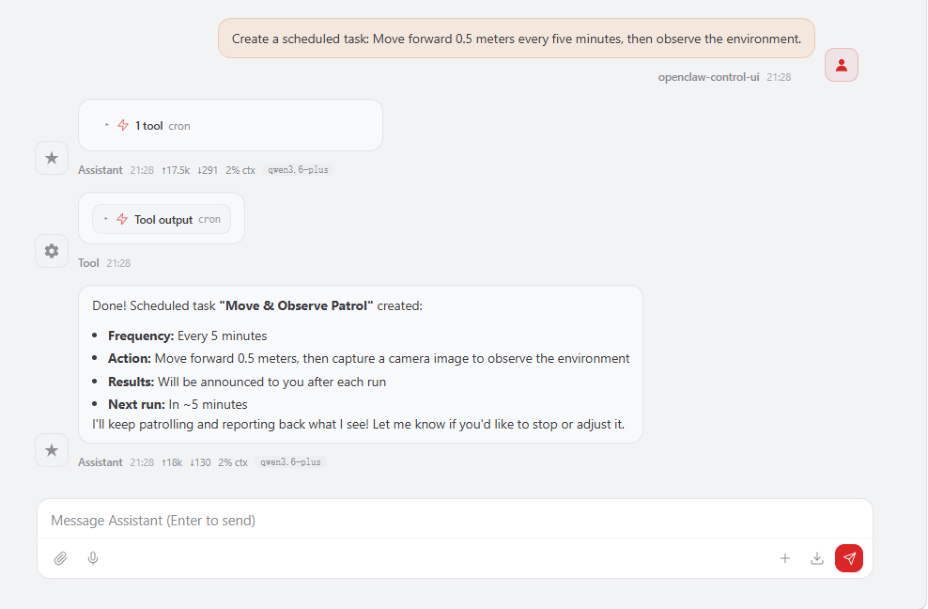
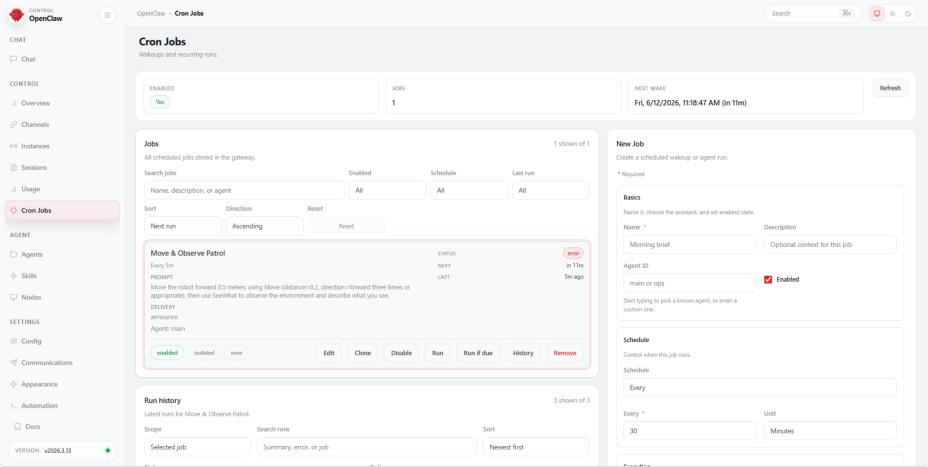
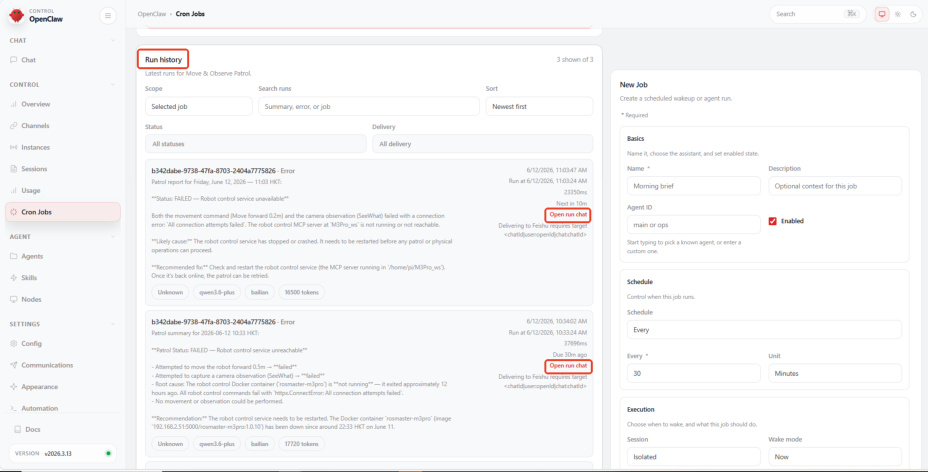

# OpenClaw Scheduled Tasks
**OpenClaw Scheduled Tasks**

1. Course Content

Course Overview

Learning Objectives

2. Introduction to OpenClaw Scheduled Tasks

3. Preparation

4. Creating Scheduled Tasks

5. Viewing and Managing Scheduled Tasks

## 1. Course Content
**Course Overview**

OpenClaw scheduled tasks are the task automation scheduling function of the OpenClaw

platform, allowing users to create timed robot tasks to achieve unattended automated

operations.

Scheduled tasks support periodic execution (e.g., every N minutes) and single execution, and

can program any sequence of robot control instructions.

**Learning Objectives**

1. Understand the functions and application scenarios of OpenClaw scheduled tasks.

2. Master the method of creating scheduled tasks using natural language.

3. Master the operation of viewing, managing, and maintaining scheduled tasks.
## 2. Introduction to OpenClaw Scheduled Tasks
Scheduled tasks are OpenClaw's intelligent scheduling function. Users can create scheduled

tasks to allow robots to automatically perform specific operations at specified times or

periods.

After creating a scheduled task, OpenClaw will automatically execute the task instructions

according to the set time and record the execution log for each execution.
## 3. Preparation
Start the MicroROS chassis agent (if it's already running, no need to repeat the process)

Start the odometer, tf, robotic arm assistance, camera nodes, etc.

Start the MCP service

this step can be omitted.

## 4. Creating Scheduled Tasks
The simplest method is to issue commands directly to OpenClaw. For example:

Create a scheduled task: Move forward 0.5 meters every five minutes, then observe the

environment.

[!TIP]

If you have configured `SeeWhat_channels` within the **[OpenClaw Multimodal Vision]**

settings, the robot's visual observations will also be automatically sent to the

corresponding channels.

provide voice responses.
## 5. Viewing and Managing Scheduled Tasks
Open WebChat and click on **Scheduled Tasks** to view a list of all created tasks.

The scheduled task list supports the following management operations:

**Enable/Disable** : Use the toggle switch to control whether a scheduled task is active; once

disabled, the task will no longer execute according to its schedule.

**Run Now** : Manually trigger a scheduled task once, useful for quickly verifying that the task is

functioning correctly.

**Delete** : Remove scheduled tasks that are no longer needed.

Click on a scheduled task to view and edit its details, including the task description and

execution schedule.

Under **Run History**, you can view the execution records for every time the scheduled task

was triggered, including the execution time, status, and results.

If you need to view detailed logs for a specific execution, you can use **Open Run Chat** to

review the AI's complete reasoning process and tool call records during the task execution,

facilitating troubleshooting.

