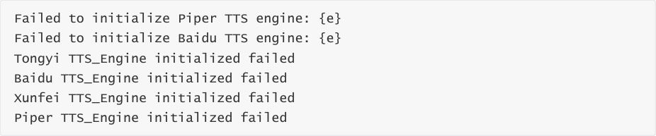
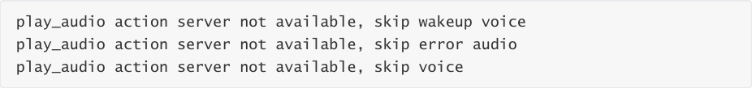
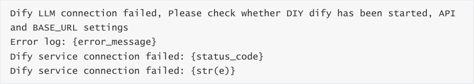
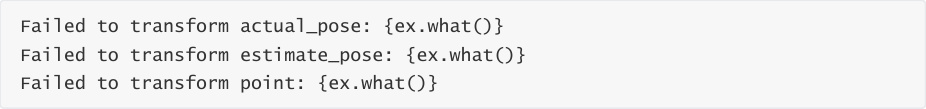
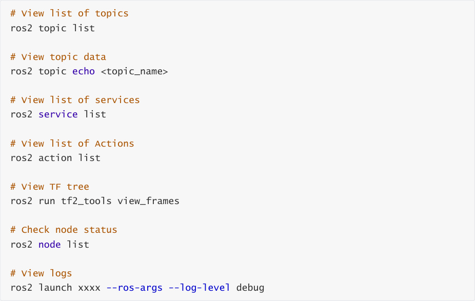

# Common Error Summary and Solutions Documentation
I. multi_brains_pre Module


### 1.1 Configuration File Related Errors

### 1.2 ASR Speech Recognition Related Errors


### 1.3 TTS Speech Synthesis Related Errors

### 1.4 Serial Communication Related Errors


### 1.5 ROS Communication Related Errors

### 1.6 Large Model Service Related Errors


### 1.7 Motion Control Related Errors

### 1.8 Audio Playback Related Errors


II. waste_classify Module   - 2.1 Model Loading Related Errors

### 2.2 Image Detection Related Errors


III. pcl_seg Point Cloud Segmentation Module

### 3.1 Depth Image Processing Errors


### 3.2 TF Transform Related Errors

### 3.3 Point Cloud Processing Related Warnings


IV. super_tracker Target Tracking Module

### 4.1 Tracker Initialization Errors


### 4.2 Image Frame Processing Warnings

### 4.3 ROI Selection Errors


**I. multi_brains_pre Package**
### 1.1 Configuration File Related Errors
**Error 1.1.1: Configuration file not found**


**Error Log:**


**Cause:**


The path for the `multi_brains_pre_setting.yaml` configuration file does not exist.

The file has been deleted or moved.


**Solution:**


directory.


**Error 1.1.2: YAML Parsing Failed**


**Error Log:**


**Cause:**


Incorrect YAML file format (e.g., incorrect indentation, unescaped special characters).


**Solution:**


1. Modify `multi_brains_pre_setting.yaml`, referencing the default file format found in the

attached source code files.

### 1.2 ASR Speech Recognition Errors
**Error 1.2.1: ASR Engine Initialization Failed**


**Error Log:**


**Cause:**


Incorrect or invalid API Key configuration.

Unsupported model name.

Network issues (for online ASR services).

Key file decryption failed (for iFlytek ASR).


**Solution:**


2. Verify that the model name being used is included in the supported list:


paraformer-realtime-v2/v1

paraformer-realtime-8k-v2/v1

gummy-realtime-v1/gummy-chat-v1


3. For iFlytek ASR, check if the key file path and decryption settings are correct.

4. Test your network connection.


**Error 1.2.2: Speech Recognition Failed**


**Error Log:**


**Cause:**


Invalid or expired API Key.

The online speech recognition service is currently unavailable.


**Solution:**


1. Check the stability of your network connection.

2. Check if your API usage quota has been exhausted.


**Error 1.2.3: VAD Engine Initialization Failed**


**Error Log:**


**Cause:**


The VAD model file does not exist.

The model path is configured incorrectly.


**Solution:**


1. Check if the `silero_vad.int8.onnx` model file has been deleted.

2. Download the VAD model file from the attached source code.


**Error 1.2.4: Audio Stream Open Failed**


**Error Log:**


**Cause:**


The microphone device is not connected.

The audio device is currently in use by another program.


**Solution:**


1. Check if the microphone device is connected correctly.


3. Close any other programs that are currently using the audio device.


**Error 1.2.5: No Speech Detected**


**Warning Log:**


**Cause:**


Microphone volume is too low.

Ambient noise is excessive.


**Solution:**


1. Increase the microphone input volume.

2. Reduce ambient noise.


3. Speak closer to the microphone.


**Error 1.2.6: Unsupported Language**


**Warning Log:**


**Cause:**


An unsupported language code was configured.


**Solution:**


1. Change the `LANGUAGE` parameter to 'zh' (Chinese) or 'en' (English).

2. Check the language settings within the configuration file:

**$HOME/M3Pro_ws/src/m3pro_bringup/config/multi_brains_pre_setting.yaml**

### 1.3 TTS (Text-to-Speech) Related Errors
**Error 1.3.1: TTS Engine Initialization Failed**


**Error Log:**





**Cause:**


TTS model files are missing.

API Key is configured incorrectly.

Configuration file failed to load.

Key file decryption failed (Xunfei TTS).


**Solution:**


1. **Piper TTS:**


2. **Online TTS (Alibaba Cloud/Baidu/Xunfei):**


Check if the corresponding API Key is configured correctly.

Verify the network connection.


3. Check if the configuration file format is correct.


**Error 1.3.2: Speech Synthesis Failed**


**Error Log:**


**Cause:**


The TTS engine was not initialized correctly?

The online speech service is unavailable?


**Solution:**


1. Verify that the TTS engine has been initialized correctly.

2. Review the specific error message to take targeted corrective actions.

### 1.4 Errors Related to Serial Communication in the Voice
**Wakeup Module**


**Error 1.4.1: Failed to Open Serial Port**


**Error Log:**


**Cause:**


The serial device for the voice wakeup module does not exist.

Hardware connection issues.


**Solution:**


2. Verify that the hardware connections are secure.

#### 1.4.2: Serial Port Reconnection Failure
**Warning Logs:**


**Cause:**


The hardware device has disconnected.


**Solution:**


1. Reconnect (unplug and replug) the USB device.


#### 1.4.3: Serial Port Transmission Failure
**Error Logs:**


**Cause:**


The serial port connection has been severed.

Buffer overflow.

The voice wake-up device is unresponsive.


**Solution:**


1. Check the status of the serial port connection.

2. Restart the program.

3. Verify that the hardware device is functioning correctly.

### 1.5 ROS Communication-Related Errors
**Error 1.5.1: Action Server Unavailable**


**Warning Logs:**





**Cause:**


**Solution:**


2. Use `ros2 action list` to check for available actions.


**Error 1.5.2: Action Goal Rejected**


**Warning Logs:**


**Cause:**


The specified audio file path does not exist.


**Solution:**


1. Verify the existence of the audio file.

2. Check the logs for the specific reason why the goal was rejected.


### 1.6 Large Language Model (LLM) Service-Related Errors
**Error 1.6.1: Dify Connection Failure**


**Error Logs:**





**Cause:**


The Dify service has not been started.

BASE_URL Configuration Error

**Invalid API Key** (Most frequent cause: The API Key used in the Dify application does not


**Solution:**


1. Confirm that the Dify service has started and is running normally.


3. Verify that the `DIFY_API_KEY` is correct.

4. Test the connection using `curl` : `curl`  - `H "Authorization: Bearer {API_KEY}"`

```
   {BASE_URL}/meta

```

**Error 1.6.2: Model Request Failed**


**Error Log:**


**Causes:**


Dify service anomaly

Model service outage

Insufficient API credits for the model

Request timeout


**Solution:**


1. Check the status of the Dify service.

2. Review the Dify service logs.

3. Check the API account status.

4. Restart the Dify service.


### 1.7 Action Control-Related Errors
**Error 1.7.1: TF Transform Retrieval Failed**


**Error Log:**


**Cause:**


The TF tree is incomplete.

The `pcl_segment` node is not publishing TF data.

The target tracking module has lost the target.


**Solution:**


2. Verify that the `pcl_segment` node is running correctly.

3. Ensure that the node is actively tracking a target.


**Error 1.7.2: TF Timestamp Too Old**


**Warning Log:**


**Cause:**


The TF publishing frequency is too low.

System latency is too high, or CPU load is excessive.

The target tracking module has lost the target.


**Solution:**


1. Increase the TF publishing frequency.

2. Optimize system performance.

3. Increase the value of the `tf_tolerance` parameter.

4. Shut down unnecessary nodes.


**Error 1.7.3: Joint Values Uninitialized**


**Warning Log:**


**Cause:**


The robotic arm query service call failed.

The initialization process was not completed.


**Solution:**


1. Check if the robotic arm service is functioning correctly.


3. Review the service call logs.

### 1.8 Audio Playback-Related Errors
**Error 1.8.1: Wake-up Audio Loading Failed**


**Error Log:**


**Cause:**


The audio file directory does not exist.

The file format is not supported.


**Solution:**


2. 3. Verify that the WAV file exists and is in the correct format.

3. Reinstall the `multi_brains_pre` package.


**II.** waste_classify **Module**

### 2.1 Model Loading Errors
**Error 2.1.1: Model File Not Found**


**Error Log:**


**Cause:**


Incorrect configuration of the YOLO model path.

The file has been deleted or moved.


**Solution:**


2. Verify that the model file exists.

3. Re-download the YOLO model file from the attached source code.


**Error 2.1.2: YOLO Model Initialization Error**


**Error Log:**


**Cause:**


The factory-default Python environment has been corrupted.

Incorrect model file format.

Insufficient memory.


**Solution:**


1. Verify that the model file is in a valid ONNX format.


3. Check if the system has sufficient memory.


**Error 2.1.3: Model Inference Startup Failure**


**Error Log:**


**Cause:**


Shared memory creation failed.

Multiprocessing startup failed.

Insufficient resources.


**Solution:**


1. Check the system's shared memory limits: `sysctl kernel.shmmax` .

2. Check the system logs for detailed error information.

### 2.2 Image Detection Errors
**Error 2.2.1: Image Shape Not Initialized**


**Error Log:**


**Cause:**


The camera has not started.

The image topic is not being published.


**Solution:**


1. Verify that the camera node has started.


`/camera/color/image_raw` .

3. Restart the CarBase launch file


**Error 2.2.2: Image Save Failed**


**Error Log:**


**Cause:**


The output directory does not exist.

Insufficient disk space.


The camera node has not started.


**Solution:**


1. Check the file path configuration.

**III. pcl_seg Point Cloud Segmentation Module**
### 3.1 Depth Image Processing Errors
**Error 3.1.1: Invalid ROI Region (Common)**


**Warning Log:**


**Cause:**


Tracking box coordinates exceed image boundaries

Tracking box dimensions are zero or negative

The target region lacks depth information


**Solution:**


1. Check if the tracking box coordinates are valid/reasonable

2. Use RViz to verify whether depth information exists for the target


**Error 3.1.2: No Depth Image**


**Warning Log:**


**Cause:**


The depth camera has not been started

Topic subscription failed

The depth image is not being published


**Solution:**


1. Confirm that the depth camera driver has been started


3. Verify the camera hardware connections

4. Restart the camera node


**Error 3.1.3: No Valid Depth Points in Circular Region**


**Warning Log:**


**Cause:**


The target point is too far or too close; there is no depth information in the vicinity of the

target point

Depth values are invalid (0 or exceed the defined threshold)


**Solution:**


1. Adjust the camera's viewing angle or the position of the target point

2. Check if the depth camera is functioning correctly

3. Use RViz to verify whether depth information exists for the target

4. Reduce ambient lighting


**Error 3.1.4: Target Point Outside Image Boundaries**


**Warning Log:**


**Cause:**


The requested coordinates fall outside the image range

Coordinate calculation error

Image resolution has changed


**Solution:**


1. Verify the coordinate calculation logic

2. Check the image resolution configuration

3. Implement boundary checks

4. Use valid coordinate values


**Error 3.1.5: Invalid Radius Value**


**Warning Log:**


**Cause:**


The radius parameter is negative or zero.

Parameter passing error.


**Solution:**


1. Ensure the radius value is a positive number.

2. Check the service call parameters.

3. Use a reasonable radius value (5–50 pixels recommended).


### 3.2 TF Transform-Related Errors
**Error 3.2.1: TF Transform Unavailable**


**Warning Log:**


**Error Log:**


**Cause:**


Necessary transforms are missing from the TF tree.

The camera coordinate frame has not been configured.

The TF publishing node has not been started.


**Solution:**


2. Ensure that the camera driver is publishing the correct TF transforms.


**Error 3.2.2: TF Transform Failed**


**Error Log:**





**Cause:**


The specified coordinate frame does not exist.

The transform data is invalid or corrupted.

Timestamp synchronization issues.


**Solution:**


1. Verify that the coordinate frame names are correct.

2. Validate the integrity of the TF data.

3. Check for timestamp synchronization issues.

### 3.3 Point Cloud Processing-Related Warnings
**Error 3.3.1: ROI Point Cloud is Empty**


**Debug Log:**


**Cause:**


There are no valid depth values within the specified ROI region.

The distance threshold parameter is set too low.

The target object is outside the valid distance range.


**Solution:**


2. Adjust the size of the ROI region.

3. Ensure that the target object is within the valid distance range.

4. Check the quality of the depth image data.


**Error 3.3.2: No Cluster Found**


**Debug Log:**


**Cause:**


The point cloud density is insufficient.

Clustering parameters have been configured incorrectly.

Target is too small or too distant


**Solution:**


1. Decrease the `cluster_min_size` parameter.

2. Increase the `cluster_max_size` parameter.

3. Adjust the `ClusterTolerance` parameter.

4. Ensure the target is sufficiently close and clearly visible.


**Error 3.3.3: No Valid Center Data**


**Warning Log:**


**Cause:**


Depth images have not yet been processed.

Clustering failed.


**Solution:**


1. Ensure that depth images are being processed correctly.

2. Check if point cloud segmentation was successful.


**IV. super_tracker Target Tracking Module**


### 4.1 Tracker Initialization Errors
**Error 4.1.1: Tracker Creation Failed**


**Error Log:**


**Cause:**


The model file does not exist.


**Solution:**


1. Check the model file path: `$HOME/MODELS/tracker/mixformer_v2_sim.onnx`

2. Adjust the `num_threads` parameter.


**Error 4.1.2: Display Window Configuration Conflict**


**Error Log:**


**Cause:**


Configuration logic conflict.


**Solution:**


1. Enable only one of the parameters:

### 4.2 Image Frame Processing Warnings
**Error 4.2.1: Received Empty or Invalid Frame**


**Warning Log:**


**Cause:**


The camera is not publishing images correctly.


**Solution:**


1. Check the running status of the camera node.


### 4.3 ROI Selection Errors
**Error 4.3.1: Selecting ROI on an Empty Frame**


**Error Log:**


**Cause:**


No image frames have been received yet.

The image frame is empty.


**Solution:**


1. Wait for the camera to publish images normally before selecting the ROI.

2. Check the camera connection.

3. Verify that the image topic contains data.


**Error 4.3.2: Invalid ROI Selection**


**Warning Log:**


**Cause:**


The user cancelled the ROI selection.

The selected ROI has zero or negative width/height dimensions.


**Solution:**


1. Re-select a valid ROI area.

2. Ensure the ROI area has sufficient dimensions (a minimum of 20x20 pixels is recommended).

3. Enclose the target completely within the bounding box on the image.


**Error 4.3.3: Failed to Set Tracking ROI**


**Error Log:**


**Cause:**


The image frame is empty.

The tracker initialization failed or encountered an exception.

The ROI coordinates are invalid.


**Solution:**


1. Ensure that a valid image frame is provided.

2. Check if the ROI coordinates fall within the image boundaries.

3. Verify the status of the tracker.


4. Re-initialize the tracker.


**Error 4.3.4: Tracking Startup Failed**


**Error Log:**


**Cause:**


The current camera frame is invalid.

The ROI setting failed.

The tracker encountered an exception.


**Solution:**


1. Confirm that the camera image is normal.

2. Check the validity of the ROI coordinates.

3. Review the specific error logs for details.


**V. General Troubleshooting Suggestions**
### 5.1 Adjusting Log Levels
If you encounter an issue, enable debug logging mode and send the complete error output

to technical support.

ROS Log Level: `ros2 launch xxxx` -- `ros`   - `args` -- `log`   - `level debug`

### 5.2 Common Diagnostic Commands

