# OpenClaw Target Tracking
**OpenClaw Target Tracking**

1. Course Content

Course Overview

Learning Objectives

2. Preparation

3. Target Tracking Case

4. Source Code Analysis


5. Parameter Tuning

6. Common Issues and Solutions

## 1. Course Content
**Course Overview**


OpenClaw target tracking is the core function of robot vision servo control. It tracks target

objects in real time using a camera and controls the robotic arm joints to adjust the camera

angle, keeping the target centered in the frame.

The target tracking function relies on the preceding GetBbox (target detection) to obtain the

initial ROI bounding box, and then starts the tracking thread to continuously correct the

robotic arm joint angles.

The tracking function supports both starting and canceling tracking. It automatically pauses

when the target confidence is too low or the target is lost, and automatically resumes

tracking when the target reappears.


**Learning Objectives**


1. Master the methods for starting and canceling target tracking using OpenClaw.
## 2. Preparation
Start the MicroROS chassis agent (if it's already started, no need to start it again)


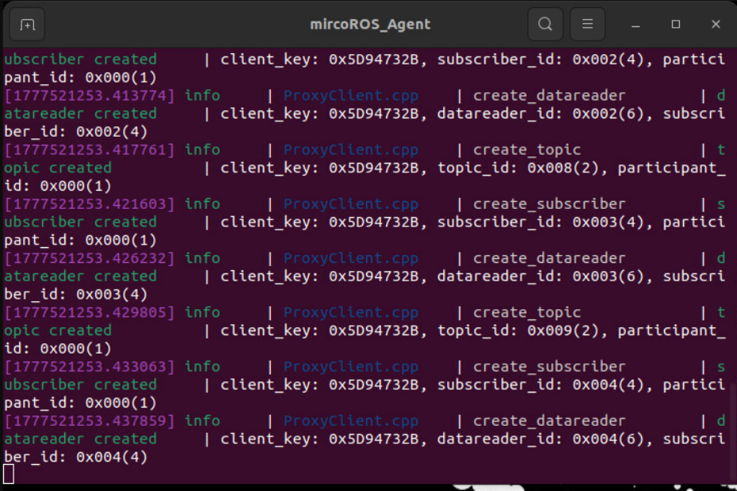

Start nodes such as odometer, TF, robotic arm assistance, and camera nodes


Start MCP service


If you need voice response, you need to start openclaw_bridge separately; otherwise, you

can omit this step.


## 3. Target Tracking Case
Choose any method to interact with OpenClaw. The following demonstration uses...

WebChat


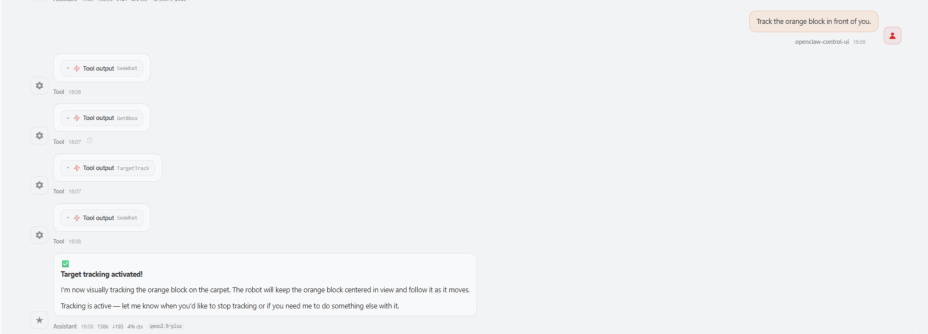

As the target object moves, the robotic arm adjusts its joint angles to ensure the camera

remains continuously focused on the object.


If the target's confidence score drops too low or the target is lost from the field of view, the

robotic arm will cease movement.


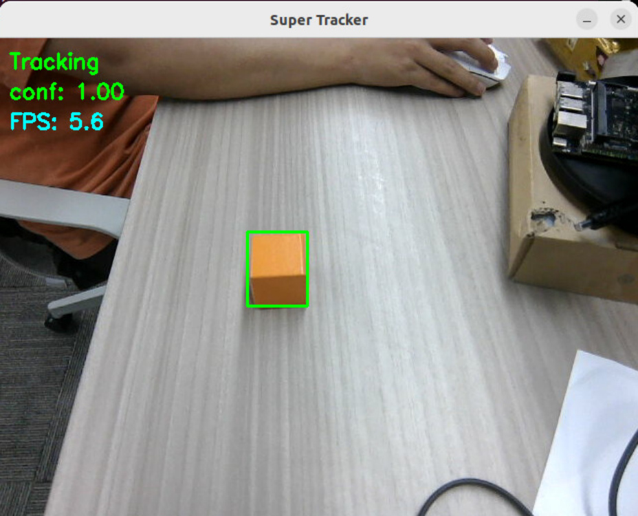
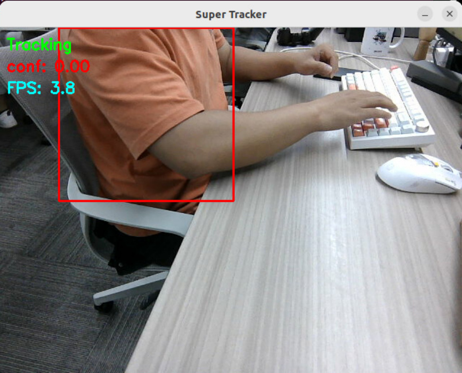

When the target reappears within the field of view, the tracker automatically searches for it;

once the confidence score exceeds 0.1, the robotic arm resumes tracking.


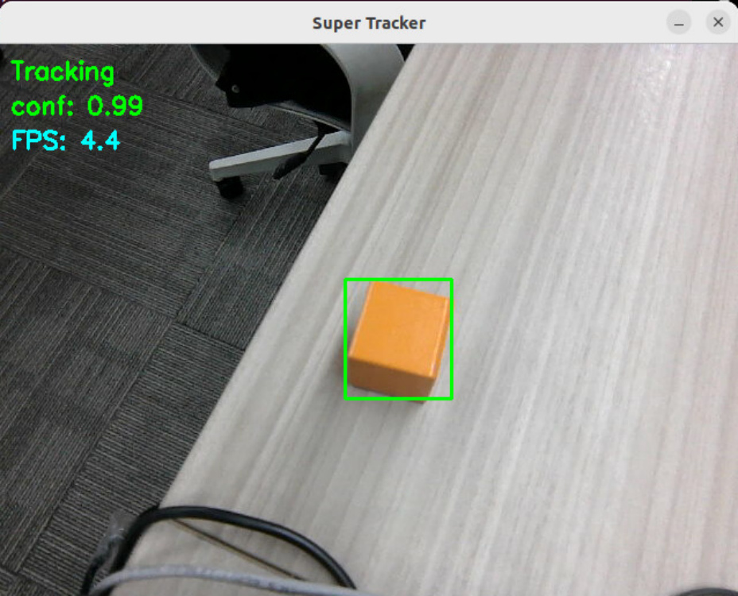
To stop tracking the target, you can issue a new command to OpenClaw.


The MCP server logs a message indicating that tracking of the target has been terminated.


[!IMPORTANT]


In the [02-OpenClaw Robotic Arm Tracking and Grasping] module, OpenClaw must first

successfully track the target before it can proceed to grasp it.
## 4. Source Code Analysis
Source Code Path


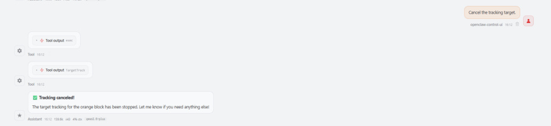

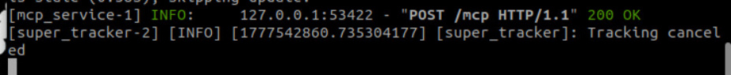


The following section provides an explanation of the source code for the core target tracking


functions it invokes.


**Tracking**

```
 def TargetTrack(self, x1_or_cmd, y1:int=None, x2:int=None, y2:int=None):

    # Cancel tracking mode

    if isinstance(x1_or_cmd, str):

      if x1_or_cmd != "cancel":

        return [False, "Invalid command for TargetTrack. Use 'cancel' to

 stop tracking."]

      # Stop gaze thread first

      if hasattr(self, '_gaze_stop_event'):

        self._gaze_stop_event.set()

      if hasattr(self, '_gaze_thread') and self._gaze_thread is not None and

 self._gaze_thread.is_alive():

        self._gaze_thread.join(timeout=2.0)

        self._gaze_thread = None

      # Cancel tracker service

      if not self.cancel_track_client.wait_for_service(timeout_sec=5.0):

        return [False, "CancelTrack service not available"]

      self.cancel_track_client.call(CancelTrack.Request())

      # Reset arm to initial pose

      self._reset_joints()

      self.InitArmPose()

      return [True, "Tracking cancelled and arm reset"]

```

```
    # Start tracking mode

    x1: int = x1_or_cmd

    if not self.start_track_client.wait_for_service(timeout_sec=5.0):

      return [False, "Tracking service not available"]

    result = self.start_track_client.call(StartTrack.Request(x1=x1, y1=y1,

 x2=x2, y2=y2))

    if not result.success:

      return [False, "Tracking failed"]

    # Start gaze control thread

    self._gaze_stop_event = threading.Event()

    self._gaze_thread = threading.Thread(target=self._gaze_track_loop,

 daemon=True)

    self._gaze_thread.start()

    return [True, "Tracking started"]

```

**Code Explanation:**


executed sequentially: stop the gaze-tracking thread → cancel the tracking service → restore

the robotic arm to its initial pose.


tracking service, passing the target ROI bounding box coordinates `(x1, y1, x2, y2)` .

3. **Background Thread:** Launches a separate thread, `_gaze_track_loop`, to continuously

execute visual servo control without interfering with the main thread's ability to respond to

other commands.

4. **Parameter Validation:** The "start" mode requires a complete set of coordinate parameters;

if any coordinate is missing, an error is returned.


**Loop**


**Code Explanation:**


joints 1, 2, and 4.


ensure the thread can be safely stopped.


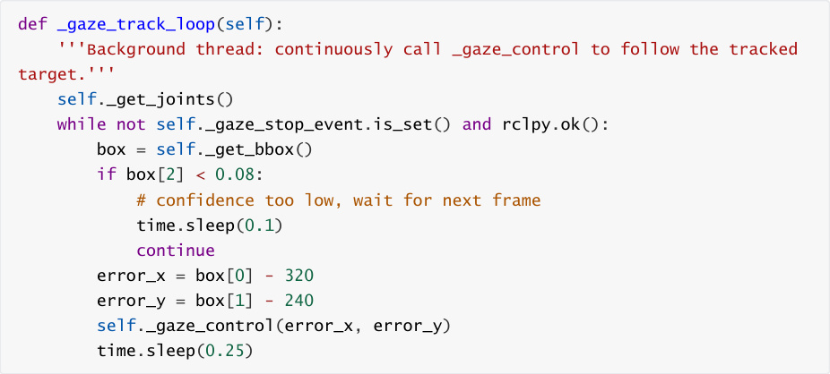
loop iteration is skipped to wait for the next frame; this corresponds to the behavior

described in the documentation as "the robot arm stops moving when the target is lost."


the pixel deviation using the image center (320, 240) as the reference point.

5. **Gaze Control:** Calls `_gaze_control()` to adjust the joint angles based on the calculated

errors, thereby centering the target within the frame.

### 4.3 _get_bbox()  — Retrieving the Target Bounding Box

**Center**


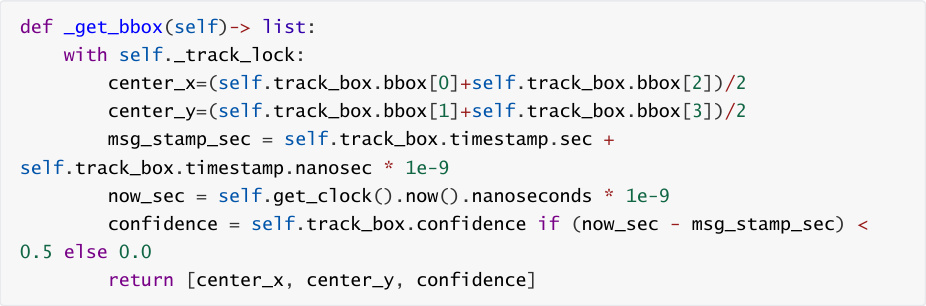


**Code Explanation:**


1. **Bounding Box Center Calculation:** `(bbox[0]+bbox[2])/2` calculates the center along the


3. **Confidence Timeliness:** If a message timestamp exceeds the current system time by more

than 0.5 seconds, the confidence score is forcibly set to 0 to prevent the use of stale tracking

data.


**Adjustment)**

```
 def _gaze_control(self, error_x, error_y):

    '''Eye gaze follows the target object'''

    if self.joint_1 is None or self.joint_2 is None or self.joint_4 is None:

      return

    if abs(error_x) > self.gaze_threshold:

      if error_x > self.gaze_threshold:

        self.joint_1 += self.step

      elif error_x < -self.gaze_threshold:

        self.joint_1 -= self.step

      self.SingleJoint_pub.publish(ArmJoint(id=1, joint=self.joint_1,

 time=100))

    if abs(error_y) > self.gaze_threshold:

      if error_y > self.gaze_threshold:

        self.joint_4 -= self.step

      elif error_y < -self.gaze_threshold:

```

```
        self.joint_4 += self.step

      # Limit joint_4 to prevent damage

      if self.joint_4 > -5:

        self.SingleJoint_pub.publish(ArmJoint(id=4, joint=self.joint_4,

 time=100))

      else:

        # joint_4 at lower limit, adjust joint_2 to continue gaze control

        self.joint_2 -= self.step

        self.SingleJoint_pub.publish(ArmJoint(id=2, joint=self.joint_2,

 time=100))

```

**Code Explanation:**


rotation) is used to adjust the camera's left-right field of view.

2. **Y-Direction Control (Joint 4):** When the error exceeds the threshold, Joint 4 (pitch) is used to

adjust the camera's up-down field of view.


automatically switches to Joint 2 for compensation to prevent damage to the robotic arm.

4. **Single-Joint Publishing:** Single-joint control commands are published via the

## 5. Parameter Tuning
Parameter file path:


Parameters related to the tracking function:


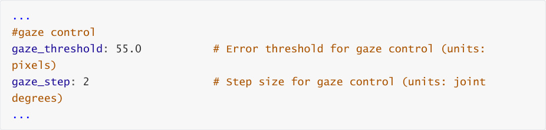


|Parameter|Effect of Increasing Value|Effect of Decreasing Value|
|---|---|---|
|`gaze_threshold`|Allows for larger deviations;<br>adjustments are more<br>lenient; no adjustments are<br>made if the deviation is<br>below this value.|Requires more precise alignment;<br>adjustments occur more frequently;<br>setting this value too low may cause<br>the robotic arm to exhibit steady-state<br>oscillations.|
|`gaze_step`|Increases the adjustment<br>step size.|Smoothes the adjustment process,<br>but increases the risk of overshoot.|


## 6. Common Issues and Solutions
**Inaccurate Target ROI Box During Tracking**


of the target object—is accurate. For detailed steps, refer to: [03-openclaw Development] —

[05-openclaw Multimodal Vision] — [4.4 Obtaining Target Bounding Box Coordinates].

The verification image can be found at:

```
   $HOME/M3Pro_ws/multi_brains_file/verify_image.png

```

If the visual model's bounding box selections are inaccurate, you need to change the visual

model within Dify. Log in to the Dify Admin Console and update the visual model configured

for "Robot Vision."


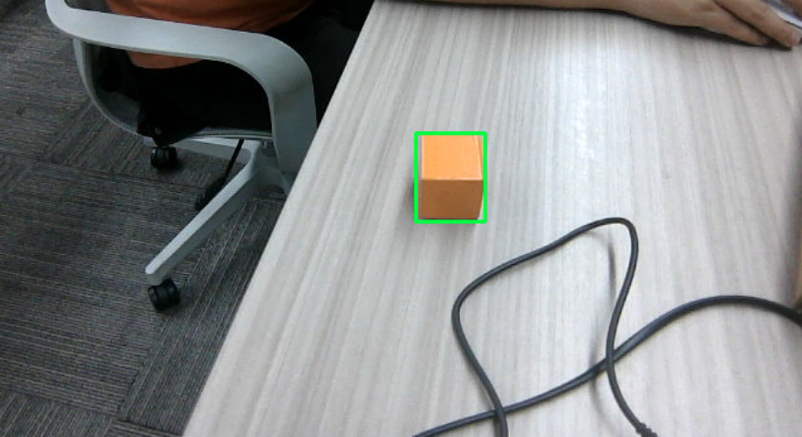

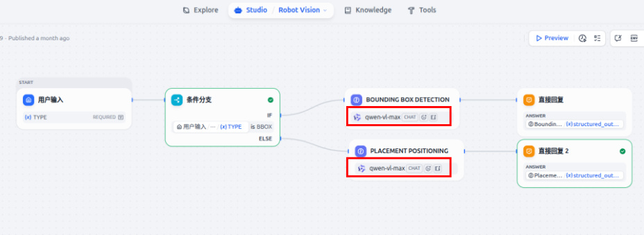
