# OpenClaw Robotic Arm Tracking And Grasping
**OpenClaw Robotic Arm Tracking And Grasping**

1. Course Content

Learning Objectives

2. Preparation

3. Robotic Arm Grasping Target Object Case

4. Source Code Analysis


5. Parameter Debugging

6. FAQ

### 6.1 How to Adjust When the Grasp Position Is Inaccurate and Deviates from the Ideal Grasp Point?

### 6.2 How to Adjust grasp_offset

### 6.3 How to Replace and Test the Vision Model If Positioning Is Inaccurate?

## 1. Course Content
**Learning Objectives**


grasping accuracy and stability

Develop the ability to analyze the causes of grasping deviations, and diagnose and resolve

visual recognition and depth loss issues
## 2. Preparation
Start the MicroROS chassis agent (skip if already started)


Start odometry, tf, robotic arm assistant, camera node and other nodes


Start the MCP service


If you need voice reply, you need to additionally start openclaw_bridge, otherwise you can

skip


## 3. Robotic Arm Grasping Target Object Case
[!TIP]


You can write commands according to your own needs. The following is a case

demonstration. Choose any interaction method. Here we use the web page WebChat

as an example.


[!IMPORTANT]


The block demonstrated here for grasping is a 4x4x4cm wooden block. Tracking and

grasping can pick up any target object. Since the servo has no torque feedback, the

grasping closure angle of the gripper needs to be specified through parameters. If the

gripper grasps too loosely or too tightly, fine-tuning can be done through parameters.


Grasp the orange block in front of you


OpenClaw calls GetBbox to obtain the outer bounding box of the target. This interface

automatically generates a verification image to verify whether the Dify vision model has

selected the correct area. Image path:


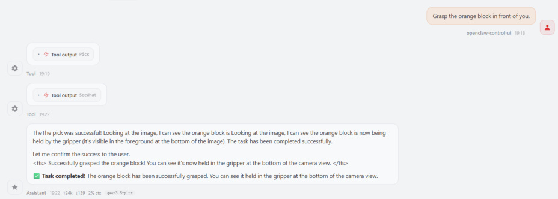


The figure below shows the tracking process of the grasping target. The robot chassis will

first adjust the chassis position to ensure the target is within the grasping range of the

robotic arm.


After the chassis adjustment is completed, the grasping point will be obtained as shown

below. The program will automatically draw the image of the grasping point for debugging

and verifying whether the grasping point is accurate. The image path is:


Object grasping process

```
┌─────────────┐

│ Observe  │

│ Environment │

└──────┬──────┘

│

▼

┌─────────────┐

│ Get Target │

│ Bounding Box│

```

```
 └──────┬──────┘

 │

 ▼

 ┌─────────────┐

 │ Track Target│

 └──────┬──────┘

 │

 ▼

 ┌─────────────┐

 │ Adjust   │

 │ Chassis   │

 │ Position  │

 └──────┬──────┘

 │

 ▼

 ┌─────────────┐

 │ Grasp Target│

 └──────┬──────┘

 │

 ▼

 ┌─────────────┐

 │ Check If  │

 │ Target   │

 │ Is Grasped │

 └─────────────┘

```

Target grasping skills


OpenClaw controls the robot to grasp the target object by first reading the robotic arm

grasping skills, following the SOP workflow.

Robotic arm grasping skill reference: [08-OpenClaw Skills Development]


[!IMPORTANT]


In [03-OpenClaw Development][02-OpenClaw Robotic Arm Tracking And Grasping],

OpenClaw will first track the target before grasping it.
## 4. Source Code Analysis
Source code path:


The core functional functions of the grasping program are all defined in the `ActionController`

class. After being registered through the MCP Tool interface, they can be called by OpenClaw. The

following is an explanation of each key function's source code.


**①** pick() **— Grasp Object**

```
 def pick(self, x1:int, y1:int, x2:int, y2:int) -> list[bool, str]:

    """Pick up item"""

    # Step 1: Start target tracking

    result = self.start_track_client.call(

      StartTrack.Request(x1=x1, y1=y1, x2=x2, y2=y2))

    # Step 2: Adjust grasping pose

    if not self._adjust_grasp_pose():

```

```
      return [False, "Failed to adjust grasp pose"]

    # Step 3: Get grasp point

    result = self._get_grasp_point()

    # Step 4: Execute grasp

    self._grasp(grasp_x=result[1], grasp_y=result[2], grasp_z=result[3],

           grasp_pitch=self.grasp_offset[3])

    # Step 5: Auto backward

    self.move_by_odom(direction='backward', distance=self.auto_back_dist)

    return [True, ""]

```

**Process description** :


1. **Start tracking** : Based on the target bounding box (x1, y1, x2, y2) detected by vision, call the

`/start_track` service to start Smart Tracker target tracking.


object 3D pose → move chassis" process until the target is within grasping range.


point, then combine with the 3D pose service to convert to spatial coordinates. See below for

detailed source code and explanation.


distance to avoid collisions and entering costmap obstacle areas.


**Method)**

```
 def _get_grasp_point(self) -> list:
    """ 获取抓取点的 3D 空间坐标 """

    # Step 1: Ensure box_center service is available

    if not self.box_center_client.wait_for_service(timeout_sec=8.0):

      return [False, "get grasp point service not available"]

    # Step 2: Capture the current frame, get grasp point detection result

    self.SeeWhat()

    response = self.box_center_client.call(GetBoxCenter.Request())

    if not response.success:

      return [False, response.message]

    # Step 3: Draw grasp point verification image (for debugging)

    image = cv2.imread(self.image_path)

    ax, ay = int(response.actual_center[0]), int(response.actual_center[1])

    ex, ey = int(response.estimate_center[0]), int(response.estimate_center[1])

    # Draw red crosshair (actual) and blue diamond (estimate), connect the two

 points

    cv2.imwrite(self.grasp_point_path, image)

    # Step 4: Prefer estimate_pose, calculate pixel offset compensation to 3D

 coordinates

    if response.estimate_pose is not None:

      offset_x = (ax - ex) / 1000 # pixel offset → meters

```

```
      offset_y = (ay - ey) / 1000

      if offset_x < 0.02: offset_x = 0

      if offset_y < 0.02: offset_y = 0

      grasp_x = response.actual_pose.position.x + offset_y # image vertical

 direction

      grasp_y = response.actual_pose.position.y + offset_x # image horizontal

 direction

      grasp_z = response.actual_pose.position.z

      return [True, grasp_x, grasp_y, grasp_z]

    # Step 5: Fallback to actual_pose

    return [True, response.actual_pose.x, response.actual_pose.y,

 response.actual_pose.z]

```

**Code explanation** :


Based on engineering experience, a grasp center estimation algorithm is proposed. When

most of the depth data of the target object is missing due to environmental lighting, it can

still estimate the 3D coordinates of the grasping target center. Due to space limitations, the

theory is not derived; only the program source code is explained.


two is used to compensate for the error in 3D spatial coordinates.

2. **Verification image** : Automatically draws a red crosshair (actual) and a blue diamond


combines visual detection and grasp center point estimation algorithm, resulting in higher

accuracy.

4. **Offset compensation** : `(ax`  - `ex)/1000` approximately converts the pixel coordinate

difference into an offset in meters, compensating the grasp coordinates. Here, only the pixel

unit is proportionally scaled to the actual unit.
## 5. Parameter Debugging
Parameter file path:


The following is the correspondence table between parameters and code:


|Parameter|Code Usage Location|Function Description|
|---|---|---|
|`GraspKeepPose`|`_grasp()` → `self.GraspKeepPose`|Joint angle posture<br>maintained by the robotic<br>arm after grasping|
|`InitArmPose`|`InitArmPose()` →<br>`self.init_arm_pose`|Target joint angles for<br>restoring the robotic arm to<br>its initial posture|
|`grasp_distance`|`_adjust_grasp_pose()` →<br>`self.grasp_distance[0]`|Desired distance between<br>chassis and target during<br>grasping (x direction), used<br>to determine if chassis<br>movement is needed|
|`grasp_offset`|`_grasp()` →<br>`self.grasp_offset[0]/[1]/[2]/[3]`|Grasp position offset`[x,`<br>`y, z, grasp angle]`, used<br>for fine-tuning grasp<br>coordinates|
|`auto_back_dist`|`pick()`,`place()` →<br>`self.auto_back_dist`|Auto backward distance<br>after grasp/place<br>completion to avoid<br>collisions and entering<br>costmap forbidden zones|
|`target_circle`|`GetPlacePoint()` /<br>`_get_pick_target_pose()` →<br>`self.target_circle`|Circular area sampling<br>radius (pixels) used for<br>calculating 3D pose when<br>obtaining target point<br>coordinates|

```
mcp_service:

ros__parameters:

```


```
  #action_controller——Arm

GraspKeepPose: [90,125,3,0,90,140] #Robotic arm grasp keep posture,

140 is gripper opening angle, 0-180, larger value means tighter grip

grasp_distance: [0.265, 0.0, 0.0] # [x, y, yaw]

place_distance: [0.39, 0.0,0.45, 0.25] #Place position and tolerance

detection

grasp_offset: [0.015,0.015,-0.03,2.0] # Grasp offset x,y,z,grasp angle

place_offset: [-0.01,0.00,0.05,1.3] #Place position offset

auto_back_dist: 0.13            # Auto backward distance, unit:

meters, automatically moves backward a distance after grasping and placing to

avoid collisions and entering costmap forbidden zones

  #odom

tf_tolerance : 0.5        # TF transform tolerance, unit: seconds

linear_speed_factor: 0.5     # Linear speed factor

angular_speed_factor: 0.1    # Angular speed factor

odom_linear_speed: 0.08

odom_angular_speed: 0.5

odom_position_tolerance: 0.005

odom_angle_tolerance: 0.05

odom_timeout: 30.0

```

```
 target_circle : 10            # Circular area radius when

 obtaining target point coordinates, unit: pixels

    #auto back

 enable_auto_back: True     # Whether to enable auto backward function

```

[!IMPORTANT]


The auto backward function after grasping (enable_auto_back) is designed to avoid

colliding with map edges when combined with navigation. If you need to disable auto

backward, set enable_auto_back to False in the parameter file. The auto backward

function in subsequent courses (garbage grasping, machine code grasping, placing) is

all controlled by this parameter and will not be repeated in later lessons.
## 6. FAQ
### 6.1 How to Adjust When the Grasp Position Is Inaccurate and
**Deviates from the Ideal Grasp Point?**


**Check in order:**


Is the Dify model's bounding box selection of the target object accurate?

If inaccurate, replace the vision model in Dify.

Is the grasp point obtained before grasping accurate?


If the grasp point deviates too far from the object center, it means the depth camera is

heavily affected by ambient lighting and the target object has no depth data at all. The

grasp center estimation algorithm cannot estimate the 3D position of the target grasp

point. Change the ambient lighting.

If the grasp point is accurate (e.g., the grasp point is at the center of the grasped object in the

image below) but there is a slight offset during grasping, it may be caused by mechanical

error of the robotic arm. Refer to Section 5.2 Grasp Parameter Analysis and adjust

grasp_offset. The offset follows the robot's right-hand coordinate system. Increase or

decrease the grasp offset appropriately.


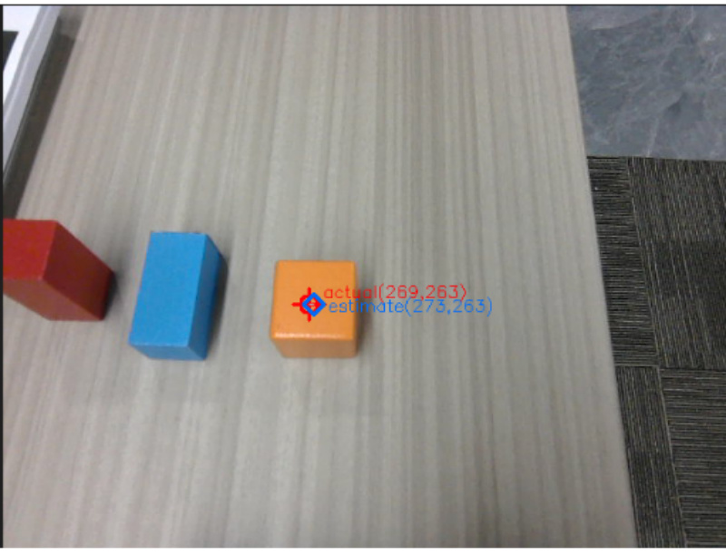
### 6.2 How to Adjust grasp_offset
**Parameter description of grasp_offset:**


**Adjustment principles:**


1. **X-axis offset (forward/backward direction)**


Positive value: grasp point forward (away from the robot body)

Negative value: grasp point backward (toward the robot body)

2. **Y-axis offset (left/right direction)**

Positive value: grasp point to the left (left side in the robot's forward direction)

Negative value: grasp point to the right (right side in the robot's forward direction)

3. **Z-axis offset (up/down direction)**


Positive value: grasp point upward

Negative value: grasp point downward

Adjustment scenario: used when grasping too high or too low, often to compensate for

the height difference between the gripper and the object surface

4. **Grasp angle (gripper rotation angle)**

Unit: radian (rad)

Adjustment scenario: adjust when needing to grasp the object from a specific angle; not

recommended to change


**Adjustment steps:**


1. Perform a grasping operation and record the deviation direction between the actual grasp

position and the ideal position.

2. Determine the direction and sign to adjust based on the right-hand coordinate system

principle.

3. Modify the corresponding offset parameter in `common.yaml` . The change takes effect

immediately after saving.

4. Restart the MCP service to apply the parameters: `ros2 launch m3pro_bringup`

```
   mcp_service.launch.py

```

**Example scenario:**


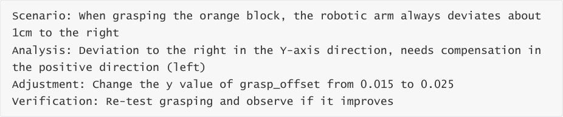


Right-hand coordinate system


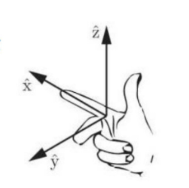

Chassis coordinate system direction

### 6.3 How to Replace and Test the Vision Model If Positioning
**Is Inaccurate?**


Enter the robot's IP in the browser to access the Dify management page

Username: [yahboom@163.com](mailto:yahboom@163.com)

Password: yahboom123

Find the **Robot Vision** application


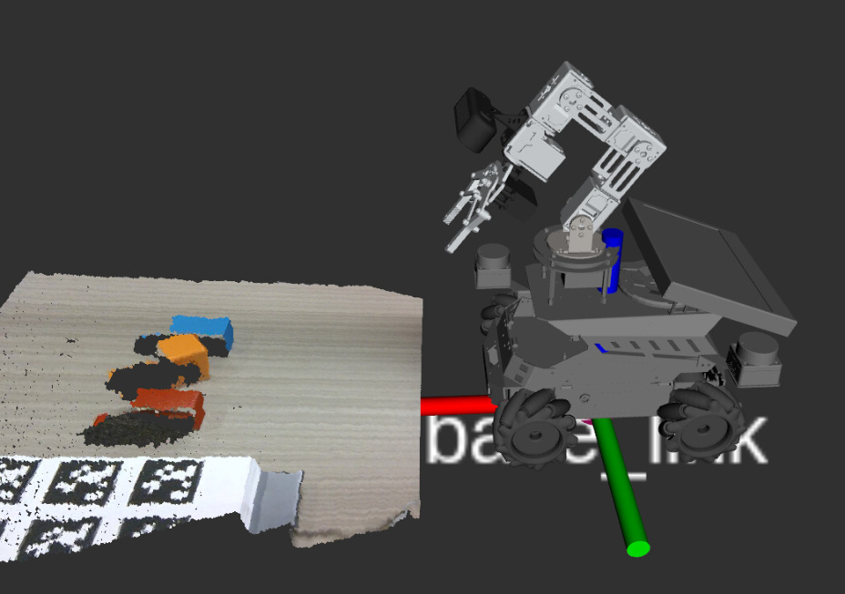
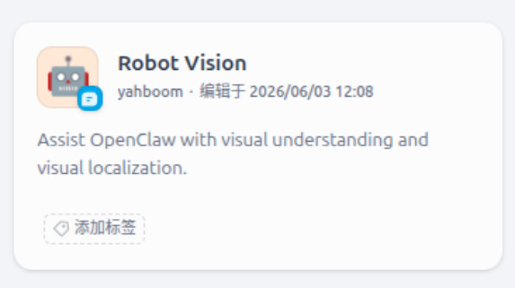

**Bounding Box Detection** and **Placement Positioning** are the visual positioning models:

**Bounding Box Detection** is used for bounding box positioning based on natural language

descriptions, used in visual grasping and tracking tasks to locate the initial bounding box of

the target in the image.


Example: Red block on the table


The green box below is the visualization result of the object's bounding box coordinates

given by the vision model based on the natural language description.


**Placement Positioning** is used for target point positioning based on natural language

descriptions, commonly used in robotic arm placement tasks to find the target position to

place.


Example: Between the red block and the blue block

The green box below is the visualization result of the target point given by the vision

model based on the natural language description.


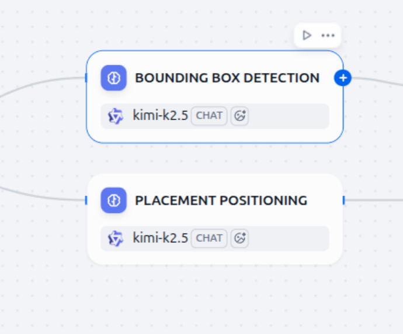

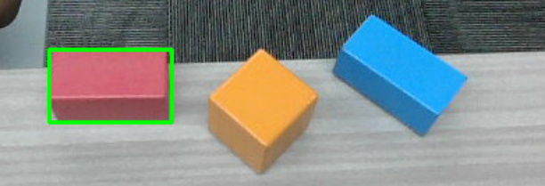
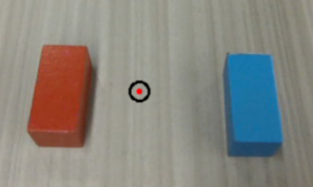

You can use the CLI tool in the terminal to test whether the current model selected in Dify

has accurate visual positioning. verify_image is the path to the visual verification image.


If the visual positioning of the currently used model is inaccurate, you can replace the vision

model.


Click the corresponding card — scroll down and select an available vision model from the

model list (vision models will have a VISION tag) — finally click Publish to save the changes.


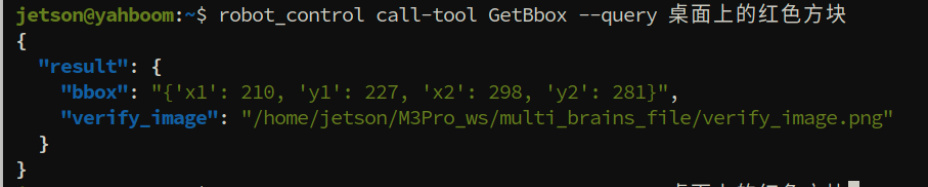

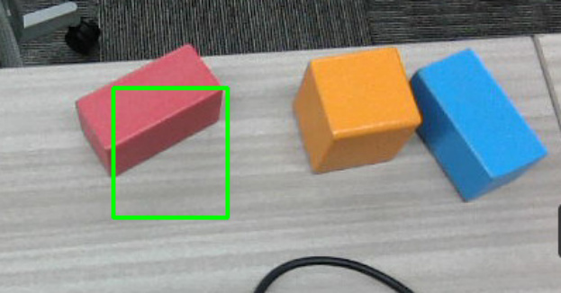

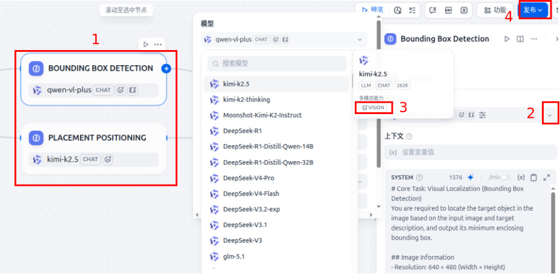
[!TIP]


Recommended vision models: QwenVL-Max series, Kimi-k2.5 series, etc.
